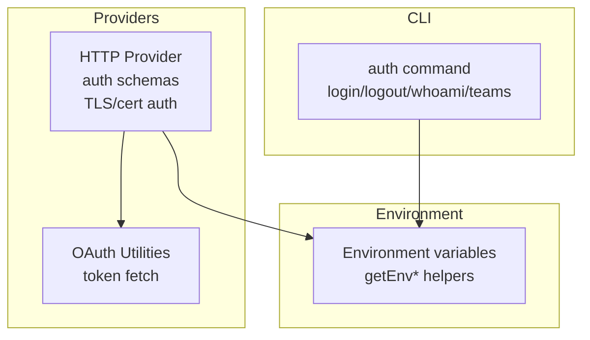
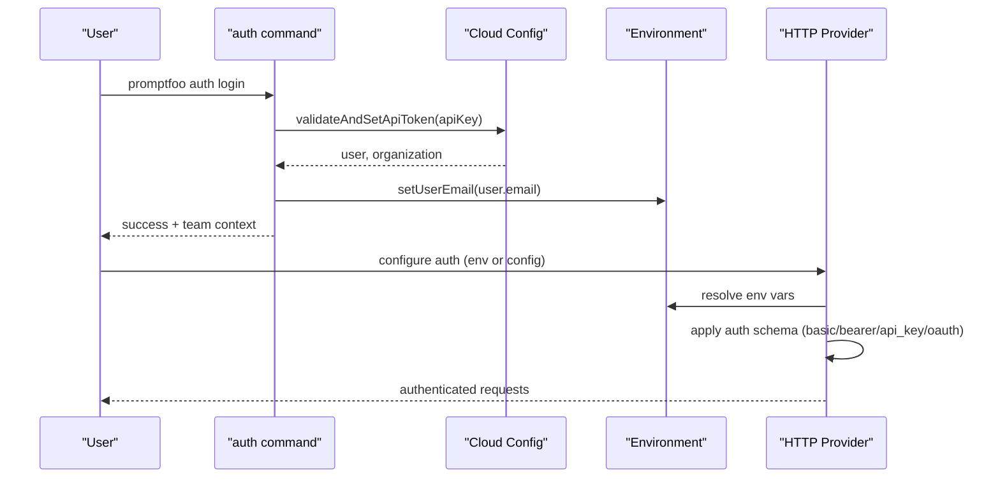
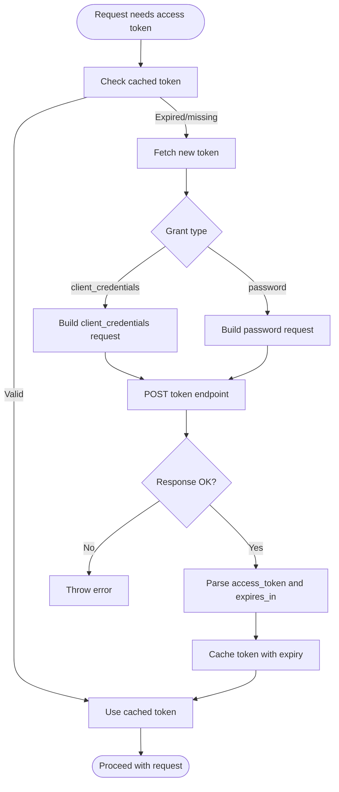
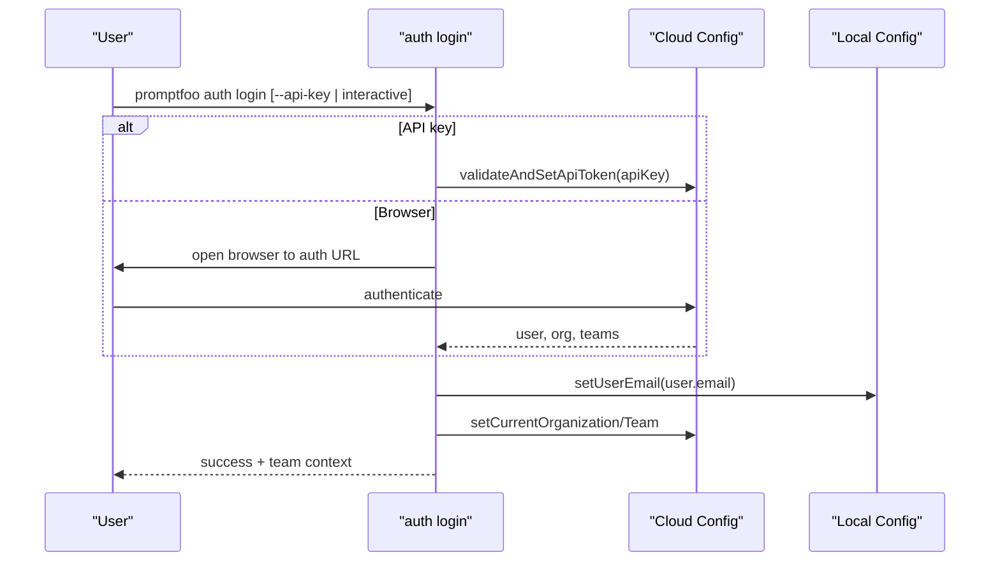
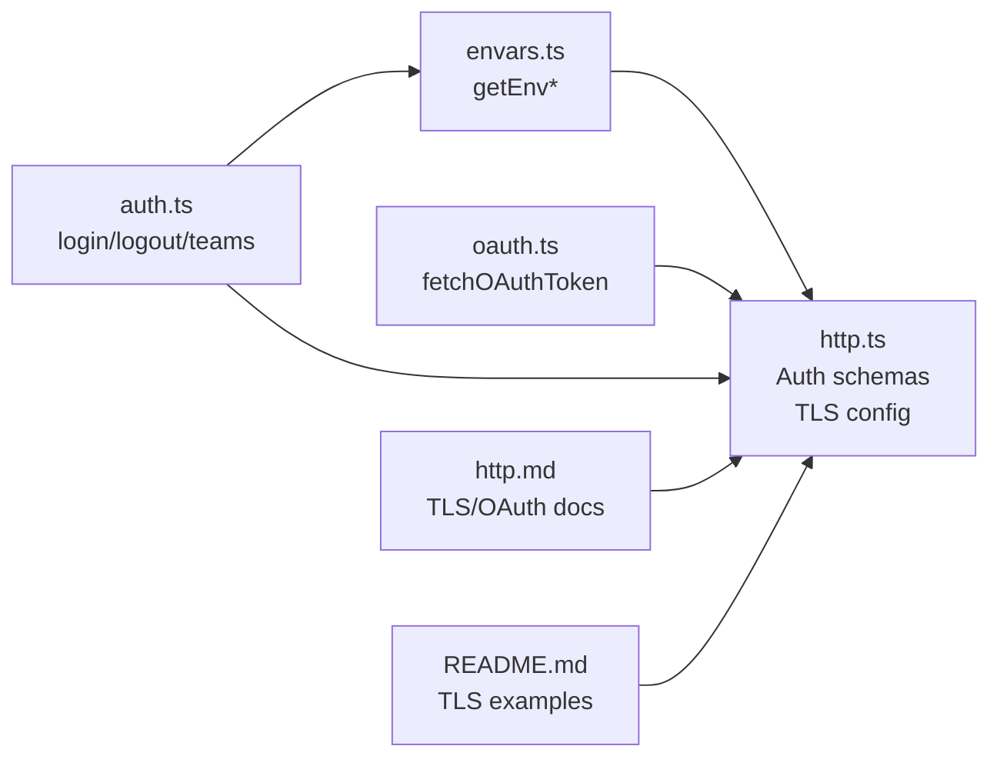

# Authentication & Configuration

<cite>
**Referenced Files in This Document**
- [envars.ts](file://src/envars.ts)
- [http.ts](file://src/providers/http.ts)
- [oauth.ts](file://src/util/oauth.ts)
- [auth.ts](file://src/commands/auth.ts)
- [http.md](file://site/docs/providers/http.md)
- [README.md](file://examples/http-provider-tls/README.md)
- [load.test.ts](file://test/util/config/load.test.ts)
- [openclaw.test.ts](file://test/providers/openclaw.test.ts)
</cite>

## Table of Contents
1. [Introduction](#introduction)
2. [Project Structure](#project-structure)
3. [Core Components](#core-components)
4. [Architecture Overview](#architecture-overview)
5. [Detailed Component Analysis](#detailed-component-analysis)
6. [Dependency Analysis](#dependency-analysis)
7. [Performance Considerations](#performance-considerations)
8. [Troubleshooting Guide](#troubleshooting-guide)
9. [Conclusion](#conclusion)
10. [Appendices](#appendices)

## Introduction
This document explains how PromptFoo handles authentication and configuration across providers. It covers supported authentication methods (API keys, OAuth tokens, Basic/Bearer tokens, service accounts, and certificate-based authentication), environment variable configuration, configuration file setup, and programmatic authentication. It also provides security best practices, credential management and rotation strategies, provider-specific setup procedures, examples of secure storage, troubleshooting techniques, and guidance for multi-account scenarios and credential switching.

## Project Structure
Authentication and configuration in PromptFoo span several areas:
- Environment variable loading and resolution
- Provider-level authentication schemas and logic
- OAuth token fetching and caching behavior
- CLI-based cloud authentication and team switching
- Documentation and examples for TLS and HTTP provider authentication

**Diagram sources**
- [auth.ts:19-359](file://src/commands/auth.ts#L19-L359)
- [envars.ts:437-567](file://src/envars.ts#L437-L567)
- [http.ts:695-795](file://src/providers/http.ts#L695-L795)
- [oauth.ts:13-96](file://src/util/oauth.ts#L13-L96)

**Section sources**
- [auth.ts:19-359](file://src/commands/auth.ts#L19-L359)
- [envars.ts:437-567](file://src/envars.ts#L437-L567)
- [http.ts:695-795](file://src/providers/http.ts#L695-L795)
- [oauth.ts:13-96](file://src/util/oauth.ts#L13-L96)

## Core Components
- Environment variable resolution: Centralized helpers to read and coerce environment variables, including provider-specific keys and TLS-related variables.
- HTTP provider authentication: Supports Basic, Bearer, API key, OAuth 2.0 (client credentials and password grants), and signature-based authentication (PEM/JKS/PFX) for TLS.
- OAuth utilities: Implements token acquisition and proactive refresh logic with a buffer before expiry.
- Cloud authentication CLI: Manages login, logout, whoami, and team selection for PromptFoo Cloud.

**Section sources**
- [envars.ts:437-567](file://src/envars.ts#L437-L567)
- [http.ts:695-795](file://src/providers/http.ts#L695-L795)
- [oauth.ts:13-96](file://src/util/oauth.ts#L13-L96)
- [auth.ts:19-359](file://src/commands/auth.ts#L19-L359)

## Architecture Overview
The authentication pipeline integrates environment variables, configuration templates, and provider-specific logic. For HTTP providers, authentication can be configured directly in the provider config or resolved from environment variables. OAuth tokens are cached and refreshed proactively. Cloud authentication is managed via CLI commands that persist credentials locally.

**Diagram sources**
- [auth.ts:35-157](file://src/commands/auth.ts#L35-L157)
- [envars.ts:437-567](file://src/envars.ts#L437-L567)
- [http.ts:695-795](file://src/providers/http.ts#L695-L795)

## Detailed Component Analysis

### Environment Variable Configuration
PromptFoo loads environment variables at startup and exposes typed helpers to read and coerce values. Provider-specific keys (e.g., API keys, OAuth credentials, TLS certs) are supported via dedicated environment variables. The resolver gives precedence to CLI-provided env overrides, then process.env, then defaults.

- Key capabilities:
  - Typed getters: getEnvString, getEnvBool, getEnvInt, getEnvFloat
  - Provider-specific variables: OPENAI_API_KEY, ANTHROPIC_API_KEY, AZURE_* variables, SHAREPOINT_*, etc.
  - TLS-related variables: PROMPTFOO_CA_CERT_PATH, PROMPTFOO_PFX_CERT_PATH, PROMPTFOO_PFX_PASSWORD, PROMPTFOO_JKS_CERT_PATH, PROMPTFOO_JKS_PASSWORD, PROMPTFOO_JKS_ALIAS
  - CI detection and non-interactive checks

- Programmatic usage:
  - Access via getEnvString/getEnvInt/etc.
  - Use in configuration templates to inject secrets from environment variables

- Examples of secure usage:
  - Use environment variables for API keys and OAuth credentials
  - Prefer external secret managers or CI/CD secret stores over committing secrets

**Section sources**
- [envars.ts:8-426](file://src/envars.ts#L8-L426)
- [envars.ts:437-567](file://src/envars.ts#L437-L567)

### HTTP Provider Authentication Methods
The HTTP provider supports multiple authentication modes. Configuration can be provided directly in the provider config or via environment variables.

- Supported auth types:
  - Basic: username/password
  - Bearer: static token
  - API key: placed in header or query
  - OAuth 2.0: client credentials and password grants
  - Signature-based (TLS): PEM, JKS, PFX for mutual TLS and request signing

- OAuth behavior:
  - Proactive refresh 60 seconds before expiry
  - Token caching and reuse across requests
  - Support for token discovery and scopes

- TLS/certificate-based authentication:
  - Client certificates for mTLS
  - Support for PEM, PFX, and JKS formats
  - Inline content, file paths, or environment variables
  - Multiple CA support and self-signed certificate handling

- Configuration examples and options are documented in the HTTP provider docs and examples.

**Section sources**
- [http.ts:695-795](file://src/providers/http.ts#L695-L795)
- [http.ts:1727-1765](file://src/providers/http.ts#L1727-L1765)
- [oauth.ts:13-96](file://src/util/oauth.ts#L13-L96)
- [http.md:835-1327](file://site/docs/providers/http.md#L835-L1327)
- [README.md:1-162](file://examples/http-provider-tls/README.md#L1-L162)

### OAuth 2.0 Authentication
OAuth 2.0 is supported for both server-to-server (client credentials) and user-based (password) flows. The implementation:
- Builds grant-type-specific requests
- Supports optional scopes
- Validates token responses and computes expiry timestamps
- Proactively refreshes tokens before they expire

**Diagram sources**
- [oauth.ts:38-96](file://src/util/oauth.ts#L38-L96)

**Section sources**
- [oauth.ts:13-96](file://src/util/oauth.ts#L13-L96)
- [http.ts:756-774](file://src/providers/http.ts#L756-L774)
- [http.md:1144-1200](file://site/docs/providers/http.md#L1144-L1200)

### Certificate-Based Authentication (TLS/mTLS)
The HTTP provider supports multiple certificate formats for mutual TLS and signing:
- PEM: separate cert/key files or inline content
- PFX/PKCS#12: single bundle with optional passphrase
- JKS: Java keystore with alias and password

Configuration supports:
- File paths
- Inline base64 content
- Environment variables for sensitive data

Security guidance:
- Never commit certificates to version control
- Protect private keys with strong passphrases
- Keep certificate validation enabled in production

**Section sources**
- [http.ts:695-754](file://src/providers/http.ts#L695-L754)
- [http.ts:610-653](file://src/providers/http.ts#L610-L653)
- [http.md:835-1036](file://site/docs/providers/http.md#L835-L1036)
- [README.md:1-162](file://examples/http-provider-tls/README.md#L1-L162)

### Cloud Authentication CLI
PromptFoo provides a CLI to manage cloud authentication and team context:
- Login via API key or browser flow
- Logout and whoami
- Team listing and switching
- Non-interactive mode guidance for CI

**Diagram sources**
- [auth.ts:35-157](file://src/commands/auth.ts#L35-L157)

**Section sources**
- [auth.ts:19-359](file://src/commands/auth.ts#L19-L359)

### Multi-Account and Credential Switching
PromptFoo supports multi-team contexts and credential switching:
- Team selection via CLI teams list/set/current
- Per-provider environment overrides take precedence over process.env
- Config env section supports template substitution for provider IDs and headers

Practical tips:
- Use CLI teams set to switch contexts
- Prefer per-provider env overrides for temporary switches
- Leverage config env section for reusable templates

**Section sources**
- [auth.ts:256-333](file://src/commands/auth.ts#L256-L333)
- [openclaw.test.ts:347-382](file://test/providers/openclaw.test.ts#L347-L382)
- [load.test.ts:2764-2841](file://test/util/config/load.test.ts#L2764-L2841)

## Dependency Analysis
Authentication-related dependencies and interactions:

**Diagram sources**
- [envars.ts:437-567](file://src/envars.ts#L437-L567)
- [http.ts:695-795](file://src/providers/http.ts#L695-L795)
- [oauth.ts:38-96](file://src/util/oauth.ts#L38-L96)
- [auth.ts:19-359](file://src/commands/auth.ts#L19-L359)
- [http.md:835-1327](file://site/docs/providers/http.md#L835-L1327)
- [README.md:1-162](file://examples/http-provider-tls/README.md#L1-L162)

**Section sources**
- [envars.ts:437-567](file://src/envars.ts#L437-L567)
- [http.ts:695-795](file://src/providers/http.ts#L695-L795)
- [oauth.ts:38-96](file://src/util/oauth.ts#L38-L96)
- [auth.ts:19-359](file://src/commands/auth.ts#L19-L359)
- [http.md:835-1327](file://site/docs/providers/http.md#L835-L1327)
- [README.md:1-162](file://examples/http-provider-tls/README.md#L1-L162)

## Performance Considerations
- OAuth token caching and proactive refresh reduce redundant token requests and latency spikes.
- Avoid excessive certificate reloads; reuse validated TLS contexts when possible.
- Prefer environment variables or config env sections to minimize repeated parsing overhead.

## Troubleshooting Guide
Common issues and resolutions:
- OAuth token failures:
  - Verify tokenUrl, clientId, clientSecret, and scopes
  - Check server responses and error messages
  - Ensure network connectivity and proxy settings

- TLS/mTLS connection problems:
  - Confirm certificate validity and trust chain
  - Validate file paths or inline content correctness
  - Ensure passphrases are correct for encrypted keys
  - Use rejectUnauthorized in production; avoid disabling it

- Environment variable resolution:
  - Confirm precedence order: CLI env overrides > process.env > defaults
  - Validate template syntax in provider IDs and headers

- Cloud authentication in CI:
  - Use --team flag to avoid interactive prompts
  - Provide API key via --api-key or environment variable

**Section sources**
- [oauth.ts:74-85](file://src/util/oauth.ts#L74-L85)
- [http.md:1034-1036](file://site/docs/providers/http.md#L1034-L1036)
- [openclaw.test.ts:347-382](file://test/providers/openclaw.test.ts#L347-L382)
- [load.test.ts:2733-2762](file://test/util/config/load.test.ts#L2733-L2762)
- [auth.ts:132-147](file://src/commands/auth.ts#L132-L147)

## Conclusion
PromptFoo provides robust, flexible authentication mechanisms spanning environment variables, configuration templates, OAuth 2.0, and certificate-based TLS. By leveraging secure credential storage, proactive token refresh, and clear CLI workflows, teams can operate securely across multiple accounts and providers while maintaining simplicity and reliability.

## Appendices

### Best Practices and Security Recommendations
- Store secrets in environment variables or secret managers; never commit to version control
- Use OAuth tokens with short-lived lifespans and proactive refresh
- Enforce certificate validation in production; avoid disabling rejectUnauthorized
- Rotate credentials regularly and audit access logs
- Use per-provider environment overrides for safe, temporary credential switching

### Provider-Specific Setup References
- HTTP provider OAuth and TLS configuration: [http.md:835-1327](file://site/docs/providers/http.md#L835-L1327)
- TLS examples and options: [README.md:1-162](file://examples/http-provider-tls/README.md#L1-L162)