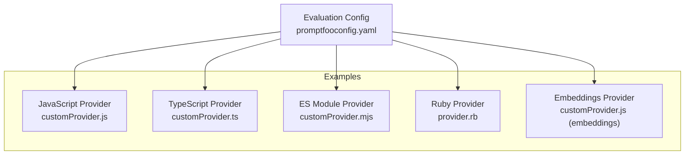
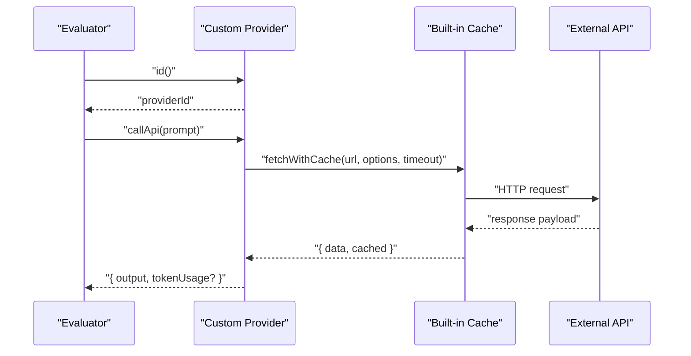
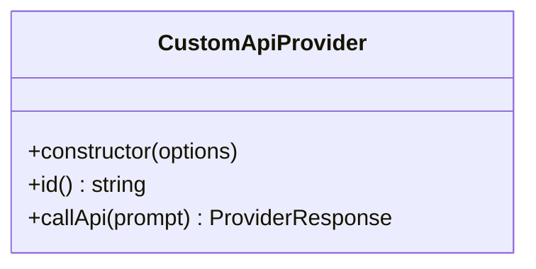
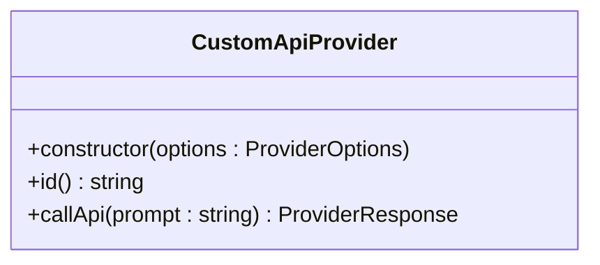
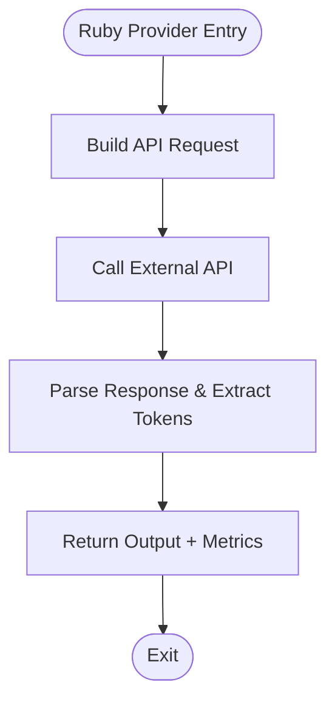
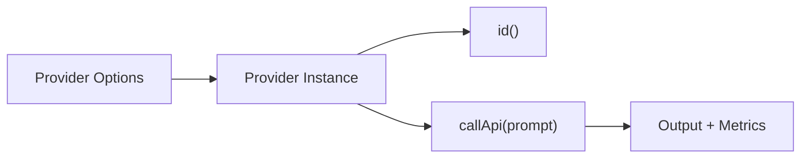
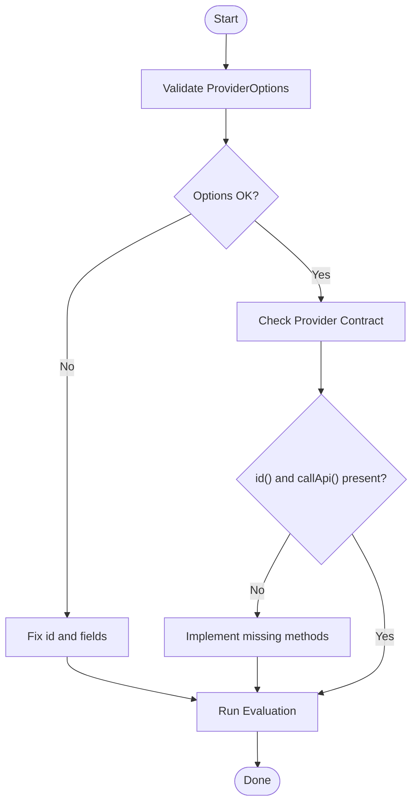

# Custom Provider Development

<cite>
**Referenced Files in This Document**
- [customProvider.js](file://examples/custom-provider/customProvider.js)
- [customProvider.ts](file://examples/custom-provider-typescript/customProvider.ts)
- [customProvider.mjs](file://examples/custom-provider-mjs/customProvider.mjs)
- [customProvider.js (embeddings)](file://examples/custom-provider-embeddings/customProvider.js)
- [provider.rb](file://examples/ruby-provider/provider.rb)
- [README.md (custom-provider)](file://examples/custom-provider/README.md)
- [README.md (custom-provider-typescript)](file://examples/custom-provider-typescript/README.md)
- [README.md (custom-provider-mjs)](file://examples/custom-provider-mjs/README.md)
- [README.md (ruby-provider)](file://examples/ruby-provider/README.md)
- [providers.test.ts](file://test/types/providers.test.ts)
- [providers.index.test.ts](file://test/providers/index.test.ts)
- [providers.route.test.ts](file://test/server/routes/providers.test.ts)
</cite>

## Table of Contents
1. [Introduction](#introduction)
2. [Project Structure](#project-structure)
3. [Core Components](#core-components)
4. [Architecture Overview](#architecture-overview)
5. [Detailed Component Analysis](#detailed-component-analysis)
6. [Dependency Analysis](#dependency-analysis)
7. [Performance Considerations](#performance-considerations)
8. [Troubleshooting Guide](#troubleshooting-guide)
9. [Conclusion](#conclusion)
10. [Appendices](#appendices)

## Introduction
This document explains how to build custom providers for PromptFoo. It covers the provider interface contract, registration via configuration, and method signatures. You will learn to implement providers in JavaScript, TypeScript, and Ruby, and how to integrate them into evaluations. Advanced topics include streaming responses, function/tool use, multimodal inputs, testing, debugging, performance optimization, caching, and error handling.

## Project Structure
PromptFoo supports custom providers through pluggable modules. The examples demonstrate how to implement providers in multiple languages and register them in configurations. Providers are resolved by ID or label and invoked during evaluation to produce model outputs.

**Diagram sources**
- [customProvider.js:1-57](file://examples/custom-provider/customProvider.js#L1-L57)
- [customProvider.ts:1-61](file://examples/custom-provider-typescript/customProvider.ts#L1-L61)
- [customProvider.mjs:1-58](file://examples/custom-provider-mjs/customProvider.mjs#L1-L58)
- [provider.rb](file://examples/ruby-provider/provider.rb)
- [customProvider.js (embeddings):1-51](file://examples/custom-provider-embeddings/customProvider.js#L1-L51)

**Section sources**
- [README.md (custom-provider):1-22](file://examples/custom-provider/README.md#L1-L22)
- [README.md (custom-provider-typescript):1-22](file://examples/custom-provider-typescript/README.md#L1-L22)
- [README.md (custom-provider-mjs):1-22](file://examples/custom-provider-mjs/README.md#L1-L22)
- [README.md (ruby-provider):1-95](file://examples/ruby-provider/README.md#L1-L95)

## Core Components
A custom provider must implement a minimal interface recognized by PromptFoo. The examples show how to define a class with an identifier and an API call method. Some providers also implement embedding or specialized methods.

Key elements:
- Identifier: A stable string returned by an id() method.
- API invocation: A callApi(prompt) method returning a structured response with output and optional tokenUsage.
- Optional methods: callEmbeddingApi(prompt) for embeddings; additional methods for streaming, tool/function calling, or multimodal inputs as needed.
- Configuration: Options passed via ProviderOptions are available in the constructor.

Validation tests confirm that providers must expose a callable id() and a callApi(prompt) method. They also enforce that provider identifiers are strings and that options include a valid id.

**Section sources**
- [customProvider.js:4-56](file://examples/custom-provider/customProvider.js#L4-L56)
- [customProvider.ts:7-60](file://examples/custom-provider-typescript/customProvider.ts#L7-L60)
- [customProvider.mjs:5-57](file://examples/custom-provider-mjs/customProvider.mjs#L5-L57)
- [customProvider.js (embeddings):1-51](file://examples/custom-provider-embeddings/customProvider.js#L1-L51)
- [providers.test.ts:41-86](file://test/types/providers.test.ts#L41-L86)
- [providers.test.ts:78-120](file://test/types/providers.test.ts#L78-L120)

## Architecture Overview
The evaluation pipeline resolves providers by ID or label, invokes callApi(prompt), and collects outputs and metrics. Providers can leverage built-in caching utilities to reduce latency and cost.

**Diagram sources**
- [customProvider.js:17-53](file://examples/custom-provider/customProvider.js#L17-L53)
- [customProvider.ts:23-59](file://examples/custom-provider-typescript/customProvider.ts#L23-L59)
- [customProvider.mjs:21-56](file://examples/custom-provider-mjs/customProvider.mjs#L21-L56)

## Detailed Component Analysis

### Provider Interface Contract
Providers must implement:
- id(): returns a string provider identifier.
- callApi(prompt): returns a structured response containing output and optional tokenUsage.

Optional capabilities:
- callEmbeddingApi(prompt): returns embedding vectors and tokenUsage.
- Streaming: Implement a streaming variant of callApi that yields partial chunks.
- Function/Tool use: Extend callApi to accept tool definitions and process tool calls.
- Multimodal: Accept mixed modalities (text, images, audio) in prompt and return structured outputs.

Provider options:
- ProviderOptions includes id, label, and arbitrary config passed from configuration.

Validation rules:
- Provider must expose id() as a function.
- Provider id must be a string.
- Provider must expose callApi(prompt) as a function.
- Provider options must include a valid id.

**Section sources**
- [providers.test.ts:41-86](file://test/types/providers.test.ts#L41-L86)
- [providers.test.ts:78-120](file://test/types/providers.test.ts#L78-L120)

### JavaScript Provider (CommonJS)
Implementation highlights:
- Class-based provider with constructor receiving ProviderOptions.
- id() returns a configurable providerId.
- callApi(prompt) builds a request payload, calls an external API via promptfoo.cache.fetchWithCache, and returns output plus tokenUsage.

Registration:
- Add the provider module path to the providers list in configuration.

**Diagram sources**
- [customProvider.js:4-56](file://examples/custom-provider/customProvider.js#L4-L56)

**Section sources**
- [customProvider.js:1-57](file://examples/custom-provider/customProvider.js#L1-L57)
- [README.md (custom-provider):1-22](file://examples/custom-provider/README.md#L1-L22)

### TypeScript Provider
Implementation highlights:
- Implements ApiProvider interface with typed ProviderOptions and ProviderResponse.
- Uses import from 'promptfoo' and type imports for strong typing.
- callApi(prompt) returns a strongly-typed ProviderResponse.

Registration:
- Same as JavaScript; ensure TypeScript is compiled or run via compatible environments.

**Diagram sources**
- [customProvider.ts:7-60](file://examples/custom-provider-typescript/customProvider.ts#L7-L60)

**Section sources**
- [customProvider.ts:1-61](file://examples/custom-provider-typescript/customProvider.ts#L1-L61)
- [README.md (custom-provider-typescript):1-22](file://examples/custom-provider-typescript/README.md#L1-L22)

### ES Module Provider (MJS)
Implementation highlights:
- ES module export with private field for providerId and public config.
- callApi(prompt) mirrors the JavaScript pattern with fetch and cache integration.

Registration:
- Reference the .mjs file in configuration.

**Diagram sources**
- [customProvider.mjs:5-57](file://examples/custom-provider-mjs/customProvider.mjs#L5-L57)

**Section sources**
- [customProvider.mjs:1-58](file://examples/custom-provider-mjs/customProvider.mjs#L1-L58)
- [README.md (custom-provider-mjs):1-22](file://examples/custom-provider-mjs/README.md#L1-L22)

### Ruby Provider
Implementation highlights:
- Demonstrates a Ruby-based provider that integrates with an external API.
- Supports token usage extraction and multiple API call patterns.
- Can be combined with Ruby assertions for validation.

Registration:
- Configure the Ruby provider in promptfooconfig.yaml and run evaluation.

**Diagram sources**
- [provider.rb](file://examples/ruby-provider/provider.rb)

**Section sources**
- [README.md (ruby-provider):1-95](file://examples/ruby-provider/README.md#L1-L95)

### Embeddings Provider
Highlights:
- Implements callEmbeddingApi(prompt) to return embedding vectors and tokenUsage.
- Useful for similarity scoring and downstream vector operations.

**Section sources**
- [customProvider.js (embeddings):1-51](file://examples/custom-provider-embeddings/customProvider.js#L1-L51)

### Streaming Responses
Approach:
- Modify callApi to stream partial chunks and yield them progressively.
- Ensure the response structure accommodates incremental tokens and finalization signals.

[No sources needed since this section provides general guidance]

### Function Calling and Tool Use
Approach:
- Extend callApi to accept tool definitions alongside prompts.
- Return structured tool call results and final outputs.

[No sources needed since this section provides general guidance]

### Multimodal Inputs
Approach:
- Accept arrays or structured inputs combining text, images, audio.
- Normalize inputs to provider-specific schema and handle media encoding.

[No sources needed since this section provides general guidance]

## Dependency Analysis
Providers are resolved by ID or label and must adhere to the provider interface contract. Tests validate that providers must expose id() and callApi(prompt), and that provider options must include a valid id.

**Diagram sources**
- [providers.test.ts:41-86](file://test/types/providers.test.ts#L41-L86)
- [providers.test.ts:78-120](file://test/types/providers.test.ts#L78-L120)

**Section sources**
- [providers.test.ts:41-86](file://test/types/providers.test.ts#L41-L86)
- [providers.test.ts:78-120](file://test/types/providers.test.ts#L78-L120)
- [providers.index.test.ts:1420-1463](file://test/providers/index.test.ts#L1420-L1463)

## Performance Considerations
- Caching: Use promptfoo.cache.fetchWithCache to avoid redundant requests and reduce latency.
- Concurrency: Limit concurrent provider calls to respect external API quotas.
- Batch embeddings: Group embedding calls when feasible.
- Timeout tuning: Adjust timeouts per provider to balance responsiveness and reliability.
- Retry/backoff: Implement retries for transient failures.

[No sources needed since this section provides general guidance]

## Troubleshooting Guide
Common issues and resolutions:
- Invalid provider shape: Ensure id() returns a string and callApi(prompt) is a function.
- Missing provider id in options: Verify ProviderOptions includes a valid id.
- Discovery/validation errors: The server-side provider discovery endpoint validates request bodies; ensure id is present and of correct type.

**Diagram sources**
- [providers.test.ts:41-86](file://test/types/providers.test.ts#L41-L86)
- [providers.route.test.ts:516-554](file://test/server/routes/providers.test.ts#L516-L554)

**Section sources**
- [providers.test.ts:41-86](file://test/types/providers.test.ts#L41-L86)
- [providers.route.test.ts:516-554](file://test/server/routes/providers.test.ts#L516-L554)

## Conclusion
Custom providers in PromptFoo follow a simple, extensible contract. By implementing id() and callApi(prompt), integrating caching, and optionally adding embedding, streaming, tool/function calling, and multimodal support, you can build robust, production-ready evaluators across JavaScript, TypeScript, ES modules, and Ruby.

## Appendices

### Step-by-Step: JavaScript Provider
1. Create a class with constructor(options) and store providerId and config.
2. Implement id() to return providerId.
3. Implement callApi(prompt) to call an external API and return output plus tokenUsage.
4. Register the provider in configuration using the module path.

**Section sources**
- [customProvider.js:1-57](file://examples/custom-provider/customProvider.js#L1-L57)
- [README.md (custom-provider):1-22](file://examples/custom-provider/README.md#L1-L22)

### Step-by-Step: TypeScript Provider
1. Import promptfoo and types.
2. Implement ApiProvider with typed ProviderOptions and ProviderResponse.
3. Implement id() and callApi(prompt).
4. Compile and run with a TypeScript-compatible environment.

**Section sources**
- [customProvider.ts:1-61](file://examples/custom-provider-typescript/customProvider.ts#L1-L61)
- [README.md (custom-provider-typescript):1-22](file://examples/custom-provider-typescript/README.md#L1-L22)

### Step-by-Step: ES Module Provider
1. Export a default class with constructor(options).
2. Implement id() and callApi(prompt).
3. Reference the .mjs file in configuration.

**Section sources**
- [customProvider.mjs:1-58](file://examples/custom-provider-mjs/customProvider.mjs#L1-L58)
- [README.md (custom-provider-mjs):1-22](file://examples/custom-provider-mjs/README.md#L1-L22)

### Step-by-Step: Ruby Provider
1. Implement a Ruby provider that calls an external API.
2. Extract token usage and return output.
3. Configure promptfooconfig.yaml to use the provider and run evaluation.

**Section sources**
- [README.md (ruby-provider):1-95](file://examples/ruby-provider/README.md#L1-L95)

### Provider Types
- API-based providers: Call external APIs and return text outputs.
- Local model providers: Run inference locally (e.g., llama.cpp, Ollama).
- Hybrid providers: Combine local and remote inference with routing logic.

[No sources needed since this section provides general guidance]

### Testing, Debugging, and Validation
- Unit tests: Validate provider shape and options.
- Integration tests: Ensure provider resolves by ID and label.
- Server route tests: Confirm provider discovery endpoint validation.

**Section sources**
- [providers.test.ts:41-86](file://test/types/providers.test.ts#L41-L86)
- [providers.index.test.ts:1420-1463](file://test/providers/index.test.ts#L1420-L1463)
- [providers.route.test.ts:516-554](file://test/server/routes/providers.test.ts#L516-L554)