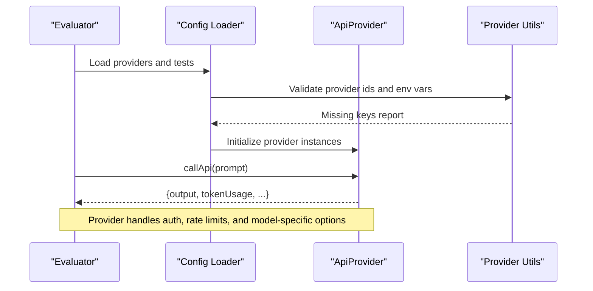
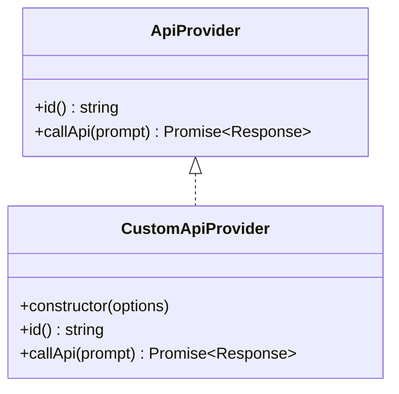
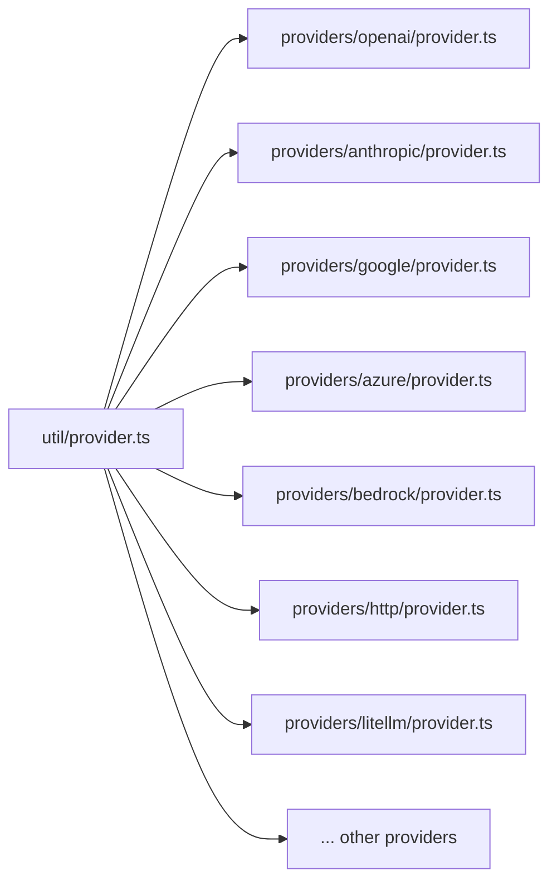

# Provider Integration

<cite>
**Referenced Files in This Document**
- [provider.ts](file://src/util/provider.ts)
- [customProvider.js](file://examples/custom-provider/customProvider.js)
- [promptfooconfig.yaml](file://examples/custom-provider/promptfooconfig.yaml)
- [promptfooconfig.yaml](file://examples/amazon-bedrock/promptfooconfig.yaml)
- [provider.ts](file://src/providers/google/provider.ts)
- [provider.ts](file://src/providers/anthropic/provider.ts)
- [provider.ts](file://src/providers/openai/provider.ts)
- [provider.ts](file://src/providers/azure/provider.ts)
- [provider.ts](file://src/providers/bedrock/provider.ts)
- [provider.ts](file://src/providers/http/provider.ts)
- [provider.ts](file://src/providers/litellm/provider.ts)
- [provider.ts](file://src/providers/huggingface/provider.ts)
- [provider.ts](file://src/providers/cloudflare-ai/provider.ts)
- [provider.ts](file://src/providers/cohere/provider.ts)
- [provider.ts](file://src/providers/mistral/provider.ts)
- [provider.ts](file://src/providers/groq/provider.ts)
- [provider.ts](file://src/providers/xai/provider.ts)
- [provider.ts](file://src/providers/deepseek/provider.ts)
- [provider.ts](file://src/providers/perplexity/provider.ts)
- [provider.ts](file://src/providers/hyperbolic/provider.ts)
- [provider.ts](file://src/providers/cerebras/provider.ts)
- [provider.ts](file://src/providers/replicate/provider.ts)
- [provider.ts](file://src/providers/ollama/provider.ts)
- [provider.ts](file://src/providers/vercel-ai-sdk/provider.ts)
- [provider.ts](file://src/providers/truefoundry/provider.ts)
- [provider.ts](file://src/providers/watsonx/provider.ts)
- [provider.ts](file://src/providers/databricks/provider.ts)
- [provider.ts](file://src/providers/sagemaker/provider.ts)
- [provider.ts](file://src/providers/portkey/provider.ts)
- [provider.ts](file://src/providers/helicone/provider.ts)
- [provider.ts](file://src/providers/langfuse/provider.ts)
- [provider.ts](file://src/providers/aiml-api/provider.ts)
- [provider.ts](file://src/providers/vercel-ai-gateway/provider.ts)
- [provider.ts](file://src/providers/llama-cpp/provider.ts)
- [provider.ts](file://src/providers/nanoclimate/provider.ts)
- [provider.ts](file://src/providers/omnivore/provider.ts)
- [provider.ts](file://src/providers/parade-ml/provider.ts)
- [provider.ts](file://src/providers/pydantic-ai/provider.ts)
- [provider.ts](file://src/providers/route/provider.ts)
- [provider.ts](file://src/providers/taipy/provider.ts)
- [provider.ts](file://src/providers/traveltime/provider.ts)
- [provider.ts](file://src/providers/vercel-ai-sdk/provider.ts)
- [provider.ts](file://src/providers/voyage-embeddings/provider.ts)
- [provider.ts](file://src/providers/xunfei-provider/provider.ts)
- [provider.ts](file://src/providers/yandex/provider.ts)
- [provider.ts](file://src/providers/zilliz/provider.ts)
- [provider.ts](file://src/providers/zyfra/provider.ts)
</cite>

## Table of Contents
1. [Introduction](#introduction)
2. [Project Structure](#project-structure)
3. [Core Components](#core-components)
4. [Architecture Overview](#architecture-overview)
5. [Detailed Component Analysis](#detailed-component-analysis)
6. [Dependency Analysis](#dependency-analysis)
7. [Performance Considerations](#performance-considerations)
8. [Troubleshooting Guide](#troubleshooting-guide)
9. [Conclusion](#conclusion)
10. [Appendices](#appendices)

## Introduction
This document explains how PromptFoo integrates with AI providers, covering supported providers, authentication, configuration, rate limiting, and provider-specific features. It also documents the provider interface, how to implement custom providers, provider selection and fallback strategies, and multi-provider evaluation approaches. Examples are drawn from the repository’s provider implementations and example configurations.

## Project Structure
PromptFoo organizes provider implementations under a dedicated providers directory. Each provider is implemented as a module exporting a class conforming to the ApiProvider interface. Utility helpers in the util directory assist with provider identification, environment variable detection, and pre-checking API keys.

```mermaid
graph TB
subgraph "Core"
Util["util/provider.ts<br/>Provider helpers"]
Types["types/providers.ts<br/>ApiProvider interface"]
end
subgraph "Providers"
OpenAI["providers/openai/provider.ts"]
Anthropic["providers/anthropic/provider.ts"]
Google["providers/google/provider.ts"]
Azure["providers/azure/provider.ts"]
Bedrock["providers/bedrock/provider.ts"]
HTTP["providers/http/provider.ts"]
LiteLLM["providers/litellm/provider.ts"]
HuggingFace["providers/huggingface/provider.ts"]
Cloudflare["providers/cloudflare-ai/provider.ts"]
Cohere["providers/cohere/provider.ts"]
Mistral["providers/mistral/provider.ts"]
Groq["providers/groq/provider.ts"]
XAI["providers/xai/provider.ts"]
DeepSeek["providers/deepseek/provider.ts"]
Perplexity["providers/perplexity/provider.ts"]
Hyperbolic["providers/hyperbolic/provider.ts"]
Cerebras["providers/cerebras/provider.ts"]
Replicate["providers/replicate/provider.ts"]
Ollama["providers/ollama/provider.ts"]
VercelSDK["providers/vercel-ai-sdk/provider.ts"]
TrueFoundry["providers/truefoundry/provider.ts"]
Watsonx["providers/watsonx/provider.ts"]
Databricks["providers/databricks/provider.ts"]
SageMaker["providers/sagemaker/provider.ts"]
Portkey["providers/portkey/provider.ts"]
Helicone["providers/helicone/provider.ts"]
Langfuse["providers/langfuse/provider.ts"]
AIML["providers/aiml-api/provider.ts"]
Gateway["providers/vercel-ai-gateway/provider.ts"]
LlamaCPP["providers/llama-cpp/provider.ts"]
Nanoclimate["providers/nanoclimate/provider.ts"]
Omnivore["providers/omnivore/provider.ts"]
ParadeML["providers/parade-ml/provider.ts"]
PydanticAI["providers/pydantic-ai/provider.ts"]
Route["providers/route/provider.ts"]
Taipy["providers/taipy/provider.ts"]
TravelTime["providers/traveltime/provider.ts"]
Voyage["providers/voyage-embeddings/provider.ts"]
Xunfei["providers/xunfei-provider/provider.ts"]
Yandex["providers/yandex/provider.ts"]
Zilliz["providers/zilliz/provider.ts"]
Zyfra["providers/zyfra/provider.ts"]
end
Util --> OpenAI
Util --> Anthropic
Util --> Google
Util --> Azure
Util --> Bedrock
Util --> HTTP
Util --> LiteLLM
Util --> HuggingFace
Util --> Cloudflare
Util --> Cohere
Util --> Mistral
Util --> Groq
Util --> XAI
Util --> DeepSeek
Util --> Perplexity
Util --> Hyperbolic
Util --> Cerebras
Util --> Replicate
Util --> Ollama
Util --> VercelSDK
Util --> TrueFoundry
Util --> Watsonx
Util --> Databricks
Util --> SageMaker
Util --> Portkey
Util --> Helicone
Util --> Langfuse
Util --> AIML
Util --> Gateway
Util --> LlamaCPP
Util --> Nanoclimate
Util --> Omnivore
Util --> ParadeML
Util --> PydanticAI
Util --> Route
Util --> Taipy
Util --> TravelTime
Util --> Voyage
Util --> Xunfei
Util --> Yandex
Util --> Zilliz
Util --> Zyfra
```

**Diagram sources**
- [provider.ts](file://src/util/provider.ts)
- [provider.ts](file://src/providers/openai/provider.ts)
- [provider.ts](file://src/providers/anthropic/provider.ts)
- [provider.ts](file://src/providers/google/provider.ts)
- [provider.ts](file://src/providers/azure/provider.ts)
- [provider.ts](file://src/providers/bedrock/provider.ts)
- [provider.ts](file://src/providers/http/provider.ts)
- [provider.ts](file://src/providers/litellm/provider.ts)
- [provider.ts](file://src/providers/huggingface/provider.ts)
- [provider.ts](file://src/providers/cloudflare-ai/provider.ts)
- [provider.ts](file://src/providers/cohere/provider.ts)
- [provider.ts](file://src/providers/mistral/provider.ts)
- [provider.ts](file://src/providers/groq/provider.ts)
- [provider.ts](file://src/providers/xai/provider.ts)
- [provider.ts](file://src/providers/deepseek/provider.ts)
- [provider.ts](file://src/providers/perplexity/provider.ts)
- [provider.ts](file://src/providers/hyperbolic/provider.ts)
- [provider.ts](file://src/providers/cerebras/provider.ts)
- [provider.ts](file://src/providers/replicate/provider.ts)
- [provider.ts](file://src/providers/ollama/provider.ts)
- [provider.ts](file://src/providers/vercel-ai-sdk/provider.ts)
- [provider.ts](file://src/providers/truefoundry/provider.ts)
- [provider.ts](file://src/providers/watsonx/provider.ts)
- [provider.ts](file://src/providers/databricks/provider.ts)
- [provider.ts](file://src/providers/sagemaker/provider.ts)
- [provider.ts](file://src/providers/portkey/provider.ts)
- [provider.ts](file://src/providers/helicone/provider.ts)
- [provider.ts](file://src/providers/langfuse/provider.ts)
- [provider.ts](file://src/providers/aiml-api/provider.ts)
- [provider.ts](file://src/providers/vercel-ai-gateway/provider.ts)
- [provider.ts](file://src/providers/llama-cpp/provider.ts)
- [provider.ts](file://src/providers/nanoclimate/provider.ts)
- [provider.ts](file://src/providers/omnivore/provider.ts)
- [provider.ts](file://src/providers/parade-ml/provider.ts)
- [provider.ts](file://src/providers/pydantic-ai/provider.ts)
- [provider.ts](file://src/providers/route/provider.ts)
- [provider.ts](file://src/providers/taipy/provider.ts)
- [provider.ts](file://src/providers/traveltime/provider.ts)
- [provider.ts](file://src/providers/voyage-embeddings/provider.ts)
- [provider.ts](file://src/providers/xunfei-provider/provider.ts)
- [provider.ts](file://src/providers/yandex/provider.ts)
- [provider.ts](file://src/providers/zilliz/provider.ts)
- [provider.ts](file://src/providers/zyfra/provider.ts)

**Section sources**
- [provider.ts](file://src/util/provider.ts)

## Core Components
- Provider interface and identification
  - Providers implement an ApiProvider interface with methods such as id() and callApi(). Utilities provide canonicalization, labeling, matching, and environment variable checks.
  - See [provider.ts](file://src/util/provider.ts).

- Authentication helpers
  - Environment variable defaults are mapped for known providers. A pre-check scans providers for missing API keys and reports which environment variables are required.
  - See [provider.ts](file://src/util/provider.ts).

- Provider selection and matching
  - Providers can be matched by label, exact id, or wildcard patterns. Helpers support allowed provider lists and model-family detection (OpenAI, Anthropic, Google).
  - See [provider.ts](file://src/util/provider.ts).

**Section sources**
- [provider.ts](file://src/util/provider.ts)

## Architecture Overview
PromptFoo evaluates prompts across multiple providers. Each provider encapsulates authentication, request construction, streaming, and token accounting. Utilities coordinate provider discovery, validation, and selection.

**Diagram sources**
- [provider.ts](file://src/util/provider.ts)
- [provider.ts](file://src/providers/openai/provider.ts)
- [provider.ts](file://src/providers/anthropic/provider.ts)
- [provider.ts](file://src/providers/google/provider.ts)
- [provider.ts](file://src/providers/azure/provider.ts)
- [provider.ts](file://src/providers/bedrock/provider.ts)

## Detailed Component Analysis

### OpenAI
- Authentication
  - Uses OPENAI_API_KEY by default; configurable via apiKeyEnvar.
  - See [provider.ts](file://src/providers/openai/provider.ts).

- Configuration options
  - Common options include temperature, max_tokens, top_p, frequency_penalty, presence_penalty, and model variants.
  - See [provider.ts](file://src/providers/openai/provider.ts).

- Rate limiting and quotas
  - Provider implementation manages concurrency and retries; respects provider-side rate limits.
  - See [provider.ts](file://src/providers/openai/provider.ts).

- Features
  - Function/tool calling, structured outputs, streaming, and embeddings.
  - See [provider.ts](file://src/providers/openai/provider.ts).

- Example configuration
  - See [promptfooconfig.yaml](file://examples/amazon-bedrock/promptfooconfig.yaml).

**Section sources**
- [provider.ts](file://src/providers/openai/provider.ts)
- [promptfooconfig.yaml](file://examples/amazon-bedrock/promptfooconfig.yaml)

### Anthropic (Claude)
- Authentication
  - Uses ANTHROPIC_API_KEY by default; configurable via apiKeyEnvar.
  - See [provider.ts](file://src/providers/anthropic/provider.ts).

- Configuration options
  - temperature, max_tokens, top_p, and model variants.
  - See [provider.ts](file://src/providers/anthropic/provider.ts).

- Rate limiting and quotas
  - Provider implementation enforces rate limits and backoff.
  - See [provider.ts](file://src/providers/anthropic/provider.ts).

- Features
  - Tool use, system prompts, and structured outputs.
  - See [provider.ts](file://src/providers/anthropic/provider.ts).

- Example configuration
  - See [promptfooconfig.yaml](file://examples/amazon-bedrock/promptfooconfig.yaml).

**Section sources**
- [provider.ts](file://src/providers/anthropic/provider.ts)
- [promptfooconfig.yaml](file://examples/amazon-bedrock/promptfooconfig.yaml)

### Google AI (Gemini, Vertex)
- Authentication
  - Uses GOOGLE_API_KEY by default; Vertex supports service accounts and ADC.
  - See [provider.ts](file://src/providers/google/provider.ts).

- Configuration options
  - temperature, max_tokens, top_p, top_k, and model variants.
  - See [provider.ts](file://src/providers/google/provider.ts).

- Rate limiting and quotas
  - Provider implementation handles quotas and regional endpoints.
  - See [provider.ts](file://src/providers/google/provider.ts).

- Features
  - Multimodal inputs, function calling, and embeddings.
  - See [provider.ts](file://src/providers/google/provider.ts).

- Example configuration
  - See [promptfooconfig.yaml](file://examples/amazon-bedrock/promptfooconfig.yaml).

**Section sources**
- [provider.ts](file://src/providers/google/provider.ts)
- [promptfooconfig.yaml](file://examples/amazon-bedrock/promptfooconfig.yaml)

### AWS Bedrock
- Authentication
  - Uses AWS credentials via IAM or IAM roles; region required.
  - See [provider.ts](file://src/providers/bedrock/provider.ts).

- Configuration options
  - region, max_tokens, temperature, and model-specific parameters.
  - See [provider.ts](file://src/providers/bedrock/provider.ts).

- Rate limiting and quotas
  - Provider implementation respects per-model throttling and concurrency limits.
  - See [provider.ts](file://src/providers/bedrock/provider.ts).

- Features
  - Multimodal, tool/function use, and streaming.
  - See [provider.ts](file://src/providers/bedrock/provider.ts).

- Example configuration
  - See [promptfooconfig.yaml](file://examples/amazon-bedrock/promptfooconfig.yaml).

**Section sources**
- [provider.ts](file://src/providers/bedrock/provider.ts)
- [promptfooconfig.yaml](file://examples/amazon-bedrock/promptfooconfig.yaml)

### Azure OpenAI
- Authentication
  - Supports API key and Azure AD tokens; optional API key enforcement.
  - See [provider.ts](file://src/providers/azure/provider.ts).

- Configuration options
  - deployment name, temperature, max_tokens, and model variants.
  - See [provider.ts](file://src/providers/azure/provider.ts).

- Rate limiting and quotas
  - Provider implementation enforces per-deployment limits.
  - See [provider.ts](file://src/providers/azure/provider.ts).

- Features
  - Function/tool calling, streaming, and embeddings.
  - See [provider.ts](file://src/providers/azure/provider.ts).

- Example configuration
  - See [promptfooconfig.yaml](file://examples/amazon-bedrock/promptfooconfig.yaml).

**Section sources**
- [provider.ts](file://src/providers/azure/provider.ts)
- [promptfooconfig.yaml](file://examples/amazon-bedrock/promptfooconfig.yaml)

### HTTP Provider
- Authentication
  - Supports bearer tokens, custom headers, and signature-based auth.
  - See [provider.ts](file://src/providers/http/provider.ts).

- Configuration options
  - base URL, headers, timeouts, and retry policies.
  - See [provider.ts](file://src/providers/http/provider.ts).

- Features
  - Custom endpoints, streaming, and response transformation.
  - See [provider.ts](file://src/providers/http/provider.ts).

**Section sources**
- [provider.ts](file://src/providers/http/provider.ts)

### LiteLLM Proxy
- Authentication
  - Supports proxy-level auth and upstream provider routing.
  - See [provider.ts](file://src/providers/litellm/provider.ts).

- Configuration options
  - proxy endpoint, model mapping, and routing rules.
  - See [provider.ts](file://src/providers/litellm/provider.ts).

**Section sources**
- [provider.ts](file://src/providers/litellm/provider.ts)

### Hugging Face
- Authentication
  - Uses HF_TOKEN by default; supports inference endpoints.
  - See [provider.ts](file://src/providers/huggingface/provider.ts).

- Configuration options
  - model, max_time, and generation parameters.
  - See [provider.ts](file://src/providers/huggingface/provider.ts).

**Section sources**
- [provider.ts](file://src/providers/huggingface/provider.ts)

### Cloudflare AI
- Authentication
  - Uses CLOUDFLARE_API_KEY by default.
  - See [provider.ts](file://src/providers/cloudflare-ai/provider.ts).

- Configuration options
  - model, temperature, and max_tokens.
  - See [provider.ts](file://src/providers/cloudflare-ai/provider.ts).

**Section sources**
- [provider.ts](file://src/providers/cloudflare-ai/provider.ts)

### Cohere
- Authentication
  - Uses COHERE_API_KEY by default.
  - See [provider.ts](file://src/providers/cohere/provider.ts).

- Configuration options
  - temperature, max_tokens, and model variants.
  - See [provider.ts](file://src/providers/cohere/provider.ts).

**Section sources**
- [provider.ts](file://src/providers/cohere/provider.ts)

### Mistral
- Authentication
  - Uses MISTRAL_API_KEY by default.
  - See [provider.ts](file://src/providers/mistral/provider.ts).

- Configuration options
  - temperature, max_tokens, and model variants.
  - See [provider.ts](file://src/providers/mistral/provider.ts).

**Section sources**
- [provider.ts](file://src/providers/mistral/provider.ts)

### Groq
- Authentication
  - Uses GROQ_API_KEY by default.
  - See [provider.ts](file://src/providers/groq/provider.ts).

- Configuration options
  - temperature, max_tokens, and model variants.
  - See [provider.ts](file://src/providers/groq/provider.ts).

**Section sources**
- [provider.ts](file://src/providers/groq/provider.ts)

### xAI (Grok)
- Authentication
  - Uses XAI_API_KEY by default.
  - See [provider.ts](file://src/providers/xai/provider.ts).

- Configuration options
  - temperature, max_tokens, and model variants.
  - See [provider.ts](file://src/providers/xai/provider.ts).

**Section sources**
- [provider.ts](file://src/providers/xai/provider.ts)

### DeepSeek
- Authentication
  - Uses DEEPSEEK_API_KEY by default.
  - See [provider.ts](file://src/providers/deepseek/provider.ts).

- Configuration options
  - temperature, max_tokens, and model variants.
  - See [provider.ts](file://src/providers/deepseek/provider.ts).

**Section sources**
- [provider.ts](file://src/providers/deepseek/provider.ts)

### Perplexity
- Authentication
  - Uses PERPLEXITY_API_KEY by default.
  - See [provider.ts](file://src/providers/perplexity/provider.ts).

- Configuration options
  - temperature, max_tokens, and model variants.
  - See [provider.ts](file://src/providers/perplexity/provider.ts).

**Section sources**
- [provider.ts](file://src/providers/perplexity/provider.ts)

### Hyperbolic
- Authentication
  - Uses HYPERBOLIC_API_KEY by default.
  - See [provider.ts](file://src/providers/hyperbolic/provider.ts).

- Configuration options
  - temperature, max_tokens, and model variants.
  - See [provider.ts](file://src/providers/hyperbolic/provider.ts).

**Section sources**
- [provider.ts](file://src/providers/hyperbolic/provider.ts)

### Cerebras
- Authentication
  - Uses CEREBRAS_API_KEY by default.
  - See [provider.ts](file://src/providers/cerebras/provider.ts).

- Configuration options
  - temperature, max_tokens, and model variants.
  - See [provider.ts](file://src/providers/cerebras/provider.ts).

**Section sources**
- [provider.ts](file://src/providers/cerebras/provider.ts)

### Replicate
- Authentication
  - Uses REPLICATE_API_TOKEN by default.
  - See [provider.ts](file://src/providers/replicate/provider.ts).

- Configuration options
  - model, temperature, max_tokens, and prediction parameters.
  - See [provider.ts](file://src/providers/replicate/provider.ts).

**Section sources**
- [provider.ts](file://src/providers/replicate/provider.ts)

### Ollama
- Authentication
  - Local runtime; no API key required.
  - See [provider.ts](file://src/providers/ollama/provider.ts).

- Configuration options
  - model, temperature, num_predict, and stream.
  - See [provider.ts](file://src/providers/ollama/provider.ts).

**Section sources**
- [provider.ts](file://src/providers/ollama/provider.ts)

### Vercel AI SDK
- Authentication
  - Supports platform-specific auth; integrates with Vercel deployments.
  - See [provider.ts](file://src/providers/vercel-ai-sdk/provider.ts).

- Configuration options
  - runtime, model, and adapter-specific parameters.
  - See [provider.ts](file://src/providers/vercel-ai-sdk/provider.ts).

**Section sources**
- [provider.ts](file://src/providers/vercel-ai-sdk/provider.ts)

### TrueFoundry
- Authentication
  - Uses platform credentials; see provider implementation.
  - See [provider.ts](file://src/providers/truefoundry/provider.ts).

- Configuration options
  - model, temperature, and max_tokens.
  - See [provider.ts](file://src/providers/truefoundry/provider.ts).

**Section sources**
- [provider.ts](file://src/providers/truefoundry/provider.ts)

### watsonx
- Authentication
  - Uses platform credentials; see provider implementation.
  - See [provider.ts](file://src/providers/watsonx/provider.ts).

- Configuration options
  - model, temperature, and max_tokens.
  - See [provider.ts](file://src/providers/watsonx/provider.ts).

**Section sources**
- [provider.ts](file://src/providers/watsonx/provider.ts)

### Databricks
- Authentication
  - Uses Databricks host and token; see provider implementation.
  - See [provider.ts](file://src/providers/databricks/provider.ts).

- Configuration options
  - model, temperature, and max_tokens.
  - See [provider.ts](file://src/providers/databricks/provider.ts).

**Section sources**
- [provider.ts](file://src/providers/databricks/provider.ts)

### Amazon SageMaker
- Authentication
  - Uses AWS credentials; see provider implementation.
  - See [provider.ts](file://src/providers/sagemaker/provider.ts).

- Configuration options
  - model, endpointName, and runtime parameters.
  - See [provider.ts](file://src/providers/sagemaker/provider.ts).

**Section sources**
- [provider.ts](file://src/providers/sagemaker/provider.ts)

### Portkey
- Authentication
  - Uses Portkey API key; see provider implementation.
  - See [provider.ts](file://src/providers/portkey/provider.ts).

- Configuration options
  - provider routing, model mapping, and A/B testing.
  - See [provider.ts](file://src/providers/portkey/provider.ts).

**Section sources**
- [provider.ts](file://src/providers/portkey/provider.ts)

### Helicone
- Authentication
  - Uses Helicone API key; see provider implementation.
  - See [provider.ts](file://src/providers/helicone/provider.ts).

- Configuration options
  - provider routing and observability features.
  - See [provider.ts](file://src/providers/helicone/provider.ts).

**Section sources**
- [provider.ts](file://src/providers/helicone/provider.ts)

### Langfuse
- Authentication
  - Uses Langfuse secret/public keys; see provider implementation.
  - See [provider.ts](file://src/providers/langfuse/provider.ts).

- Configuration options
  - provider routing and tracing features.
  - See [provider.ts](file://src/providers/langfuse/provider.ts).

**Section sources**
- [provider.ts](file://src/providers/langfuse/provider.ts)

### AIML API
- Authentication
  - Uses AIML API key; see provider implementation.
  - See [provider.ts](file://src/providers/aiml-api/provider.ts).

- Configuration options
  - model, temperature, and max_tokens.
  - See [provider.ts](file://src/providers/aiml-api/provider.ts).

**Section sources**
- [provider.ts](file://src/providers/aiml-api/provider.ts)

### Vercel AI Gateway
- Authentication
  - Uses Vercel credentials; see provider implementation.
  - See [provider.ts](file://src/providers/vercel-ai-gateway/provider.ts).

- Configuration options
  - gateway routing and model mapping.
  - See [provider.ts](file://src/providers/vercel-ai-gateway/provider.ts).

**Section sources**
- [provider.ts](file://src/providers/vercel-ai-gateway/provider.ts)

### Llama.cpp
- Authentication
  - Local runtime; no API key required.
  - See [provider.ts](file://src/providers/llama-cpp/provider.ts).

- Configuration options
  - model, temperature, and n_predict.
  - See [provider.ts](file://src/providers/llama-cpp/provider.ts).

**Section sources**
- [provider.ts](file://src/providers/llama-cpp/provider.ts)

### Additional Providers
The repository includes providers for Nanoclimate, Omnivore, Parade ML, Pydantic AI, Route, Taipy, TravelTime, Voyage Embeddings, Xunfei, Yandex, Zilliz, and Zyfra. Each follows the same ApiProvider pattern and can be configured similarly.

**Section sources**
- [provider.ts](file://src/providers/nanoclimate/provider.ts)
- [provider.ts](file://src/providers/omnivore/provider.ts)
- [provider.ts](file://src/providers/parade-ml/provider.ts)
- [provider.ts](file://src/providers/pydantic-ai/provider.ts)
- [provider.ts](file://src/providers/route/provider.ts)
- [provider.ts](file://src/providers/taipy/provider.ts)
- [provider.ts](file://src/providers/traveltime/provider.ts)
- [provider.ts](file://src/providers/voyage-embeddings/provider.ts)
- [provider.ts](file://src/providers/xunfei-provider/provider.ts)
- [provider.ts](file://src/providers/yandex/provider.ts)
- [provider.ts](file://src/providers/zilliz/provider.ts)
- [provider.ts](file://src/providers/zyfra/provider.ts)

### Developing Custom Providers
To implement a custom provider:
- Implement a class with id() and callApi(prompt) methods.
- Optionally expose getApiKey(), requiresApiKey(), and tokenUsage fields.
- Reference the example custom provider implementation and configuration.

**Diagram sources**
- [provider.ts](file://src/util/provider.ts)
- [customProvider.js](file://examples/custom-provider/customProvider.js)

**Section sources**
- [customProvider.js](file://examples/custom-provider/customProvider.js)
- [promptfooconfig.yaml](file://examples/custom-provider/promptfooconfig.yaml)

## Dependency Analysis
Provider utilities centralize provider identification, environment variable mapping, and pre-validation. Providers depend on these utilities for consistent behavior across the system.

**Diagram sources**
- [provider.ts](file://src/util/provider.ts)
- [provider.ts](file://src/providers/openai/provider.ts)
- [provider.ts](file://src/providers/anthropic/provider.ts)
- [provider.ts](file://src/providers/google/provider.ts)
- [provider.ts](file://src/providers/azure/provider.ts)
- [provider.ts](file://src/providers/bedrock/provider.ts)
- [provider.ts](file://src/providers/http/provider.ts)
- [provider.ts](file://src/providers/litellm/provider.ts)

**Section sources**
- [provider.ts](file://src/util/provider.ts)

## Performance Considerations
- Concurrency and batching
  - Providers manage concurrent requests and backoff to avoid throttling.
- Token accounting
  - Providers populate tokenUsage for accurate cost tracking and quota monitoring.
- Streaming
  - Many providers support streaming responses to reduce latency.
- Regional endpoints
  - Bedrock and Vertex require region configuration for optimal latency.

[No sources needed since this section provides general guidance]

## Troubleshooting Guide
- Missing API keys
  - Use the pre-check utility to detect missing environment variables and required keys.
  - See [provider.ts](file://src/util/provider.ts).

- Provider matching and selection
  - Use labels, ids, or wildcard patterns to select providers; verify matches with helper functions.
  - See [provider.ts](file://src/util/provider.ts).

- Authentication failures
  - Verify environment variables and provider-specific auth modes (e.g., Azure AD vs API key).
  - See [provider.ts](file://src/providers/azure/provider.ts), [provider.ts](file://src/providers/bedrock/provider.ts).

- Rate limit exceeded
  - Reduce concurrency, enable backoff, and consider provider-specific throttling controls.
  - See provider implementations for rate-limit handling.

**Section sources**
- [provider.ts](file://src/util/provider.ts)
- [provider.ts](file://src/providers/azure/provider.ts)
- [provider.ts](file://src/providers/bedrock/provider.ts)

## Conclusion
PromptFoo’s provider architecture offers a unified interface for integrating dozens of AI providers. With robust authentication helpers, configuration flexibility, and provider-specific features, it supports diverse evaluation scenarios from single-provider comparisons to multi-provider A/B testing and fallback strategies.

[No sources needed since this section summarizes without analyzing specific files]

## Appendices

### Provider Selection and Fallback Strategies
- Select a single provider by id or label.
- Compare multiple instances of the same provider with different config options.
- Use allowedProviders to restrict evaluation to specific providers.
- Implement fallback chains by ordering providers; the evaluator can attempt subsequent providers on failure.

**Section sources**
- [provider.ts](file://src/util/provider.ts)
- [promptfooconfig.yaml](file://examples/custom-provider/promptfooconfig.yaml)

### Multi-Provider Evaluation
- Define multiple providers in the configuration; each will be evaluated independently.
- Use defaultTest.options.provider.embedding to set a separate embeddings provider for similarity and related assertions.

**Section sources**
- [promptfooconfig.yaml](file://examples/amazon-bedrock/promptfooconfig.yaml)

### Provider-Specific Configuration Options
- Temperature and max_tokens are widely supported across providers.
- Model variants and additional parameters are provider-specific; consult individual provider implementations.

**Section sources**
- [provider.ts](file://src/providers/openai/provider.ts)
- [provider.ts](file://src/providers/anthropic/provider.ts)
- [provider.ts](file://src/providers/google/provider.ts)
- [provider.ts](file://src/providers/bedrock/provider.ts)
- [provider.ts](file://src/providers/azure/provider.ts)

### Authentication Methods
- API keys via environment variables (e.g., OPENAI_API_KEY).
- OAuth and service accounts via provider-specific implementations (e.g., Azure AD, Vertex ADC).
- Signature-based auth for HTTP providers.

**Section sources**
- [provider.ts](file://src/util/provider.ts)
- [provider.ts](file://src/providers/azure/provider.ts)
- [provider.ts](file://src/providers/google/provider.ts)
- [provider.ts](file://src/providers/http/provider.ts)

### Provider Limitations, Costs, and Performance
- Limitations vary by provider (e.g., model availability, input modalities).
- Costs are often tracked via tokenUsage; configure budgets accordingly.
- Performance depends on region, model, and provider-specific throughput.

[No sources needed since this section provides general guidance]