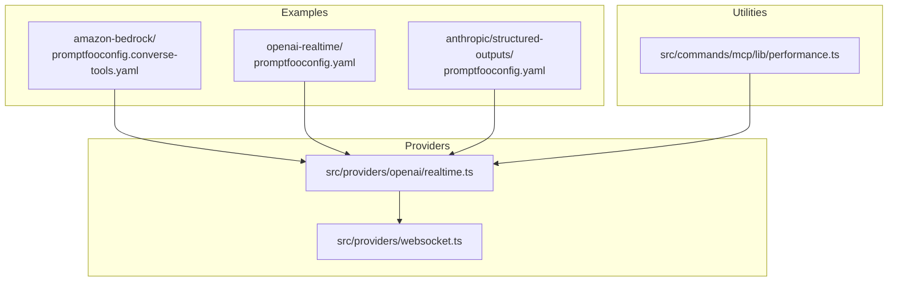
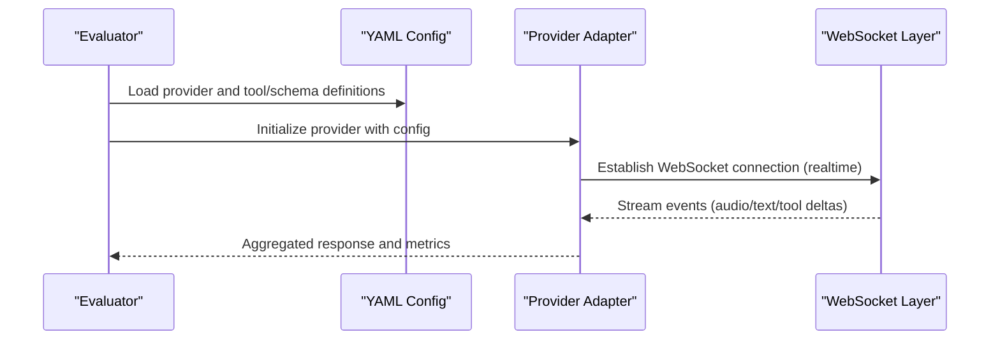
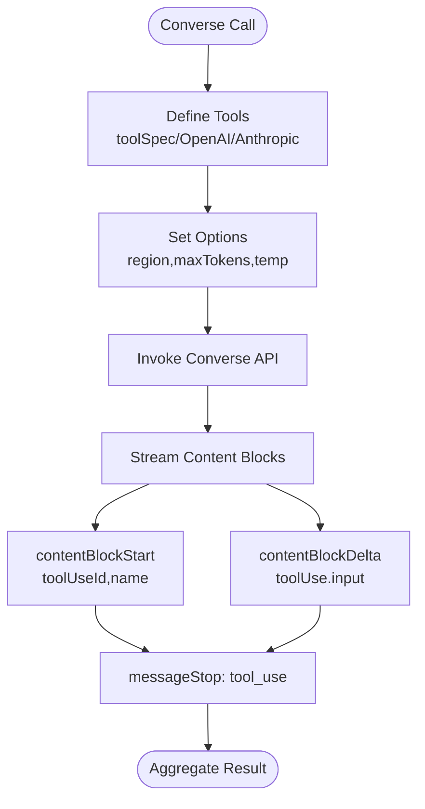
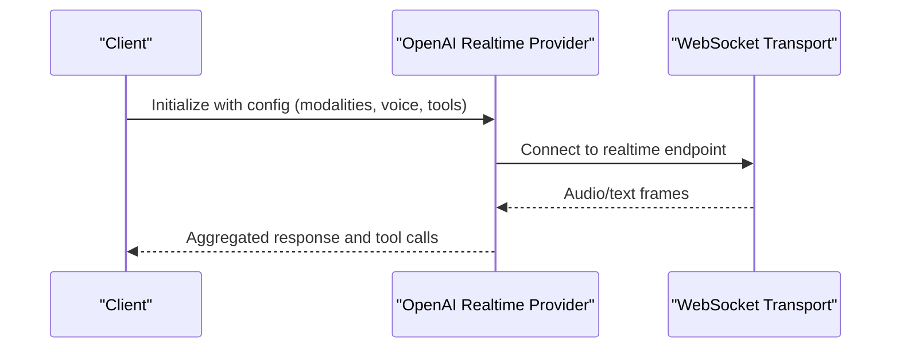
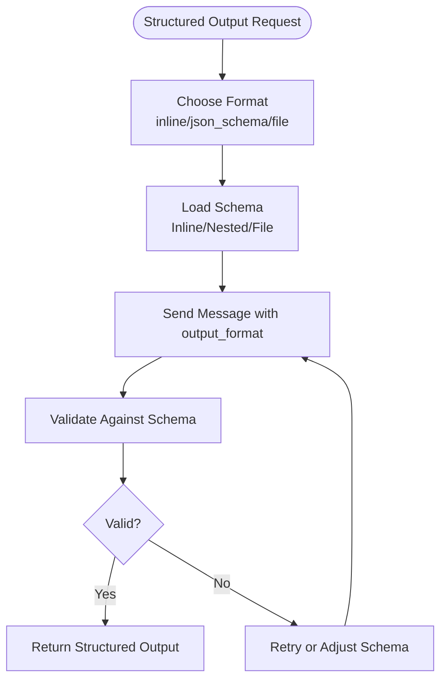
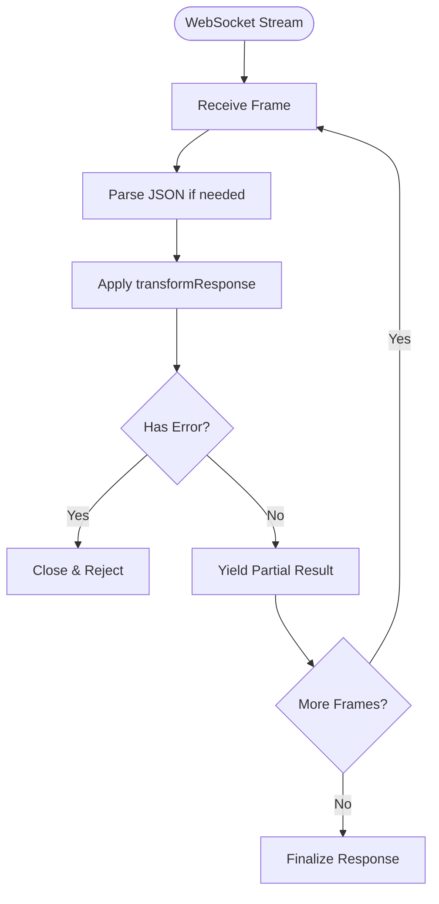
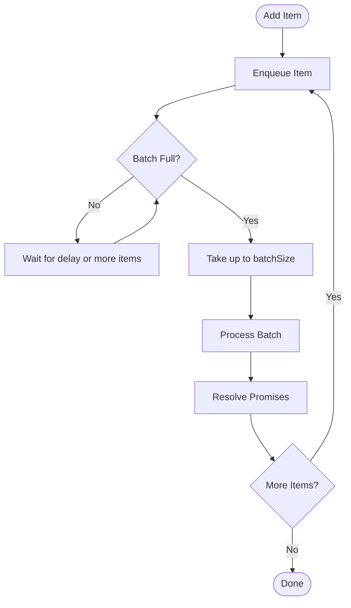
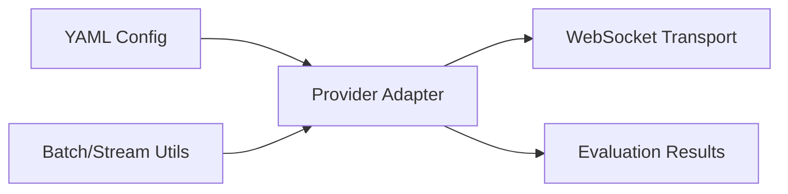

# Provider-Specific Features

<cite>
**Referenced Files in This Document**
- [promptfooconfig.converse-tools.yaml](file://examples/amazon-bedrock/promptfooconfig.converse-tools.yaml)
- [promptfooconfig.yaml](file://examples/openai-realtime/promptfooconfig.yaml)
- [promptfooconfig.yaml](file://examples/anthropic/structured-outputs/promptfooconfig.yaml)
- [realtime.ts](file://src/providers/openai/realtime.ts)
- [websocket.ts](file://src/providers/websocket.ts)
- [converse.test.ts](file://test/providers/bedrock/converse.test.ts)
- [performance.ts](file://src/commands/mcp/lib/performance.ts)
- [performance.test.ts](file://test/commands/mcp/lib/performance.test.ts)
</cite>

## Table of Contents
1. [Introduction](#introduction)
2. [Project Structure](#project-structure)
3. [Core Components](#core-components)
4. [Architecture Overview](#architecture-overview)
5. [Detailed Component Analysis](#detailed-component-analysis)
6. [Dependency Analysis](#dependency-analysis)
7. [Performance Considerations](#performance-considerations)
8. [Troubleshooting Guide](#troubleshooting-guide)
9. [Conclusion](#conclusion)
10. [Appendices](#appendices)

## Introduction
This document explains provider-specific features and capabilities in PromptFoo with a focus on advanced model behaviors such as function/tool calling, structured outputs, multimodal inputs (images, audio, video), and real-time capabilities. It also covers provider-specific configuration options, model variants, feature availability, streaming responses, parallel function execution, and batch processing. Guidance is grounded in concrete configuration examples and implementation patterns present in the repository.

## Project Structure
PromptFoo organizes provider-specific demonstrations under the examples directory, with provider implementations located under src/providers. Advanced features are exercised via YAML configurations that define prompts, providers, tools, and runtime options. Streaming and real-time capabilities are implemented through provider-specific adapters and WebSocket handling.

**Diagram sources**
- [promptfooconfig.converse-tools.yaml](file://examples/amazon-bedrock/promptfooconfig.converse-tools.yaml)
- [promptfooconfig.yaml](file://examples/openai-realtime/promptfooconfig.yaml)
- [promptfooconfig.yaml](file://examples/anthropic/structured-outputs/promptfooconfig.yaml)
- [realtime.ts](file://src/providers/openai/realtime.ts)
- [websocket.ts](file://src/providers/websocket.ts)
- [performance.ts](file://src/commands/mcp/lib/performance.ts)

**Section sources**
- [promptfooconfig.converse-tools.yaml](file://examples/amazon-bedrock/promptfooconfig.converse-tools.yaml)
- [promptfooconfig.yaml](file://examples/openai-realtime/promptfooconfig.yaml)
- [promptfooconfig.yaml](file://examples/anthropic/structured-outputs/promptfooconfig.yaml)
- [realtime.ts](file://src/providers/openai/realtime.ts)
- [websocket.ts](file://src/providers/websocket.ts)
- [performance.ts](file://src/commands/mcp/lib/performance.ts)

## Core Components
- Bedrock Converse API with tool/function calling:
  - Native Converse toolSpec format, OpenAI-compatible function format, and Anthropic-compatible format are demonstrated.
  - Configurable toolChoice and tool definitions are supported.
- OpenAI Realtime API:
  - WebSocket-based real-time audio/text exchange with configurable modalities, voice, instructions, and tools.
  - Automatic beta headers and extended WebSocket timeouts are supported.
- Anthropic Structured Outputs:
  - Inline JSON schema, external schema file, and nested file references for strict JSON outputs.
  - Strict tool definitions enforce exact parameter schemas.
- Streaming and WebSocket Providers:
  - WebSocket provider supports streaming transformations and custom response processing.
- Batch and Parallel Execution Utilities:
  - BatchProcessor and streamProcess utilities enable controlled concurrency and batched processing.

**Section sources**
- [promptfooconfig.converse-tools.yaml](file://examples/amazon-bedrock/promptfooconfig.converse-tools.yaml)
- [promptfooconfig.yaml](file://examples/openai-realtime/promptfooconfig.yaml)
- [promptfooconfig.yaml](file://examples/anthropic/structured-outputs/promptfooconfig.yaml)
- [websocket.ts](file://src/providers/websocket.ts)
- [performance.ts](file://src/commands/mcp/lib/performance.ts)

## Architecture Overview
The evaluation pipeline integrates provider-specific configurations with provider implementations. For real-time and streaming scenarios, WebSocket-based transports are used, while structured outputs rely on provider-native schema enforcement.

**Diagram sources**
- [promptfooconfig.yaml](file://examples/openai-realtime/promptfooconfig.yaml)
- [realtime.ts](file://src/providers/openai/realtime.ts)
- [websocket.ts](file://src/providers/websocket.ts)

## Detailed Component Analysis

### Bedrock Converse Tool Calling
- Feature coverage:
  - Native Converse toolSpec format, OpenAI function format, and Anthropic-compatible format.
  - toolChoice selection and tool definitions with JSON schemas.
- Provider-specific configuration:
  - Region, maxTokens, temperature, and tools arrays.
- Streaming behavior:
  - Tool use is streamed via contentBlockStart and contentBlockDelta events during conversational exchanges.
- Example references:
  - Tool definitions and toolChoice usage are defined in the Bedrock Converse configuration.
  - Streaming tool use events are validated in tests.

**Diagram sources**
- [promptfooconfig.converse-tools.yaml](file://examples/amazon-bedrock/promptfooconfig.converse-tools.yaml)
- [converse.test.ts](file://test/providers/bedrock/converse.test.ts)

**Section sources**
- [promptfooconfig.converse-tools.yaml](file://examples/amazon-bedrock/promptfooconfig.converse-tools.yaml)
- [converse.test.ts](file://test/providers/bedrock/converse.test.ts)

### OpenAI Realtime API
- Feature coverage:
  - Real-time audio/text exchange via WebSocket.
  - Configurable modalities (text/audio), voice, instructions, temperature.
  - Tools definition for function calling with automatic beta headers.
- Provider-specific configuration:
  - websocketTimeout, modalities, voice, instructions, tools, tool_choice.
- Implementation highlights:
  - WebSocket URL construction, origin computation, and audio state management.
  - Session body composition with defaults and overrides.

**Diagram sources**
- [promptfooconfig.yaml](file://examples/openai-realtime/promptfooconfig.yaml)
- [realtime.ts](file://src/providers/openai/realtime.ts)

**Section sources**
- [promptfooconfig.yaml](file://examples/openai-realtime/promptfooconfig.yaml)
- [realtime.ts](file://src/providers/openai/realtime.ts)

### Anthropic Structured Outputs
- Feature coverage:
  - Inline JSON schema, external schema file, and nested file references.
  - Strict tool definitions enforcing exact parameter schemas.
- Provider-specific configuration:
  - output_format with json_schema or file references.
  - tool_choice with strict tool definitions.
- Example references:
  - Inline schema, external file, and nested format configurations are defined in the Anthropic structured outputs example.

**Diagram sources**
- [promptfooconfig.yaml](file://examples/anthropic/structured-outputs/promptfooconfig.yaml)

**Section sources**
- [promptfooconfig.yaml](file://examples/anthropic/structured-outputs/promptfooconfig.yaml)

### Multimodal Inputs (Images, Audio, Video)
- Bedrock multimodal examples:
  - Llama Vision, Nova multimodal, and Nova Sonic configurations demonstrate image and audio inputs.
- Provider-specific configuration:
  - Model IDs tailored for multimodal processing, with appropriate input formats and tool definitions.
- Example references:
  - Multimodal Bedrock configurations are available under the Amazon Bedrock examples.

**Section sources**
- [promptfooconfig.converse-images.yaml](file://examples/amazon-bedrock/promptfooconfig.converse-images.yaml)
- [promptfooconfig.llama-vision.yaml](file://examples/amazon-bedrock/promptfooconfig.llama-vision.yaml)
- [promptfooconfig.nova.multimodal.yaml](file://examples/amazon-bedrock/promptfooconfig.nova.multimodal.yaml)
- [promptfooconfig.nova-sonic.yaml](file://examples/amazon-bedrock/promptfooconfig.nova-sonic.yaml)

### Streaming Responses
- WebSocket provider:
  - Supports streaming transformations and custom response processing via transformResponse.
  - Handles JSON parsing and error propagation during streaming.
- Example references:
  - WebSocket provider implementation demonstrates streaming and transformation logic.

**Diagram sources**
- [websocket.ts](file://src/providers/websocket.ts)

**Section sources**
- [websocket.ts](file://src/providers/websocket.ts)

### Parallel Function Execution and Batch Processing
- BatchProcessor:
  - Queues items and processes them in fixed-size batches after a short delay or when the batch is full.
  - Maintains concurrency limits and resolves promises per batch item.
- streamProcess:
  - Streams results as they complete, preserving concurrency limits and yielding results incrementally.
- Example references:
  - Tests demonstrate batch processing behavior and ordering guarantees.

**Diagram sources**
- [performance.ts](file://src/commands/mcp/lib/performance.ts)

**Section sources**
- [performance.ts](file://src/commands/mcp/lib/performance.ts)
- [performance.test.ts](file://test/commands/mcp/lib/performance.test.ts)

## Dependency Analysis
- Provider configurations depend on provider-specific adapters:
  - Bedrock Converse adapter consumes tool definitions and streaming events.
  - OpenAI Realtime adapter manages WebSocket lifecycle and audio state.
  - WebSocket provider adapts generic streams to provider responses.
- Utilities support batch and parallel execution for performance optimization.

**Diagram sources**
- [promptfooconfig.converse-tools.yaml](file://examples/amazon-bedrock/promptfooconfig.converse-tools.yaml)
- [promptfooconfig.yaml](file://examples/openai-realtime/promptfooconfig.yaml)
- [realtime.ts](file://src/providers/openai/realtime.ts)
- [websocket.ts](file://src/providers/websocket.ts)
- [performance.ts](file://src/commands/mcp/lib/performance.ts)

**Section sources**
- [promptfooconfig.converse-tools.yaml](file://examples/amazon-bedrock/promptfooconfig.converse-tools.yaml)
- [promptfooconfig.yaml](file://examples/openai-realtime/promptfooconfig.yaml)
- [realtime.ts](file://src/providers/openai/realtime.ts)
- [websocket.ts](file://src/providers/websocket.ts)
- [performance.ts](file://src/commands/mcp/lib/performance.ts)

## Performance Considerations
- Concurrency control:
  - Use BatchProcessor to batch requests and reduce overhead.
  - Use streamProcess to yield results as they complete, minimizing latency.
- Streaming efficiency:
  - WebSocket provider handles partial frames and incremental parsing to reduce memory pressure.
- Real-time tuning:
  - Adjust websocketTimeout for unstable networks.
  - Limit modalities to text or audio as needed to reduce bandwidth.

[No sources needed since this section provides general guidance]

## Troubleshooting Guide
- Realtime WebSocket errors:
  - Verify WebSocket URL construction and origin computation.
  - Check for audio state resets and timeouts.
- Streaming parsing failures:
  - Ensure transformResponse handles both JSON and text frames gracefully.
  - Validate that errors are propagated and the connection is closed appropriately.
- Bedrock tool streaming:
  - Confirm contentBlockStart and contentBlockDelta events are captured and aggregated.
  - Validate tool definitions and toolChoice settings.

**Section sources**
- [realtime.ts](file://src/providers/openai/realtime.ts)
- [websocket.ts](file://src/providers/websocket.ts)
- [converse.test.ts](file://test/providers/bedrock/converse.test.ts)

## Conclusion
PromptFoo’s provider-specific features enable advanced model capabilities across providers. Bedrock Converse supports native and compatible tool formats with streaming, OpenAI Realtime enables real-time audio/text with tools, and Anthropic offers strict structured outputs with schema enforcement. Streaming and WebSocket handling, along with batch and parallel execution utilities, provide robust performance and reliability for production workloads.

[No sources needed since this section summarizes without analyzing specific files]

## Appendices
- Example configurations:
  - Bedrock Converse tools: [promptfooconfig.converse-tools.yaml](file://examples/amazon-bedrock/promptfooconfig.converse-tools.yaml)
  - OpenAI Realtime: [promptfooconfig.yaml](file://examples/openai-realtime/promptfooconfig.yaml)
  - Anthropic structured outputs: [promptfooconfig.yaml](file://examples/anthropic/structured-outputs/promptfooconfig.yaml)
- Implementation references:
  - Realtime provider: [realtime.ts](file://src/providers/openai/realtime.ts)
  - WebSocket provider: [websocket.ts](file://src/providers/websocket.ts)
  - Batch/stream utilities: [performance.ts](file://src/commands/mcp/lib/performance.ts)