# Cloud Providers

<cite>
**Referenced Files in This Document**
- [README.md](file://README.md)
- [examples/amazon-bedrock/README.md](file://examples/amazon-bedrock/README.md)
- [examples/google-aistudio-gemini/README.md](file://examples/google-aistudio-gemini/README.md)
- [examples/azure/README.md](file://examples/azure/README.md)
- [examples/mistral/README.md](file://examples/mistral/README.md)
- [examples/groq/README.md](file://examples/groq/README.md)
- [examples/cohere/README.md](file://examples/cohere/README.md)
- [examples/huggingface-chat/README.md](file://examples/huggingface-chat/README.md)
- [examples/openai-chatkit/README.md](file://examples/openai-chatkit/README.md)
- [examples/openai-vision/README.md](file://examples/openai-vision/README.md)
- [examples/openai-images/README.md](file://examples/openai-images/README.md)
</cite>

## Table of Contents
1. [Introduction](#introduction)
2. [Project Structure](#project-structure)
3. [Core Components](#core-components)
4. [Architecture Overview](#architecture-overview)
5. [Detailed Component Analysis](#detailed-component-analysis)
6. [Dependency Analysis](#dependency-analysis)
7. [Performance Considerations](#performance-considerations)
8. [Troubleshooting Guide](#troubleshooting-guide)
9. [Conclusion](#con targeting each cloud provider
10. [Appendices](#appendices)

## Introduction
This document explains the cloud-based AI providers supported by PromptFoo, focusing on OpenAI (GPT models), Anthropic (Claude models), Google AI Studio (Gemini), Azure OpenAI, AWS Bedrock, Mistral AI, Groq, Cohere, Hugging Face, and DeepSeek. It covers authentication via API keys, configuration options, provider-specific features, and practical guidance for selecting providers, optimizing costs, and ensuring reliable evaluations.

Where applicable, this document references concrete example configurations and provider documentation included in the repository to ground each provider’s capabilities and setup.

## Project Structure
PromptFoo organizes provider examples under the examples directory, grouped by cloud provider or service. These examples demonstrate:
- Authentication setup via environment variables
- Provider-specific configuration options
- Capabilities such as chat completions, multimodal inputs, and specialized endpoints
- Practical tips for cost optimization and reliability

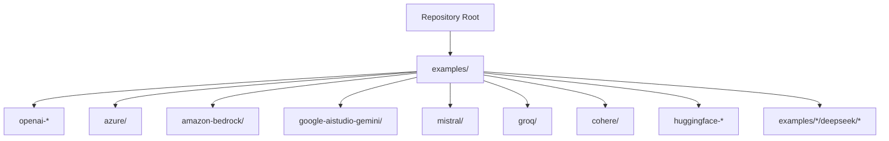

**Section sources**
- [README.md](file://README.md)

## Core Components
- Provider configuration via promptfooconfig.yaml: Each example shows how to define providers, set model IDs, and configure provider-specific parameters.
- Authentication via environment variables: Examples consistently demonstrate setting API keys or credentials as environment variables before running evaluations.
- Capability demonstrations: Examples showcase chat completions, multimodal inputs, image generation, and specialized endpoints (e.g., Azure Assistants, Bedrock Knowledge Base, OpenAI Vision/Image).

Key takeaways:
- OpenAI: Chat completions, vision, image generation, and specialized workflows (e.g., ChatKit).
- Anthropic: Messages and completions APIs via the Anthropic provider.
- Google AI Studio: Gemini models with multimodal and image understanding capabilities.
- Azure OpenAI: Chat, vision, and Assistants with multiple authentication methods.
- AWS Bedrock: Unified Converse API, inference profiles, and knowledge base integration.
- Mistral AI: Chat, reasoning (Magistral), embeddings, and multimodal models.
- Groq: Fast inference for chat completions.
- Cohere: Generative and retrieval-augmented generation (RAG) features.
- Hugging Face: OpenAI-compatible chat completions with model routing.
- DeepSeek: Reasoning and multimodal models via various examples.

**Section sources**
- [examples/openai-chatkit/README.md](file://examples/openai-chatkit/README.md)
- [examples/openai-vision/README.md](file://examples/openai-vision/README.md)
- [examples/openai-images/README.md](file://examples/openai-images/README.md)
- [examples/azure/README.md](file://examples/azure/README.md)
- [examples/amazon-bedrock/README.md](file://examples/amazon-bedrock/README.md)
- [examples/google-aistudio-gemini/README.md](file://examples/google-aistudio-gemini/README.md)
- [examples/mistral/README.md](file://examples/mistral/README.md)
- [examples/groq/README.md](file://examples/groq/README.md)
- [examples/cohere/README.md](file://examples/cohere/README.md)
- [examples/huggingface-chat/README.md](file://examples/huggingface-chat/README.md)

## Architecture Overview
The evaluation pipeline integrates PromptFoo with cloud providers through provider-specific configurations and environment variables. The examples illustrate how to:
- Select a provider and model
- Configure authentication
- Define prompts and test cases
- Evaluate outputs and capture metrics

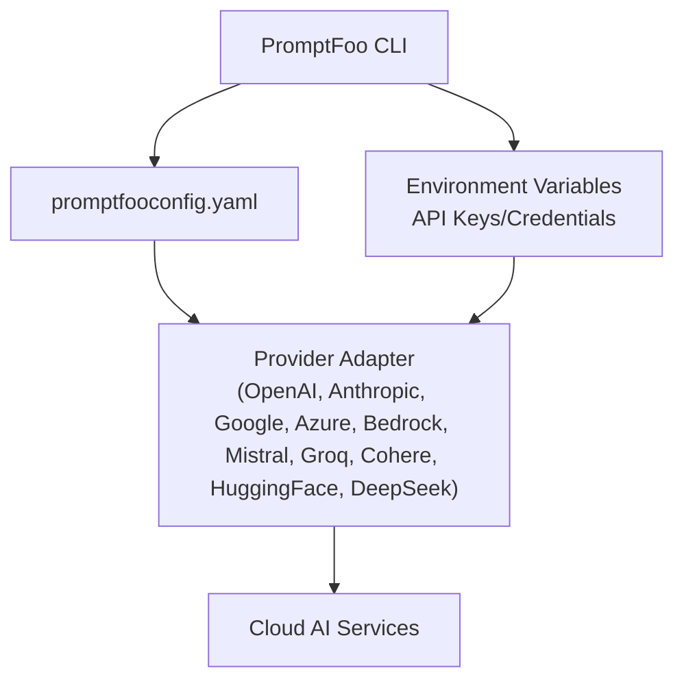

[No sources needed since this diagram shows conceptual workflow, not actual code structure]

## Detailed Component Analysis

### OpenAI (GPT Models)
- Authentication: Set OPENAI_API_KEY.
- Capabilities demonstrated:
  - Chat completions
  - Vision (image understanding)
  - Image generation (GPT Image, DALL‑E)
  - Specialized workflows (ChatKit)
- Configuration highlights:
  - Chat: model selection, temperature, max tokens
  - Vision: JSON prompts with images, URL variables
  - Images: model-specific parameters (size, quality, format)
  - ChatKit: stateful workflows and simulated user testing

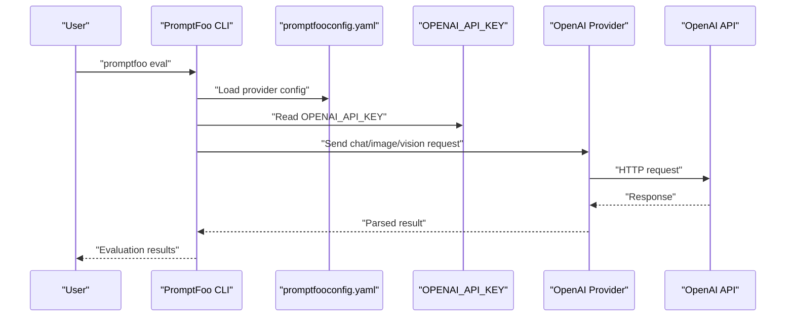

**Diagram sources**
- [examples/openai-vision/README.md](file://examples/openai-vision/README.md)
- [examples/openai-images/README.md](file://examples/openai-images/README.md)
- [examples/openai-chatkit/README.md](file://examples/openai-chatkit/README.md)

**Section sources**
- [examples/openai-vision/README.md](file://examples/openai-vision/README.md)
- [examples/openai-images/README.md](file://examples/openai-images/README.md)
- [examples/openai-chatkit/README.md](file://examples/openai-chatkit/README.md)

### Anthropic (Claude Models)
- Authentication: Typically via API key.
- Provider coverage: Messages and completions APIs are supported.
- Configuration: Provider-specific parameters and model selection are configured in promptfooconfig.yaml.

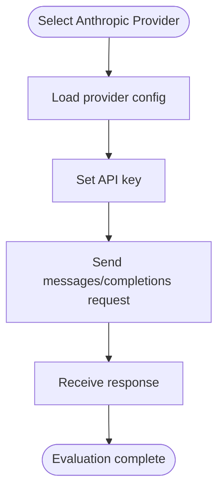

**Section sources**
- [examples/azure/README.md](file://examples/azure/README.md)

### Google AI Studio (Gemini)
- Authentication: GOOGLE_API_KEY.
- Capabilities demonstrated:
  - Multimodal understanding (text + images)
  - System instructions loaded from external files
  - Multiple Gemini models (2.5 Pro/Flash, 2.0 Flash, 1.5 Pro/Flash)
- Configuration highlights:
  - Model selection
  - System instruction file path
  - Image understanding examples

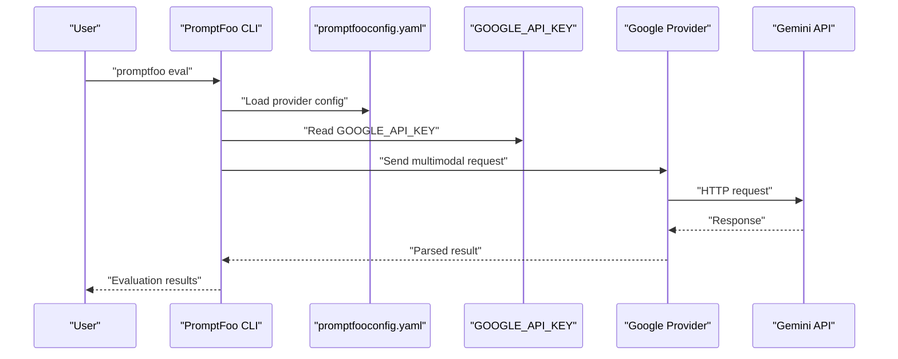

**Diagram sources**
- [examples/google-aistudio-gemini/README.md](file://examples/google-aistudio-gemini/README.md)

**Section sources**
- [examples/google-aistudio-gemini/README.md](file://examples/google-aistudio-gemini/README.md)

### Azure OpenAI
- Authentication: AZURE_API_KEY, AZURE_API_HOST; optional Azure CLI or service principal.
- Capabilities demonstrated:
  - Chat and vision models
  - Azure OpenAI Assistants with tools
  - Third-party models via Azure AI Foundry (Claude, Llama, DeepSeek, Mistral)
- Configuration highlights:
  - Resource host and API key
  - Assistants tool usage
  - Foundry agent examples

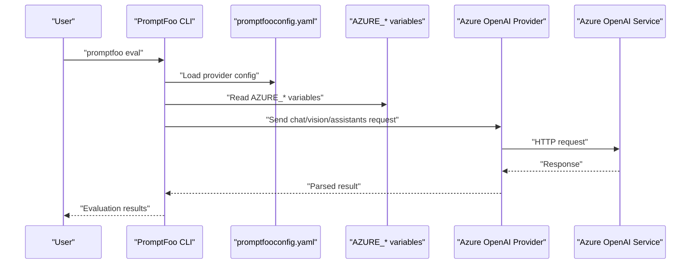

**Diagram sources**
- [examples/azure/README.md](file://examples/azure/README.md)

**Section sources**
- [examples/azure/README.md](file://examples/azure/README.md)

### AWS Bedrock
- Authentication: AWS credentials (access key, secret key, SSO profiles).
- Capabilities demonstrated:
  - Unified Converse API with extended thinking (ultrathink)
  - Inference profiles for multi-region failover and cost optimization
  - Knowledge Base RAG with citations
  - Support for Claude, Nova, Llama, Mistral, OpenAI GPT-OSS, and others
- Configuration highlights:
  - Region selection
  - Thinking budget and visibility
  - Inference profile ARNs and model types
  - Knowledge Base ID and context transformation

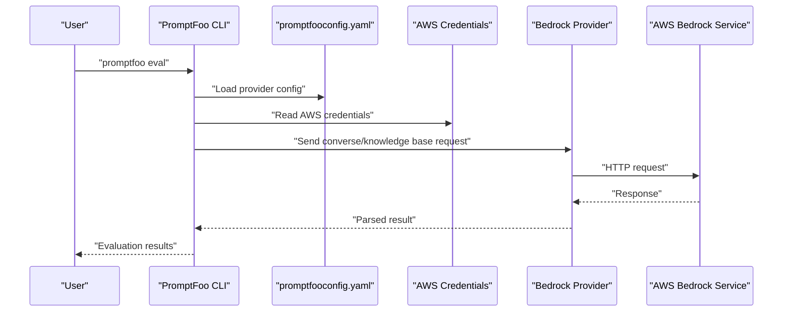

**Diagram sources**
- [examples/amazon-bedrock/README.md](file://examples/amazon-bedrock/README.md)

**Section sources**
- [examples/amazon-bedrock/README.md](file://examples/amazon-bedrock/README.md)

### Mistral AI
- Authentication: MISTRAL_API_KEY.
- Capabilities demonstrated:
  - Chat models (Mistral Large/Medium/Small)
  - Reasoning models (Magistral Medium/Small)
  - Embeddings for semantic similarity
  - Multimodal models (Pixtral)
  - Tool use and structured outputs
- Configuration highlights:
  - Model selection for reasoning, chat, and embeddings
  - Cost tracking across model tiers
  - Evaluation-grade configurations

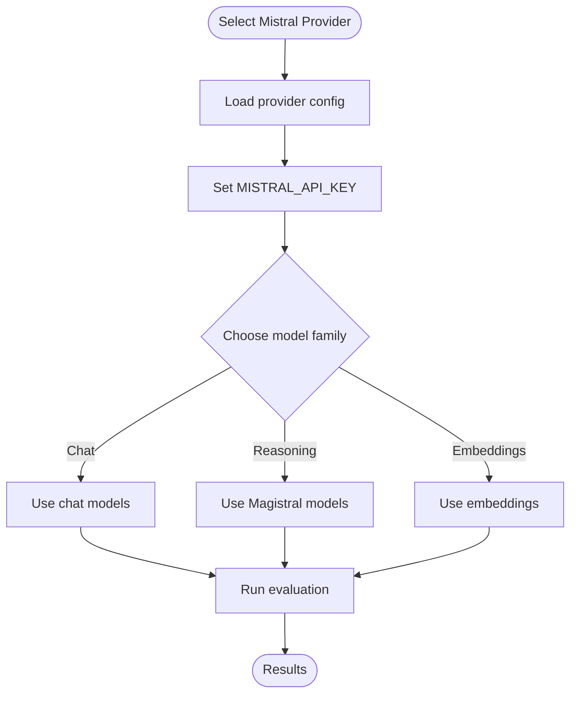

**Section sources**
- [examples/mistral/README.md](file://examples/mistral/README.md)

### Groq
- Authentication: GROQ_API_KEY.
- Capabilities demonstrated:
  - Fast inference for chat completions
- Configuration highlights:
  - Basic provider setup and model selection

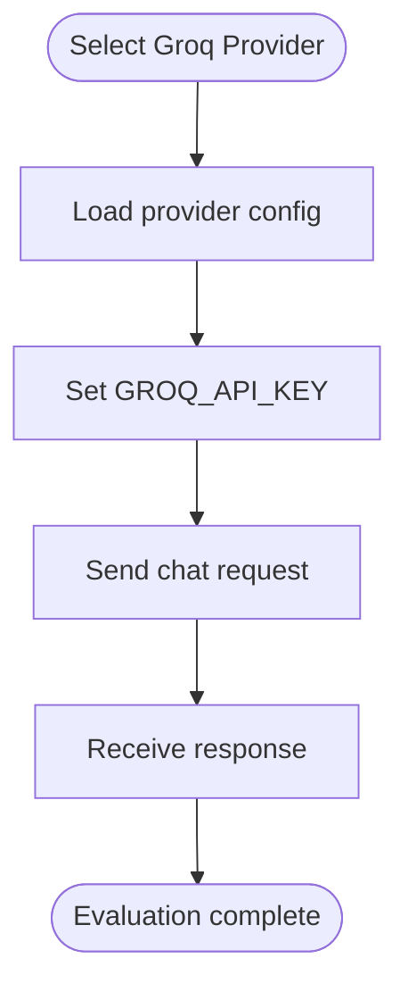

**Section sources**
- [examples/groq/README.md](file://examples/groq/README.md)

### Cohere
- Authentication: COHERE_API_KEY.
- Capabilities demonstrated:
  - Generative and retrieval-augmented generation (RAG) features
- Configuration highlights:
  - Provider setup and advanced configurations

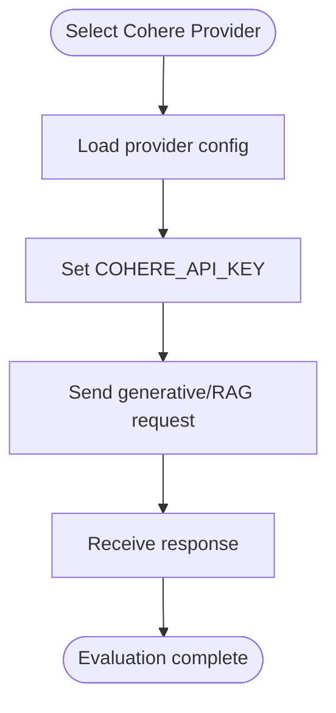

**Section sources**
- [examples/cohere/README.md](file://examples/cohere/README.md)

### Hugging Face
- Authentication: HF_TOKEN.
- Capabilities demonstrated:
  - OpenAI-compatible chat completions
  - Model routing via inference providers
- Configuration highlights:
  - Provider format and model selection
  - Temperature, max tokens, top_p
  - Inference provider routing

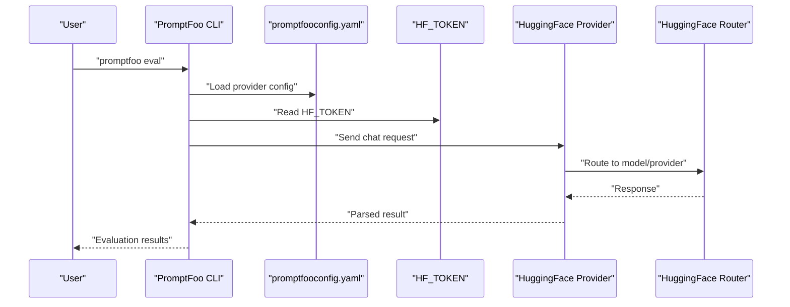

**Diagram sources**
- [examples/huggingface-chat/README.md](file://examples/huggingface-chat/README.md)

**Section sources**
- [examples/huggingface-chat/README.md](file://examples/huggingface-chat/README.md)

### DeepSeek
- Demonstrated via examples for reasoning and multimodal models.
- Authentication and configuration follow provider-specific patterns in promptfooconfig.yaml.

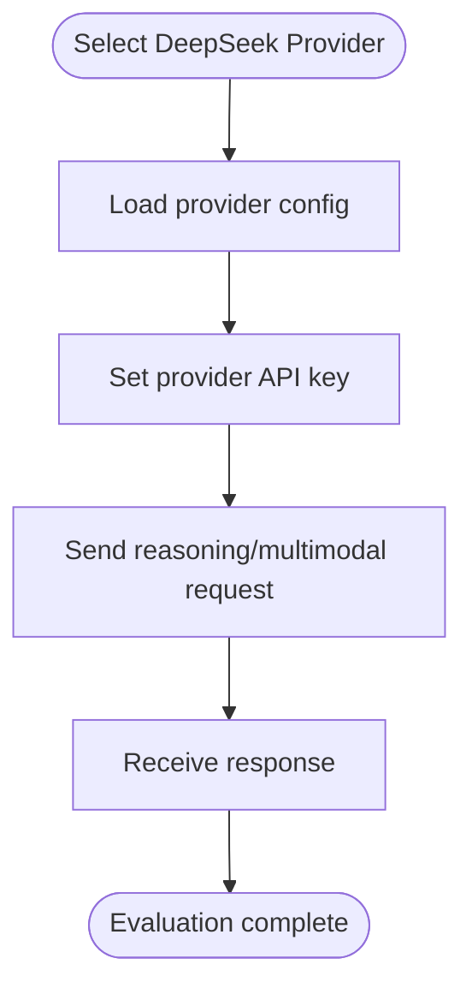

**Section sources**
- [examples/amazon-bedrock/README.md](file://examples/amazon-bedrock/README.md)
- [examples/azure/README.md](file://examples/azure/README.md)

## Dependency Analysis
Provider examples depend on:
- Environment variables for authentication
- Provider-specific configuration blocks in promptfooconfig.yaml
- Cloud provider SDKs or HTTP clients (as implemented by each provider adapter)

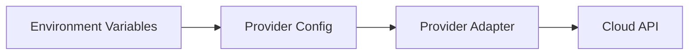

[No sources needed since this diagram shows conceptual relationships, not specific code structure]

## Performance Considerations
- Rate limiting: Consult provider-specific rate limits and adjust concurrency and retries accordingly.
- Cost optimization:
  - Prefer smaller, cheaper models for initial rounds; escalate to larger models for final grading.
  - Use inference profiles (Bedrock) for multi-region failover and cost optimization.
  - Track token usage and output size to estimate costs.
- Reliability:
  - Enable retries and circuit breakers for transient failures.
  - Use provider-specific timeouts (e.g., Nova Sonic) to avoid long hangs.

[No sources needed since this section provides general guidance]

## Troubleshooting Guide
Common issues and resolutions:
- Authentication failures:
  - Verify environment variables are set and correct for the chosen provider.
- Model access not granted:
  - Ensure model access is enabled in the provider’s console (e.g., AWS Bedrock model access).
- Regional availability:
  - Confirm the target region supports the requested model(s).
- Timeout or connectivity errors:
  - Adjust provider-specific timeouts and retry policies.
- Unexpected output formats:
  - Validate provider configuration and ensure model supports the requested features (e.g., structured outputs, multimodal).

**Section sources**
- [examples/amazon-bedrock/README.md](file://examples/amazon-bedrock/README.md)
- [examples/azure/README.md](file://examples/azure/README.md)

## Conclusion
PromptFoo provides a unified way to evaluate multiple cloud AI providers. By configuring environment variables, selecting appropriate models, and leveraging provider-specific features, teams can assess performance, optimize costs, and ensure reliable evaluations across OpenAI, Anthropic, Google AI Studio, Azure OpenAI, AWS Bedrock, Mistral AI, Groq, Cohere, Hugging Face, and DeepSeek.

[No sources needed since this section summarizes without analyzing specific files]

## Appendices

### Provider Selection Criteria
- Task fit: Choose models aligned with the task (reasoning, chat, vision, embeddings).
- Cost: Compare per-token or per-request pricing across providers.
- Latency: Some providers (e.g., Groq) emphasize speed; others offer broader model variety.
- Regional availability: Ensure the provider supports your deployment region.
- SLAs and reliability: Review provider SLAs and choose providers with acceptable uptime for production use.

[No sources needed since this section provides general guidance]

### Best Practices
- Start with small, fast models for exploratory evaluations; reserve larger models for final grading.
- Use embeddings for semantic similarity checks when appropriate.
- Leverage provider-specific features (e.g., Bedrock inference profiles, Azure Assistants tools) to improve robustness.
- Monitor token usage and adjust prompt length and generation parameters to control costs.

[No sources needed since this section provides general guidance]