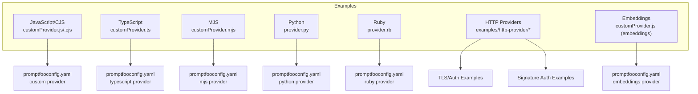
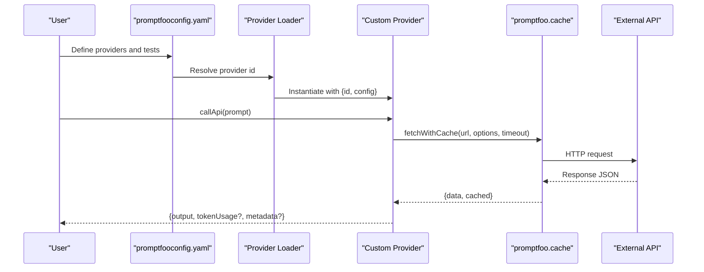
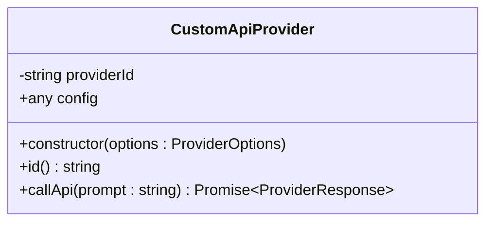
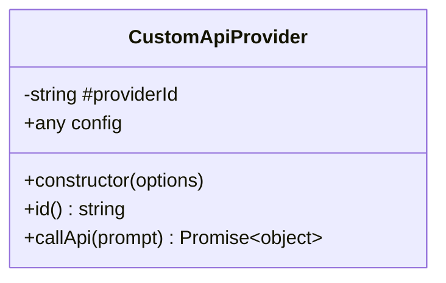
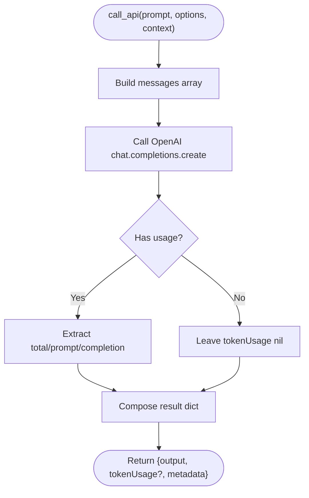
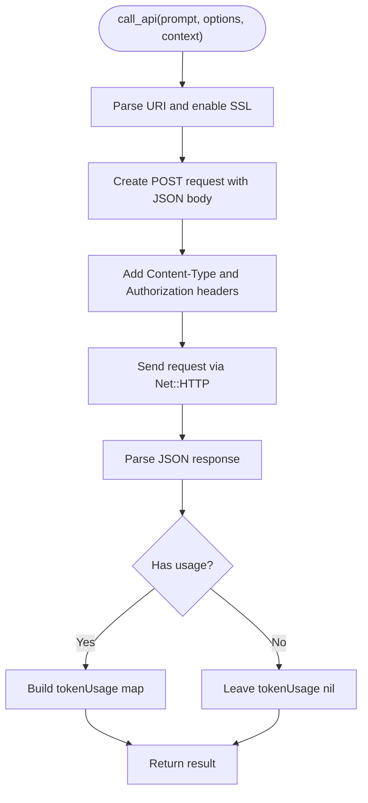
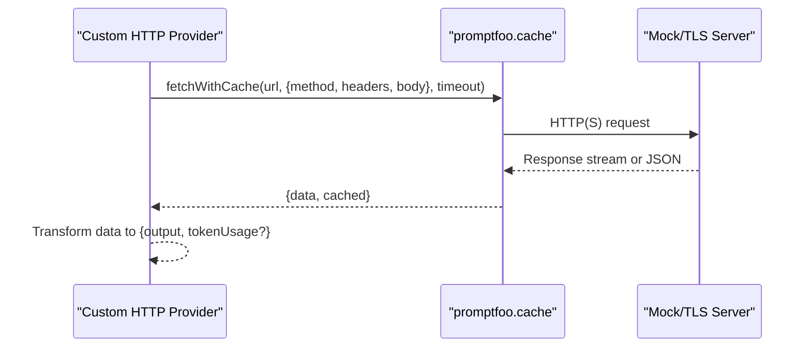
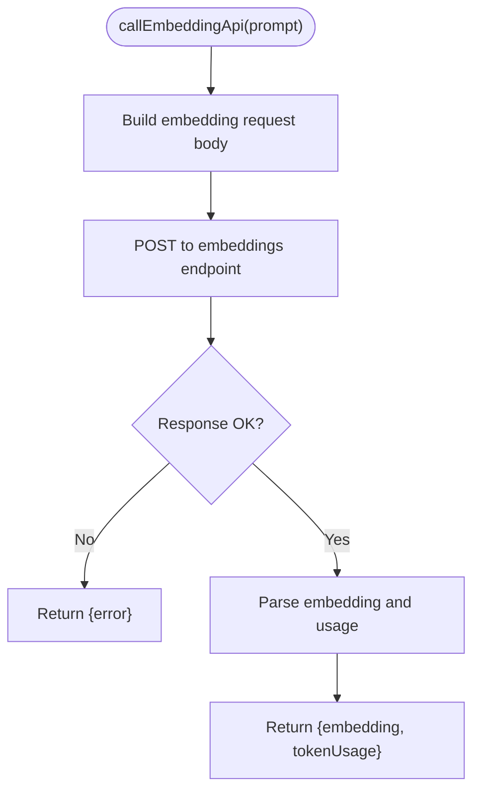
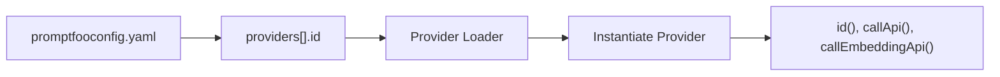

# Custom Provider Development

<cite>
**Referenced Files in This Document**
- [customProvider.js](file://examples/custom-provider/customProvider.js)
- [customProvider.cjs](file://examples/custom-provider/customProvider.cjs)
- [customProvider.ts](file://examples/custom-provider-typescript/customProvider.ts)
- [customProvider.mjs](file://examples/custom-provider-mjs/customProvider.mjs)
- [customProvider.js (embeddings)](file://examples/custom-provider-embeddings/customProvider.js)
- [provider.py](file://examples/python-provider/provider.py)
- [provider.rb](file://examples/ruby-provider/provider.rb)
- [promptfooconfig.yaml (custom provider)](file://examples/custom-provider/promptfooconfig.yaml)
- [promptfooconfig.yaml (custom provider embeddings)](file://examples/custom-provider-embeddings/promptfooconfig.yaml)
- [promptfooconfig.yaml (custom provider mjs)](file://examples/custom-provider-mjs/promptfooconfig.yaml)
- [promptfooconfig.yaml (custom provider typescript)](file://examples/custom-provider-typescript/promptfooconfig.yaml)
- [README.md (custom provider)](file://examples/custom-provider/README.md)
- [README.md (custom provider embeddings)](file://examples/custom-provider-embeddings/README.md)
- [README.md (custom provider mjs)](file://examples/custom-provider-mjs/README.md)
- [README.md (custom provider typescript)](file://examples/custom-provider-typescript/README.md)
- [README.md (python provider)](file://examples/python-provider/README.md)
- [README.md (ruby provider)](file://examples/ruby-provider/README.md)
- [http-provider README](file://examples/http-provider/README.md)
- [http-provider-auth-signature README](file://examples/http-provider-auth-signature/README.md)
- [http-provider-auth-signature-jks README](file://examples/http-provider-auth-signature-jks/README.md)
- [http-provider-auth-signature-pfx README](file://examples/http-provider-auth-signature-pfx/README.md)
- [http-provider-streaming README](file://examples/http-provider-streaming/README.md)
- [http-provider-tls README](file://examples/http-provider-tls/README.md)
- [mock-server.js](file://examples/http-provider-tls/mock-server.js)
- [app.js (signature auth)](file://examples/http-provider-auth-signature/app.js)
- [app.js (signature auth jks)](file://examples/http-provider-auth-signature-jks/app.js)
- [app.js (signature auth pfx)](file://examples/http-provider-auth-signature-pfx/app.js)
- [provider-simple-traced.js](file://examples/opentelemetry-tracing/provider-simple-traced.js)
</cite>

## Table of Contents
1. [Introduction](#introduction)
2. [Project Structure](#project-structure)
3. [Core Components](#core-components)
4. [Architecture Overview](#architecture-overview)
5. [Detailed Component Analysis](#detailed-component-analysis)
6. [Dependency Analysis](#dependency-analysis)
7. [Performance Considerations](#performance-considerations)
8. [Troubleshooting Guide](#troubleshooting-guide)
9. [Conclusion](#conclusion)
10. [Appendices](#appendices)

## Introduction
This document explains how to build custom AI providers for PromptFoo. It covers the provider interface contract, response formatting, authentication and request/response transformations for HTTP-based providers, and implementation patterns for Python, JavaScript, TypeScript, and Ruby. It also documents provider registration via configuration, validation, error handling, testing strategies, debugging techniques, performance optimization, packaging, distribution, and integration with the PromptFoo ecosystem.

## Project Structure
PromptFoo supports custom providers across multiple languages and styles:
- JavaScript/TypeScript: ESM, CJS, and TS class-based providers
- Python: Function-based providers with sync and async variants
- Ruby: Function-based providers
- HTTP providers: Custom endpoints with authentication and TLS support
- Embeddings providers: Dedicated embedding API method

Key example locations:
- JavaScript/CJS: examples/custom-provider
- TypeScript: examples/custom-provider-typescript
- MJS: examples/custom-provider-mjs
- Python: examples/python-provider
- Ruby: examples/ruby-provider
- HTTP providers: examples/http-provider and related auth/TLS examples
- Embeddings: examples/custom-provider-embeddings

**Diagram sources**
- [customProvider.js:1-57](file://examples/custom-provider/customProvider.js#L1-L57)
- [customProvider.cjs:1-57](file://examples/custom-provider/customProvider.cjs#L1-L57)
- [customProvider.ts:1-61](file://examples/custom-provider-typescript/customProvider.ts#L1-L61)
- [customProvider.mjs:1-58](file://examples/custom-provider-mjs/customProvider.mjs#L1-L58)
- [provider.py:1-84](file://examples/python-provider/provider.py#L1-L84)
- [provider.rb:1-85](file://examples/ruby-provider/provider.rb#L1-L85)
- [promptfooconfig.yaml (custom provider):1-23](file://examples/custom-provider/promptfooconfig.yaml#L1-L23)
- [promptfooconfig.yaml (custom provider typescript):1-23](file://examples/custom-provider-typescript/promptfooconfig.yaml#L1-L23)
- [promptfooconfig.yaml (custom provider mjs):1-23](file://examples/custom-provider-mjs/promptfooconfig.yaml#L1-L23)
- [promptfooconfig.yaml (custom provider embeddings):1-23](file://examples/custom-provider-embeddings/promptfooconfig.yaml#L1-L23)
- [http-provider README:1-200](file://examples/http-provider/README.md#L1-L200)
- [http-provider-auth-signature README:1-200](file://examples/http-provider-auth-signature/README.md#L1-L200)
- [http-provider-auth-signature-jks README:1-200](file://examples/http-provider-auth-signature-jks/README.md#L1-L200)
- [http-provider-auth-signature-pfx README:1-200](file://examples/http-provider-auth-signature-pfx/README.md#L1-L200)
- [http-provider-streaming README:1-200](file://examples/http-provider-streaming/README.md#L1-L200)
- [http-provider-tls README:1-200](file://examples/http-provider-tls/README.md#L1-L200)

**Section sources**
- [customProvider.js:1-57](file://examples/custom-provider/customProvider.js#L1-L57)
- [customProvider.ts:1-61](file://examples/custom-provider-typescript/customProvider.ts#L1-L61)
- [customProvider.mjs:1-58](file://examples/custom-provider-mjs/customProvider.mjs#L1-L58)
- [provider.py:1-84](file://examples/python-provider/provider.py#L1-L84)
- [provider.rb:1-85](file://examples/ruby-provider/provider.rb#L1-L85)
- [promptfooconfig.yaml (custom provider):1-23](file://examples/custom-provider/promptfooconfig.yaml#L1-L23)
- [promptfooconfig.yaml (custom provider typescript):1-23](file://examples/custom-provider-typescript/promptfooconfig.yaml#L1-L23)
- [promptfooconfig.yaml (custom provider mjs):1-23](file://examples/custom-provider-mjs/promptfooconfig.yaml#L1-L23)
- [promptfooconfig.yaml (custom provider embeddings):1-23](file://examples/custom-provider-embeddings/promptfooconfig.yaml#L1-L23)

## Core Components
A custom provider must implement a minimal interface contract and return standardized response objects. The examples demonstrate both class-based and function-based providers.

- Interface contract summary
  - id(): returns a stable provider identifier string
  - callApi(prompt): returns a standardized response object
  - Optional: callEmbeddingApi(prompt) for embedding providers

- Response object fields
  - output: string
  - tokenUsage: optional object with total, prompt, completion
  - metadata: optional object for passing back config or extra info

- Authentication and caching
  - Use promptfoo.cache.fetchWithCache for HTTP requests to benefit from built-in caching and timeouts
  - Set Authorization headers via environment variables or config

- Configuration and registration
  - Register providers in promptfooconfig.yaml under providers with id pointing to the module path or file
  - Use label for human-readable names
  - Pass provider-specific config via config: {}

**Section sources**
- [customProvider.js:13-53](file://examples/custom-provider/customProvider.js#L13-L53)
- [customProvider.ts:19-59](file://examples/custom-provider-typescript/customProvider.ts#L19-L59)
- [customProvider.mjs:17-56](file://examples/custom-provider-mjs/customProvider.mjs#L17-L56)
- [customProvider.js (embeddings):14-47](file://examples/custom-provider-embeddings/customProvider.js#L14-L47)
- [promptfooconfig.yaml (custom provider):7-11](file://examples/custom-provider/promptfooconfig.yaml#L7-L11)
- [promptfooconfig.yaml (custom provider embeddings):1-23](file://examples/custom-provider-embeddings/promptfooconfig.yaml#L1-L23)

## Architecture Overview
The provider lifecycle in PromptFoo:
- Configuration loads provider modules by id
- PromptFoo invokes id() to identify the provider
- For each prompt/test case, PromptFoo calls callApi(prompt) or callEmbeddingApi(prompt)
- Responses are normalized and used for assertions, scoring, and reporting

**Diagram sources**
- [customProvider.js:17-52](file://examples/custom-provider/customProvider.js#L17-L52)
- [customProvider.ts:23-58](file://examples/custom-provider-typescript/customProvider.ts#L23-L58)
- [customProvider.mjs:21-55](file://examples/custom-provider-mjs/customProvider.mjs#L21-L55)
- [promptfooconfig.yaml (custom provider):7-11](file://examples/custom-provider/promptfooconfig.yaml#L7-L11)

## Detailed Component Analysis

### JavaScript/CJS Provider
- Implements a class with id() and callApi(prompt)
- Uses promptfoo.cache.fetchWithCache for HTTP requests
- Reads OPENAI_API_KEY from environment
- Returns output and tokenUsage

**Diagram sources**
- [customProvider.js:4-54](file://examples/custom-provider/customProvider.js#L4-L54)

**Section sources**
- [customProvider.js:1-57](file://examples/custom-provider/customProvider.js#L1-L57)
- [customProvider.cjs:1-57](file://examples/custom-provider/customProvider.cjs#L1-L57)
- [promptfooconfig.yaml (custom provider):7-11](file://examples/custom-provider/promptfooconfig.yaml#L7-L11)
- [README.md (custom provider):1-22](file://examples/custom-provider/README.md#L1-L22)

### TypeScript Provider
- Implements ApiProvider interface with typed ProviderOptions and ProviderResponse
- Uses ESM import and exports default class
- Same callApi pattern with tokenUsage and metadata

**Diagram sources**
- [customProvider.ts:7-60](file://examples/custom-provider-typescript/customProvider.ts#L7-L60)

**Section sources**
- [customProvider.ts:1-61](file://examples/custom-provider-typescript/customProvider.ts#L1-L61)
- [promptfooconfig.yaml (custom provider typescript):1-23](file://examples/custom-provider-typescript/promptfooconfig.yaml#L1-L23)
- [README.md (custom provider typescript):1-22](file://examples/custom-provider-typescript/README.md#L1-L22)

### MJS Provider
- ESM module with default export
- Private field for providerId and public config
- Same callApi pattern as other JS providers

**Diagram sources**
- [customProvider.mjs:5-57](file://examples/custom-provider-mjs/customProvider.mjs#L5-L57)

**Section sources**
- [customProvider.mjs:1-58](file://examples/custom-provider-mjs/customProvider.mjs#L1-L58)
- [promptfooconfig.yaml (custom provider mjs):1-23](file://examples/custom-provider-mjs/promptfooconfig.yaml#L1-L23)
- [README.md (custom provider mjs):1-22](file://examples/custom-provider-mjs/README.md#L1-L22)

### Python Provider
- Function-based provider with call_api(prompt, options, context)
- Supports async_provider(prompt, options, context)
- Returns dict with output, tokenUsage, and metadata
- Demonstrates usage of OpenAI client and token usage extraction

**Diagram sources**
- [provider.py:7-40](file://examples/python-provider/provider.py#L7-L40)

**Section sources**
- [provider.py:1-84](file://examples/python-provider/provider.py#L1-L84)
- [README.md (python provider):1-200](file://examples/python-provider/README.md#L1-L200)

### Ruby Provider
- Function-based provider with call_api(prompt, options, context)
- Uses Net::HTTP with HTTPS and JSON serialization
- Returns output, tokenUsage, and metadata

**Diagram sources**
- [provider.rb:14-61](file://examples/ruby-provider/provider.rb#L14-L61)

**Section sources**
- [provider.rb:1-85](file://examples/ruby-provider/provider.rb#L1-L85)
- [README.md (ruby provider):1-200](file://examples/ruby-provider/README.md#L1-L200)

### HTTP Provider Development
- Use promptfoo.cache.fetchWithCache for HTTP endpoints
- Configure headers (e.g., Authorization) and request body
- Support streaming responses via HTTP streaming examples
- Implement signature-based authentication using dedicated examples
- Enable TLS with certificate/key examples

**Diagram sources**
- [customProvider.js:31-52](file://examples/custom-provider/customProvider.js#L31-L52)
- [customProvider.ts:37-58](file://examples/custom-provider-typescript/customProvider.ts#L37-L58)
- [customProvider.mjs:35-55](file://examples/custom-provider-mjs/customProvider.mjs#L35-L55)
- [http-provider README:1-200](file://examples/http-provider/README.md#L1-L200)
- [http-provider-streaming README:1-200](file://examples/http-provider-streaming/README.md#L1-L200)
- [http-provider-auth-signature README:1-200](file://examples/http-provider-auth-signature/README.md#L1-L200)
- [http-provider-auth-signature-jks README:1-200](file://examples/http-provider-auth-signature-jks/README.md#L1-L200)
- [http-provider-auth-signature-pfx README:1-200](file://examples/http-provider-auth-signature-pfx/README.md#L1-L200)
- [http-provider-tls README:1-200](file://examples/http-provider-tls/README.md#L1-L200)
- [mock-server.js:1-200](file://examples/http-provider-tls/mock-server.js#L1-L200)
- [app.js (signature auth):1-200](file://examples/http-provider-auth-signature/app.js#L1-L200)
- [app.js (signature auth jks):1-200](file://examples/http-provider-auth-signature-jks/app.js#L1-L200)
- [app.js (signature auth pfx):1-200](file://examples/http-provider-auth-signature-pfx/app.js#L1-L200)

**Section sources**
- [customProvider.js:30-52](file://examples/custom-provider/customProvider.js#L30-L52)
- [customProvider.ts:36-58](file://examples/custom-provider-typescript/customProvider.ts#L36-L58)
- [customProvider.mjs:34-55](file://examples/custom-provider-mjs/customProvider.mjs#L34-L55)
- [http-provider README:1-200](file://examples/http-provider/README.md#L1-L200)
- [http-provider-streaming README:1-200](file://examples/http-provider-streaming/README.md#L1-L200)
- [http-provider-auth-signature README:1-200](file://examples/http-provider-auth-signature/README.md#L1-L200)
- [http-provider-auth-signature-jks README:1-200](file://examples/http-provider-auth-signature-jks/README.md#L1-L200)
- [http-provider-auth-signature-pfx README:1-200](file://examples/http-provider-auth-signature-pfx/README.md#L1-L200)
- [http-provider-tls README:1-200](file://examples/http-provider-tls/README.md#L1-L200)
- [mock-server.js:1-200](file://examples/http-provider-tls/mock-server.js#L1-L200)
- [app.js (signature auth):1-200](file://examples/http-provider-auth-signature/app.js#L1-L200)
- [app.js (signature auth jks):1-200](file://examples/http-provider-auth-signature-jks/app.js#L1-L200)
- [app.js (signature auth pfx):1-200](file://examples/http-provider-auth-signature-pfx/app.js#L1-L200)

### Embeddings Provider
- Implements callEmbeddingApi(prompt) returning embedding vector and tokenUsage
- Demonstrates embedding API call and error handling

**Diagram sources**
- [customProvider.js (embeddings):18-47](file://examples/custom-provider-embeddings/customProvider.js#L18-L47)

**Section sources**
- [customProvider.js (embeddings):1-51](file://examples/custom-provider-embeddings/customProvider.js#L1-L51)
- [promptfooconfig.yaml (custom provider embeddings):1-23](file://examples/custom-provider-embeddings/promptfooconfig.yaml#L1-L23)
- [README.md (custom provider embeddings):1-200](file://examples/custom-provider-embeddings/README.md#L1-L200)

### Tracing Provider (OpenTelemetry)
- Demonstrates adding tracing to a provider using provider-simple-traced.js
- Useful pattern for observability in production providers

**Section sources**
- [provider-simple-traced.js:1-200](file://examples/opentelemetry-tracing/provider-simple-traced.js#L1-L200)

## Dependency Analysis
Provider registration and resolution:
- promptfooconfig.yaml providers entries define id and optional label
- id can be a file path or module specifier
- Provider loader instantiates the class/function and calls id()

**Diagram sources**
- [promptfooconfig.yaml (custom provider):7-11](file://examples/custom-provider/promptfooconfig.yaml#L7-L11)
- [promptfooconfig.yaml (custom provider typescript):1-23](file://examples/custom-provider-typescript/promptfooconfig.yaml#L1-L23)
- [promptfooconfig.yaml (custom provider mjs):1-23](file://examples/custom-provider-mjs/promptfooconfig.yaml#L1-L23)
- [promptfooconfig.yaml (custom provider embeddings):1-23](file://examples/custom-provider-embeddings/promptfooconfig.yaml#L1-L23)

**Section sources**
- [promptfooconfig.yaml (custom provider):1-23](file://examples/custom-provider/promptfooconfig.yaml#L1-L23)
- [promptfooconfig.yaml (custom provider typescript):1-23](file://examples/custom-provider-typescript/promptfooconfig.yaml#L1-L23)
- [promptfooconfig.yaml (custom provider mjs):1-23](file://examples/custom-provider-mjs/promptfooconfig.yaml#L1-L23)
- [promptfooconfig.yaml (custom provider embeddings):1-23](file://examples/custom-provider-embeddings/promptfooconfig.yaml#L1-L23)

## Performance Considerations
- Use promptfoo.cache.fetchWithCache to avoid redundant network calls and benefit from built-in timeouts
- Minimize payload sizes and only include necessary fields in request bodies
- For embedding providers, batch prompts when possible and reuse connections
- Prefer async implementations in Python/Ruby to keep evaluations responsive
- Monitor tokenUsage to tune max_tokens and temperature for cost/performance balance

## Troubleshooting Guide
Common issues and resolutions:
- Authentication failures
  - Verify environment variables (e.g., OPENAI_API_KEY) are set and accessible
  - Check Authorization header format and permissions
- Network timeouts
  - Adjust timeout values in fetchWithCache calls
  - Ensure outbound connectivity and firewall rules
- Response parsing errors
  - Validate that response contains expected fields (e.g., choices[0].message.content)
  - For embeddings, confirm data[0].embedding exists
- Configuration errors
  - Confirm providers[].id points to the correct file/module
  - Ensure label and config are properly formatted YAML

**Section sources**
- [customProvider.js:35-42](file://examples/custom-provider/customProvider.js#L35-L42)
- [customProvider.ts:41-48](file://examples/custom-provider-typescript/customProvider.ts#L41-L48)
- [customProvider.mjs:39-46](file://examples/custom-provider-mjs/customProvider.mjs#L39-L46)
- [customProvider.js (embeddings):32-46](file://examples/custom-provider-embeddings/customProvider.js#L32-L46)
- [promptfooconfig.yaml (custom provider):7-11](file://examples/custom-provider/promptfooconfig.yaml#L7-L11)

## Conclusion
PromptFoo’s custom provider framework supports multiple languages and patterns. By implementing id() and callApi() (and optionally callEmbeddingApi()), returning a standardized response object, and leveraging built-in caching and configuration, you can integrate proprietary APIs, internal services, and specialized models seamlessly into PromptFoo evaluations.

## Appendices

### Step-by-Step Tutorials

- Create a JavaScript/CJS provider
  1. Create a class with id() and callApi(prompt)
  2. Use promptfoo.cache.fetchWithCache for HTTP requests
  3. Set Authorization via environment variables
  4. Register in promptfooconfig.yaml under providers with id pointing to the file
  5. Run promptfoo eval

  **Section sources**
  - [customProvider.js:1-57](file://examples/custom-provider/customProvider.js#L1-L57)
  - [promptfooconfig.yaml (custom provider):7-11](file://examples/custom-provider/promptfooconfig.yaml#L7-L11)
  - [README.md (custom provider):1-22](file://examples/custom-provider/README.md#L1-L22)

- Create a TypeScript provider
  1. Implement ApiProvider interface with typed ProviderOptions and ProviderResponse
  2. Export default class
  3. Register in promptfooconfig.yaml with id pointing to the TS file
  4. Compile and run evaluations

  **Section sources**
  - [customProvider.ts:1-61](file://examples/custom-provider-typescript/customProvider.ts#L1-L61)
  - [promptfooconfig.yaml (custom provider typescript):1-23](file://examples/custom-provider-typescript/promptfooconfig.yaml#L1-L23)
  - [README.md (custom provider typescript):1-22](file://examples/custom-provider-typescript/README.md#L1-L22)

- Create an MJS provider
  1. Create a default-exported class with id() and callApi(prompt)
  2. Use ESM imports and promptfoo.cache.fetchWithCache
  3. Register in promptfooconfig.yaml with id pointing to the .mjs file

  **Section sources**
  - [customProvider.mjs:1-58](file://examples/custom-provider-mjs/customProvider.mjs#L1-L58)
  - [promptfooconfig.yaml (custom provider mjs):1-23](file://examples/custom-provider-mjs/promptfooconfig.yaml#L1-L23)
  - [README.md (custom provider mjs):1-22](file://examples/custom-provider-mjs/README.md#L1-L22)

- Create a Python provider
  1. Implement call_api(prompt, options, context) returning dict with output and tokenUsage
  2. Optionally implement async_provider for async calls
  3. Register in promptfooconfig.yaml with id pointing to the Python file
  4. Ensure dependencies are installed

  **Section sources**
  - [provider.py:1-84](file://examples/python-provider/provider.py#L1-L84)
  - [README.md (python provider):1-200](file://examples/python-provider/README.md#L1-L200)

- Create a Ruby provider
  1. Implement call_api(prompt, options, context) using Net::HTTP
  2. Serialize JSON body and parse response
  3. Register in promptfooconfig.yaml with id pointing to the Ruby file

  **Section sources**
  - [provider.rb:1-85](file://examples/ruby-provider/provider.rb#L1-L85)
  - [README.md (ruby provider):1-200](file://examples/ruby-provider/README.md#L1-L200)

- Build an HTTP provider with authentication and TLS
  1. Use promptfoo.cache.fetchWithCache with appropriate headers
  2. Follow signature auth examples for HMAC or certificate-based signing
  3. Use TLS examples for certificate/key configuration
  4. Test with mock servers when needed

  **Section sources**
  - [http-provider README:1-200](file://examples/http-provider/README.md#L1-L200)
  - [http-provider-auth-signature README:1-200](file://examples/http-provider-auth-signature/README.md#L1-L200)
  - [http-provider-auth-signature-jks README:1-200](file://examples/http-provider-auth-signature-jks/README.md#L1-L200)
  - [http-provider-auth-signature-pfx README:1-200](file://examples/http-provider-auth-signature-pfx/README.md#L1-L200)
  - [http-provider-streaming README:1-200](file://examples/http-provider-streaming/README.md#L1-L200)
  - [http-provider-tls README:1-200](file://examples/http-provider-tls/README.md#L1-L200)
  - [mock-server.js:1-200](file://examples/http-provider-tls/mock-server.js#L1-L200)
  - [app.js (signature auth):1-200](file://examples/http-provider-auth-signature/app.js#L1-L200)
  - [app.js (signature auth jks):1-200](file://examples/http-provider-auth-signature-jks/app.js#L1-L200)
  - [app.js (signature auth pfx):1-200](file://examples/http-provider-auth-signature-pfx/app.js#L1-L200)

- Develop an embeddings provider
  1. Implement callEmbeddingApi(prompt) returning embedding vector and tokenUsage
  2. Handle errors gracefully by returning {error}
  3. Register in promptfooconfig.yaml

  **Section sources**
  - [customProvider.js (embeddings):1-51](file://examples/custom-provider-embeddings/customProvider.js#L1-L51)
  - [promptfooconfig.yaml (custom provider embeddings):1-23](file://examples/custom-provider-embeddings/promptfooconfig.yaml#L1-L23)
  - [README.md (custom provider embeddings):1-200](file://examples/custom-provider-embeddings/README.md#L1-L200)

### Provider Testing Strategies
- Unit tests for response shape and tokenUsage extraction
- Integration tests against real endpoints with mocked responses
- Performance tests with varying prompt sizes and concurrency
- Observability: add tracing around provider calls for production-grade monitoring

### Debugging Techniques
- Log request/response bodies and headers
- Validate environment variables at startup
- Use small test sets and verbose output flags
- Inspect cached responses and cache keys

### Packaging and Distribution
- Package providers as local modules or npm packages
- Publish TypeScript/ESM providers with proper exports
- Document provider capabilities and configuration in README
- Provide example configurations for common use cases