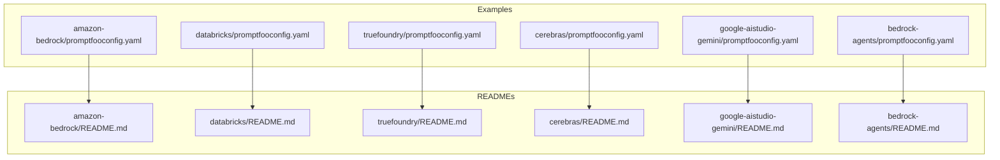
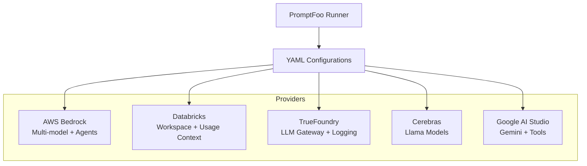
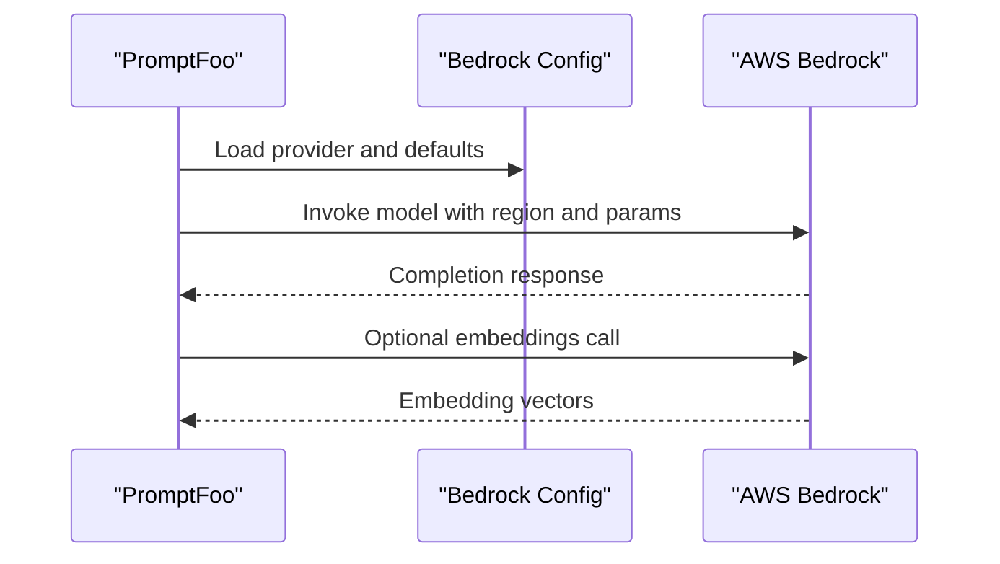
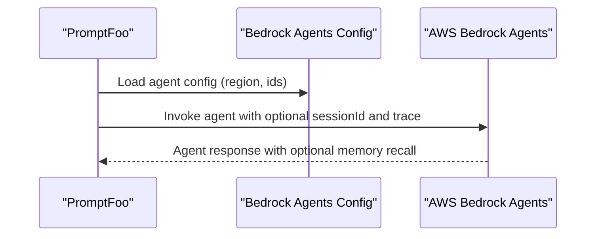
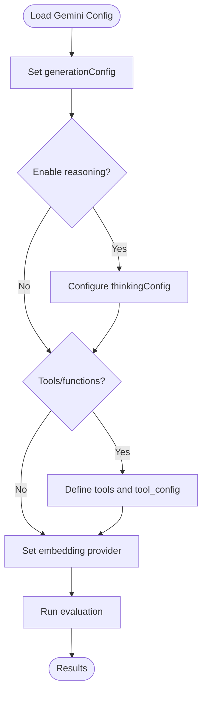
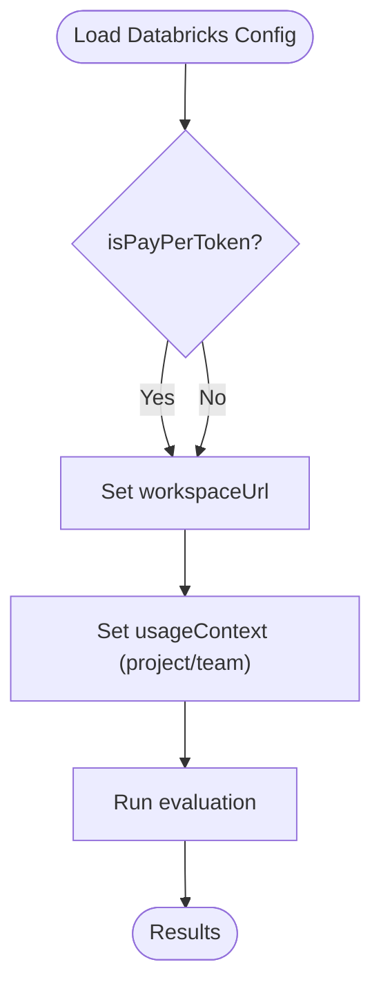
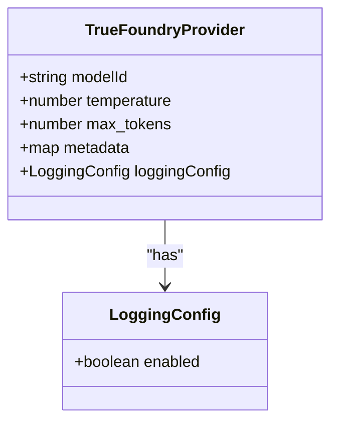
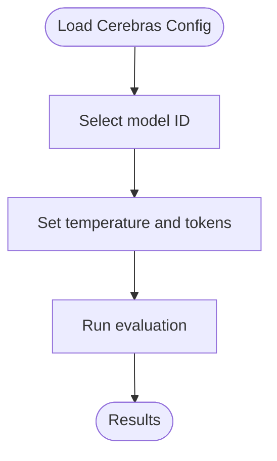
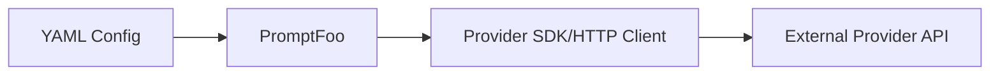

# Enterprise Providers

<cite>
**Referenced Files in This Document**
- [promptfooconfig.yaml](file://examples/amazon-bedrock/promptfooconfig.yaml)
- [promptfooconfig.yaml](file://examples/databricks/promptfooconfig.yaml)
- [promptfooconfig.yaml](file://examples/truefoundry/promptfooconfig.yaml)
- [promptfooconfig.yaml](file://examples/cerebras/promptfooconfig.yaml)
- [promptfooconfig.yaml](file://examples/google-aistudio-gemini/promptfooconfig.yaml)
- [promptfooconfig.yaml](file://examples/bedrock-agents/promptfooconfig.yaml)
- [README.md](file://examples/amazon-bedrock/README.md)
- [README.md](file://examples/databricks/README.md)
- [README.md](file://examples/truefoundry/README.md)
- [README.md](file://examples/cerebras/README.md)
- [README.md](file://examples/google-aistudio-gemini/README.md)
- [README.md](file://examples/bedrock-agents/README.md)
</cite>

## Table of Contents
1. [Introduction](#introduction)
2. [Project Structure](#project-structure)
3. [Core Components](#core-components)
4. [Architecture Overview](#architecture-overview)
5. [Detailed Component Analysis](#detailed-component-analysis)
6. [Dependency Analysis](#dependency-analysis)
7. [Performance Considerations](#performance-considerations)
8. [Troubleshooting Guide](#troubleshooting-guide)
9. [Conclusion](#conclusion)
10. [Appendices](#appendices)

## Introduction
This document explains enterprise-grade AI providers integrated with PromptFoo, focusing on Azure OpenAI Assistant, AWS Bedrock Agents, Google AI Studio, Databricks, Snowflake, TrueFoundry, IBM BAM, Cerebras, and Cloudera. It covers enterprise authentication methods (OAuth, service principals, SSO), data residency and compliance (SOC2, GDPR), audit logging and governance controls, pricing models and cost allocation, deployment patterns (hybrid cloud, multi-region), and security/network requirements for enterprise environments.

## Project Structure
The repository includes example configurations for multiple providers under the examples directory. These YAML configurations demonstrate how to integrate providers with PromptFoo, including authentication, region selection, and advanced features such as embeddings, tools, and structured outputs.

**Diagram sources**
- [promptfooconfig.yaml](file://examples/amazon-bedrock/promptfooconfig.yaml)
- [promptfooconfig.yaml](file://examples/databricks/promptfooconfig.yaml)
- [promptfooconfig.yaml](file://examples/truefoundry/promptfooconfig.yaml)
- [promptfooconfig.yaml](file://examples/cerebras/promptfooconfig.yaml)
- [promptfooconfig.yaml](file://examples/google-aistudio-gemini/promptfooconfig.yaml)
- [promptfooconfig.yaml](file://examples/bedrock-agents/promptfooconfig.yaml)
- [README.md](file://examples/amazon-bedrock/README.md)
- [README.md](file://examples/databricks/README.md)
- [README.md](file://examples/truefoundry/README.md)
- [README.md](file://examples/cerebras/README.md)
- [README.md](file://examples/google-aistudio-gemini/README.md)
- [README.md](file://examples/bedrock-agents/README.md)

**Section sources**
- [promptfooconfig.yaml](file://examples/amazon-bedrock/promptfooconfig.yaml)
- [promptfooconfig.yaml](file://examples/databricks/promptfooconfig.yaml)
- [promptfooconfig.yaml](file://examples/truefoundry/promptfooconfig.yaml)
- [promptfooconfig.yaml](file://examples/cerebras/promptfooconfig.yaml)
- [promptfooconfig.yaml](file://examples/google-aistudio-gemini/promptfooconfig.yaml)
- [promptfooconfig.yaml](file://examples/bedrock-agents/promptfooconfig.yaml)
- [README.md](file://examples/amazon-bedrock/README.md)
- [README.md](file://examples/databricks/README.md)
- [README.md](file://examples/truefoundry/README.md)
- [README.md](file://examples/cerebras/README.md)
- [README.md](file://examples/google-aistudio-gemini/README.md)
- [README.md](file://examples/bedrock-agents/README.md)

## Core Components
- AWS Bedrock: Multi-model inference, embeddings, and agents with region and credential configuration.
- Databricks: Pay-per-token endpoints with workspace URL and usage context for cost allocation.
- TrueFoundry: LLM Gateway with metadata and logging configuration.
- Cerebras: Llama model evaluations with token limits and temperature tuning.
- Google AI Studio: Gemini models with generation config, structured outputs, and function/tool calling.
- Bedrock Agents: Agent invocation with session and memory controls.

**Section sources**
- [promptfooconfig.yaml](file://examples/amazon-bedrock/promptfooconfig.yaml)
- [promptfooconfig.yaml](file://examples/databricks/promptfooconfig.yaml)
- [promptfooconfig.yaml](file://examples/truefoundry/promptfooconfig.yaml)
- [promptfooconfig.yaml](file://examples/cerebras/promptfooconfig.yaml)
- [promptfooconfig.yaml](file://examples/google-aistudio-gemini/promptfooconfig.yaml)
- [promptfooconfig.yaml](file://examples/bedrock-agents/promptfooconfig.yaml)

## Architecture Overview
The enterprise evaluation pipeline integrates PromptFoo with provider-specific configurations. Providers are selected by ID, configured with region/credentials, and optionally customized with advanced settings such as embeddings, tools, and structured outputs. Tests define prompts and assertions, while defaultTest sets baseline provider options.

**Diagram sources**
- [promptfooconfig.yaml](file://examples/amazon-bedrock/promptfooconfig.yaml)
- [promptfooconfig.yaml](file://examples/databricks/promptfooconfig.yaml)
- [promptfooconfig.yaml](file://examples/truefoundry/promptfooconfig.yaml)
- [promptfooconfig.yaml](file://examples/cerebras/promptfooconfig.yaml)
- [promptfooconfig.yaml](file://examples/google-aistudio-gemini/promptfooconfig.yaml)
- [promptfooconfig.yaml](file://examples/bedrock-agents/promptfooconfig.yaml)

## Detailed Component Analysis

### AWS Bedrock
- Authentication and Region: Configure region and optional credentials; agent configurations support agentId, agentAliasId, sessionId, and memoryId.
- Embeddings: Set embedding provider via defaultTest for similarity-based assertions.
- Models: Select models by provider ID with region and generation parameters.

**Diagram sources**
- [promptfooconfig.yaml](file://examples/amazon-bedrock/promptfooconfig.yaml)
- [README.md](file://examples/amazon-bedrock/README.md)

**Section sources**
- [promptfooconfig.yaml](file://examples/amazon-bedrock/promptfooconfig.yaml)
- [README.md](file://examples/amazon-bedrock/README.md)

### AWS Bedrock Agents
- Agent Invocation: Configure agentId, agentAliasId, region, and optional sessionId, enableTrace, and memoryId.
- Credentials: Supports explicit keys or default credential chain; environment variables recommended.
- Session and Memory: Use sessionId to maintain conversation state; choose short or long-term memory.

**Diagram sources**
- [promptfooconfig.yaml](file://examples/bedrock-agents/promptfooconfig.yaml)
- [README.md](file://examples/bedrock-agents/README.md)

**Section sources**
- [promptfooconfig.yaml](file://examples/bedrock-agents/promptfooconfig.yaml)
- [README.md](file://examples/bedrock-agents/README.md)

### Google AI Studio (Gemini)
- Models and Generation: Configure generationConfig including temperature, maxOutputTokens, and thinkingConfig for reasoning.
- Structured Outputs: Define response_mime_type and response_schema for JSON outputs.
- Tools and Functions: Configure tools with function_declarations and tool_config for function calling.
- Embeddings: Use embedding provider via defaultTest for similarity-based assertions.

**Diagram sources**
- [promptfooconfig.yaml](file://examples/google-aistudio-gemini/promptfooconfig.yaml)
- [README.md](file://examples/google-aistudio-gemini/README.md)

**Section sources**
- [promptfooconfig.yaml](file://examples/google-aistudio-gemini/promptfooconfig.yaml)
- [README.md](file://examples/google-aistudio-gemini/README.md)

### Databricks
- Endpoint Type: Pay-per-token endpoint selection via model ID.
- Workspace and Cost Allocation: Configure workspaceUrl and usageContext (project/team) for cost attribution.
- Evaluation: Use standard tests with provider-specific parameters.

**Diagram sources**
- [promptfooconfig.yaml](file://examples/databricks/promptfooconfig.yaml)
- [README.md](file://examples/databricks/README.md)

**Section sources**
- [promptfooconfig.yaml](file://examples/databricks/promptfooconfig.yaml)
- [README.md](file://examples/databricks/README.md)

### TrueFoundry
- LLM Gateway: Select model via provider ID and configure temperature, max tokens, and metadata.
- Logging: Enable loggingConfig for audit trails.
- Governance: Attach metadata (e.g., user_id, environment) for governance and cost allocation.

**Diagram sources**
- [promptfooconfig.yaml](file://examples/truefoundry/promptfooconfig.yaml)
- [README.md](file://examples/truefoundry/README.md)

**Section sources**
- [promptfooconfig.yaml](file://examples/truefoundry/promptfooconfig.yaml)
- [README.md](file://examples/truefoundry/README.md)

### Cerebras
- Model Selection: Choose Llama variants with provider IDs.
- Generation Parameters: Set temperature and max completion tokens.
- Evaluation: Use standard tests with provider-specific parameters.

**Diagram sources**
- [promptfooconfig.yaml](file://examples/cerebras/promptfooconfig.yaml)
- [README.md](file://examples/cerebras/README.md)

**Section sources**
- [promptfooconfig.yaml](file://examples/cerebras/promptfooconfig.yaml)
- [README.md](file://examples/cerebras/README.md)

### Conceptual Overview
- Enterprise Authentication: OAuth, service principals, and SSO can be integrated via environment variables and credential chains supported by providers (e.g., AWS Bedrock Agents credentials).
- Data Residency and Compliance: Select regional endpoints and embed provider regions to meet SOC2 and GDPR requirements.
- Audit Logging and Governance: Enable logging and attach metadata for governance and cost allocation.
- Pricing and Cost Allocation: Use provider-specific mechanisms (e.g., Databricks usageContext, TrueFoundry metadata) to allocate costs by project/team/environment.
- Deployment Patterns: Hybrid cloud and multi-region setups are supported by configuring region and endpoint URLs.
- Security and Network: Restrict outbound traffic to provider endpoints and enable TLS; configure firewalls accordingly.

[No sources needed since this section doesn't analyze specific source files]

## Dependency Analysis
Provider configurations depend on:
- PromptFoo runner to parse YAML and route requests.
- Provider SDKs or HTTP clients to call external APIs.
- Environment variables for credentials and region configuration.

[No sources needed since this diagram shows conceptual relationships]

**Section sources**
- [promptfooconfig.yaml](file://examples/amazon-bedrock/promptfooconfig.yaml)
- [promptfooconfig.yaml](file://examples/databricks/promptfooconfig.yaml)
- [promptfooconfig.yaml](file://examples/truefoundry/promptfooconfig.yaml)
- [promptfooconfig.yaml](file://examples/cerebras/promptfooconfig.yaml)
- [promptfooconfig.yaml](file://examples/google-aistudio-gemini/promptfooconfig.yaml)
- [promptfooconfig.yaml](file://examples/bedrock-agents/promptfooconfig.yaml)

## Performance Considerations
- Token Limits: Tune max tokens and temperature to balance quality and latency.
- Embeddings: Use dedicated embedding providers for similarity-based assertions to avoid repeated model calls.
- Regional Proximity: Select region closest to users to reduce latency.
- Batch and Parallelism: Run multiple provider comparisons concurrently within test suites.

[No sources needed since this section provides general guidance]

## Troubleshooting Guide
- AWS Bedrock Agents
  - Verify agentId, agentAliasId, and region.
  - Use environment variables for credentials; ensure default credential chain is available.
  - Enable trace for debugging; reuse sessionId for continuity.
- Google AI Studio
  - Confirm generationConfig and thinkingConfig settings.
  - Validate response schema for structured outputs.
  - Ensure embedding provider is set for similarity assertions.
- Databricks
  - Set workspaceUrl and usageContext for cost attribution.
  - Confirm pay-per-token endpoint selection.
- TrueFoundry
  - Enable loggingConfig for audit trails.
  - Attach metadata for governance and cost allocation.
- Cerebras
  - Validate model IDs and generation parameters.

**Section sources**
- [promptfooconfig.yaml](file://examples/bedrock-agents/promptfooconfig.yaml)
- [promptfooconfig.yaml](file://examples/google-aistudio-gemini/promptfooconfig.yaml)
- [promptfooconfig.yaml](file://examples/databricks/promptfooconfig.yaml)
- [promptfooconfig.yaml](file://examples/truefoundry/promptfooconfig.yaml)
- [promptfooconfig.yaml](file://examples/cerebras/promptfooconfig.yaml)

## Conclusion
These enterprise-focused provider configurations demonstrate how to integrate PromptFoo with major AI platforms. By leveraging region-aware deployments, structured outputs, logging, metadata, and cost allocation mechanisms, organizations can evaluate models effectively while meeting enterprise requirements for security, compliance, and governance.

[No sources needed since this section summarizes without analyzing specific files]

## Appendices
- Additional provider examples and configurations are available in the examples directory for further customization and integration.

[No sources needed since this section doesn't analyze specific source files]