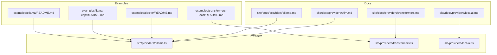
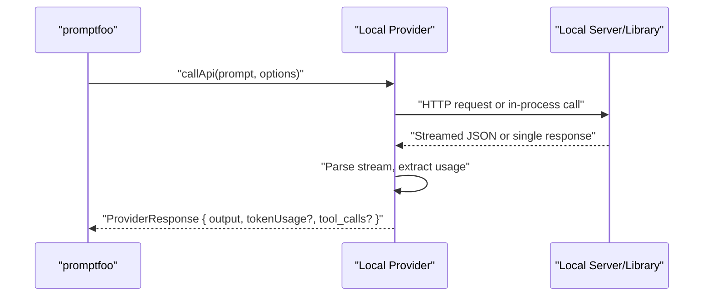
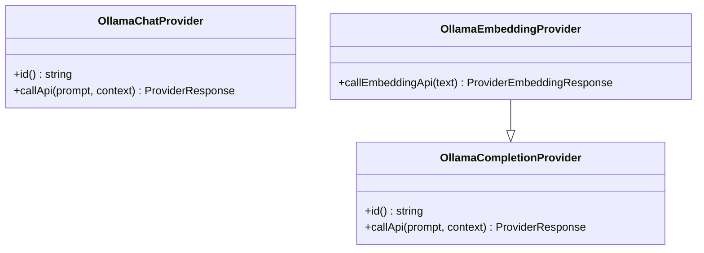
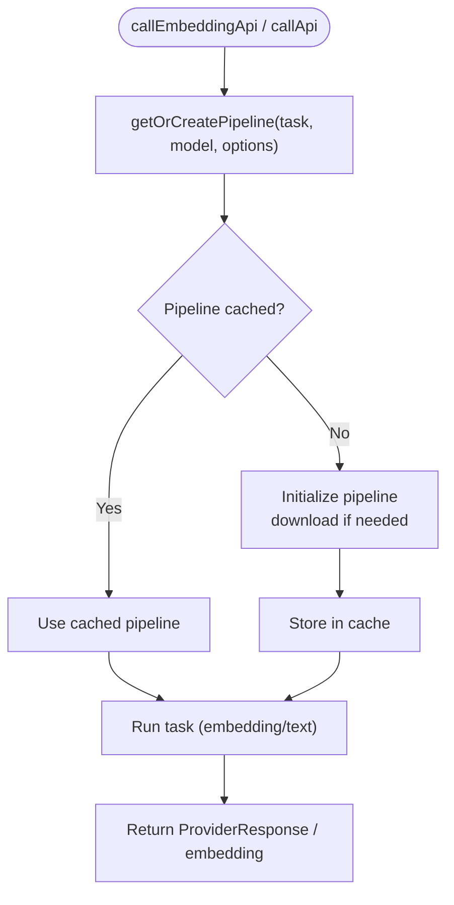
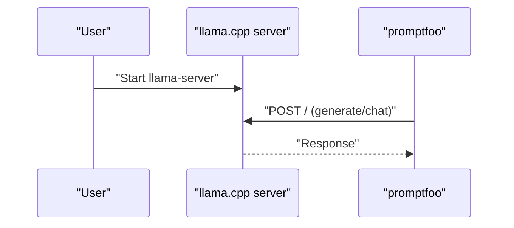
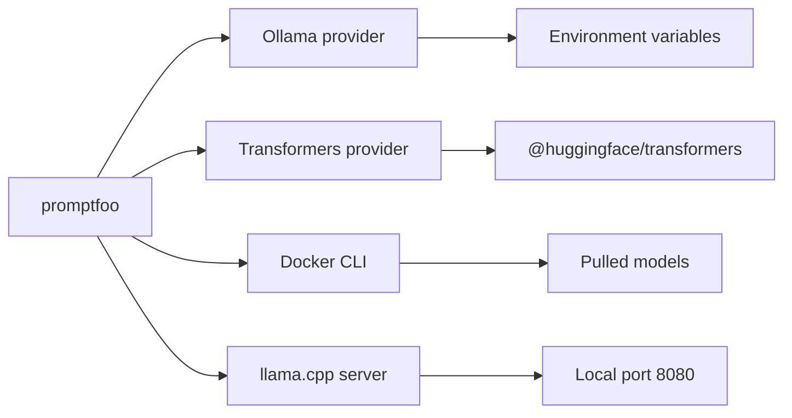

# Local Model Providers

<cite>
**Referenced Files in This Document**
- [README.md](file://examples/ollama/README.md)
- [ollama.ts](file://src/providers/ollama.ts)
- [ollama.md](file://site/docs/providers/ollama.md)
- [README.md](file://examples/llama-cpp/README.md)
- [README.md](file://examples/transformers-local/README.md)
- [transformers.ts](file://src/providers/transformers.ts)
- [transformers.md](file://site/docs/providers/transformers.md)
- [README.md](file://examples/docker/README.md)
- [localai.ts](file://src/providers/localai.ts)
- [vllm.md](file://site/docs/providers/vllm.md)
- [localai.md](file://site/docs/providers/localai.md)
</cite>

## Table of Contents
1. [Introduction](#introduction)
2. [Project Structure](#project-structure)
3. [Core Components](#core-components)
4. [Architecture Overview](#architecture-overview)
5. [Detailed Component Analysis](#detailed-component-analysis)
6. [Dependency Analysis](#dependency-analysis)
7. [Performance Considerations](#performance-considerations)
8. [Security and Privacy](#security-and-privacy)
9. [Setup Guides](#setup-guides)
10. [Cost Analysis and Migration](#cost-analysis-and-migration)
11. [Troubleshooting Guide](#troubleshooting-guide)
12. [Conclusion](#conclusion)

## Introduction
This document explains how to run AI models locally using promptfoo with providers that support on-premises or private environments. It covers Ollama, llama.cpp, Transformers.js, Docker Model Runner, LocalAI, Text Generation WebUI, and vLLM. You will learn deployment strategies, hardware requirements, quantization and memory optimization, configuration and API compatibility, performance tuning, security and privacy, offline operation, and cost comparisons with cloud providers.

## Project Structure
The repository includes:
- Example configurations and guides for local providers under examples/
- Provider implementations under src/providers/
- Provider documentation under site/docs/providers/

**Diagram sources**
- [README.md:1-145](file://examples/ollama/README.md#L1-L145)
- [ollama.ts:1-554](file://src/providers/ollama.ts#L1-L554)
- [README.md:1-49](file://examples/llama-cpp/README.md#L1-L49)
- [README.md:1-70](file://examples/transformers-local/README.md#L1-L70)
- [transformers.ts:1-533](file://src/providers/transformers.ts#L1-L533)
- [README.md:1-47](file://examples/docker/README.md#L1-L47)
- [localai.ts:1-200](file://src/providers/localai.ts#L1-L200)
- [ollama.md:1-260](file://site/docs/providers/ollama.md#L1-L260)
- [transformers.md:1-145](file://site/docs/providers/transformers.md#L1-L145)
- [localai.md:1-200](file://site/docs/providers/localai.md#L1-L200)
- [vllm.md:1-200](file://site/docs/providers/vllm.md#L1-L200)

**Section sources**
- [README.md:1-145](file://examples/ollama/README.md#L1-L145)
- [README.md:1-49](file://examples/llama-cpp/README.md#L1-L49)
- [README.md:1-70](file://examples/transformers-local/README.md#L1-L70)
- [README.md:1-47](file://examples/docker/README.md#L1-L47)
- [ollama.ts:1-554](file://src/providers/ollama.ts#L1-L554)
- [transformers.ts:1-533](file://src/providers/transformers.ts#L1-L533)
- [localai.ts:1-200](file://src/providers/localai.ts#L1-L200)
- [ollama.md:1-260](file://site/docs/providers/ollama.md#L1-L260)
- [transformers.md:1-145](file://site/docs/providers/transformers.md#L1-L145)
- [localai.md:1-200](file://site/docs/providers/localai.md#L1-L200)
- [vllm.md:1-200](file://site/docs/providers/vllm.md#L1-L200)

## Core Components
- Ollama provider: Implements completion, chat, and embeddings endpoints; supports function/tool calling; configurable via environment variables and provider config.
- Transformers.js provider: Fully local inference in Node.js using ONNX models; supports embeddings and text generation; includes caching and quantization.
- llama.cpp: Local server mode with a documented HTTP interface; promptfoo consumes it via a local HTTP endpoint.
- Docker Model Runner: Containerized model management and serving; promptfoo evaluates models pulled via Docker CLI.
- LocalAI and Text Generation WebUI: Additional local serving stacks supported by the repository’s provider ecosystem.
- vLLM: Documented provider for high-throughput local serving.

**Section sources**
- [ollama.ts:138-554](file://src/providers/ollama.ts#L138-L554)
- [transformers.ts:307-533](file://src/providers/transformers.ts#L307-L533)
- [README.md:1-49](file://examples/llama-cpp/README.md#L1-L49)
- [README.md:1-47](file://examples/docker/README.md#L1-L47)
- [localai.ts:1-200](file://src/providers/localai.ts#L1-L200)
- [localai.md:1-200](file://site/docs/providers/localai.md#L1-L200)
- [vllm.md:1-200](file://site/docs/providers/vllm.md#L1-L200)

## Architecture Overview
The evaluation flow connects promptfoo to local providers through HTTP or in-process libraries. Providers encapsulate API calls, streaming parsing, token usage extraction, and optional function/tool calling.

**Diagram sources**
- [ollama.ts:157-291](file://src/providers/ollama.ts#L157-L291)
- [ollama.ts:313-500](file://src/providers/ollama.ts#L313-L500)
- [transformers.ts:437-528](file://src/providers/transformers.ts#L437-L528)

## Detailed Component Analysis

### Ollama Provider
- Endpoints: generate, chat, embeddings.
- Configuration: temperature, top_p, num_predict, stop sequences, tools, passthrough, think.
- Function/tool calling: Converts tool definitions to OpenAI-compatible format and normalizes tool call arguments.
- Environment variables: OLLAMA_BASE_URL, OLLAMA_API_KEY, REQUEST_TIMEOUT_MS.
- Embeddings: Dedicated provider for semantic similarity assertions.
- Serial evaluation: Use concurrency flag to run one provider at a time for memory-limited setups.

**Diagram sources**
- [ollama.ts:138-292](file://src/providers/ollama.ts#L138-L292)
- [ollama.ts:294-501](file://src/providers/ollama.ts#L294-L501)
- [ollama.ts:503-554](file://src/providers/ollama.ts#L503-L554)

**Section sources**
- [ollama.ts:16-94](file://src/providers/ollama.ts#L16-L94)
- [ollama.ts:157-291](file://src/providers/ollama.ts#L157-L291)
- [ollama.ts:313-500](file://src/providers/ollama.ts#L313-L500)
- [ollama.ts:503-554](file://src/providers/ollama.ts#L503-L554)
- [ollama.md:47-76](file://site/docs/providers/ollama.md#L47-L76)
- [ollama.md:77-109](file://site/docs/providers/ollama.md#L77-L109)
- [ollama.md:111-194](file://site/docs/providers/ollama.md#L111-L194)
- [README.md:11-23](file://examples/ollama/README.md#L11-L23)

### Transformers.js Provider
- Tasks: feature-extraction (embeddings), text-generation.
- Options: device, dtype (quantization), cacheDir, localFilesOnly, revision, pooling, normalize, prefix, sampling controls.
- Pipeline caching: Singleton pipelines per task:model:device:dtype; automatic cleanup on shutdown.
- Embeddings: Supports BGE/E5 prefixes and normalization.
- Text generation: Handles chat-style arrays and greedy/sampling decoding.

**Diagram sources**
- [transformers.ts:149-252](file://src/providers/transformers.ts#L149-L252)
- [transformers.ts:338-398](file://src/providers/transformers.ts#L338-L398)
- [transformers.ts:437-528](file://src/providers/transformers.ts#L437-L528)

**Section sources**
- [transformers.ts:9-43](file://src/providers/transformers.ts#L9-L43)
- [transformers.ts:149-252](file://src/providers/transformers.ts#L149-L252)
- [transformers.ts:307-399](file://src/providers/transformers.ts#L307-L399)
- [transformers.ts:413-529](file://src/providers/transformers.ts#L413-L529)
- [transformers.md:42-91](file://site/docs/providers/transformers.md#L42-L91)
- [transformers.md:125-139](file://site/docs/providers/transformers.md#L125-L139)
- [README.md:5-26](file://examples/transformers-local/README.md#L5-L26)

### llama.cpp Provider
- Local server mode: Start llama-server and point promptfoo to the local HTTP endpoint.
- Prompt formatting: Pass prompts as-is; ensure compatibility with the chosen model’s expected format.
- Cache behavior: promptfoo does not invalidate cache when the underlying model changes; use no-cache flag to bypass.

**Diagram sources**
- [README.md:13-21](file://examples/llama-cpp/README.md#L13-L21)
- [README.md:23-36](file://examples/llama-cpp/README.md#L23-L36)

**Section sources**
- [README.md:1-49](file://examples/llama-cpp/README.md#L1-L49)

### Docker Model Runner
- Pull and serve models via Docker Model Runner CLI.
- Evaluate using promptfoo with pre-pulled models; examples demonstrate model selection and evaluation commands.

**Section sources**
- [README.md:1-47](file://examples/docker/README.md#L1-L47)

### LocalAI and Text Generation WebUI
- Provider implementations and documentation exist for these local stacks, enabling compatibility with promptfoo’s provider interface.

**Section sources**
- [localai.ts:1-200](file://src/providers/localai.ts#L1-L200)
- [localai.md:1-200](file://site/docs/providers/localai.md#L1-L200)

### vLLM
- Provider documentation outlines configuration and usage patterns for high-throughput local serving.

**Section sources**
- [vllm.md:1-200](file://site/docs/providers/vllm.md#L1-L200)

## Dependency Analysis
- Ollama provider depends on environment variables for base URL and optional API key, and parses streamed JSON responses.
- Transformers provider dynamically imports the Transformers.js library and manages a pipeline cache keyed by task, model, device, and dtype.
- Docker and llama.cpp rely on external servers/processes; promptfoo communicates via HTTP.

**Diagram sources**
- [ollama.ts:222-236](file://src/providers/ollama.ts#L222-L236)
- [transformers.ts:181-189](file://src/providers/transformers.ts#L181-L189)
- [README.md:14-32](file://examples/docker/README.md#L14-L32)
- [README.md:15-21](file://examples/llama-cpp/README.md#L15-L21)

**Section sources**
- [ollama.ts:1-15](file://src/providers/ollama.ts#L1-L15)
- [transformers.ts:1-5](file://src/providers/transformers.ts#L1-L5)
- [README.md:1-47](file://examples/docker/README.md#L1-L47)
- [README.md:1-49](file://examples/llama-cpp/README.md#L1-L49)

## Performance Considerations
- Concurrency and memory:
  - Ollama: Use serial evaluation to reduce memory pressure during multi-model testing.
  - Transformers: Use quantization dtypes (e.g., q4/q8) and limit concurrency with the serial flag.
- Quantization and memory:
  - Ollama: Tune model parameters and consider smaller models for constrained environments.
  - Transformers: dtype options reduce memory footprint; device selection affects performance.
- Caching:
  - Transformers: Pipelines are cached after first load; initial downloads dominate first-run latency.
  - Ollama: Streaming responses include token usage; ensure models are loaded once per evaluation batch.
- Disk and throughput:
  - Docker examples indicate significant disk usage for multiple quantized models.

**Section sources**
- [ollama.md:241-260](file://site/docs/providers/ollama.md#L241-L260)
- [transformers.md:125-139](file://site/docs/providers/transformers.md#L125-L139)
- [README.md:34-34](file://examples/docker/README.md#L34-L34)

## Security and Privacy
- Offline operation:
  - Transformers and llama.cpp examples emphasize fully local operation without external APIs.
- Data locality:
  - Ollama and LocalAI examples show local endpoints; ensure network isolation and secure configuration.
- Authentication:
  - Ollama supports bearer token authentication via environment variable.
- Network binding:
  - Ollama documentation includes guidance for IPv4/IPv6 localhost binding to avoid connection refusal.

**Section sources**
- [README.md:21-26](file://examples/transformers-local/README.md#L21-L26)
- [README.md:38-48](file://examples/llama-cpp/README.md#L38-L48)
- [ollama.md:47-51](file://site/docs/providers/ollama.md#L47-L51)
- [ollama.md:222-240](file://site/docs/providers/ollama.md#L222-L240)

## Setup Guides

### Ollama
- Install Ollama and pull models as shown in the example README.
- Configure provider IDs and options in promptfoo configuration.
- Use function/tool calling with OpenAI-compatible tool definitions.

**Section sources**
- [README.md:11-23](file://examples/ollama/README.md#L11-L23)
- [ollama.md:10-45](file://site/docs/providers/ollama.md#L10-L45)
- [ollama.md:77-109](file://site/docs/providers/ollama.md#L77-L109)

### llama.cpp
- Install llama.cpp and start the server on a local port.
- Configure promptfoo to target the local endpoint; note that promptfoo does not format prompts for compatibility—match the model’s expected format.

**Section sources**
- [README.md:9-21](file://examples/llama-cpp/README.md#L9-L21)
- [README.md:42-48](file://examples/llama-cpp/README.md#L42-L48)

### Transformers.js
- Install the optional dependency and configure providers for embeddings and text generation.
- Use quantization and device selection for performance and memory optimization.

**Section sources**
- [README.md:5-11](file://examples/transformers-local/README.md#L5-L11)
- [transformers.md:10-16](file://site/docs/providers/transformers.md#L10-L16)
- [transformers.md:42-91](file://site/docs/providers/transformers.md#L42-L91)

### Docker Model Runner
- Enable Docker Model Runner and pull models via the CLI.
- Run evaluations with the provided configuration files.

**Section sources**
- [README.md:14-32](file://examples/docker/README.md#L14-L32)

### LocalAI and Text Generation WebUI
- Follow provider documentation for configuration and endpoint compatibility.

**Section sources**
- [localai.md:1-200](file://site/docs/providers/localai.md#L1-L200)

### vLLM
- Refer to provider documentation for setup and configuration.

**Section sources**
- [vllm.md:1-200](file://site/docs/providers/vllm.md#L1-L200)

## Cost Analysis and Migration
- Local ownership:
  - Eliminates per-request costs and reduces reliance on cloud APIs.
- Hardware and licensing:
  - Requires sufficient CPU/RAM/GPU depending on model size and quantization; Docker examples indicate substantial disk usage for multiple models.
- Migration strategy:
  - Start with smaller quantized models; gradually increase size and precision as hardware permits.
  - Use serial evaluation during migration to validate accuracy and performance.
  - Maintain parity with cloud configurations by aligning provider options and assertions.

[No sources needed since this section provides general guidance]

## Troubleshooting Guide
- Ollama connectivity:
  - Verify base URL and API key; resolve IPv4/IPv6 localhost binding mismatches.
  - Use serial evaluation to reduce memory contention.
- Transformers.js:
  - Ensure the optional dependency is installed; confirm model availability with ONNX weights.
  - Reduce dtype or run serially if encountering out-of-memory conditions.
- llama.cpp:
  - Confirm server is reachable at the configured port; disable cache if model updates are not reflected.

**Section sources**
- [ollama.md:222-240](file://site/docs/providers/ollama.md#L222-L240)
- [ollama.md:241-260](file://site/docs/providers/ollama.md#L241-L260)
- [transformers.md:131-139](file://site/docs/providers/transformers.md#L131-L139)
- [README.md:46-48](file://examples/llama-cpp/README.md#L46-L48)

## Conclusion
Using local model providers with promptfoo enables secure, private, and offline evaluation of AI models. Choose the provider that best fits your environment: Ollama for ease of use and function calling, Transformers.js for fully local Node.js inference, llama.cpp for lightweight server mode, Docker Model Runner for containerized orchestration, and LocalAI or Text Generation WebUI for alternative local stacks. Optimize for performance with quantization and serial evaluation, and plan for cost reduction by eliminating cloud API fees while maintaining quality through careful configuration and validation.