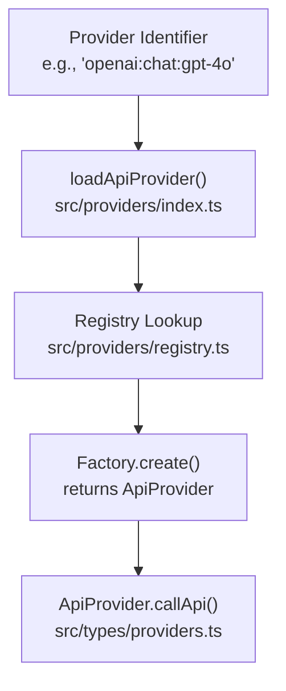
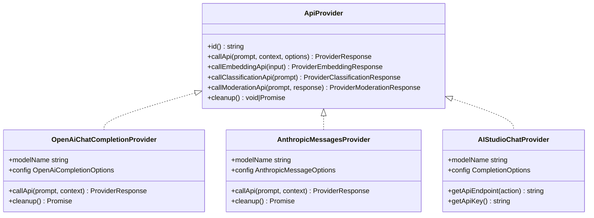
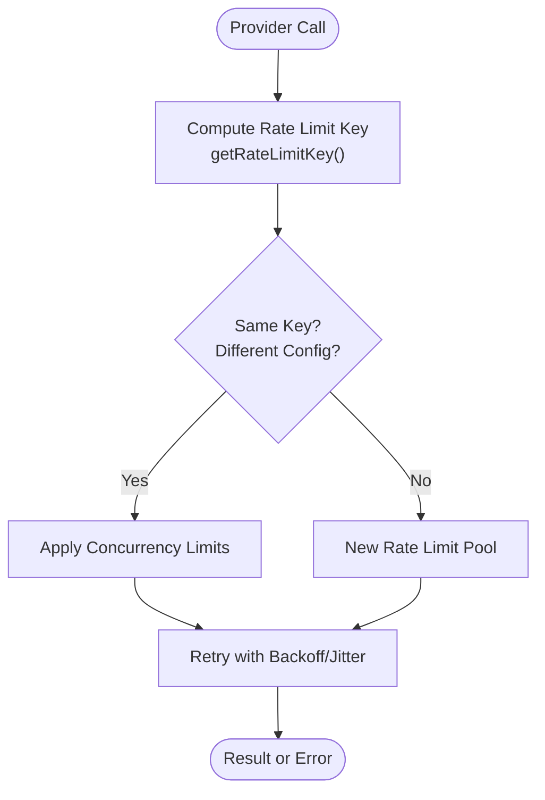
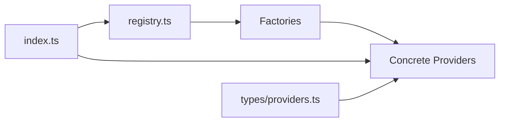

# Supported Providers

<cite>
**Referenced Files in This Document**
- [registry.ts](file://src/providers/registry.ts)
- [index.ts](file://src/providers/index.ts)
- [providers.ts](file://src/types/providers.ts)
- [rateLimitKey.ts](file://src/scheduler/rateLimitKey.ts)
- [providerRateLimitState.test.ts](file://test/scheduler/providerRateLimitState.test.ts)
- [rateLimitRegistry.test.ts](file://test/scheduler/rateLimitRegistry.test.ts)
- [chat.ts](file://src/providers/openai/chat.ts)
- [messages.ts](file://src/providers/anthropic/messages.ts)
- [ai.studio.ts](file://src/providers/google/ai.studio.ts)
- [ProviderTypeSelector.tsx](file://src/app/src/pages/redteam/setup/components/Targets/ProviderTypeSelector.tsx)
- [mcp.md](file://site/docs/providers/mcp.md)
</cite>

## Table of Contents
1. [Introduction](#introduction)
2. [Project Structure](#project-structure)
3. [Core Components](#core-components)
4. [Architecture Overview](#architecture-overview)
5. [Detailed Component Analysis](#detailed-component-analysis)
6. [Dependency Analysis](#dependency-analysis)
7. [Performance Considerations](#performance-considerations)
8. [Troubleshooting Guide](#troubleshooting-guide)
9. [Conclusion](#conclusion)
10. [Appendices](#appendices)

## Introduction
This document enumerates and explains all supported AI providers in PromptFoo. It covers authentication setup, configuration options, rate limiting, provider-specific features, capabilities, pricing considerations, selection criteria, and operational constraints. The goal is to help users choose the right provider for their evaluation needs and operate them effectively.

## Project Structure
PromptFoo organizes providers under a single registry that maps provider identifiers to factory functions. The loader resolves provider strings, files, functions, and objects into concrete provider instances. Providers expose a unified API surface defined by the provider types.

**Diagram sources**
- [index.ts:31-177](file://src/providers/index.ts#L31-L177)
- [registry.ts:143-1599](file://src/providers/registry.ts#L143-L1599)
- [providers.ts:102-120](file://src/types/providers.ts#L102-L120)

**Section sources**
- [index.ts:31-177](file://src/providers/index.ts#L31-L177)
- [registry.ts:143-1599](file://src/providers/registry.ts#L143-L1599)
- [providers.ts:102-120](file://src/types/providers.ts#L102-L120)

## Core Components
- Provider Registry: Central mapping of provider identifiers to factory functions. It supports many providers including OpenAI, Anthropic, Google AI, AWS Bedrock, Azure OpenAI, Mistral, Groq, Ollama, and more.
- Provider Loader: Resolves provider strings, files, functions, and objects into instantiated providers. Handles cloud-linked providers, file-based configs, and environment overrides.
- Provider Types: Defines the contract for all providers, including callApi, callEmbeddingApi, callClassificationApi, and callModerationApi.

Key capabilities exposed by providers:
- Text generation (chat/completions)
- Embeddings
- Moderation
- Image generation
- Video generation
- Audio transcription and voice
- Tool/function calling
- Structured outputs
- Realtime audio/video streaming
- MCP (Model Context Protocol) integration

**Section sources**
- [registry.ts:143-1599](file://src/providers/registry.ts#L143-L1599)
- [index.ts:31-177](file://src/providers/index.ts#L31-L177)
- [providers.ts:102-136](file://src/types/providers.ts#L102-L136)

## Architecture Overview
The provider system follows a factory pattern. The registry defines test/create handlers for each provider family. The loader selects the appropriate factory and constructs the provider with merged configuration and environment overrides.

**Diagram sources**
- [providers.ts:102-136](file://src/types/providers.ts#L102-L136)
- [chat.ts:41-64](file://src/providers/openai/chat.ts#L41-L64)
- [messages.ts:32-56](file://src/providers/anthropic/messages.ts#L32-L56)
- [ai.studio.ts:122-132](file://src/providers/google/ai.studio.ts#L122-L132)

## Detailed Component Analysis

### Provider Capabilities Matrix
Below is a consolidated matrix of capabilities across major provider families. The matrix indicates support for chat completions, embeddings, image generation, video generation, audio, moderation, tool/function calling, and structured outputs.

- OpenAI
  - Chat completions: ✅
  - Embeddings: ✅
  - Images: ✅
  - Video: ✅
  - Audio: ✅
  - Moderation: ✅
  - Tools/Functions: ✅
  - Structured Outputs: ✅
  - Realtime: ✅
  - Assistants/Agents: ✅
  - ChatKit: ✅
  - Responses API: ✅
  - Codex SDK: ✅
- Anthropic
  - Messages: ✅
  - Embeddings: ❌
  - Images: ❌
  - Video: ❌
  - Audio: ❌
  - Moderation: ❌
  - Tools/Functions: ✅
  - Structured Outputs: ✅
  - Thinking: ✅
- Google AI Studio (Gemini)
  - Chat: ✅
  - Embeddings: ❌
  - Images: ✅ (native image models)
  - Video: ✅
  - Audio: ❌
  - Moderation: ❌
  - Tools/Functions: ✅
  - Structured Outputs: ✅
- AWS Bedrock
  - Chat/Completions: ✅
  - Embeddings: ✅
  - Images: ✅ (via supported models)
  - Video: ✅ (Nova-Reel, Luma-Ray)
  - Knowledge Base: ✅
  - Agents: ✅
  - Converse API: ✅
- Azure OpenAI
  - Chat: ✅
  - Completions: ✅
  - Embeddings: ✅
  - Moderation: ✅
  - Assistants: ✅
  - Foundry Agent: ✅
  - Responses API: ✅
  - Video: ✅
- Mistral
  - Chat: ✅
  - Embeddings: ✅
- Groq
  - Chat: ✅
  - Responses API: ✅
- Ollama
  - Chat: ✅
  - Completions: ✅
  - Embeddings: ✅
- Others (selected)
  - Alibaba/DashScope: ✅
  - Cohere: ✅
  - Hugging Face: ✅
  - ElevenLabs: TTS/STT/Agents/History/Isolation/Alignment
  - Replicate: ✅
  - TrueFoundry: ✅
  - Vercel: ✅
  - Portkey: ✅
  - Together/AI: ✅
  - Fireworks: ✅
  - Perplexity: ✅
  - Helicone: ✅
  - OpenRouter: ✅
  - GitHub: ✅
  - Cerebras: ✅
  - Databricks: ✅
  - Hyperbolic: ✅
  - OpenRouter: ✅
  - X.AI: ✅
  - Vertex AI: ✅
  - WatsonX: ✅
  - LocalAI: ✅
  - Cloudflare AI/Gateway: ✅
  - OpenCLAW: ✅
  - OpenCode: ✅
  - Envoy: ✅
  - Nscale: ✅
  - ModelsLab: ✅
  - CometAPI: ✅
  - Docker: ✅
  - AIMLAPI: ✅
  - Jfrog/Qwak: ✅
  - LlamaAPI: ✅
  - QuiverAI: ✅
  - F5: ✅
  - Echo: ✅
  - Browser: ✅
  - HTTP/Webhook/WebSocket: ✅
  - MCP: ✅

Notes:
- Some providers require specific model types or formats (e.g., OpenAI:chat, openai:embedding, openai:image).
- Capability depends on the selected model and provider configuration.

**Section sources**
- [registry.ts:143-1599](file://src/providers/registry.ts#L143-L1599)

### Authentication Setup
- OpenAI
  - Environment variables: OPENAI_API_KEY or provider config.apiKey
  - Optional: OPENAI_ORGANIZATION, OPENAI_BASE_URL, OPENAI_REGION
- Anthropic
  - Environment variable: ANTHROPIC_API_KEY or provider config.apiKey
- Google AI Studio
  - Environment variables: GOOGLE_API_KEY or GEMINI_API_KEY or PALM_API_KEY
  - Host override: GOOGLE_API_HOST or PALM_API_HOST
  - Base URL override: GOOGLE_API_BASE_URL
- AWS Bedrock
  - AWS credentials via standard AWS SDK mechanisms
  - Region override via config.region
- Azure OpenAI
  - Azure credentials and endpoint via standard Azure SDK mechanisms
  - Deployment/assistant IDs required for specific endpoints
- Mistral
  - Environment variable: MISTRAL_API_KEY or provider config.apiKey
- Groq
  - Environment variable: GROQ_API_KEY or provider config.apiKey
- Ollama
  - Local service accessible via configured base URL
- Others
  - Most providers accept apiKey or apiToken via environment variables or provider config
  - Some providers support custom base URLs and hosts

**Section sources**
- [chat.ts:84-92](file://src/providers/openai/chat.ts#L84-L92)
- [messages.ts:84-92](file://src/providers/anthropic/messages.ts#L84-L92)
- [ai.studio.ts:94-108](file://src/providers/google/ai.studio.ts#L94-L108)
- [registry.ts:336-402](file://src/providers/registry.ts#L336-L402)

### Configuration Options
Common configuration keys across providers:
- id: Provider identifier
- config: Provider-specific configuration
- env: Environment overrides
- label: Human-readable label
- transform: Post-processing transform
- delay: Per-request delay
- prompts: Filtered prompt sets
- inputs: Static inputs for provider runs

Provider-specific examples:
- OpenAI
  - Model selection, temperature, max_tokens, tools, response_format, stream, mcp, functionToolCallbacks
- Anthropic
  - Model selection, temperature, max_tokens, tools, output_format, thinking, stream, mcp
- Google AI Studio
  - apiHost, apiBaseUrl, apiVersion, safety settings, system instructions
- AWS Bedrock
  - modelId, region, knowledgeBaseId, agentId, video models (Nova-Reel, Luma-Ray)
- Azure OpenAI
  - deploymentName, modelName, moderation model, video model
- Mistral
  - model selection for chat/embeddings
- Groq
  - model selection for chat and responses
- Ollama
  - model selection for chat/completion/embeddings
- MCP
  - server configuration, OAuth, token refresh behavior

**Section sources**
- [providers.ts:50-59](file://src/types/providers.ts#L50-L59)
- [chat.ts:151-200](file://src/providers/openai/chat.ts#L151-L200)
- [messages.ts:151-200](file://src/providers/anthropic/messages.ts#L151-L200)
- [ai.studio.ts:122-132](file://src/providers/google/ai.studio.ts#L122-L132)
- [mcp.md:181-219](file://site/docs/providers/mcp.md#L181-L219)

### Rate Limiting
PromptFoo implements a rate-limiting registry keyed by provider identity and relevant configuration segments (API key tail, base URL, region, organization). This ensures concurrency and retry policies are applied consistently per unique provider configuration.

**Diagram sources**
- [rateLimitKey.ts:9-42](file://src/scheduler/rateLimitKey.ts#L9-L42)

**Section sources**
- [rateLimitKey.ts:9-42](file://src/scheduler/rateLimitKey.ts#L9-L42)
- [providerRateLimitState.test.ts:1-49](file://test/scheduler/providerRateLimitState.test.ts#L1-L49)
- [rateLimitRegistry.test.ts:897-931](file://test/scheduler/rateLimitRegistry.test.ts#L897-L931)

### Provider Selection Criteria and Best Practices
- Model Availability and Cost
  - Prefer providers/models aligned with your budget and latency targets.
  - Use the provider capabilities matrix to confirm required features (chat, embeddings, images, video, audio).
- Regional and Compliance
  - Select providers/models available in your region.
  - Consider data residency and export controls; some providers offer regional endpoints.
- Stability and Reliability
  - Choose providers with SLAs suitable for production evaluations.
  - Use rate limiting and retries judiciously to avoid provider throttling.
- Tooling and Features
  - For tool/function calling, structured outputs, and reasoning, verify provider support.
  - For multimodal needs, confirm image/video/audio generation capabilities.
- MCP Integration
  - Use MCP-enabled providers to integrate external tools and services securely.

**Section sources**
- [ProviderTypeSelector.tsx:599-656](file://src/app/src/pages/redteam/setup/components/Targets/ProviderTypeSelector.tsx#L599-L656)

### Pricing Considerations and Cost Estimation
- PromptFoo captures cost in provider responses when available. Use this to estimate total costs across evaluations.
- Providers commonly charge per 1K tokens for text models and per image/video generation for media models.
- For accurate estimates:
  - Track token usage per provider response.
  - Multiply by provider pricing tiers.
  - Account for batch sizes and retries.

**Section sources**
- [providers.ts:145-191](file://src/types/providers.ts#L145-L191)

### Provider Limitations, Regional Availability, and Compliance
- Model Availability
  - Not all models are available from every provider; verify model names and types in the registry.
- Regional Constraints
  - Some providers restrict endpoints to specific regions; configure accordingly.
- Compliance
  - Ensure provider terms permit evaluation use cases.
  - For sensitive data, consider on-prem/self-hosted providers (e.g., Ollama, LocalAI) or providers offering enterprise-grade controls.

**Section sources**
- [registry.ts:336-402](file://src/providers/registry.ts#L336-L402)

## Dependency Analysis
The provider system is decoupled from provider implementations via the registry and factory pattern. The loader depends on the registry to instantiate providers and merges environment overrides and cloud-linked configurations.

**Diagram sources**
- [registry.ts:143-1599](file://src/providers/registry.ts#L143-L1599)
- [index.ts:31-177](file://src/providers/index.ts#L31-L177)
- [providers.ts:102-136](file://src/types/providers.ts#L102-L136)

**Section sources**
- [registry.ts:143-1599](file://src/providers/registry.ts#L143-L1599)
- [index.ts:31-177](file://src/providers/index.ts#L31-L177)
- [providers.ts:102-136](file://src/types/providers.ts#L102-L136)

## Performance Considerations
- Concurrency Control
  - Tune max/min concurrency per provider pool to balance throughput and stability.
- Retries and Backoff
  - Use exponential backoff with jitter to mitigate transient failures.
- Caching
  - Enable caching for repeated prompts to reduce latency and cost.
- Streaming
  - Prefer streaming for long outputs to improve perceived performance.

[No sources needed since this section provides general guidance]

## Troubleshooting Guide
- Unknown Provider Identifier
  - Ensure the provider string matches a registered pattern. The loader throws a descriptive error if unrecognized.
- Missing API Keys
  - Verify environment variables or provider config.apiKey are set.
- Rate Limit Exceeded
  - Adjust concurrency and retry policies; ensure the rate limit key differentiates unique configurations.
- MCP Authentication Failures
  - Confirm OAuth token endpoint discovery and refresh behavior.

**Section sources**
- [index.ts:167-177](file://src/providers/index.ts#L167-L177)
- [chat.ts:84-92](file://src/providers/openai/chat.ts#L84-L92)
- [messages.ts:84-92](file://src/providers/anthropic/messages.ts#L84-L92)
- [mcp.md:181-219](file://site/docs/providers/mcp.md#L181-L219)

## Conclusion
PromptFoo’s provider ecosystem supports a broad range of AI services with a consistent interface. By leveraging the registry, loader, and typed provider contracts, users can configure, evaluate, and operate providers efficiently. Use the capabilities matrix, authentication guidance, and rate-limiting strategies to select and operate providers that meet your evaluation goals.

[No sources needed since this section summarizes without analyzing specific files]

## Appendices

### Provider Families and Examples
- OpenAI: openai:chat:gpt-4o, openai:embedding:text-embedding-3-large, openai:image:dall-e-3, openai:video:sora-2
- Anthropic: anthropic:messages:claude-3-5-sonnet-20241022, anthropic:completion:claude-instant
- Google AI Studio: google:gemini-2.0-flash, google:image:gemini-2.5-flash-image
- AWS Bedrock: bedrock:anthropic.claude-3-5-sonnet-20241022-v2:0, bedrock:embeddings:amazon.titan-embed-text-v1, bedrock:video:amazon.nova-reel-v1:1
- Azure OpenAI: azure:chat:my-deployment, azure:embedding:text-embedding-ada-002, azure:assistant:my-assistant, azure:video:sora
- Mistral: mistral:open-mixtral-8x7b, mistral:embeddings
- Groq: groq:llama-3.3-70b-versatile, groq:responses:llama-3.3-70b-versatile
- Ollama: ollama:chat:llama3.2, ollama:embedding:nomic-embed-text
- Others: alibaba:, cohere:, elevenlabs:, replicate:, truefoundry:, vercel:, portkey:, togetherai:, fireworks:, perplexity:, helicone:, openrouter:, github:, cerebras:, databricks:, hyperbolic:, xai:, vertex:, watsonx:, localai:, cloudflare-ai:, cloudflare-gateway:, openclaw:, opencode:, envoy:, nscale:, modelslab:, cometapi:, docker:, aimlapi:, jfrog:, llamaapi:, quiverai:, f5:, echo:, browser:, http/https, webhook, websocket, mcp

**Section sources**
- [registry.ts:143-1599](file://src/providers/registry.ts#L143-L1599)