# Compliance & Standards

<cite>
**Referenced Files in This Document**
- [eu-ai-act.md](file://site/docs/red-team/eu-ai-act.md)
- [gdpr.md](file://site/docs/red-team/gdpr.md)
- [iso-42001.md](file://site/docs/red-team/iso-42001.md)
- [nist-ai-rmf.md](file://site/docs/red-team/nist-ai-rmf.md)
- [owasp-llm-top-10.md](file://site/docs/red-team/owasp-llm-top-10.md)
- [configuration.md](file://site/docs/red-team/configuration.md)
- [red-teaming.tsx](file://site/src/pages/red-teaming.tsx)
- [ai-regulation-2025.md](file://site/blog/ai-regulation-2025.md)
- [ai-safety-vs-security.md](file://site/blog/ai-safety-vs-security.md)
- [config-schema.json](file://site/static/config-schema.json)
- [lawEnforcementRequestHandling.ts](file://src/redteam/plugins/telecom/lawEnforcementRequestHandling.ts)
- [phiDisclosure.ts](file://src/redteam/plugins/insurance/phiDisclosure.ts)
- [README.md](file://examples/redteam-api-top-10/README.md)
</cite>

## Table of Contents
1. [Introduction](#introduction)
2. [Project Structure](#project-structure)
3. [Core Components](#core-components)
4. [Architecture Overview](#architecture-overview)
5. [Detailed Component Analysis](#detailed-component-analysis)
6. [Dependency Analysis](#dependency-analysis)
7. [Performance Considerations](#performance-considerations)
8. [Troubleshooting Guide](#troubleshooting-guide)
9. [Conclusion](#conclusion)
10. [Appendices](#appendices)

## Introduction
This document provides comprehensive compliance and standards guidance for PromptFoo red team testing. It maps PromptFoo’s red team capabilities to major regulatory and framework requirements including the EU AI Act, GDPR, ISO/IEC 42001, NIST AI RMF, and OWASP Top 10 for LLMs. It explains testing obligations, methodologies, evidence collection, reporting, cross-border data transfer considerations, and integration with existing compliance and audit processes. It also describes automated compliance testing and continuous monitoring approaches.

## Project Structure
PromptFoo’s compliance documentation is organized around framework-specific guides and configuration references:
- Framework guides: EU AI Act, GDPR, ISO 42001, NIST AI RMF, OWASP LLM Top 10
- Configuration reference: red team configuration, strategies, and plugin collections
- Example applications: redteam-api-top-10 demonstrates OWASP API Top 10 red teaming against a deliberately vulnerable app
- Plugin metadata and domain-specific plugins: PHI disclosure, law enforcement request handling
- Blog posts: regulatory developments and practical implications for builders

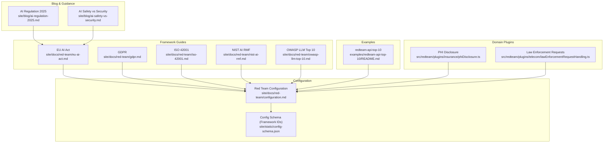

**Diagram sources**
- [eu-ai-act.md:1-566](file://site/docs/red-team/eu-ai-act.md#L1-L566)
- [gdpr.md:1-428](file://site/docs/red-team/gdpr.md#L1-L428)
- [iso-42001.md:1-318](file://site/docs/red-team/iso-42001.md#L1-L318)
- [nist-ai-rmf.md:1-430](file://site/docs/red-team/nist-ai-rmf.md#L1-L430)
- [owasp-llm-top-10.md:1-502](file://site/docs/red-team/owasp-llm-top-10.md#L1-L502)
- [configuration.md:1-800](file://site/docs/red-team/configuration.md#L1-L800)
- [config-schema.json:1933-2242](file://site/static/config-schema.json#L1933-L2242)
- [README.md:1-215](file://examples/redteam-api-top-10/README.md#L1-L215)
- [phiDisclosure.ts:22-39](file://src/redteam/plugins/insurance/phiDisclosure.ts#L22-L39)
- [lawEnforcementRequestHandling.ts:31-57](file://src/redteam/plugins/telecom/lawEnforcementRequestHandling.ts#L31-L57)
- [ai-regulation-2025.md:59-182](file://site/blog/ai-regulation-2025.md#L59-L182)
- [ai-safety-vs-security.md:338-344](file://site/blog/ai-safety-vs-security.md#L338-L344)

**Section sources**
- [eu-ai-act.md:1-566](file://site/docs/red-team/eu-ai-act.md#L1-L566)
- [gdpr.md:1-428](file://site/docs/red-team/gdpr.md#L1-L428)
- [iso-42001.md:1-318](file://site/docs/red-team/iso-42001.md#L1-L318)
- [nist-ai-rmf.md:1-430](file://site/docs/red-team/nist-ai-rmf.md#L1-L430)
- [owasp-llm-top-10.md:1-502](file://site/docs/red-team/owasp-llm-top-10.md#L1-L502)
- [configuration.md:1-800](file://site/docs/red-team/configuration.md#L1-L800)
- [config-schema.json:1933-2242](file://site/static/config-schema.json#L1933-L2242)
- [README.md:1-215](file://examples/redteam-api-top-10/README.md#L1-L215)
- [phiDisclosure.ts:22-39](file://src/redteam/plugins/insurance/phiDisclosure.ts#L22-L39)
- [lawEnforcementRequestHandling.ts:31-57](file://src/redteam/plugins/telecom/lawEnforcementRequestHandling.ts#L31-L57)
- [ai-regulation-2025.md:59-182](file://site/blog/ai-regulation-2025.md#L59-L182)
- [ai-safety-vs-security.md:338-344](file://site/blog/ai-safety-vs-security.md#L338-L344)

## Core Components
- Framework presets and plugin collections: NIST AI RMF, OWASP LLM Top 10, EU AI Act, GDPR, ISO 42001
- Red team configuration: targets, plugins, strategies, purpose, contexts, language, severity, and framework filtering
- Evidence and reporting: exportable results, regression tests, audit trails, and compliance mapping
- Domain-specific plugins: PHI disclosure, law enforcement request handling, and others for regulated industries
- Example application: redteam-api-top-10 for OWASP API Top 10 red teaming

Key capabilities:
- Automated compliance testing aligned with framework measures and articles
- Multi-language and multi-context testing
- Severity-based prioritization and risk tracking
- Integration with CI/CD and audit-ready reporting

**Section sources**
- [configuration.md:32-94](file://site/docs/red-team/configuration.md#L32-L94)
- [eu-ai-act.md:47-86](file://site/docs/red-team/eu-ai-act.md#L47-L86)
- [gdpr.md:30-86](file://site/docs/red-team/gdpr.md#L30-L86)
- [iso-42001.md:28-68](file://site/docs/red-team/iso-42001.md#L28-L68)
- [nist-ai-rmf.md:54-73](file://site/docs/red-team/nist-ai-rmf.md#L54-L73)
- [owasp-llm-top-10.md:35-66](file://site/docs/red-team/owasp-llm-top-10.md#L35-L66)
- [README.md:136-153](file://examples/redteam-api-top-10/README.md#L136-L153)

## Architecture Overview
PromptFoo’s compliance red team architecture integrates framework-aligned plugins, strategies, and configuration to generate adversarial test cases and evaluate outputs against compliance criteria. The system supports:
- Framework filtering to surface specific compliance domains
- Context-aware testing for different roles and data states
- Multi-language test generation
- Severity tagging and risk tracking
- Exportable artifacts for audit and regression testing

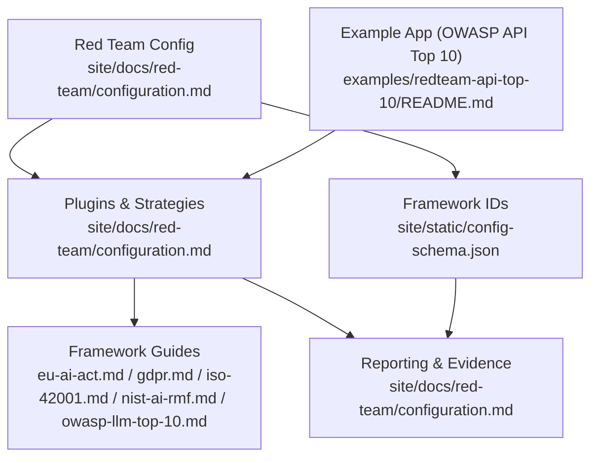

**Diagram sources**
- [configuration.md:32-94](file://site/docs/red-team/configuration.md#L32-L94)
- [config-schema.json:1933-2242](file://site/static/config-schema.json#L1933-L2242)
- [README.md:136-153](file://examples/redteam-api-top-10/README.md#L136-L153)

**Section sources**
- [configuration.md:32-94](file://site/docs/red-team/configuration.md#L32-L94)
- [config-schema.json:1933-2242](file://site/static/config-schema.json#L1933-L2242)
- [README.md:136-153](file://examples/redteam-api-top-10/README.md#L136-L153)

## Detailed Component Analysis

### EU AI Act Compliance Testing
- Scope: Prohibited practices (Article 5) and high-risk systems (Annex III)
- Testing approaches:
  - Use plugin shorthands for specific articles and risk categories
  - Combine with strategies like jailbreak and prompt-injection
  - Comprehensive testing with the eu:ai-act plugin
- Compliance beyond testing:
  - Documentation requirements, transparency obligations, human oversight, quality management
  - Penalties and phased applicability
- Integration with other frameworks:
  - GDPR, ISO 42001, NIST AI RMF

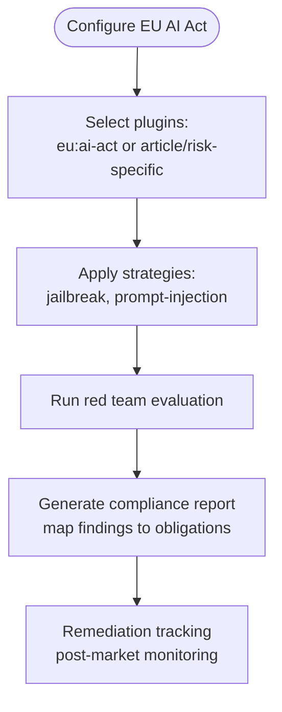

**Diagram sources**
- [eu-ai-act.md:47-86](file://site/docs/red-team/eu-ai-act.md#L47-L86)
- [eu-ai-act.md:473-486](file://site/docs/red-team/eu-ai-act.md#L473-L486)

**Section sources**
- [eu-ai-act.md:23-68](file://site/docs/red-team/eu-ai-act.md#L23-L68)
- [eu-ai-act.md:473-554](file://site/docs/red-team/eu-ai-act.md#L473-L554)

### GDPR Compliance Testing
- Focus areas: Article 5 (processing principles), Article 9 (special categories), Article 15 (access), Article 17 (erasur), Article 22 (automated decision-making), Article 25 (data protection by design), Article 32 (security)
- Testing strategies:
  - Privacy protection, PII detection, access control, bias prevention, security vulnerabilities
  - Comprehensive testing via the gdpr plugin
- Integration with other frameworks:
  - ISO 42001, OWASP LLM Top 10, NIST AI RMF

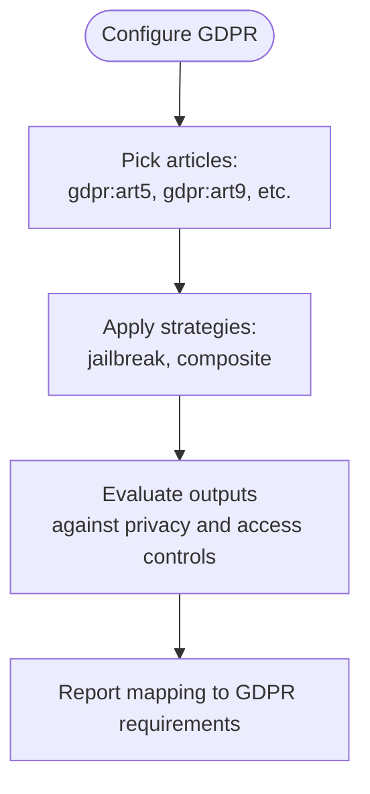

**Diagram sources**
- [gdpr.md:30-86](file://site/docs/red-team/gdpr.md#L30-L86)
- [gdpr.md:341-354](file://site/docs/red-team/gdpr.md#L341-L354)

**Section sources**
- [gdpr.md:12-86](file://site/docs/red-team/gdpr.md#L12-L86)
- [gdpr.md:341-428](file://site/docs/red-team/gdpr.md#L341-L428)

### ISO 42001 Compliance Testing
- Risk domains: Accountability & Human Oversight, Fairness & Bias Prevention, Privacy & Data Protection, Robustness & Resilience, Security & Vulnerability Management, Safety & Ethical Use, Transparency & Trustworthiness
- Testing approaches:
  - Domain-specific plugins and comprehensive iso:42001 plugin
  - Strategies for robustness and security testing
- Custom risk assessment:
  - Custom plugins aligned with ISO 42001 principles

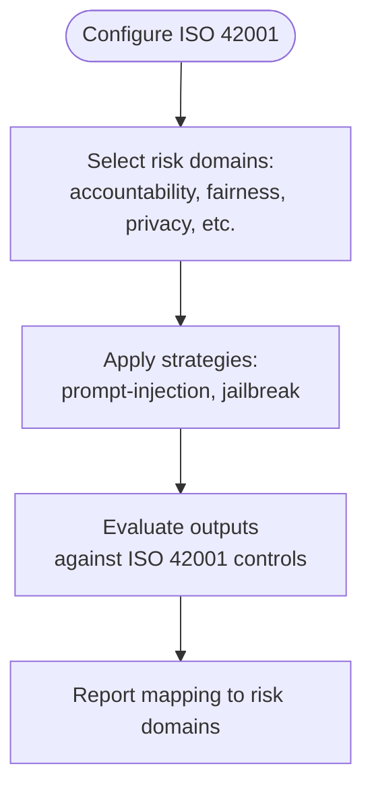

**Diagram sources**
- [iso-42001.md:28-68](file://site/docs/red-team/iso-42001.md#L28-L68)
- [iso-42001.md:265-281](file://site/docs/red-team/iso-42001.md#L265-L281)

**Section sources**
- [iso-42001.md:10-68](file://site/docs/red-team/iso-42001.md#L10-L68)
- [iso-42001.md:265-318](file://site/docs/red-team/iso-42001.md#L265-L318)

### NIST AI RMF Compliance Testing
- Framework structure: Govern, Map, Measure, Manage
- Focus: MEASURE 1.1–1.2, 2.1–2.13, 3.1–3.3, 4.1–4.3
- Testing approaches:
  - Use nist:ai:measure or specific measure plugins
  - Combine with strategies for safety, security, privacy, fairness, and misuse
- Best practices:
  - Document testing, regular evaluation, representative contexts, risk tracking, stakeholder feedback

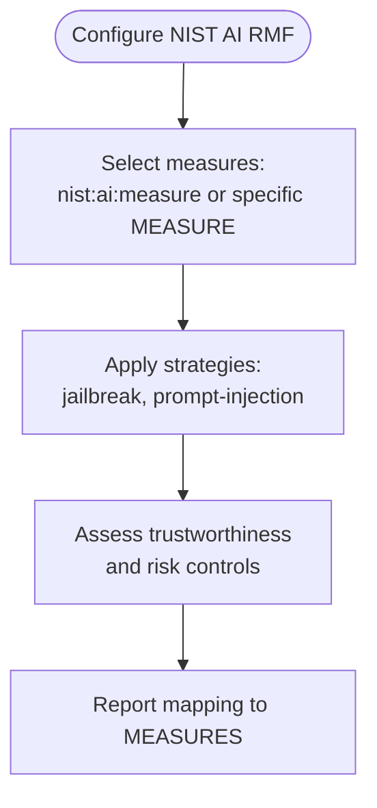

**Diagram sources**
- [nist-ai-rmf.md:54-73](file://site/docs/red-team/nist-ai-rmf.md#L54-L73)
- [nist-ai-rmf.md:361-374](file://site/docs/red-team/nist-ai-rmf.md#L361-L374)

**Section sources**
- [nist-ai-rmf.md:12-73](file://site/docs/red-team/nist-ai-rmf.md#L12-L73)
- [nist-ai-rmf.md:361-430](file://site/docs/red-team/nist-ai-rmf.md#L361-L430)

### OWASP LLM Top 10 Compliance Testing
- Top 10: Prompt Injection, Sensitive Information Disclosure, Supply Chain Vulnerabilities, Data and Model Poisoning, Improper Output Handling, Excessive Agency, System Prompt Leakage, Vector and Embedding Weaknesses, Misinformation, Unbounded Consumption
- Testing approaches:
  - Use owasp:llm or specific items (e.g., owasp:llm:01, owasp:llm:02)
  - Strategies: prompt-injection, jailbreak
  - Supply chain testing via model comparison and vendor acceptance testing
- Red team phases:
  - Model Evaluation, Implementation Evaluation, System Evaluation, Runtime/Human & Agentic Evaluation

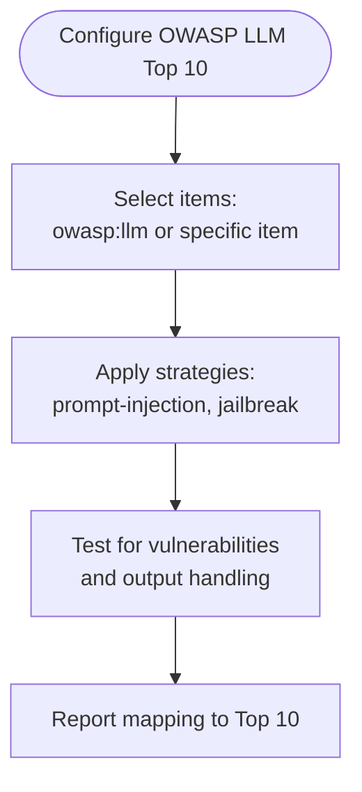

**Diagram sources**
- [owasp-llm-top-10.md:35-66](file://site/docs/red-team/owasp-llm-top-10.md#L35-L66)
- [owasp-llm-top-10.md:426-484](file://site/docs/red-team/owasp-llm-top-10.md#L426-L484)

**Section sources**
- [owasp-llm-top-10.md:12-66](file://site/docs/red-team/owasp-llm-top-10.md#L12-L66)
- [owasp-llm-top-10.md:426-502](file://site/docs/red-team/owasp-llm-top-10.md#L426-L502)

### Compliance Testing Methodologies and Evidence Collection
- Configuration-driven testing:
  - Targets, plugins, strategies, purpose, contexts, language, severity, framework filtering
- Evidence and reporting:
  - Exportable results, regression tests, audit trails
  - Framework filtering surfaces relevant compliance domains
- Continuous monitoring:
  - Real-time threat monitoring dashboards and compliance sections

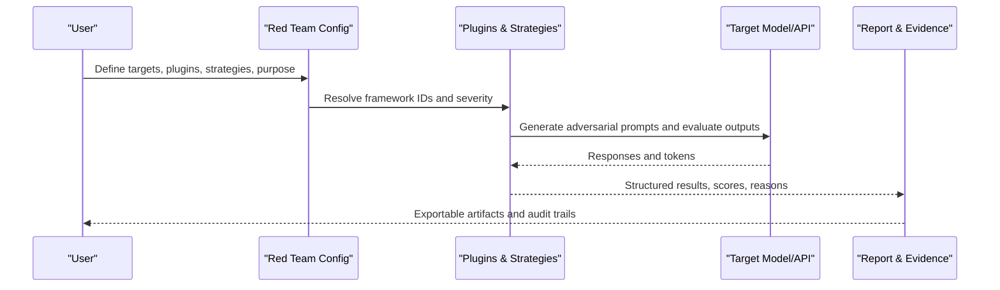

**Diagram sources**
- [configuration.md:32-94](file://site/docs/red-team/configuration.md#L32-L94)
- [red-teaming.tsx:308-343](file://site/src/pages/red-teaming.tsx#L308-L343)

**Section sources**
- [configuration.md:32-94](file://site/docs/red-team/configuration.md#L32-L94)
- [red-teaming.tsx:308-343](file://site/src/pages/red-teaming.tsx#L308-L343)

### Cross-Border Data Transfer Restrictions and Transparency Requirements
- Regulatory enforcement begins: Significant penalties and cross-border enforcement actions
- Transparency obligations:
  - Inform users when interacting with AI
  - Mark AI-generated content
  - Detect deepfakes
- Data transfers:
  - Enforcement actions highlight cross-border data transfer risks and consent mechanisms

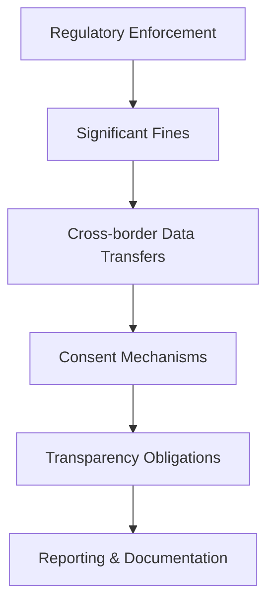

**Diagram sources**
- [ai-safety-vs-security.md:338-344](file://site/blog/ai-safety-vs-security.md#L338-L344)
- [eu-ai-act.md:499-516](file://site/docs/red-team/eu-ai-act.md#L499-L516)

**Section sources**
- [ai-safety-vs-security.md:338-344](file://site/blog/ai-safety-vs-security.md#L338-L344)
- [eu-ai-act.md:499-525](file://site/docs/red-team/eu-ai-act.md#L499-L525)

### Integration with Existing Compliance Management Systems and Audit Processes
- Framework filtering:
  - Use redteam.frameworks to limit report scope to relevant frameworks
- Audit-ready reporting:
  - Exportable results and regression tests
- Practical implications:
  - Documentation is structural
  - Testing covers deployed systems and action paths

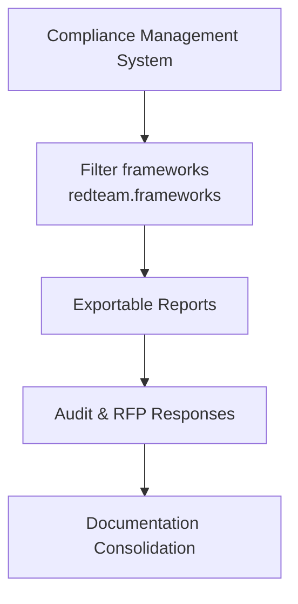

**Diagram sources**
- [configuration.md:70-94](file://site/docs/red-team/configuration.md#L70-L94)
- [ai-regulation-2025.md:244-253](file://site/blog/ai-regulation-2025.md#L244-L253)

**Section sources**
- [configuration.md:70-94](file://site/docs/red-team/configuration.md#L70-L94)
- [ai-regulation-2025.md:244-253](file://site/blog/ai-regulation-2025.md#L244-L253)

### Automated Compliance Testing and Continuous Monitoring
- Automated testing:
  - Preset configurations for frameworks and standards
  - Multi-language and multi-context testing
  - Severity-based prioritization
- Continuous monitoring:
  - Real-time threat monitoring dashboards
  - Built-in framework compliance mapping for audit-ready reporting

**Section sources**
- [red-teaming.tsx:308-343](file://site/src/pages/red-teaming.tsx#L308-L343)
- [configuration.md:536-560](file://site/docs/red-team/configuration.md#L536-L560)

## Dependency Analysis
PromptFoo’s compliance documentation and configuration rely on:
- Framework guides that define plugin IDs and testing approaches
- Configuration schema that enumerates supported framework IDs
- Example applications that demonstrate plugin usage against real vulnerabilities
- Domain plugins that enforce industry-specific compliance (e.g., PHI disclosure, law enforcement request handling)

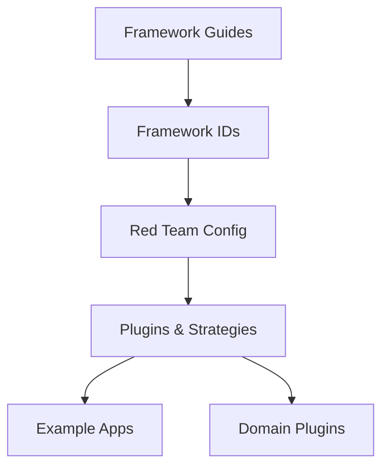

**Diagram sources**
- [config-schema.json:1933-2242](file://site/static/config-schema.json#L1933-L2242)
- [configuration.md:70-94](file://site/docs/red-team/configuration.md#L70-L94)
- [README.md:136-153](file://examples/redteam-api-top-10/README.md#L136-L153)
- [phiDisclosure.ts:22-39](file://src/redteam/plugins/insurance/phiDisclosure.ts#L22-L39)
- [lawEnforcementRequestHandling.ts:31-57](file://src/redteam/plugins/telecom/lawEnforcementRequestHandling.ts#L31-L57)

**Section sources**
- [config-schema.json:1933-2242](file://site/static/config-schema.json#L1933-L2242)
- [configuration.md:70-94](file://site/docs/red-team/configuration.md#L70-L94)
- [README.md:136-153](file://examples/redteam-api-top-10/README.md#L136-L153)
- [phiDisclosure.ts:22-39](file://src/redteam/plugins/insurance/phiDisclosure.ts#L22-L39)
- [lawEnforcementRequestHandling.ts:31-57](file://src/redteam/plugins/telecom/lawEnforcementRequestHandling.ts#L31-L57)

## Performance Considerations
- Multi-language and multi-context testing increases coverage but may increase runtime; tune numTests and language arrays accordingly
- Severity levels help prioritize remediation efforts
- Use framework filtering to reduce report scope and improve turnaround for audits

## Troubleshooting Guide
Common issues and resolutions:
- Attack provider configuration:
  - Ensure appropriate provider for attack generation; default uses OpenAI, with options for Azure, Bedrock, HuggingFace, Ollama, or custom HTTP endpoints
- Remote vs local generation:
  - Disable remote generation via environment variable if needed; quality depends on chosen model
- Example app setup:
  - Follow prerequisites and quick start steps for redteam-api-top-10
- Domain plugin specifics:
  - PHI disclosure and law enforcement request handling plugins define precise pass/fail criteria; ensure outputs meet requirements

**Section sources**
- [configuration.md:730-800](file://site/docs/red-team/configuration.md#L730-L800)
- [README.md:34-40](file://examples/redteam-api-top-10/README.md#L34-L40)
- [phiDisclosure.ts:22-39](file://src/redteam/plugins/insurance/phiDisclosure.ts#L22-L39)
- [lawEnforcementRequestHandling.ts:31-57](file://src/redteam/plugins/telecom/lawEnforcementRequestHandling.ts#L31-L57)

## Conclusion
PromptFoo’s red teaming capabilities provide a structured, automated approach to compliance testing across EU AI Act, GDPR, ISO 42001, NIST AI RMF, and OWASP LLM Top 10. By leveraging framework presets, multi-language and multi-context testing, severity-based prioritization, and exportable reporting, organizations can build robust compliance programs, maintain continuous monitoring, and meet audit and regulatory expectations.

## Appendices
- Compliance assessment example:
  - EU AI Act: Use eu:ai-act plugin with jailbreak and prompt-injection strategies
  - GDPR: Use gdpr plugin with comprehensive articles
  - ISO 42001: Use iso:42001 plugin covering all risk domains
  - NIST AI RMF: Use nist:ai:measure plugin or specific MEASURE plugins
  - OWASP LLM Top 10: Use owasp:llm plugin or specific items
- Gap analysis and remediation tracking:
  - Use severity levels and risk tracking features to prioritize remediation
  - Maintain audit trails and exportable results for compliance reporting

**Section sources**
- [eu-ai-act.md:473-554](file://site/docs/red-team/eu-ai-act.md#L473-L554)
- [gdpr.md:341-428](file://site/docs/red-team/gdpr.md#L341-L428)
- [iso-42001.md:265-318](file://site/docs/red-team/iso-42001.md#L265-L318)
- [nist-ai-rmf.md:361-430](file://site/docs/red-team/nist-ai-rmf.md#L361-L430)
- [owasp-llm-top-10.md:426-502](file://site/docs/red-team/owasp-llm-top-10.md#L426-L502)