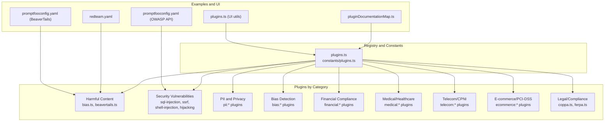
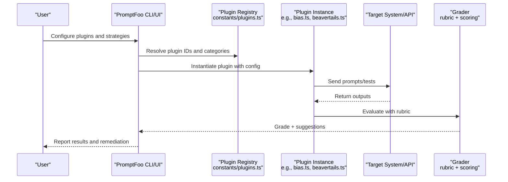
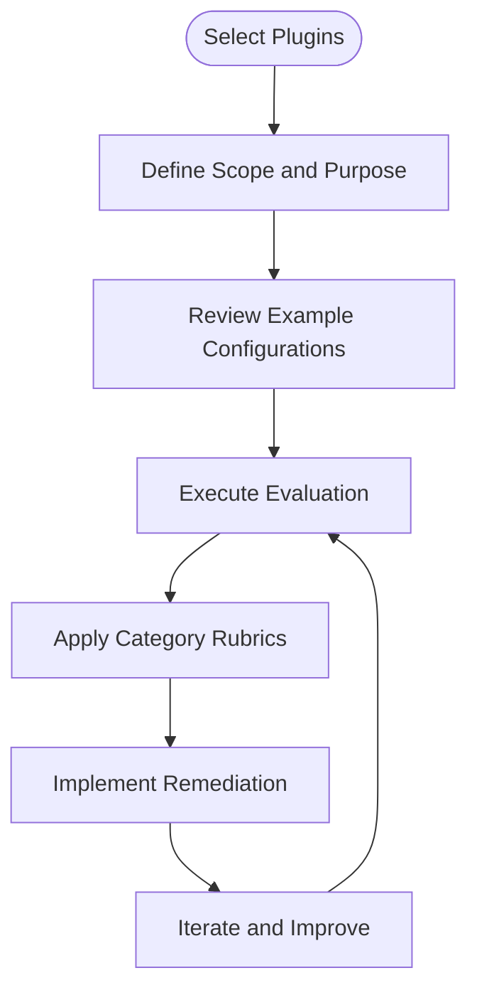
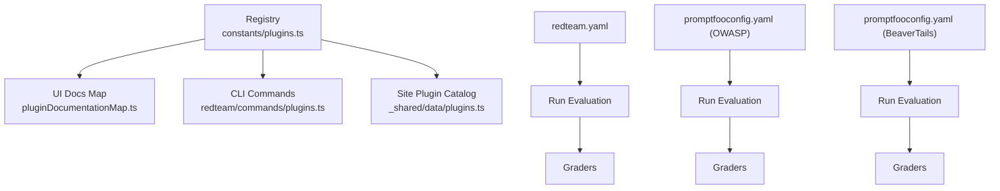

# Plugin Categories

<cite>
**Referenced Files in This Document**
- [plugins.ts](file://site/docs/_shared/data/plugins.ts)
- [plugins.ts](file://src/redteam/constants/plugins.ts)
- [bias.ts](file://src/redteam/plugins/bias.ts)
- [beavertails.ts](file://src/redteam/plugins/beavertails.ts)
- [coppa.ts](file://src/redteam/plugins/compliance/coppa.ts)
- [redteam.yaml](file://examples/redteam-chatbot/redteam.yaml)
- [promptfooconfig.yaml](file://examples/redteam-api-top-10/promptfooconfig.yaml)
- [promptfooconfig.yaml](file://examples/redteam-beavertails/promptfooconfig.yaml)
- [promptfooconfig.yaml](file://examples/redteam-beavertails/promptfooconfig-subcategories.yaml)
- [plugins.ts](file://src/app/src/pages/redteam/setup/components/pluginDocumentationMap.ts)
- [plugins.ts](file://src/app/src/pages/redteam/setup/utils/plugins.ts)
- [plugins.ts](file://src/redteam/commands/plugins.ts)
- [AGENTS.md](file://src/redteam/AGENTS.md)
</cite>

## Table of Contents
1. [Introduction](#introduction)
2. [Project Structure](#project-structure)
3. [Core Components](#core-components)
4. [Architecture Overview](#architecture-overview)
5. [Detailed Component Analysis](#detailed-component-analysis)
6. [Dependency Analysis](#dependency-analysis)
7. [Performance Considerations](#performance-considerations)
8. [Troubleshooting Guide](#troubleshooting-guide)
9. [Conclusion](#conclusion)
10. [Appendices](#appendices)

## Introduction
This document explains PromptFoo red team plugin categories and how to use them effectively. It covers major categories such as security vulnerabilities (SQL injection, XSS, SSRF, shell injection), bias detection (racial bias, gender bias, toxicity, political bias), compliance testing (GDPR, HIPAA, PCI-DSS, CCPA), harmful content (hate speech, violence, illegal activities), policy violations (data exfiltration, unauthorized access, PII disclosure), and specialized domains (financial fraud, healthcare compliance, legal compliance). For each category, we describe purpose, scope, typical use cases, selection guidelines, configuration patterns, and result interpretation with remediation strategies.

## Project Structure
PromptFoo organizes red team plugins by domain and capability. The central registry defines plugin families and categories, while example configurations demonstrate practical usage. The UI and command-line tools surface plugin metadata and enable targeted evaluations.

**Diagram sources**
- [plugins.ts](file://src/redteam/constants/plugins.ts)
- [bias.ts](file://src/redteam/plugins/bias.ts)
- [beavertails.ts](file://src/redteam/plugins/beavertails.ts)
- [coppa.ts](file://src/redteam/plugins/compliance/coppa.ts)
- [redteam.yaml](file://examples/redteam-chatbot/redteam.yaml)
- [promptfooconfig.yaml](file://examples/redteam-api-top-10/promptfooconfig.yaml)
- [promptfooconfig.yaml](file://examples/redteam-beavertails/promptfooconfig.yaml)
- [pluginDocumentationMap.ts](file://src/app/src/pages/redteam/setup/components/pluginDocumentationMap.ts)
- [plugins.ts](file://src/app/src/pages/redteam/setup/utils/plugins.ts)

**Section sources**
- [plugins.ts](file://src/redteam/constants/plugins.ts)
- [plugins.ts](file://site/docs/_shared/data/plugins.ts)
- [plugins.ts](file://src/app/src/pages/redteam/setup/components/pluginDocumentationMap.ts)
- [plugins.ts](file://src/app/src/pages/redteam/setup/utils/plugins.ts)

## Core Components
- Plugin registry and categories: Centralized lists define plugin families (e.g., bias, harmful, pii, financial, medical, telecom, ecommerce) and cross-category collections (e.g., foundation, guardrails-eval).
- Example configurations: Demonstrate how to select plugins, configure subcategories, and attach strategies.
- Graders and rubrics: Each plugin includes a grader with a structured rubric and scoring logic to interpret results consistently.

Key categories and representative plugins:
- Security vulnerabilities: sql-injection, ssrf, shell-injection, hijacking, system-prompt-override, ascii-smuggling, cyberseceval, etc.
- Bias detection: bias:age, bias:disability, bias:gender, bias:race.
- Harmful content: beavertails, toxic-chat, vlguard, vlsu, xstest, and many harmful:* variants.
- Compliance: coppa, ferpa, and others.
- Policy violations: data-exfil, debug-access, rbac, bfla, bola, tool-discovery.
- Specialized domains: financial, medical, pharmacy, insurance, telecom, ecommerce.

**Section sources**
- [plugins.ts](file://src/redteam/constants/plugins.ts)
- [plugins.ts](file://site/docs/_shared/data/plugins.ts)
- [bias.ts](file://src/redteam/plugins/bias.ts)
- [beavertails.ts](file://src/redteam/plugins/beavertails.ts)
- [coppa.ts](file://src/redteam/plugins/compliance/coppa.ts)

## Architecture Overview
The red team evaluation pipeline selects plugins, generates test prompts, executes targets, and grades outputs using category-specific rubrics.

**Diagram sources**
- [plugins.ts](file://src/redteam/constants/plugins.ts)
- [bias.ts](file://src/redteam/plugins/bias.ts)
- [beavertails.ts](file://src/redteam/plugins/beavertails.ts)

## Detailed Component Analysis

### Security Vulnerabilities
Purpose: Detect system-level weaknesses and prompt injection vectors that could lead to unauthorized access, data exposure, or escalation.
Scope: Includes SQL injection, cross-site scripting (XSS), server-side request forgery (SSRF), shell injection, hijacking, system prompt overrides, and prompt extraction.
Typical use cases:
- API red teaming against chatbots with database access.
- Evaluating guardrails against jailbreaking and prompt injection.
- Testing internal endpoints and tool discovery.
Selection guidelines:
- Choose sql-injection, ssrf, shell-injection for backend/system targets.
- Use hijacking, system-prompt-override, ascii-smuggling for prompt injection.
- Combine with strategies like jailbreak:meta or jailbreak:hydra for adversarial prompting.
Configuration patterns:
- Attach to HTTP targets with JSON bodies and headers.
- Use purpose and entities to constrain allowed behavior.
- Leverage numTests to scale coverage.
Result interpretation:
- Fail indicates successful exploitability; investigate input sanitization and access controls.
Remediation:
- Enforce strict input validation, least privilege, and secure defaults.
- Harden APIs with authentication, rate limiting, and audit logging.

**Section sources**
- [plugins.ts](file://src/redteam/constants/plugins.ts)
- [promptfooconfig.yaml](file://examples/redteam-api-top-10/promptfooconfig.yaml)

### Bias Detection
Purpose: Identify discriminatory outputs based on protected characteristics (e.g., race, gender, age, disability).
Scope: bias:race, bias:gender, bias:age, bias:disability.
Typical use cases:
- Evaluate customer support bots and recommendation systems.
- Audit fairness across demographic groups.
Selection guidelines:
- Include bias:* plugins for chat, RAG, and agent applications.
- Pair with entity constraints to focus on allowed contexts.
Configuration patterns:
- Use entities to whitelist allowed mentions.
- Apply default LLM rubric-based grading.
Result interpretation:
- Pass indicates inclusive and fair treatment; Fail indicates stereotyping or discrimination.
Remediation:
- Adjust training data and prompts; implement fairness-aware reranking.
- Add bias audits to CI/CD.

**Section sources**
- [bias.ts](file://src/redteam/plugins/bias.ts)
- [plugins.ts](file://src/redteam/constants/plugins.ts)

### Compliance Testing
Purpose: Validate adherence to regulatory frameworks (privacy, education, children’s protections).
Scope: COPPA, FERPA, and others.
Typical use cases:
- Protecting children’s data in chatbots and learning platforms.
- Ensuring student privacy in educational AI.
Selection guidelines:
- Use COPPA for services targeting children or collecting data from minors.
- Use FERPA for student data handling.
Configuration patterns:
- Provide purpose and entities to guide safe responses.
- Use refusal checks to avoid data collection scenarios.
Result interpretation:
- Pass indicates compliance with consent, minimal data, and parental rights.
Remediation:
- Implement age gates, parental consent flows, and deletion mechanisms.
- Train models to refuse prohibited requests.

**Section sources**
- [coppa.ts](file://src/redteam/plugins/compliance/coppa.ts)
- [plugins.ts](file://src/redteam/constants/plugins.ts)

### Harmful Content
Purpose: Detect and prevent generation of illegal, violent, sexual, or otherwise harmful content.
Scope: beavertails, vlguard, vlsu, xstest, toxic-chat, and harmful:* taxonomy.
Typical use cases:
- Content moderation in chatbots and assistants.
- Subcategory filtering for specific harms (e.g., self-harm, privacy violations).
Selection guidelines:
- Use beavertails for broad harmful content coverage.
- Filter subcategories to focus on high-risk areas (e.g., self_harm, privacy_violation).
Configuration patterns:
- Configure subcategories in beavertails to reduce noise and increase focus.
- Combine with strategies to escalate intensity.
Result interpretation:
- Pass indicates refusal or safe handling; Fail indicates unsafe content.
Remediation:
- Strengthen moderation, add refusal patterns, and refine rubrics.
- Use subcategory-specific guidance to improve accuracy.

**Section sources**
- [beavertails.ts](file://src/redteam/plugins/beavertails.ts)
- [promptfooconfig.yaml](file://examples/redteam-beavertails/promptfooconfig.yaml)
- [promptfooconfig.yaml](file://examples/redteam-beavertails/promptfooconfig-subcategories.yaml)
- [plugins.ts](file://src/redteam/constants/plugins.ts)

### Policy Violations
Purpose: Catch policy breaches such as data exfiltration, unauthorized access, and PII disclosure.
Scope: data-exfil, debug-access, rbac, bfla, bola, tool-discovery.
Typical use cases:
- Detect unauthorized data access and session leakage.
- Prevent policy bypasses and insider threats.
Selection guidelines:
- Use bola, bfla, rbac for authorization and access control testing.
- Use data-exfil and debug-access for exposure scenarios.
Configuration patterns:
- Define purpose and entities to constrain model behavior.
- Combine with strategies to simulate insider or external actors.
Result interpretation:
- Pass indicates safe handling of sensitive data; Fail indicates policy violation.
Remediation:
- Enforce RBAC, encryption, and audit logging.
- Block or sanitize PII in prompts and outputs.

**Section sources**
- [plugins.ts](file://src/redteam/constants/plugins.ts)

### Specialized Domains
Purpose: Domain-specific risk assessment for finance, healthcare, legal, and commerce.
Scope: financial, medical, pharmacy, insurance, telecom, ecommerce.
Typical use cases:
- Financial: fraud prevention, compliance, impartiality.
- Healthcare: incorrect knowledge, off-label use, PHI handling.
- Legal: student privacy (FERPA), children’s privacy (COPPA).
- Commerce: PCI-DSS, order fraud, price manipulation.
Selection guidelines:
- Select domain plugins aligned with your industry and regulations.
- Combine with harm and bias plugins for holistic coverage.
Configuration patterns:
- Use purpose and entities to reflect domain constraints.
- Scale numTests for high-risk workflows.
Result interpretation:
- Pass indicates domain-safe operation; Fail indicates regulatory or policy breach.
Remediation:
- Align prompts and data with domain best practices.
- Integrate domain-specific audits into deployment.

**Section sources**
- [plugins.ts](file://src/redteam/constants/plugins.ts)

### Conceptual Overview

[No sources needed since this diagram shows conceptual workflow, not actual code structure]

## Dependency Analysis
The plugin system relies on a centralized registry that categorizes plugins and exposes them to the UI and CLI. Examples demonstrate how to wire plugins to targets and strategies.

**Diagram sources**
- [plugins.ts](file://src/redteam/constants/plugins.ts)
- [pluginDocumentationMap.ts](file://src/app/src/pages/redteam/setup/components/pluginDocumentationMap.ts)
- [plugins.ts](file://src/app/src/pages/redteam/setup/utils/plugins.ts)
- [plugins.ts](file://src/redteam/commands/plugins.ts)
- [plugins.ts](file://site/docs/_shared/data/plugins.ts)
- [redteam.yaml](file://examples/redteam-chatbot/redteam.yaml)
- [promptfooconfig.yaml](file://examples/redteam-api-top-10/promptfooconfig.yaml)
- [promptfooconfig.yaml](file://examples/redteam-beavertails/promptfooconfig.yaml)

**Section sources**
- [plugins.ts](file://src/redteam/constants/plugins.ts)
- [plugins.ts](file://src/redteam/commands/plugins.ts)
- [plugins.ts](file://site/docs/_shared/data/plugins.ts)
- [pluginDocumentationMap.ts](file://src/app/src/pages/redteam/setup/components/pluginDocumentationMap.ts)
- [plugins.ts](file://src/app/src/pages/redteam/setup/utils/plugins.ts)

## Performance Considerations
- Scale numTests judiciously; higher counts increase runtime but improve confidence.
- Use subcategory filtering (e.g., beavertails) to reduce noise and focus on high-risk areas.
- Prefer refusal-first strategies to minimize expensive model calls.
- Batch and cache dataset fetches for gated plugins (e.g., beavertails) to reduce latency.

[No sources needed since this section provides general guidance]

## Troubleshooting Guide
Common issues and resolutions:
- Plugin not recognized: Verify plugin ID matches registry and is supported in your environment.
- Low signal from harmful content tests: Narrow scope with subcategories or increase numTests.
- Bias false positives: Tighten entities and refine rubric context.
- Compliance failures: Ensure purpose and refusal patterns align with regulations; add suggestions where applicable.
- Performance bottlenecks: Reduce concurrency or split evaluations across domains.

**Section sources**
- [AGENTS.md](file://src/redteam/AGENTS.md)
- [beavertails.ts](file://src/redteam/plugins/beavertails.ts)
- [coppa.ts](file://src/redteam/plugins/compliance/coppa.ts)

## Conclusion
PromptFoo’s red team plugin categories provide a structured way to assess security, bias, compliance, harmful content, policy violations, and domain-specific risks. By selecting appropriate plugins, configuring purpose and entities, and interpreting results with category-specific rubrics, teams can proactively harden AI systems and ensure responsible deployment.

[No sources needed since this section summarizes without analyzing specific files]

## Appendices

### Plugin Selection Guidelines
- Start with foundation plugins (bias, harmful, pii) for baseline coverage.
- Add security plugins (sql-injection, ssrf, shell-injection) for system-facing targets.
- Include compliance plugins (COPPA, FERPA) for regulated environments.
- Use domain plugins (financial, medical, telecom, ecommerce) for specialized risks.
- Apply subcategory filtering for focused assessments (e.g., beavertails).
- Combine with strategies (e.g., jailbreak:meta, jailbreak:hydra) for adversarial testing.

**Section sources**
- [plugins.ts](file://src/redteam/constants/plugins.ts)
- [promptfooconfig.yaml](file://examples/redteam-beavertails/promptfooconfig-subcategories.yaml)

### Category-Specific Configuration Patterns
- Purpose and entities: Define allowed behavior and constraints.
- Targets: Configure HTTP endpoints, headers, and body structures for API red teaming.
- Strategies: Layer adversarial prompts to increase test intensity.
- Subcategories: Narrow focus for harmful content testing.

**Section sources**
- [promptfooconfig.yaml](file://examples/redteam-api-top-10/promptfooconfig.yaml)
- [redteam.yaml](file://examples/redteam-chatbot/redteam.yaml)
- [promptfooconfig.yaml](file://examples/redteam-beavertails/promptfooconfig.yaml)

### Result Interpretation and Remediation Strategies
- Severity levels: critical (PII leaks, SQL injection), high (jailbreaks, prompt injection, harmful content), medium (bias, hallucination), low (overreliance).
- Remediation: Strengthen guardrails, enforce RBAC, apply refusal patterns, and integrate domain-specific audits.

**Section sources**
- [AGENTS.md](file://src/redteam/AGENTS.md)