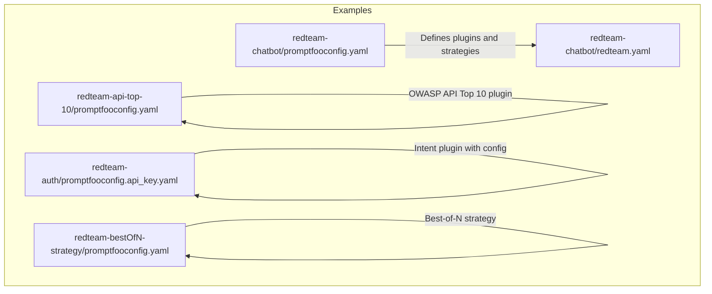
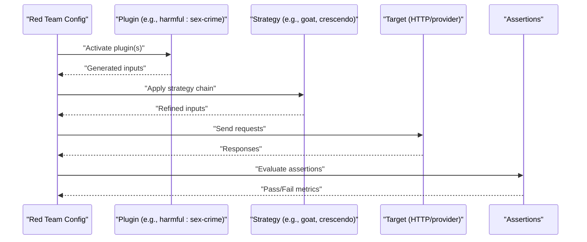
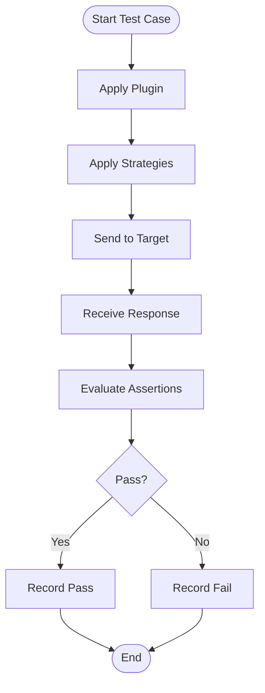
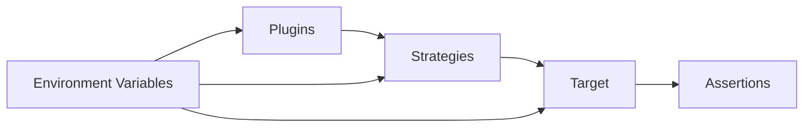
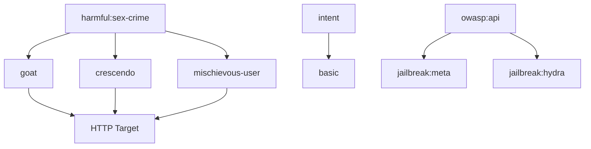

# Plugin Configuration & Usage

<cite>
**Referenced Files in This Document**
- [promptfooconfig.yaml](file://examples/redteam-chatbot/promptfooconfig.yaml)
- [redteam.yaml](file://examples/redteam-chatbot/redteam.yaml)
- [promptfooconfig.yaml](file://examples/redteam-api-top-10/promptfooconfig.yaml)
- [promptfooconfig.yaml](file://examples/redteam-auth/promptfooconfig.api_key.yaml)
- [promptfooconfig.yaml](file://examples/redteam-bestOfN-strategy/promptfooconfig.yaml)
- [sharedFrontend.test.ts](file://test/redteam/sharedFrontend.test.ts)
</cite>

## Table of Contents
1. [Introduction](#introduction)
2. [Project Structure](#project-structure)
3. [Core Components](#core-components)
4. [Architecture Overview](#architecture-overview)
5. [Detailed Component Analysis](#detailed-component-analysis)
6. [Dependency Analysis](#dependency-analysis)
7. [Performance Considerations](#performance-considerations)
8. [Troubleshooting Guide](#troubleshooting-guide)
9. [Conclusion](#conclusion)
10. [Appendices](#appendices)

## Introduction
This document explains how to configure and use PromptFoo red team plugins effectively. It covers plugin activation patterns, parameter configuration, execution control, chaining mechanisms, conditional execution, and dependency management. It also details plugin-specific options, result filtering, execution order, priority settings, conflict resolution, performance tuning, timeouts, result interpretation, scoring, and reporting formats. Examples are drawn from real configuration files in the repository.

## Project Structure
The repository includes multiple red team configuration examples that demonstrate plugin usage patterns:
- A chatbot scenario with plugin activation and strategy chaining
- An API-focused scenario aligned with the OWASP Top 10
- An authentication-focused scenario with plugin-specific configuration
- A Best-of-N strategy example showing plugin scaling and strategy selection

**Diagram sources**
- [promptfooconfig.yaml:40-52](file://examples/redteam-chatbot/promptfooconfig.yaml#L40-L52)
- [redteam.yaml:71-84](file://examples/redteam-chatbot/redteam.yaml#L71-L84)
- [promptfooconfig.yaml:56-62](file://examples/redteam-api-top-10/promptfooconfig.yaml#L56-L62)
- [promptfooconfig.yaml:25-36](file://examples/redteam-auth/promptfooconfig.api_key.yaml#L25-L36)
- [promptfooconfig.yaml:14-30](file://examples/redteam-bestOfN-strategy/promptfooconfig.yaml#L14-L30)

**Section sources**
- [promptfooconfig.yaml:1-52](file://examples/redteam-chatbot/promptfooconfig.yaml#L1-L52)
- [redteam.yaml:1-213](file://examples/redteam-chatbot/redteam.yaml#L1-L213)
- [promptfooconfig.yaml:1-62](file://examples/redteam-api-top-10/promptfooconfig.yaml#L1-L62)
- [promptfooconfig.yaml:1-36](file://examples/redteam-auth/promptfooconfig.api_key.yaml#L1-L36)
- [promptfooconfig.yaml:1-30](file://examples/redteam-bestOfN-strategy/promptfooconfig.yaml#L1-L30)

## Core Components
- Plugin activation: Plugins are declared under the redteam section and can be specified either as simple IDs or as objects with id and optional config.
- Strategy chaining: Strategies modify or augment plugin-generated inputs. They can be applied individually or in combination.
- Execution control: Controls include numTests (per plugin), purpose (context), and target configuration (HTTP, providers).
- Conditional execution: Strategies can be configured with stateful behavior and inject variables for iterative refinement.
- Dependency management: Plugins and strategies depend on the target provider and environment variables.

Key configuration anchors:
- Plugins: Declared as a list under redteam.plugins
- Strategies: Declared as a list under redteam.strategies
- Purpose: Provided via redteam.purpose
- Targets: Defined under targets with HTTP or provider IDs

**Section sources**
- [promptfooconfig.yaml:23-52](file://examples/redteam-chatbot/promptfooconfig.yaml#L23-L52)
- [redteam.yaml:28-84](file://examples/redteam-chatbot/redteam.yaml#L28-L84)
- [promptfooconfig.yaml:29-62](file://examples/redteam-api-top-10/promptfooconfig.yaml#L29-L62)
- [promptfooconfig.yaml:25-36](file://examples/redteam-auth/promptfooconfig.api_key.yaml#L25-L36)
- [promptfooconfig.yaml:14-30](file://examples/redteam-bestOfN-strategy/promptfooconfig.yaml#L14-L30)

## Architecture Overview
The red team evaluation pipeline integrates plugins and strategies with targets and assertions. Plugins generate adversarial inputs; strategies refine or combine them; targets execute requests; assertions evaluate outcomes.

[No sources needed since this diagram shows conceptual workflow, not actual code structure]

## Detailed Component Analysis

### Plugin Activation Patterns
- Simple activation: A plugin is listed by ID.
- Parameterized activation: A plugin object includes id and config.
- Multiple plugins: Plugins can be combined; each contributes inputs scaled by numTests.

Examples:
- Single plugin activation with strategies
- Intent plugin with intent list configuration
- OWASP API plugin for API security scenarios

**Section sources**
- [promptfooconfig.yaml:40-52](file://examples/redteam-chatbot/promptfooconfig.yaml#L40-L52)
- [redteam.yaml:71-84](file://examples/redteam-chatbot/redteam.yaml#L71-L84)
- [promptfooconfig.yaml:27-36](file://examples/redteam-auth/promptfooconfig.api_key.yaml#L27-L36)
- [promptfooconfig.yaml:56-62](file://examples/redteam-api-top-10/promptfooconfig.yaml#L56-L62)

### Parameter Configuration
- Plugin-level config: Some plugins accept nested options (e.g., intent lists).
- Strategy-level config: Options like stateful and injectVar control behavior.
- Global controls: numTests scales test generation per plugin.

Observed patterns:
- Intent plugin with intent array
- Strategy stateful toggles conversation continuity
- Inject var allows iterative prompt injection

**Section sources**
- [promptfooconfig.yaml:30-31](file://examples/redteam-auth/promptfooconfig.api_key.yaml#L30-L31)
- [redteam.yaml:75-83](file://examples/redteam-chatbot/redteam.yaml#L75-L83)
- [redteam.yaml:163-190](file://examples/redteam-chatbot/redteam.yaml#L163-L190)

### Execution Control
- Purpose: Provides contextual guidance to plugins and strategies.
- Targets: Define endpoint, method, headers, body, and optional auth.
- Environment variables: Used for secrets and timeouts.

Practical controls:
- REQUEST_TIMEOUT_MS for long-running operations
- Session IDs to avoid cross-test interference

**Section sources**
- [promptfooconfig.yaml:4-10](file://examples/redteam-api-top-10/promptfooconfig.yaml#L4-L10)
- [promptfooconfig.yaml:15-27](file://examples/redteam-api-top-10/promptfooconfig.yaml#L15-L27)
- [promptfooconfig.yaml:16-21](file://examples/redteam-auth/promptfooconfig.api_key.yaml#L16-L21)

### Plugin Chaining Mechanisms
- Strategy application: Strategies can be chained; each modifies inputs before target execution.
- Provider overrides per strategy: Strategies can specify a provider id and config for specialized handling.

Evidence:
- Multiple strategies applied to the same plugin
- Strategy provider overrides with injectVar and stateful flags

**Section sources**
- [redteam.yaml:154-210](file://examples/redteam-chatbot/redteam.yaml#L154-L210)

### Conditional Execution Based on Results
- Assertions drive pass/fail outcomes per test case.
- Strategy-specific assertions (e.g., Harmful/Crescendo) indicate result interpretation.

**Diagram sources**
- [redteam.yaml:142-205](file://examples/redteam-chatbot/redteam.yaml#L142-L205)

**Section sources**
- [redteam.yaml:129-210](file://examples/redteam-chatbot/redteam.yaml#L129-L210)

### Dependency Management Between Plugins
- Plugins depend on the target provider and environment variables.
- Strategies depend on plugin outputs and inject variables.
- Assertions depend on strategy outputs and provider responses.

[No sources needed since this diagram shows conceptual relationships, not specific code structure]

### Plugin-Specific Configuration Options
- Intent plugin: Accepts an intent list to steer model behavior.
- OWASP API plugin: Designed for API security red teaming.
- Strategy-specific options: stateful, injectVar, provider overrides.

Evidence:
- Intent list under plugin config
- Strategy provider override with injectVar and stateful

**Section sources**
- [promptfooconfig.yaml:30-31](file://examples/redteam-auth/promptfooconfig.api_key.yaml#L30-L31)
- [promptfooconfig.yaml](file://examples/redteam-api-top-10/promptfooconfig.yaml#L57)
- [redteam.yaml:163-190](file://examples/redteam-chatbot/redteam.yaml#L163-L190)

### Parameter Tuning and Result Filtering
- numTests controls per-plugin test volume.
- Strategy-level stateful toggles influence conversation continuity.
- Assertions filter results by metric names and types.

**Section sources**
- [promptfooconfig.yaml:18-23](file://examples/redteam-bestOfN-strategy/promptfooconfig.yaml#L18-L23)
- [redteam.yaml:75-83](file://examples/redteam-chatbot/redteam.yaml#L75-L83)
- [redteam.yaml:142-205](file://examples/redteam-chatbot/redteam.yaml#L142-L205)

### Execution Order, Priority Settings, and Conflict Resolution
- Execution order: Plugins run first, followed by strategies, then target evaluation.
- Priority: Not explicitly defined; strategies can override provider behavior.
- Conflict resolution: Use distinct strategies and inject variables to avoid collisions; leverage stateful toggles to manage session continuity.

**Section sources**
- [redteam.yaml:71-84](file://examples/redteam-chatbot/redteam.yaml#L71-L84)
- [redteam.yaml:163-190](file://examples/redteam-chatbot/redteam.yaml#L163-L190)

### Advanced Usage Patterns
- Best-of-N strategy: Generates multiple variants and selects the most effective.
- Jailbreak strategies: Meta and Hydra strategies for API-focused scenarios.
- Multi-plugin combinations: Combine harmful, intent, and OWASP plugins.

**Section sources**
- [promptfooconfig.yaml:28-30](file://examples/redteam-bestOfN-strategy/promptfooconfig.yaml#L28-L30)
- [promptfooconfig.yaml:59-62](file://examples/redteam-api-top-10/promptfooconfig.yaml#L59-L62)
- [promptfooconfig.yaml:40-52](file://examples/redteam-chatbot/promptfooconfig.yaml#L40-L52)

## Dependency Analysis
The following diagram maps configuration dependencies among plugins, strategies, and targets.

**Diagram sources**
- [promptfooconfig.yaml:40-52](file://examples/redteam-chatbot/promptfooconfig.yaml#L40-L52)
- [redteam.yaml:71-84](file://examples/redteam-chatbot/redteam.yaml#L71-L84)
- [promptfooconfig.yaml:27-36](file://examples/redteam-auth/promptfooconfig.api_key.yaml#L27-L36)
- [promptfooconfig.yaml:56-62](file://examples/redteam-api-top-10/promptfooconfig.yaml#L56-L62)

**Section sources**
- [promptfooconfig.yaml:40-52](file://examples/redteam-chatbot/promptfooconfig.yaml#L40-L52)
- [redteam.yaml:71-84](file://examples/redteam-chatbot/redteam.yaml#L71-L84)
- [promptfooconfig.yaml:27-36](file://examples/redteam-auth/promptfooconfig.api_key.yaml#L27-L36)
- [promptfooconfig.yaml:56-62](file://examples/redteam-api-top-10/promptfooconfig.yaml#L56-L62)

## Performance Considerations
- Concurrency control: maxConcurrency can be configured to limit parallel evaluations.
- Timeout management: Use environment variables to increase request timeouts for slow operations.
- Scaling: Adjust numTests per plugin to balance coverage and runtime.
- Strategy overhead: stateful strategies may increase latency; disable when unnecessary.

Evidence:
- maxConcurrency configuration handling in tests
- REQUEST_TIMEOUT_MS environment variable usage

**Section sources**
- [sharedFrontend.test.ts:197-208](file://test/redteam/sharedFrontend.test.ts#L197-L208)
- [promptfooconfig.yaml:4-6](file://examples/redteam-api-top-10/promptfooconfig.yaml#L4-L6)

## Troubleshooting Guide
Common issues and resolutions:
- Empty plugin config: Ensure plugin config objects omit empty config blocks.
- Missing environment variables: Verify secrets and timeouts are set before running.
- Strategy provider mismatches: Confirm strategy provider ids align with installed providers.
- Assertion failures: Review assertion types and metrics to ensure they match strategy outputs.

**Section sources**
- [sharedFrontend.test.ts:221-230](file://test/redteam/sharedFrontend.test.ts#L221-L230)
- [redteam.yaml:142-205](file://examples/redteam-chatbot/redteam.yaml#L142-L205)

## Conclusion
PromptFoo’s red team configuration supports flexible plugin activation, parameterized configuration, and robust strategy chaining. By combining plugins with strategies, controlling concurrency and timeouts, and interpreting assertions, teams can systematically uncover vulnerabilities while maintaining reproducibility and performance.

## Appendices

### Appendix A: Configuration File References
- Chatbot red team configuration with plugin and strategy examples
- API red team configuration with OWASP plugin and jailbreak strategies
- Authentication red team configuration with intent plugin and API key auth
- Best-of-N strategy example for scaling plugin outputs

**Section sources**
- [promptfooconfig.yaml:1-52](file://examples/redteam-chatbot/promptfooconfig.yaml#L1-L52)
- [redteam.yaml:1-213](file://examples/redteam-chatbot/redteam.yaml#L1-L213)
- [promptfooconfig.yaml:1-62](file://examples/redteam-api-top-10/promptfooconfig.yaml#L1-L62)
- [promptfooconfig.yaml:1-36](file://examples/redteam-auth/promptfooconfig.api_key.yaml#L1-L36)
- [promptfooconfig.yaml:1-30](file://examples/redteam-bestOfN-strategy/promptfooconfig.yaml#L1-L30)