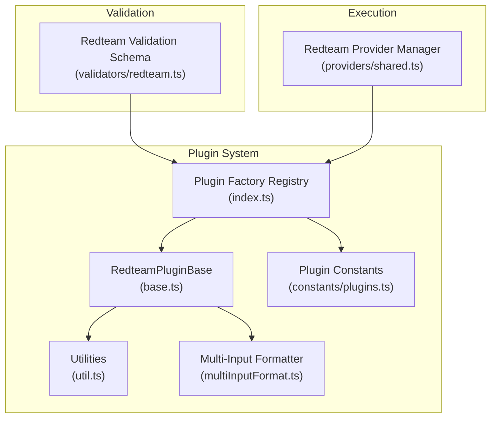
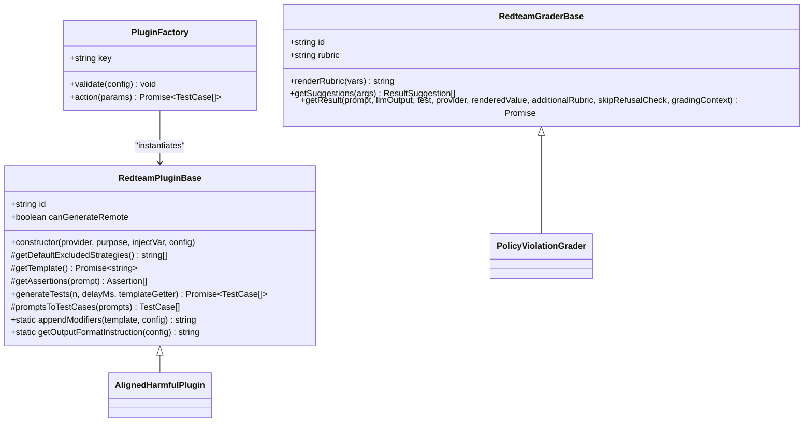
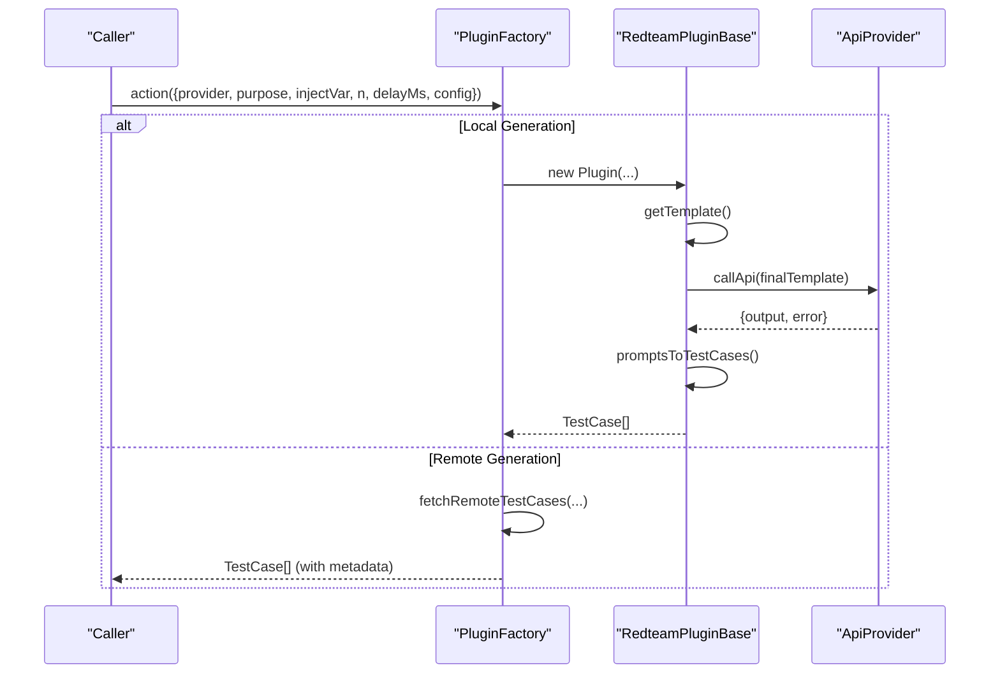
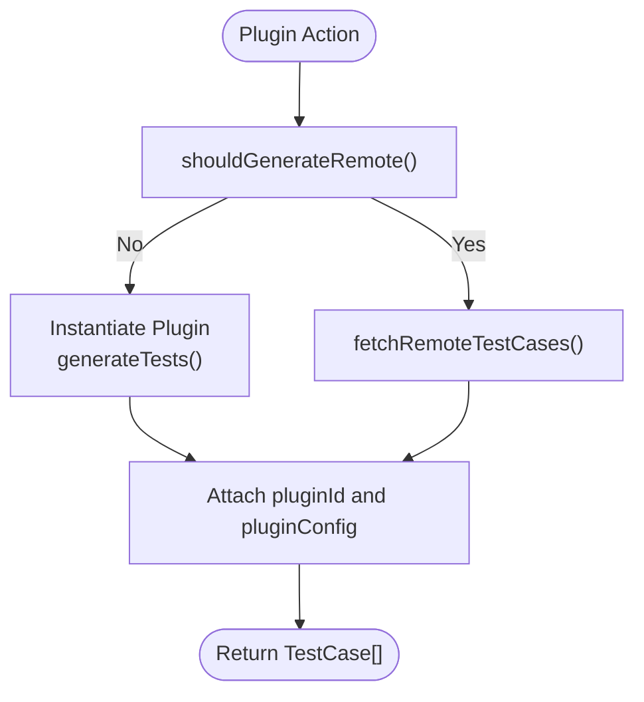
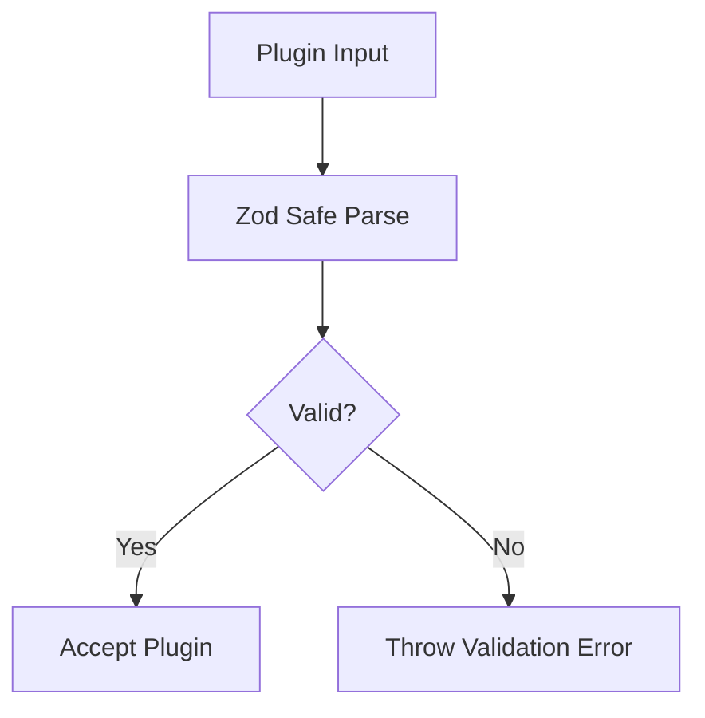
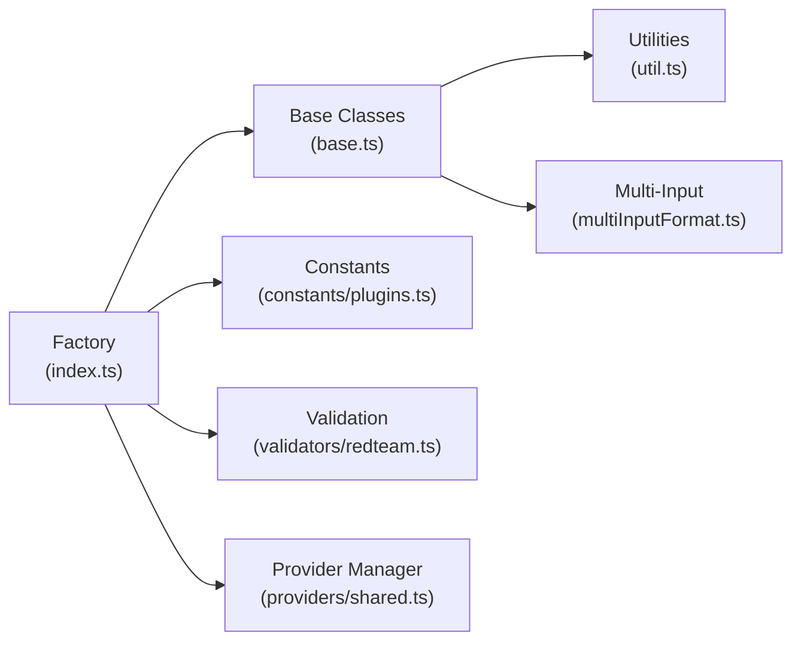

# Plugin Development Guide

<cite>
**Referenced Files in This Document**
- [base.ts](file://src/redteam/plugins/base.ts)
- [index.ts](file://src/redteam/plugins/index.ts)
- [plugins.ts](file://src/redteam/constants/plugins.ts)
- [util.ts](file://src/redteam/util.ts)
- [multiInputFormat.ts](file://src/redteam/plugins/multiInputFormat.ts)
- [shared.ts](file://src/redteam/providers/shared.ts)
- [redteam.ts](file://src/validators/redteam.ts)
- [policy/index.ts](file://src/redteam/plugins/policy/index.ts)
- [aligned.ts](file://src/redteam/plugins/harmful/aligned.ts)
- [index.test.ts](file://test/redteam/index.test.ts)
- [pluginId.test.ts](file://test/redteam/plugins/pluginId.test.ts)
- [policy.test.ts](file://test/redteam/plugins/policy.test.ts)
- [validators.test.ts](file://test/redteam/validators.test.ts)
</cite>

## Table of Contents
1. [Introduction](#introduction)
2. [Project Structure](#project-structure)
3. [Core Components](#core-components)
4. [Architecture Overview](#architecture-overview)
5. [Detailed Component Analysis](#detailed-component-analysis)
6. [Dependency Analysis](#dependency-analysis)
7. [Performance Considerations](#performance-considerations)
8. [Troubleshooting Guide](#troubleshooting-guide)
9. [Conclusion](#conclusion)
10. [Appendices](#appendices)

## Introduction
This guide provides comprehensive documentation for developing PromptFoo red team plugins. It covers the plugin interface specification, base class inheritance, required method implementations, lifecycle management, configuration schema, validation, error handling, testing methodologies, and best practices for performance and security. The content is derived from the repository’s red team plugin architecture and validation logic.

## Project Structure
PromptFoo’s red team plugin system centers around a base class that standardizes prompt generation, test case creation, and grading. Plugins are registered via a factory system that supports both local generation and remote generation. Constants define plugin categories and default behaviors, while utilities handle multi-input parsing and refusal detection.

**Diagram sources**
- [base.ts:33-296](file://src/redteam/plugins/base.ts#L33-L296)
- [index.ts:160-190](file://src/redteam/plugins/index.ts#L160-L190)
- [plugins.ts:1-556](file://src/redteam/constants/plugins.ts#L1-L556)
- [util.ts:1-411](file://src/redteam/util.ts#L1-L411)
- [multiInputFormat.ts:1-327](file://src/redteam/plugins/multiInputFormat.ts#L1-L327)
- [redteam.ts:82-121](file://src/validators/redteam.ts#L82-L121)
- [shared.ts:70-244](file://src/redteam/providers/shared.ts#L70-L244)

**Section sources**
- [base.ts:33-296](file://src/redteam/plugins/base.ts#L33-L296)
- [index.ts:160-190](file://src/redteam/plugins/index.ts#L160-L190)
- [plugins.ts:1-556](file://src/redteam/constants/plugins.ts#L1-L556)
- [util.ts:1-411](file://src/redteam/util.ts#L1-L411)
- [multiInputFormat.ts:1-327](file://src/redteam/plugins/multiInputFormat.ts#L1-L327)
- [redteam.ts:82-121](file://src/validators/redteam.ts#L82-L121)
- [shared.ts:70-244](file://src/redteam/providers/shared.ts#L70-L244)

## Core Components
- RedteamPluginBase: Abstract base class defining plugin identity, template generation, assertions, and test case conversion. It manages modifiers, multi-input mode, and refusal handling.
- RedteamGraderBase: Abstract base class for grading logic, including rubric rendering, refusal checks, and suggestion generation.
- Plugin Factory: Central registry that creates plugin instances, handles local vs remote generation, and attaches metadata.
- Plugin Constants: Defines plugin categories, collections, default configurations, and UI behavior flags.
- Utilities: Provide multi-input parsing, refusal detection, goal extraction, and session ID handling.
- Provider Manager: Manages provider instances for red team generation and grading, with caching and rate limiting support.

Key responsibilities:
- Lifecycle: Initialization, template rendering, prompt generation, test case creation, metadata attachment, and cleanup.
- Execution: Local generation via provider or remote generation via API, with health checks and error propagation.
- Validation: Zod schemas for plugin configuration and plugin object definitions.

**Section sources**
- [base.ts:33-296](file://src/redteam/plugins/base.ts#L33-L296)
- [index.ts:160-190](file://src/redteam/plugins/index.ts#L160-L190)
- [plugins.ts:1-556](file://src/redteam/constants/plugins.ts#L1-L556)
- [util.ts:1-411](file://src/redteam/util.ts#L1-L411)
- [shared.ts:70-244](file://src/redteam/providers/shared.ts#L70-L244)

## Architecture Overview
The plugin architecture separates concerns between generation and grading. Plugins inherit from RedteamPluginBase to produce test cases and assertions. RedteamGraderBase handles evaluation using rubrics and provider responses. The factory system orchestrates local vs remote generation and metadata enrichment.

**Diagram sources**
- [base.ts:33-296](file://src/redteam/plugins/base.ts#L33-L296)
- [aligned.ts:11-73](file://src/redteam/plugins/harmful/aligned.ts#L11-L73)
- [policy/index.ts:132-201](file://src/redteam/plugins/policy/index.ts#L132-L201)
- [index.ts:61-72](file://src/redteam/plugins/index.ts#L61-L72)

**Section sources**
- [base.ts:33-296](file://src/redteam/plugins/base.ts#L33-L296)
- [aligned.ts:11-73](file://src/redteam/plugins/harmful/aligned.ts#L11-L73)
- [policy/index.ts:132-201](file://src/redteam/plugins/policy/index.ts#L132-L201)
- [index.ts:61-72](file://src/redteam/plugins/index.ts#L61-L72)

## Detailed Component Analysis

### Plugin Base Class
The base class defines the contract for all red team plugins:
- Identity: Each plugin must expose a stable id.
- Template: Implement getTemplate to return a Jinja-style template string.
- Assertions: Implement getAssertions to return evaluation assertions for generated prompts.
- Generation: generateTests orchestrates batching, templating, provider calls, refusal handling, and test case conversion.
- Modifiers: appendModifiers injects structured modifiers into the template for strategies.
- Multi-input: getOutputFormatInstruction and formatter utilities support multi-input JSON generation.

**Diagram sources**
- [index.ts:160-190](file://src/redteam/plugins/index.ts#L160-L190)
- [base.ts:98-200](file://src/redteam/plugins/base.ts#L98-L200)

**Section sources**
- [base.ts:33-296](file://src/redteam/plugins/base.ts#L33-L296)
- [index.ts:160-190](file://src/redteam/plugins/index.ts#L160-L190)

### Plugin Factory and Remote Generation
The factory system:
- Wraps plugin constructors into PluginFactory with validate and action methods.
- Determines local vs remote generation based on plugin capability and environment flags.
- Attaches computed modifiers and plugin metadata to test cases.
- Supports specialized remote-only plugins and category-specific handlers.

**Diagram sources**
- [index.ts:160-190](file://src/redteam/plugins/index.ts#L160-L190)
- [index.ts:346-390](file://src/redteam/plugins/index.ts#L346-L390)

**Section sources**
- [index.ts:160-190](file://src/redteam/plugins/index.ts#L160-L190)
- [index.ts:346-390](file://src/redteam/plugins/index.ts#L346-L390)

### Plugin Constants and Collections
Constants define:
- Default test counts and provider defaults.
- Plugin collections (foundation, harmful, PII, bias, etc.) and their membership.
- UI-disabled flags for remote-unavailable environments.
- Remote-only plugin IDs and exemptions.

These constants drive plugin discovery, expansion, and UI behavior.

**Section sources**
- [plugins.ts:1-556](file://src/redteam/constants/plugins.ts#L1-L556)

### Utilities for Multi-Input and Refusal Handling
Utilities support:
- Multi-input parsing: extractPromptFromTags, extractAllPromptsFromTags, extractVariablesFromJson, extractInputVarsFromPrompt.
- Refusal detection: isBasicRefusal, isEmptyResponse.
- Goal extraction: extractGoalFromPrompt via remote API.
- Short plugin ID normalization: getShortPluginId.

**Section sources**
- [util.ts:1-411](file://src/redteam/util.ts#L1-L411)

### Provider Management
The provider manager:
- Loads and caches providers for red team and grading tasks.
- Supports JSON-only responses and small-model preferences.
- Wraps providers with rate limiting when configured.
- Provides fallbacks from defaultTest configuration.

**Section sources**
- [shared.ts:70-244](file://src/redteam/providers/shared.ts#L70-L244)

### Plugin Configuration Schema and Validation
Validation ensures:
- Plugin object shape with id, numTests, config, severity.
- Enumerated plugin ids or custom file:// ids.
- Positive numTests enforcement.
- Policy plugin config validation requiring policy text or resolved policy object.

**Diagram sources**
- [redteam.ts:82-121](file://src/validators/redteam.ts#L82-L121)
- [redteam.ts:373-498](file://src/validators/redteam.ts#L373-L498)

**Section sources**
- [redteam.ts:82-121](file://src/validators/redteam.ts#L82-L121)
- [redteam.ts:373-498](file://src/validators/redteam.ts#L373-L498)

### Example Plugin Implementations
- PolicyPlugin: Demonstrates required config validation, template construction, and assertion generation.
- AlignedHarmfulPlugin: Shows category-driven template selection and assertion mapping.

**Section sources**
- [policy/index.ts:20-130](file://src/redteam/plugins/policy/index.ts#L20-L130)
- [aligned.ts:11-73](file://src/redteam/plugins/harmful/aligned.ts#L11-L73)

## Dependency Analysis
The plugin system exhibits clear separation of concerns:
- Base classes encapsulate generation and grading logic.
- Factory decouples instantiation from execution.
- Constants centralize plugin taxonomy and defaults.
- Utilities provide cross-cutting functionality (parsing, refusal detection).
- Provider manager abstracts provider lifecycle and configuration.

**Diagram sources**
- [index.ts:160-190](file://src/redteam/plugins/index.ts#L160-L190)
- [base.ts:33-296](file://src/redteam/plugins/base.ts#L33-L296)
- [plugins.ts:1-556](file://src/redteam/constants/plugins.ts#L1-L556)
- [util.ts:1-411](file://src/redteam/util.ts#L1-L411)
- [multiInputFormat.ts:1-327](file://src/redteam/plugins/multiInputFormat.ts#L1-L327)
- [redteam.ts:82-121](file://src/validators/redteam.ts#L82-L121)
- [shared.ts:70-244](file://src/redteam/providers/shared.ts#L70-L244)

**Section sources**
- [index.ts:160-190](file://src/redteam/plugins/index.ts#L160-L190)
- [base.ts:33-296](file://src/redteam/plugins/base.ts#L33-L296)
- [plugins.ts:1-556](file://src/redteam/constants/plugins.ts#L1-L556)
- [util.ts:1-411](file://src/redteam/util.ts#L1-L411)
- [multiInputFormat.ts:1-327](file://src/redteam/plugins/multiInputFormat.ts#L1-L327)
- [redteam.ts:82-121](file://src/validators/redteam.ts#L82-L121)
- [shared.ts:70-244](file://src/redteam/providers/shared.ts#L70-L244)

## Performance Considerations
- Batch size: Generation uses a fixed batch size to balance throughput and latency.
- Delays: Optional delays between API calls reduce rate limits and improve stability.
- Caching: Remote generation leverages cached responses and health checks.
- Multi-input parsing: Efficient JSON extraction minimizes post-processing overhead.
- Provider caching: Provider manager caches providers to avoid repeated initialization.
- Memory: Prefer streaming or chunked processing for large outputs; avoid retaining unnecessary intermediate buffers.

[No sources needed since this section provides general guidance]

## Troubleshooting Guide
Common issues and resolutions:
- Plugin validation failures: Ensure plugin id is valid or starts with file:// for custom plugins; verify numTests is positive.
- Refusal handling: The base class detects refusal patterns and throws explanatory errors; review configured examples and purpose context.
- Remote generation errors: Health checks and error logging indicate upstream issues; confirm environment flags and network connectivity.
- Multi-input parsing failures: Verify JSON format within <Prompt> tags and required keys presence.

**Section sources**
- [redteam.ts:82-121](file://src/validators/redteam.ts#L82-L121)
- [base.ts:142-181](file://src/redteam/plugins/base.ts#L142-L181)
- [index.ts:94-158](file://src/redteam/plugins/index.ts#L94-L158)
- [util.ts:1-411](file://src/redteam/util.ts#L1-L411)

## Conclusion
PromptFoo’s red team plugin system offers a robust, extensible framework for generating adversarial test cases. By inheriting from the base classes, implementing required methods, and leveraging the factory and provider managers, developers can build reliable, configurable plugins that integrate seamlessly with the evaluation pipeline. Adhering to validation schemas, error handling patterns, and performance best practices ensures high-quality plugin development.

[No sources needed since this section summarizes without analyzing specific files]

## Appendices

### Step-by-Step Tutorial: Creating a Plugin from Scratch
1. Define plugin identity and configuration:
   - Choose a stable id and ensure it is recognized by constants or use file:// for custom plugins.
   - Implement validate in the factory to enforce required config fields.
2. Implement the base class:
   - Provide getTemplate with a structured prompt for test generation.
   - Implement getAssertions to define evaluation criteria.
   - Optionally override getDefaultExcludedStrategies to refine strategy usage.
3. Register the plugin:
   - Wrap the constructor with createPluginFactory and register in the Plugins array.
   - For remote-only plugins, use createRemotePlugin.
4. Test locally:
   - Run unit tests to validate configuration and behavior.
   - Integrate with integration tests to verify end-to-end generation and grading.

**Section sources**
- [index.ts:160-190](file://src/redteam/plugins/index.ts#L160-L190)
- [plugins.ts:1-556](file://src/redteam/constants/plugins.ts#L1-L556)

### Step-by-Step Tutorial: Modifying an Existing Plugin
1. Identify the plugin class to modify (e.g., PolicyPlugin).
2. Update getTemplate to refine prompt instructions or add new variables.
3. Adjust getAssertions to incorporate new evaluation criteria.
4. Validate changes using existing unit tests and integration tests.
5. Confirm remote generation compatibility if applicable.

**Section sources**
- [policy/index.ts:20-130](file://src/redteam/plugins/policy/index.ts#L20-L130)

### Step-by-Step Tutorial: Debugging Plugin Execution
1. Enable debug logs to trace provider calls and template rendering.
2. Inspect refusal detection and error messages for upstream failures.
3. Verify multi-input parsing by logging extracted variables and JSON content.
4. Use test fixtures to reproduce issues and iterate quickly.

**Section sources**
- [base.ts:98-200](file://src/redteam/plugins/base.ts#L98-L200)
- [util.ts:1-411](file://src/redteam/util.ts#L1-L411)

### Testing Methodologies
- Unit testing: Validate configuration schemas, refusal handling, and multi-input parsing.
- Integration testing: Execute plugin generation against real providers and verify test case metadata.
- Performance benchmarking: Measure generation throughput, latency, and resource usage across plugins.

**Section sources**
- [policy.test.ts:1-36](file://test/redteam/plugins/policy.test.ts#L1-L36)
- [validators.test.ts:136-181](file://test/redteam/validators.test.ts#L136-L181)
- [index.test.ts:1593-1635](file://test/redteam/index.test.ts#L1593-L1635)
- [pluginId.test.ts:148-165](file://test/redteam/plugins/pluginId.test.ts#L148-L165)

### Packaging, Distribution, and Versioning
- Packaging: Distribute plugins as Node packages with proper exports and TypeScript declarations.
- Distribution: Publish to npm or internal registries; ensure dependency alignment with PromptFoo versions.
- Versioning: Align plugin versions with PromptFoo releases; use semantic versioning and maintain backward compatibility for plugin APIs.

[No sources needed since this section provides general guidance]

### Best Practices for Performance, Memory, and Security
- Performance:
  - Use batching and optional delays to manage provider quotas.
  - Cache provider instances and reuse them across generations.
- Memory:
  - Avoid retaining large intermediate artifacts; process streams when possible.
  - Clean up temporary buffers after test case conversion.
- Security:
  - Sanitize user-provided inputs and examples before template rendering.
  - Restrict access to sensitive configuration and environment variables.
  - Validate and constrain plugin configuration to prevent excessive resource usage.

[No sources needed since this section provides general guidance]