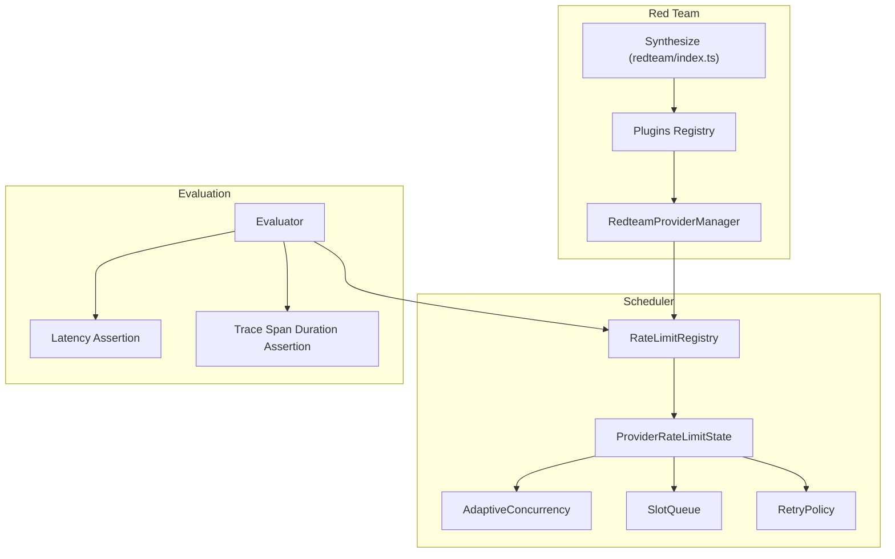
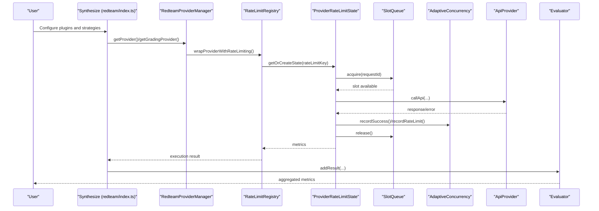
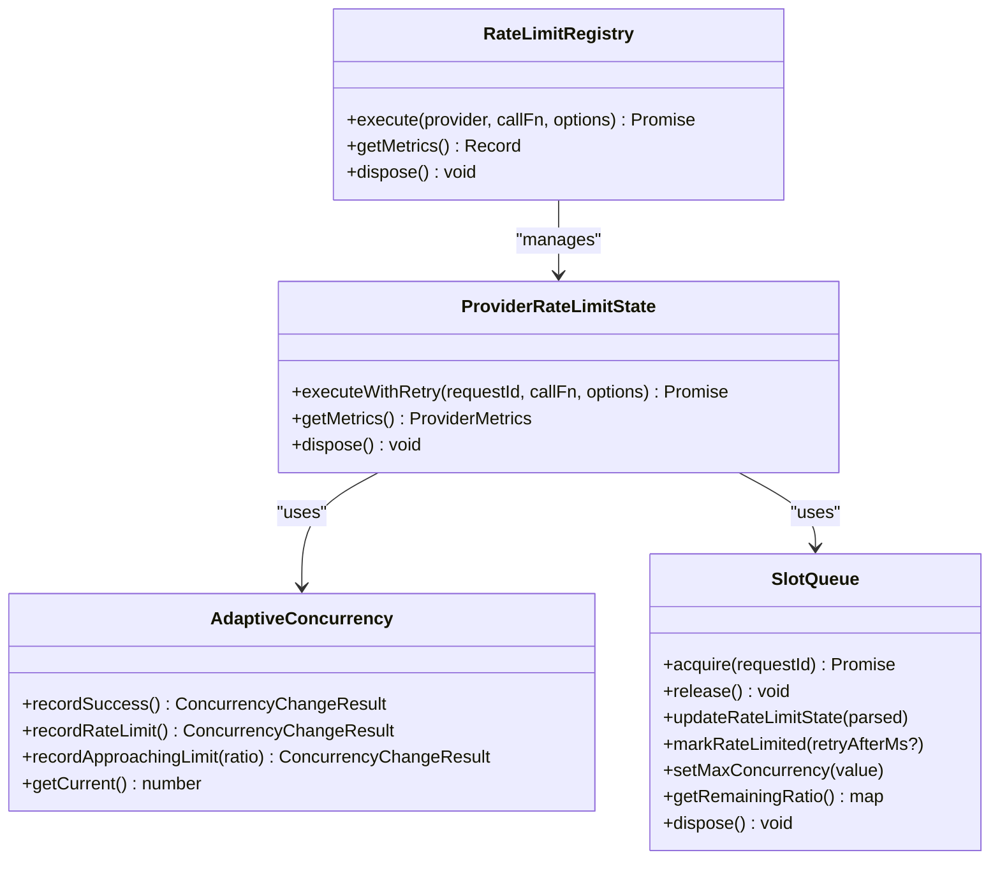
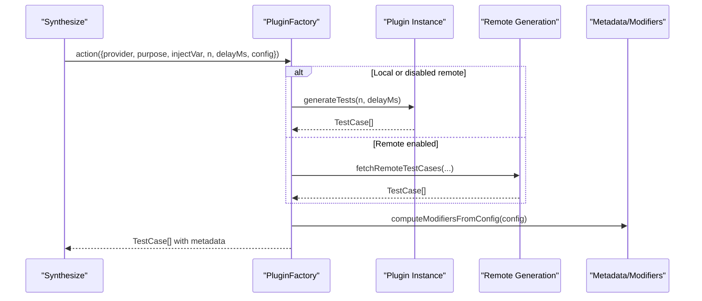
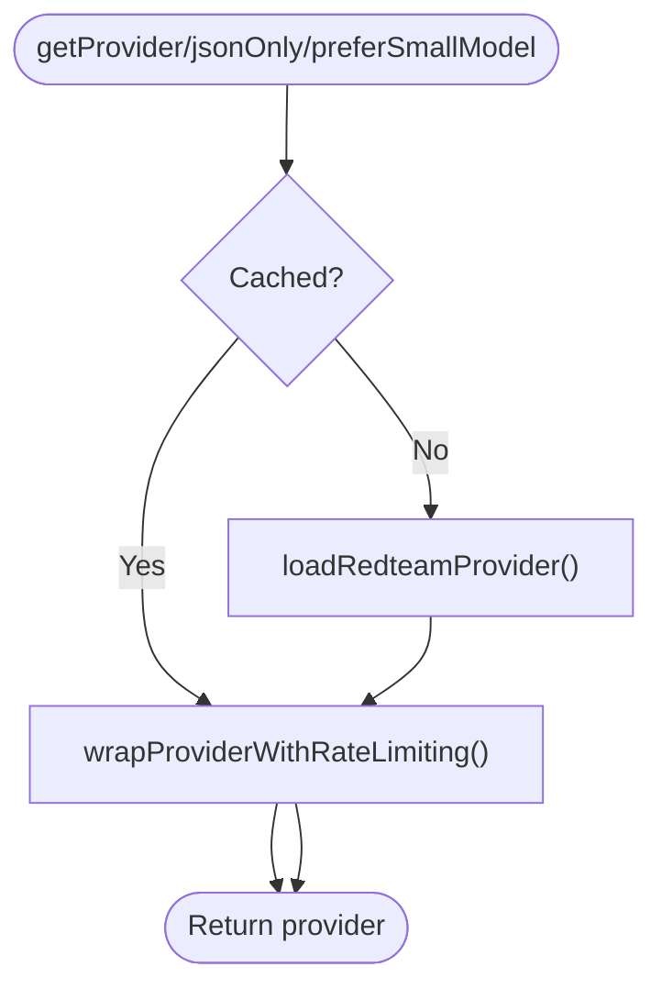
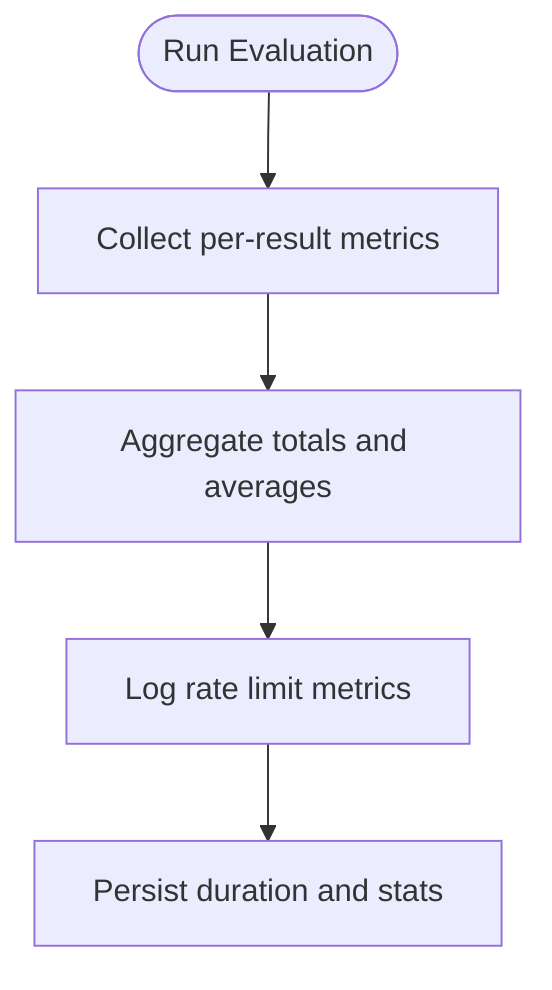
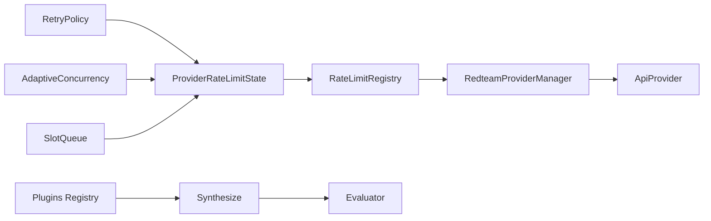

# Plugin Performance & Optimization

<cite>
**Referenced Files in This Document**
- [adaptiveConcurrency.ts](file://src/scheduler/adaptiveConcurrency.ts)
- [rateLimitRegistry.ts](file://src/scheduler/rateLimitRegistry.ts)
- [providerRateLimitState.ts](file://src/scheduler/providerRateLimitState.ts)
- [slotQueue.ts](file://src/scheduler/slotQueue.ts)
- [retryPolicy.ts](file://src/scheduler/retryPolicy.ts)
- [index.ts](file://src/redteam/index.ts)
- [plugins/index.ts](file://src/redteam/plugins/index.ts)
- [shared.ts](file://src/redteam/providers/shared.ts)
- [evaluator.ts](file://src/evaluator.ts)
- [latency.ts](file://src/assertions/latency.ts)
- [traceSpanDuration.ts](file://src/assertions/traceSpanDuration.ts)
- [performance.ts](file://src/commands/mcp/lib/performance.ts)
- [rate-limits.md](file://site/docs/configuration/rate-limits.md)
</cite>

## Table of Contents
1. [Introduction](#introduction)
2. [Project Structure](#project-structure)
3. [Core Components](#core-components)
4. [Architecture Overview](#architecture-overview)
5. [Detailed Component Analysis](#detailed-component-analysis)
6. [Dependency Analysis](#dependency-analysis)
7. [Performance Considerations](#performance-considerations)
8. [Troubleshooting Guide](#troubleshooting-guide)
9. [Conclusion](#conclusion)
10. [Appendices](#appendices)

## Introduction
This document provides comprehensive performance documentation for PromptFoo red team testing plugins. It focuses on plugin execution timing, resource consumption, concurrency control, rate limiting, and batch processing. It also covers profiling techniques, performance monitoring, bottleneck identification, and optimization strategies for large-scale red team testing, including parallel execution, resource pooling, and memory management. Special attention is given to plugin-specific concerns such as model inference costs, API rate limits, and external service dependencies.

## Project Structure
The performance-critical subsystems for red team plugins are organized around:
- Scheduler and rate-limiting orchestration
- Plugin execution and remote generation
- Provider wrappers and concurrency control
- Evaluation lifecycle and metrics aggregation

**Diagram sources**
- [adaptiveConcurrency.ts:29-142](file://src/scheduler/adaptiveConcurrency.ts#L29-L142)
- [slotQueue.ts:28-304](file://src/scheduler/slotQueue.ts#L28-L304)
- [providerRateLimitState.ts:84-397](file://src/scheduler/providerRateLimitState.ts#L84-L397)
- [rateLimitRegistry.ts:19-145](file://src/scheduler/rateLimitRegistry.ts#L19-L145)
- [retryPolicy.ts:1-80](file://src/scheduler/retryPolicy.ts#L1-L80)
- [shared.ts:70-244](file://src/redteam/providers/shared.ts#L70-L244)
- [plugins/index.ts:159-190](file://src/redteam/plugins/index.ts#L159-L190)
- [index.ts:700-800](file://src/redteam/index.ts#L700-L800)
- [evaluator.ts:1733-2296](file://src/evaluator.ts#L1733-L2296)
- [latency.ts:1-21](file://src/assertions/latency.ts#L1-L21)
- [traceSpanDuration.ts:79-105](file://src/assertions/traceSpanDuration.ts#L79-L105)

**Section sources**
- [adaptiveConcurrency.ts:1-143](file://src/scheduler/adaptiveConcurrency.ts#L1-L143)
- [rateLimitRegistry.ts:1-146](file://src/scheduler/rateLimitRegistry.ts#L1-L146)
- [providerRateLimitState.ts:1-398](file://src/scheduler/providerRateLimitState.ts#L1-L398)
- [slotQueue.ts:1-305](file://src/scheduler/slotQueue.ts#L1-L305)
- [retryPolicy.ts:1-80](file://src/scheduler/retryPolicy.ts#L1-L80)
- [index.ts:700-800](file://src/redteam/index.ts#L700-L800)
- [plugins/index.ts:1-420](file://src/redteam/plugins/index.ts#L1-L420)
- [shared.ts:1-625](file://src/redteam/providers/shared.ts#L1-L625)
- [evaluator.ts:1733-2296](file://src/evaluator.ts#L1733-L2296)
- [latency.ts:1-21](file://src/assertions/latency.ts#L1-L21)
- [traceSpanDuration.ts:79-105](file://src/assertions/traceSpanDuration.ts#L79-L105)
- [performance.ts:149-186](file://src/commands/mcp/lib/performance.ts#L149-L186)
- [rate-limits.md:189-200](file://site/docs/configuration/rate-limits.md#L189-L200)

## Core Components
- AdaptiveConcurrency: Dynamically adjusts concurrency based on rate limit feedback and recovery thresholds.
- SlotQueue: Enforces per-provider concurrency and rate-limit windows with FIFO scheduling and optional queue timeouts.
- ProviderRateLimitState: Tracks per-provider metrics, latency percentiles, and applies adaptive concurrency and retry logic.
- RateLimitRegistry: Central registry that creates and forwards provider-specific rate-limit states; emits events for monitoring.
- RedteamProviderManager: Wraps providers with rate limiting and caches providers for reuse.
- Plugins Registry: Loads plugin factories, supports local and remote plugin generation, and attaches metadata.
- Synthesize: Orchestrates plugin execution, concurrency caps, and strategy application.
- Evaluator: Aggregates metrics, tracks latency, and logs rate limit metrics for debugging.

**Section sources**
- [adaptiveConcurrency.ts:29-142](file://src/scheduler/adaptiveConcurrency.ts#L29-L142)
- [slotQueue.ts:28-304](file://src/scheduler/slotQueue.ts#L28-L304)
- [providerRateLimitState.ts:84-397](file://src/scheduler/providerRateLimitState.ts#L84-L397)
- [rateLimitRegistry.ts:19-145](file://src/scheduler/rateLimitRegistry.ts#L19-L145)
- [shared.ts:70-244](file://src/redteam/providers/shared.ts#L70-L244)
- [plugins/index.ts:159-190](file://src/redteam/plugins/index.ts#L159-L190)
- [index.ts:700-800](file://src/redteam/index.ts#L700-L800)
- [evaluator.ts:1733-2296](file://src/evaluator.ts#L1733-L2296)

## Architecture Overview
The red team plugin pipeline integrates with the scheduler to enforce concurrency and rate limits, while the evaluator aggregates performance metrics and logs.

**Diagram sources**
- [index.ts:700-800](file://src/redteam/index.ts#L700-L800)
- [shared.ts:70-244](file://src/redteam/providers/shared.ts#L70-L244)
- [rateLimitRegistry.ts:42-89](file://src/scheduler/rateLimitRegistry.ts#L42-L89)
- [providerRateLimitState.ts:127-253](file://src/scheduler/providerRateLimitState.ts#L127-L253)
- [slotQueue.ts:58-104](file://src/scheduler/slotQueue.ts#L58-L104)
- [adaptiveConcurrency.ts:46-87](file://src/scheduler/adaptiveConcurrency.ts#L46-L87)
- [evaluator.ts:1733-2296](file://src/evaluator.ts#L1733-L2296)

## Detailed Component Analysis

### Concurrency Control and Rate Limiting
- AdaptiveConcurrency: Implements recovery and backoff heuristics with configurable thresholds and factors. It increases concurrency after sustained success and decreases it upon rate limit hits or proactive throttling based on remaining ratios.
- SlotQueue: Enforces max concurrency and respects provider rate limits by tracking remaining requests/tokens and reset times. It schedules resets and rejects timed-out queued requests.
- ProviderRateLimitState: Coordinates header parsing, latency tracking, and retry decisions. It emits events for rate limit learning, warnings, hits, and concurrency changes.
- RateLimitRegistry: Creates provider-specific states keyed by provider identity and configuration, forwarding events and exposing metrics.

**Diagram sources**
- [adaptiveConcurrency.ts:29-142](file://src/scheduler/adaptiveConcurrency.ts#L29-L142)
- [slotQueue.ts:28-304](file://src/scheduler/slotQueue.ts#L28-L304)
- [providerRateLimitState.ts:84-397](file://src/scheduler/providerRateLimitState.ts#L84-L397)
- [rateLimitRegistry.ts:19-145](file://src/scheduler/rateLimitRegistry.ts#L19-L145)

**Section sources**
- [adaptiveConcurrency.ts:1-143](file://src/scheduler/adaptiveConcurrency.ts#L1-L143)
- [slotQueue.ts:1-305](file://src/scheduler/slotQueue.ts#L1-L305)
- [providerRateLimitState.ts:1-398](file://src/scheduler/providerRateLimitState.ts#L1-L398)
- [rateLimitRegistry.ts:1-146](file://src/scheduler/rateLimitRegistry.ts#L1-L146)

### Plugin Execution and Remote Generation
- Plugins Registry: Provides plugin factories that either generate tests locally or remotely. Remote generation is gated by health checks and environment flags. Metadata and modifiers are attached to test cases for downstream strategies.
- Synthesize: Controls concurrency caps, applies strategies, and computes total test counts. It validates and deduplicates strategies and supports language-aware test generation.

**Diagram sources**
- [plugins/index.ts:159-190](file://src/redteam/plugins/index.ts#L159-L190)
- [plugins/index.ts:280-344](file://src/redteam/plugins/index.ts#L280-L344)
- [plugins/index.ts:346-420](file://src/redteam/plugins/index.ts#L346-L420)
- [index.ts:700-800](file://src/redteam/index.ts#L700-L800)

**Section sources**
- [plugins/index.ts:1-420](file://src/redteam/plugins/index.ts#L1-L420)
- [index.ts:700-800](file://src/redteam/index.ts#L700-L800)

### Provider Wrapping and Caching
- RedteamProviderManager: Lazily loads and caches providers, wraps them with rate limiting when a registry is set, and exposes helpers for grading and multilingual scenarios.

**Diagram sources**
- [shared.ts:126-187](file://src/redteam/providers/shared.ts#L126-L187)
- [shared.ts:70-105](file://src/redteam/providers/shared.ts#L70-L105)

**Section sources**
- [shared.ts:1-625](file://src/redteam/providers/shared.ts#L1-L625)

### Evaluation Metrics and Monitoring
- Evaluator: Aggregates latency, token usage, and cost metrics; logs rate limit metrics for debugging; computes efficiency and detects usage patterns.
- Assertions: Latency assertion and trace span duration assertion provide targeted performance checks.

**Diagram sources**
- [evaluator.ts:2432-2461](file://src/evaluator.ts#L2432-L2461)
- [evaluator.ts:2263-2296](file://src/evaluator.ts#L2263-L2296)
- [latency.ts:1-21](file://src/assertions/latency.ts#L1-L21)
- [traceSpanDuration.ts:79-105](file://src/assertions/traceSpanDuration.ts#L79-L105)

**Section sources**
- [evaluator.ts:1733-2296](file://src/evaluator.ts#L1733-L2296)
- [evaluator.ts:2432-2461](file://src/evaluator.ts#L2432-L2461)
- [latency.ts:1-21](file://src/assertions/latency.ts#L1-L21)
- [traceSpanDuration.ts:79-105](file://src/assertions/traceSpanDuration.ts#L79-L105)

## Dependency Analysis
- Scheduler depends on RetryPolicy and AdaptiveConcurrency to manage provider throughput.
- ProviderRateLimitState encapsulates SlotQueue and AdaptiveConcurrency, emitting events consumed by RateLimitRegistry.
- RedteamProviderManager integrates RateLimitRegistry into provider execution paths.
- Plugins Registry interacts with remote generation and attaches metadata to test cases.
- Synthesize orchestrates concurrency and strategy application, feeding results into Evaluator.

**Diagram sources**
- [retryPolicy.ts:1-80](file://src/scheduler/retryPolicy.ts#L1-L80)
- [providerRateLimitState.ts:84-397](file://src/scheduler/providerRateLimitState.ts#L84-L397)
- [adaptiveConcurrency.ts:29-142](file://src/scheduler/adaptiveConcurrency.ts#L29-L142)
- [slotQueue.ts:28-304](file://src/scheduler/slotQueue.ts#L28-L304)
- [rateLimitRegistry.ts:19-145](file://src/scheduler/rateLimitRegistry.ts#L19-L145)
- [shared.ts:70-244](file://src/redteam/providers/shared.ts#L70-L244)
- [plugins/index.ts:159-190](file://src/redteam/plugins/index.ts#L159-L190)
- [index.ts:700-800](file://src/redteam/index.ts#L700-L800)
- [evaluator.ts:1733-2296](file://src/evaluator.ts#L1733-L2296)

**Section sources**
- [retryPolicy.ts:1-80](file://src/scheduler/retryPolicy.ts#L1-L80)
- [providerRateLimitState.ts:1-398](file://src/scheduler/providerRateLimitState.ts#L1-L398)
- [adaptiveConcurrency.ts:1-143](file://src/scheduler/adaptiveConcurrency.ts#L1-L143)
- [slotQueue.ts:1-305](file://src/scheduler/slotQueue.ts#L1-L305)
- [rateLimitRegistry.ts:1-146](file://src/scheduler/rateLimitRegistry.ts#L1-L146)
- [shared.ts:1-625](file://src/redteam/providers/shared.ts#L1-L625)
- [plugins/index.ts:1-420](file://src/redteam/plugins/index.ts#L1-L420)
- [index.ts:700-800](file://src/redteam/index.ts#L700-L800)
- [evaluator.ts:1733-2296](file://src/evaluator.ts#L1733-L2296)

## Performance Considerations
- Concurrency caps: The synthesis pipeline caps concurrency and disables parallelism when delays are configured. Tune max concurrency to balance throughput and stability.
- Adaptive concurrency: Automatically recovers from rate limits and proactively reduces concurrency when remaining quotas drop below thresholds.
- Retry policy: Exponential backoff with jitter prevents thundering herds; server-specified retry-after is preferred when available.
- Event-driven monitoring: RateLimitRegistry and ProviderRateLimitState emit events for rate limit hits, warnings, learned limits, and concurrency changes—use them for observability.
- Metrics aggregation: Evaluator computes latency percentiles, total tokens, and cost; leverage these for capacity planning and cost control.
- Remote vs. local generation: Remote plugin generation offloads workloads but adds network latency; ensure health checks and timeouts are configured appropriately.

[No sources needed since this section provides general guidance]

## Troubleshooting Guide
- Symptom: Frequent rate limit hits
  - Action: Inspect emitted events and metrics; confirm AdaptiveConcurrency recovery and SlotQueue reset timers. Review RetryPolicy configuration and jitter factors.
  - Evidence: Events from ProviderRateLimitState and RateLimitRegistry.
  
  **Section sources**
  - [providerRateLimitState.ts:127-253](file://src/scheduler/providerRateLimitState.ts#L127-L253)
  - [rateLimitRegistry.ts:42-89](file://src/scheduler/rateLimitRegistry.ts#L42-L89)
  - [retryPolicy.ts:21-80](file://src/scheduler/retryPolicy.ts#L21-L80)

- Symptom: Slow plugin execution
  - Action: Use latency assertions and trace span duration assertions to identify bottlenecks. Check plugin-specific modifiers and remote generation overhead.
  - Evidence: Evaluator metrics and assertion outputs.

  **Section sources**
  - [latency.ts:1-21](file://src/assertions/latency.ts#L1-L21)
  - [traceSpanDuration.ts:79-105](file://src/assertions/traceSpanDuration.ts#L79-L105)
  - [evaluator.ts:2263-2296](file://src/evaluator.ts#L2263-L2296)

- Symptom: High memory usage during large-scale red team tests
  - Action: Reduce concurrency, enable batching where supported, and externalize large binary payloads in provider responses to avoid bloating history.
  - Evidence: Blob extraction utilities and provider response handling.

  **Section sources**
  - [shared.ts:493-502](file://src/redteam/providers/shared.ts#L493-L502)

- Symptom: Deterministic behavior in tests
  - Action: Set max concurrency to 1 and introduce fixed delays for reproducible runs.
  - Evidence: Configuration guidance.

  **Section sources**
  - [rate-limits.md:189-200](file://site/docs/configuration/rate-limits.md#L189-L200)

## Conclusion
PromptFoo’s red team plugin performance is governed by a robust scheduler that adapts to provider rate limits, enforces concurrency, and retries transient failures. The system provides rich metrics and events for monitoring, enabling targeted optimizations such as parallel execution, resource pooling, and memory management. By tuning concurrency, leveraging remote generation judiciously, and applying performance assertions, teams can scale red team testing effectively while controlling costs and avoiding external service saturation.

[No sources needed since this section summarizes without analyzing specific files]

## Appendices

### Benchmarking Methodologies
- Measure end-to-end latency and throughput across plugin sets and strategies.
- Use latency and trace span duration assertions to define SLOs.
- Compare local versus remote plugin generation under identical load conditions.

[No sources needed since this section provides general guidance]

### Capacity Planning Guidelines
- Estimate peak requests per second per provider and allocate concurrency accordingly.
- Monitor rate limit metrics and adjust retry policies to minimize retries.
- Plan for bursty traffic by sizing queues and allowing adaptive recovery.

[No sources needed since this section provides general guidance]

### Optimization Strategies
- Parallel execution: Increase concurrency up to provider limits; rely on adaptive algorithms to stabilize.
- Resource pooling: Reuse providers via RedteamProviderManager caching; wrap providers with RateLimitRegistry for shared state.
- Memory management: Externalize large payloads and avoid storing unnecessary artifacts in history.

[No sources needed since this section provides general guidance]