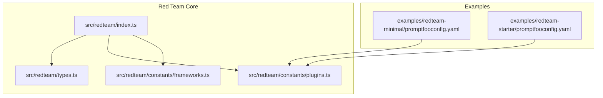
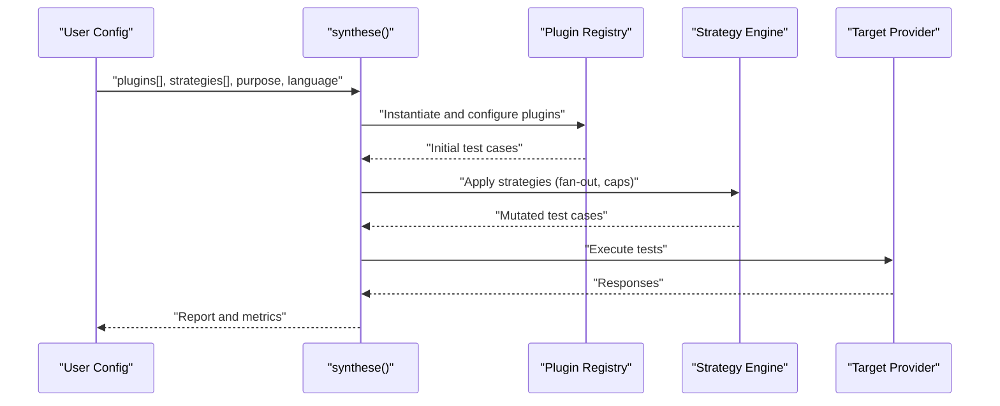
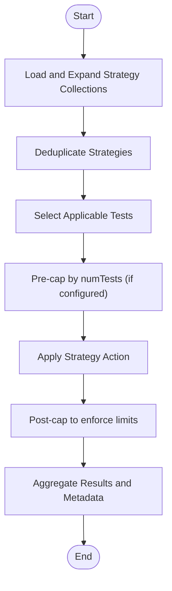
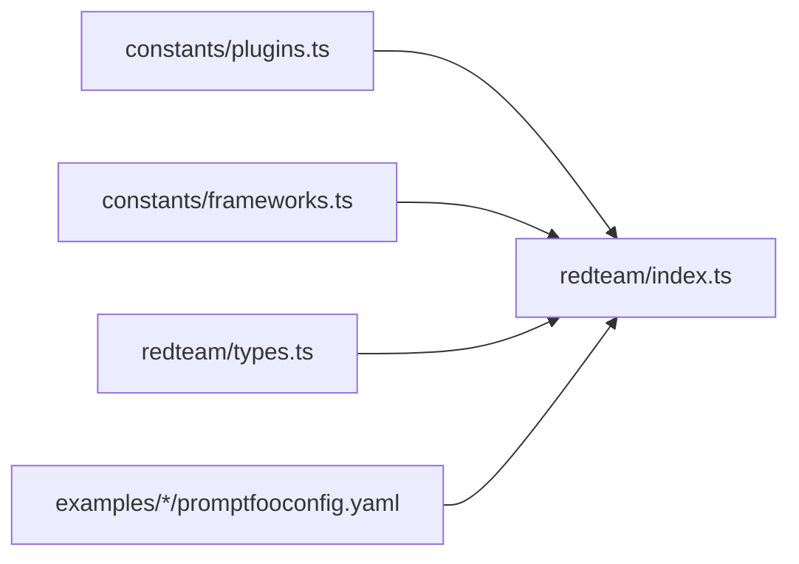

# Plugin System

<cite>
**Referenced Files in This Document**
- [index.ts](file://src/redteam/index.ts)
- [types.ts](file://src/redteam/types.ts)
- [plugins.ts](file://src/redteam/constants/plugins.ts)
- [frameworks.ts](file://src/redteam/constants/frameworks.ts)
- [promptfooconfig.yaml (minimal)](file://examples/redteam-minimal/promptfooconfig.yaml)
- [promptfooconfig.yaml (starter)](file://examples/redteam-starter/promptfooconfig.yaml)
</cite>

## Table of Contents
1. [Introduction](#introduction)
2. [Project Structure](#project-structure)
3. [Core Components](#core-components)
4. [Architecture Overview](#architecture-overview)
5. [Detailed Component Analysis](#detailed-component-analysis)
6. [Dependency Analysis](#dependency-analysis)
7. [Performance Considerations](#performance-considerations)
8. [Troubleshooting Guide](#troubleshooting-guide)
9. [Conclusion](#conclusion)
10. [Appendices](#appendices)

## Introduction
This document describes the PromptFoo red team plugin system used to generate adversarial test cases across security, bias, compliance, and domain-specific categories. It explains plugin architecture, configuration, execution patterns, and how plugins integrate with strategies and frameworks. It also provides guidance for developing custom plugins, tuning parameters, interpreting results, chaining plugins, conditional execution, and optimizing performance.

## Project Structure
The red team plugin system is implemented under the redteam module and supported by configuration constants and framework mappings. Key areas:
- Plugin orchestration and execution: src/redteam/index.ts
- Type definitions and schemas: src/redteam/types.ts
- Plugin lists, categories, and defaults: src/redteam/constants/plugins.ts
- Framework mappings (OWASP, GDPR, ISO, EU AI Act, NIST): src/redteam/constants/frameworks.ts
- Example configurations demonstrating plugin usage: examples/redteam-*/promptfooconfig.yaml

**Diagram sources**
- [index.ts:1-120](file://src/redteam/index.ts#L1-L120)
- [types.ts:1-120](file://src/redteam/types.ts#L1-L120)
- [plugins.ts:1-120](file://src/redteam/constants/plugins.ts#L1-L120)
- [frameworks.ts:1-120](file://src/redteam/constants/frameworks.ts#L1-L120)
- [promptfooconfig.yaml (minimal):1-19](file://examples/redteam-minimal/promptfooconfig.yaml#L1-L19)
- [promptfooconfig.yaml (starter):1-34](file://examples/redteam-starter/promptfooconfig.yaml#L1-L34)

**Section sources**
- [index.ts:1-120](file://src/redteam/index.ts#L1-L120)
- [plugins.ts:1-120](file://src/redteam/constants/plugins.ts#L1-L120)
- [frameworks.ts:1-120](file://src/redteam/constants/frameworks.ts#L1-L120)
- [promptfooconfig.yaml (minimal):1-19](file://examples/redteam-minimal/promptfooconfig.yaml#L1-L19)
- [promptfooconfig.yaml (starter):1-34](file://examples/redteam-starter/promptfooconfig.yaml#L1-L34)

## Core Components
- Plugin registry and categories: Defines available plugins, collections, and exemptions.
- Strategy engine: Applies transformations to plugin-generated test cases.
- Framework mappings: Aligns plugins and strategies with standards (e.g., OWASP LLM/API Top 10, GDPR, ISO/IEC 42001).
- Configuration types: Enforces plugin and strategy configuration schemas.
- Orchestration: Coordinates plugin execution, metadata enrichment, and result reporting.

Key capabilities:
- Plugin selection by ID, category, or collection
- Per-plugin configuration (e.g., severity, language, inputs, policy)
- Strategy application with fan-out and caps
- Multi-language support and multi-input mode
- Remote-only plugin support and UI gating

**Section sources**
- [plugins.ts:38-83](file://src/redteam/constants/plugins.ts#L38-L83)
- [plugins.ts:497-508](file://src/redteam/constants/plugins.ts#L497-L508)
- [types.ts:54-105](file://src/redteam/types.ts#L54-L105)
- [index.ts:246-256](file://src/redteam/index.ts#L246-L256)
- [index.ts:700-764](file://src/redteam/index.ts#L700-L764)

## Architecture Overview
The red team pipeline:
1. Parse configuration and expand strategy collections.
2. Generate plugin tests with enriched metadata (severity, language, modifiers).
3. Apply strategies to mutate and expand test sets.
4. Aggregate results and produce a summary report.

**Diagram sources**
- [index.ts:700-764](file://src/redteam/index.ts#L700-L764)
- [index.ts:350-567](file://src/redteam/index.ts#L350-L567)
- [types.ts:144-156](file://src/redteam/types.ts#L144-L156)

## Detailed Component Analysis

### Plugin Categories and Coverage
The system supports broad coverage across:
- Security vulnerabilities: SQL injection, XSS, SSRF, shell injection, debug access, malicious code
- Bias detection: age, disability, gender, race
- Compliance testing: GDPR, HIPAA (via PII plugins), PCI-DSS, CCPA (via domain plugins)
- Specialized domains: financial, healthcare, legal, insurance, telecom, real estate, ecommerce

Categories and representative plugins:
- Foundation: ascii-smuggling, beavertails, bias:* (age, disability, gender, race), contracts, cyberseceval, donotanswer, excessive-agency, hallucination, hijacking, imitation, pliny, politics, religion
- Harmful content: chemical-biological-weapons, child-exploitation, copyright-violations, cybercrime, graphic-content, harassment-bullying, hate, illegal-activities, illegal-drugs, indiscriminate-weapons, insults, intellectual-property, misinformation-disinformation, non-violent-crime, profanity, radicalization, self-harm, sex-crime, sexual-content, specialized-advice, unsafe-practices, violent-crime, weapons:ied
- PII: api-db, direct, session, social
- Financial: calculation-error, compliance-violation, confidential-disclosure, counterfactual, data-leakage, defamation, hallucination, impartiality, misconduct, sox-compliance, sycophancy
- Healthcare: anchoring-bias, incorrect-knowledge, off-label-use, prioritization-error, sycophancy
- Insurance: coverage-discrimination, network-misinformation, phi-disclosure
- Telecommunications: cpni-disclosure, location-disclosure, account-takeover, e911-misinformation, tcpa-violation, unauthorized-changes, fraud-enablement, porting-misinformation, billing-misinformation, coverage-misinformation, law-enforcement-request-handling, accessibility-violation
- Real estate: fair-housing-discrimination, steering, discriminatory-listings, lending-discrimination, valuation-bias, accessibility-discrimination, advertising-discrimination, source-of-income
- E-commerce: compliance-bypass, order-fraud, pci-dss, price-manipulation

These categories are defined in constants and used to build default and minimal plugin sets.

**Section sources**
- [plugins.ts:38-83](file://src/redteam/constants/plugins.ts#L38-L83)
- [plugins.ts:220-227](file://src/redteam/constants/plugins.ts#L220-L227)
- [plugins.ts:229-231](file://src/redteam/constants/plugins.ts#L229-L231)
- [plugins.ts:233-240](file://src/redteam/constants/plugins.ts#L233-L240)
- [plugins.ts:242-254](file://src/redteam/constants/plugins.ts#L242-L254)
- [plugins.ts:256-260](file://src/redteam/constants/plugins.ts#L256-L260)
- [plugins.ts:262-266](file://src/redteam/constants/plugins.ts#L262-L266)
- [plugins.ts:268-288](file://src/redteam/constants/plugins.ts#L268-L288)
- [plugins.ts:290-299](file://src/redteam/constants/plugins.ts#L290-L299)
- [plugins.ts:301-308](file://src/redteam/constants/plugins.ts#L301-L308)

### Plugin Configuration Schema
Plugins accept a flexible configuration object with common fields:
- Examples and grader examples
- Severity levels
- Language and multi-language support
- Prompt and purpose overrides
- Modifiers (e.g., tone, style, context)
- Target identifiers/systems (BOLA/BFLA)
- Mentions (competitors)
- Target URLs and SSRF thresholds (SSRF)
- PII fields (name)
- Multilingual toggle (CyberSecEval)
- Indirect injection variable
- Intended results (RAG poisoning)
- Policy references (cloud or inline)
- System prompt
- Strategy exclusions
- Multi-variable inputs (Inputs schema)
- Nonce to prevent caching

These fields are validated by the PluginConfigSchema and used to enrich test metadata and guide plugin behavior.

**Section sources**
- [types.ts:54-105](file://src/redteam/types.ts#L54-L105)
- [types.ts:10-15](file://src/redteam/types.ts#L10-L15)

### Strategy Application and Fan-Out
Strategies transform plugin-generated test cases:
- Fan-out strategies multiply input tests (e.g., jailbreak, jailbreak:composite)
- Caps limit total outputs per strategy
- Layer strategies compose multiple steps
- Retry adds additional tests without replacing base set
- Multilingual strategies compute requested vs. generated counts per language

The strategy engine deduplicates layered strategies and applies pre/post limits to ensure predictable scaling.

**Diagram sources**
- [index.ts:747-794](file://src/redteam/index.ts#L747-L794)
- [index.ts:350-567](file://src/redteam/index.ts#L350-L567)

**Section sources**
- [index.ts:350-567](file://src/redteam/index.ts#L350-L567)
- [index.ts:576-613](file://src/redteam/index.ts#L576-L613)
- [index.ts:621-686](file://src/redteam/index.ts#L621-L686)

### Framework Mappings and Compliance
Framework mappings connect plugins and strategies to recognized standards:
- OWASP LLM Top 10: maps prompt injection, sensitive disclosure, poisoning, output handling, excessive agency, system prompt leakage, vectors/embeddings, misinformation, unbounded consumption
- OWASP API Top 10: maps authorization, authentication, resource consumption, privacy, supply chain, misinformation, injection, security misconfig, specialized advice, unsafe API consumption
- OWASP Agentic Top 10: maps goal hijack, tool misuse, identity abuse, supply chain, unexpected code execution, memory/context poisoning, insecure inter-agent communication, cascading failures, trust exploitation, rogue agents
- NIST AI RMF: maps alignment, bias, privacy, robustness, security, ethics, transparency across measurement areas
- ISO/IEC 42001: maps accountability, fairness, privacy, robustness, security, safety, transparency
- GDPR: maps principles, special categories, access, erasure, automated decisions, data protection by design, security
- EU AI Act: maps prohibited practices and high-risk use-cases

These mappings help align red team testing with compliance and risk frameworks.

**Section sources**
- [frameworks.ts:82-181](file://src/redteam/constants/frameworks.ts#L82-L181)
- [frameworks.ts:183-227](file://src/redteam/constants/frameworks.ts#L183-L227)
- [frameworks.ts:236-300](file://src/redteam/constants/frameworks.ts#L236-L300)
- [frameworks.ts:404-493](file://src/redteam/constants/frameworks.ts#L404-L493)
- [frameworks.ts:495-529](file://src/redteam/constants/frameworks.ts#L495-L529)
- [frameworks.ts:606-655](file://src/redteam/constants/frameworks.ts#L606-L655)
- [frameworks.ts:665-744](file://src/redteam/constants/frameworks.ts#L665-L744)
- [frameworks.ts:752-800](file://src/redteam/constants/frameworks.ts#L752-L800)

### Plugin Execution and Metadata Enrichment
Plugin execution enriches test cases with:
- Plugin ID and config (resolved file URIs)
- Severity (auto-derived or explicit)
- Modifiers (including language)
- Test generation instructions
- Multi-input extraction for strategies

The orchestrator ensures concurrency limits, abort signals, and progress reporting.

**Section sources**
- [index.ts:290-324](file://src/redteam/index.ts#L290-L324)
- [index.ts:724-745](file://src/redteam/index.ts#L724-L745)

### Example Configurations
Minimal configuration demonstrates selecting specific plugins and applying strategies.

Starter configuration shows:
- HTTP target with JSON body and response transformation
- Purpose-driven configuration
- Using plugin collections and targeted intent configuration

These examples illustrate practical plugin selection and strategy application.

**Section sources**
- [promptfooconfig.yaml (minimal):1-19](file://examples/redteam-minimal/promptfooconfig.yaml#L1-L19)
- [promptfooconfig.yaml (starter):21-34](file://examples/redteam-starter/promptfooconfig.yaml#L21-L34)

## Dependency Analysis
The plugin system depends on:
- Constants for plugin lists, categories, and exemptions
- Types for configuration schemas and runtime options
- Strategy engine for transformations
- Framework mappings for compliance alignment

**Diagram sources**
- [plugins.ts:1-120](file://src/redteam/constants/plugins.ts#L1-L120)
- [frameworks.ts:1-120](file://src/redteam/constants/frameworks.ts#L1-L120)
- [types.ts:1-120](file://src/redteam/types.ts#L1-L120)
- [index.ts:1-120](file://src/redteam/index.ts#L1-L120)

**Section sources**
- [plugins.ts:1-120](file://src/redteam/constants/plugins.ts#L1-L120)
- [frameworks.ts:1-120](file://src/redteam/constants/frameworks.ts#L1-L120)
- [types.ts:1-120](file://src/redteam/types.ts#L1-L120)
- [index.ts:1-120](file://src/redteam/index.ts#L1-L120)

## Performance Considerations
- Concurrency caps: Max concurrency is enforced to prevent provider throttling.
- Delay and concurrency: Enabling delay forces single-threaded execution.
- Strategy caps: numTests caps prevent unbounded growth.
- Pre/post limiting: Strategies pre-limit inputs and post-cap outputs.
- Multi-language multipliers: Total test counts scale with language configurations.

Recommendations:
- Start with conservative numTests and increase gradually.
- Use retry strategy judiciously to avoid exponential growth.
- Prefer layer strategies for controlled composition.
- Monitor provider quotas and adjust maxConcurrency accordingly.

**Section sources**
- [index.ts:737-745](file://src/redteam/index.ts#L737-L745)
- [index.ts:406-450](file://src/redteam/index.ts#L406-L450)
- [index.ts:508-514](file://src/redteam/index.ts#L508-L514)
- [index.ts:621-686](file://src/redteam/index.ts#L621-L686)

## Troubleshooting Guide
Common issues and resolutions:
- Partial generation failures: When critical plugins fail to generate tests, a PartialGenerationError is thrown with a list of failed plugins. Check provider credentials, configuration, and logs.
- Strategy mismatch: Exclude incompatible strategies via plugin config’s excludeStrategies field.
- Remote-only plugins: Some plugins require remote generation; UI disables them when remote generation is unavailable.
- File URI resolution: resolvePluginConfig supports file:// YAML/JSON/text loading; ensure paths exist.

Operational tips:
- Use verbose logging to inspect plugin and strategy behavior.
- Validate plugin configs against PluginConfigSchema.
- Verify framework mappings align with intended compliance goals.

**Section sources**
- [types.ts:395-418](file://src/redteam/types.ts#L395-L418)
- [index.ts:220-244](file://src/redteam/index.ts#L220-L244)
- [plugins.ts:510-556](file://src/redteam/constants/plugins.ts#L510-L556)

## Conclusion
The PromptFoo red team plugin system provides a comprehensive, extensible framework for adversarial testing across security, bias, compliance, and domain-specific risks. Its plugin registry, strategy engine, and framework mappings enable targeted, scalable, and standards-aligned evaluations. By leveraging configuration schemas, multi-language and multi-input modes, and performance controls, teams can tune the system to their risk profile and provider constraints.

## Appendices

### Plugin Development Guidelines
- Define a plugin ID and category prefix following established patterns.
- Implement a plugin action that accepts provider, purpose, injectVar, n, delayMs, and config.
- Support multi-input mode via Inputs schema and extract variables from transformed JSON when needed.
- Respect strategy exclusions and exemptions (e.g., dataset plugins, agentic plugins).
- Provide clear severity mapping and metadata enrichment.
- Validate configuration with PluginConfigSchema and include examples and grader guidance.

### Configuration Reference Highlights
- Plugins: id, numTests, config (severity, language, inputs, policy, modifiers, etc.)
- Strategies: id, config (enabled, plugins, numTests)
- Frameworks: map to plugin and strategy sets for compliance alignment

**Section sources**
- [types.ts:54-105](file://src/redteam/types.ts#L54-L105)
- [types.ts:107-118](file://src/redteam/types.ts#L107-L118)
- [frameworks.ts:82-181](file://src/redteam/constants/frameworks.ts#L82-L181)