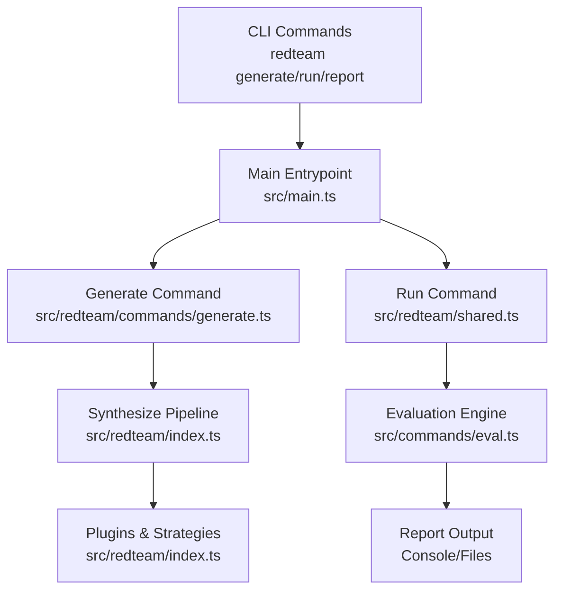
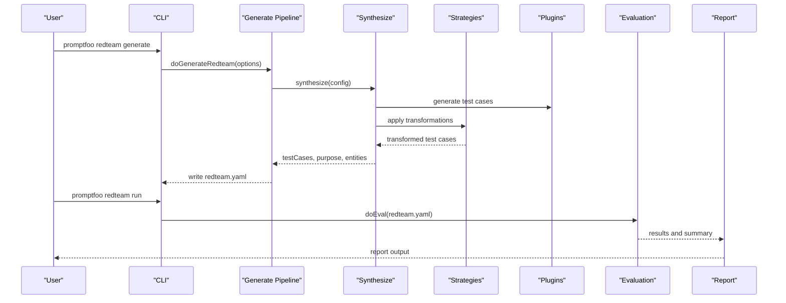
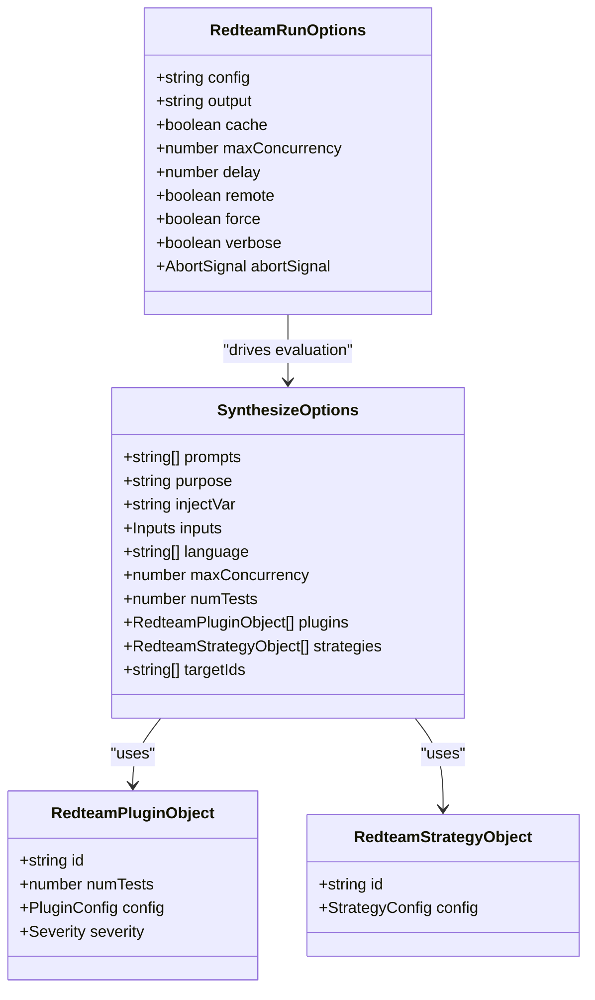
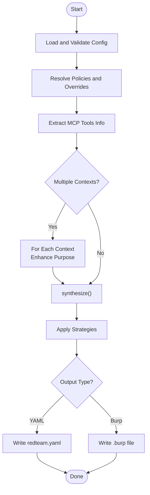
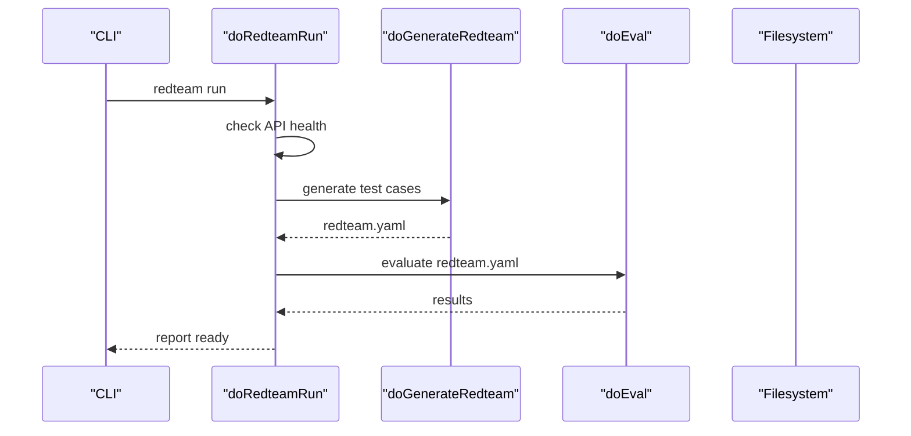
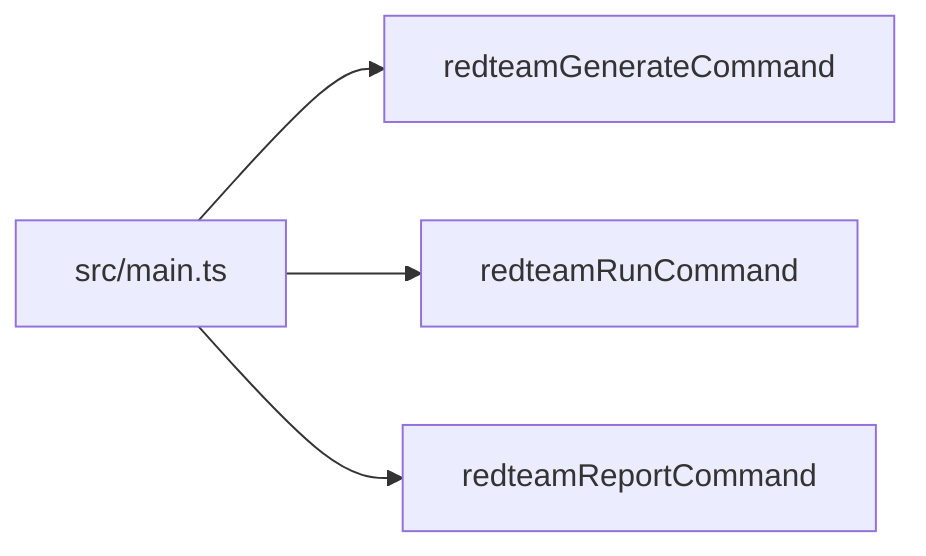
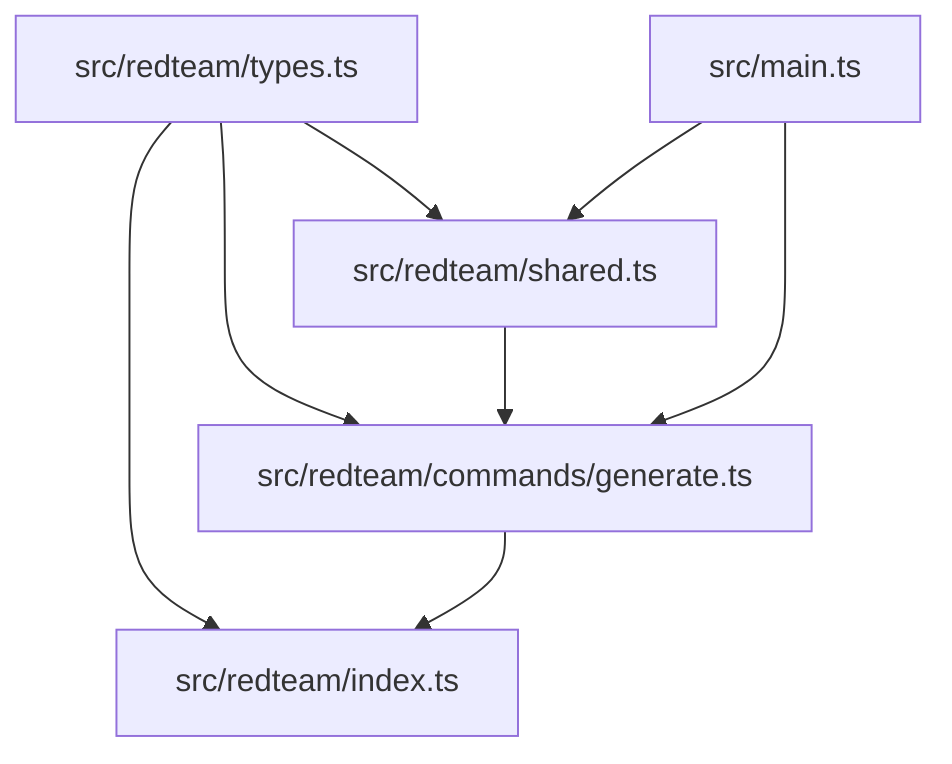

# Red Team Testing Overview

<cite>
**Referenced Files in This Document**
- [src/redteam/index.ts](file://src/redteam/index.ts)
- [src/redteam/shared.ts](file://src/redteam/shared.ts)
- [src/redteam/types.ts](file://src/redteam/types.ts)
- [src/redteam/commands/generate.ts](file://src/redteam/commands/generate.ts)
- [src/main.ts](file://src/main.ts)
- [examples/redteam-starter/promptfooconfig.yaml](file://examples/redteam-starter/promptfooconfig.yaml)
- [examples/redteam-minimal/promptfooconfig.yaml](file://examples/redteam-minimal/promptfooconfig.yaml)
- [examples/redteam-multi-modal/README.md](file://examples/redteam-multi-modal/README.md)
- [site/blog/red-team-gpt.md](file://site/blog/red-team-gpt.md)
- [site/blog/red-team-huggingface-model.md](file://site/blog/red-team-huggingface-model.md)
- [site/docs/guides/llm-redteaming.md](file://site/docs/guides/llm-redteaming.md)
</cite>

## Table of Contents
1. [Introduction](#introduction)
2. [Project Structure](#project-structure)
3. [Core Components](#core-components)
4. [Architecture Overview](#architecture-overview)
5. [Detailed Component Analysis](#detailed-component-analysis)
6. [Dependency Analysis](#dependency-analysis)
7. [Performance Considerations](#performance-considerations)
8. [Troubleshooting Guide](#troubleshooting-guide)
9. [Conclusion](#conclusion)
10. [Appendices](#appendices)

## Introduction
This document explains red team testing for LLM applications using PromptFoo. It covers the fundamentals of adversarial testing, methodology, objectives, and best practices. It documents the red team framework architecture and how it integrates with the broader evaluation system, outlines the differences between traditional and adversarial testing, defines the scope of red team testing (security, bias, compliance, safety), and provides a complete workflow from setup to remediation. Ethical considerations and responsible disclosure practices are included, along with examples of common attack vectors and detection techniques.

## Project Structure
PromptFoo’s red team capability is implemented as part of the evaluation engine. The CLI exposes red team commands that orchestrate test case generation, evaluation, and reporting. Configuration is expressed in YAML and supports plugins, strategies, purpose statements, and optional contexts for multi-scenario testing.

Key areas:
- CLI integration and command wiring
- Red team generation pipeline
- Evaluation integration
- Types and configuration schemas
- Example configurations and documentation

**Diagram sources**
- [src/main.ts:225-240](file://src/main.ts#L225-L240)
- [src/redteam/commands/generate.ts:154-800](file://src/redteam/commands/generate.ts#L154-L800)
- [src/redteam/shared.ts:21-194](file://src/redteam/shared.ts#L21-L194)
- [src/redteam/index.ts:700-800](file://src/redteam/index.ts#L700-L800)

**Section sources**
- [src/main.ts:225-240](file://src/main.ts#L225-L240)
- [src/redteam/commands/generate.ts:154-800](file://src/redteam/commands/generate.ts#L154-L800)
- [src/redteam/shared.ts:21-194](file://src/redteam/shared.ts#L21-L194)
- [src/redteam/index.ts:700-800](file://src/redteam/index.ts#L700-L800)

## Core Components
- Red team configuration and types: Defines plugin and strategy objects, severity levels, and runtime options.
- Generation pipeline: Resolves configuration, extracts purpose and entities, synthesizes test cases via plugins and strategies, and writes outputs.
- Run pipeline: Generates test cases (if needed), invokes evaluation, and reports results.
- CLI commands: redteam generate, redteam run, and redteam report are wired into the main CLI.

Key responsibilities:
- Purpose-driven test generation
- Plugin-driven vulnerability categories
- Strategy-driven adversarial transformations
- Multi-context and multi-language support
- Reporting and progress tracking

**Section sources**
- [src/redteam/types.ts:174-316](file://src/redteam/types.ts#L174-L316)
- [src/redteam/commands/generate.ts:154-800](file://src/redteam/commands/generate.ts#L154-L800)
- [src/redteam/shared.ts:21-194](file://src/redteam/shared.ts#L21-L194)
- [src/redteam/index.ts:700-800](file://src/redteam/index.ts#L700-L800)

## Architecture Overview
The red team architecture is a layered pipeline:
- CLI layer: parses arguments and routes to generate/run/report.
- Configuration layer: loads YAML, validates schemas, merges defaults, and resolves policies.
- Synthesis layer: orchestrates plugins and strategies to produce adversarial test cases.
- Evaluation layer: executes tests against targets and collects results.
- Reporting layer: prints summaries and persists artifacts.

**Diagram sources**
- [src/main.ts:225-240](file://src/main.ts#L225-L240)
- [src/redteam/commands/generate.ts:154-800](file://src/redteam/commands/generate.ts#L154-L800)
- [src/redteam/shared.ts:21-194](file://src/redteam/shared.ts#L21-L194)
- [src/redteam/index.ts:700-800](file://src/redteam/index.ts#L700-L800)

## Detailed Component Analysis

### Red Team Configuration and Types
- Plugin and strategy typing: Strongly typed plugin and strategy objects, with optional configuration and severity levels.
- Common options: Inject variable, inputs, language, numTests, provider, purpose, contexts, strategies, frameworks, delay, remote, sharing, and tracing.
- RedteamRunOptions: Options for running evaluations, including callbacks for progress and logs.

**Diagram sources**
- [src/redteam/types.ts:144-195](file://src/redteam/types.ts#L144-L195)
- [src/redteam/types.ts:227-240](file://src/redteam/types.ts#L227-L240)
- [src/redteam/types.ts:244-276](file://src/redteam/types.ts#L244-L276)

**Section sources**
- [src/redteam/types.ts:144-195](file://src/redteam/types.ts#L144-L195)
- [src/redteam/types.ts:227-240](file://src/redteam/types.ts#L227-L240)
- [src/redteam/types.ts:244-276](file://src/redteam/types.ts#L244-L276)

### Generation Pipeline
- Validates configuration and merges defaults.
- Resolves plugin severity overrides and policy references.
- Extracts MCP tools info and augments purpose/test generation instructions.
- Synthesizes test cases across single or multiple contexts.
- Writes YAML or Burp-compatible outputs.

**Diagram sources**
- [src/redteam/commands/generate.ts:154-800](file://src/redteam/commands/generate.ts#L154-L800)
- [src/redteam/index.ts:700-800](file://src/redteam/index.ts#L700-L800)

**Section sources**
- [src/redteam/commands/generate.ts:154-800](file://src/redteam/commands/generate.ts#L154-L800)
- [src/redteam/index.ts:700-800](file://src/redteam/index.ts#L700-L800)

### Run Pipeline
- doRedteamRun orchestrates generation and evaluation.
- Checks API health, generates test cases, runs evaluation, and prints timing and completion messages.
- Supports progress callbacks and abort signals.

**Diagram sources**
- [src/redteam/shared.ts:21-194](file://src/redteam/shared.ts#L21-L194)
- [src/redteam/commands/generate.ts:154-800](file://src/redteam/commands/generate.ts#L154-L800)

**Section sources**
- [src/redteam/shared.ts:21-194](file://src/redteam/shared.ts#L21-L194)

### CLI Integration
- redteam generate and redteam run are registered in the main CLI.
- redteam discover and redteam report are also available.

**Diagram sources**
- [src/main.ts:225-240](file://src/main.ts#L225-L240)

**Section sources**
- [src/main.ts:225-240](file://src/main.ts#L225-L240)

### Example Configurations
- Minimal starter: demonstrates purpose, plugins, and strategies for a small set of tests.
- Starter example: shows HTTP target configuration and red team configuration with plugins and strategies.

**Section sources**
- [examples/redteam-minimal/promptfooconfig.yaml:1-19](file://examples/redteam-minimal/promptfooconfig.yaml#L1-L19)
- [examples/redteam-starter/promptfooconfig.yaml:1-34](file://examples/redteam-starter/promptfooconfig.yaml#L1-L34)

## Dependency Analysis
- CLI depends on command modules for generate and run.
- Generate depends on synthesis and strategy/plugin registries.
- Run depends on evaluation and shared utilities.
- Types define contracts across modules.

**Diagram sources**
- [src/redteam/types.ts:174-316](file://src/redteam/types.ts#L174-L316)
- [src/redteam/index.ts:700-800](file://src/redteam/index.ts#L700-L800)
- [src/redteam/commands/generate.ts:154-800](file://src/redteam/commands/generate.ts#L154-L800)
- [src/redteam/shared.ts:21-194](file://src/redteam/shared.ts#L21-L194)
- [src/main.ts:225-240](file://src/main.ts#L225-L240)

**Section sources**
- [src/redteam/types.ts:174-316](file://src/redteam/types.ts#L174-L316)
- [src/redteam/index.ts:700-800](file://src/redteam/index.ts#L700-L800)
- [src/redteam/commands/generate.ts:154-800](file://src/redteam/commands/generate.ts#L154-L800)
- [src/redteam/shared.ts:21-194](file://src/redteam/shared.ts#L21-L194)
- [src/main.ts:225-240](file://src/main.ts#L225-L240)

## Performance Considerations
- Concurrency caps: generation enforces a maximum concurrency threshold to avoid provider throttling.
- Delay and fan-out strategies: strategies can increase test volume; tune numTests and n carefully.
- Remote generation: health checks and cloud permissions influence throughput.
- Progress bars and callbacks: reduce overhead in non-interactive environments.

[No sources needed since this section provides general guidance]

## Troubleshooting Guide
Common issues and remedies:
- Partial generation failures: The system throws a specific error when plugin generation fails; use verbose logging and check provider credentials.
- Probe limits: Non-cloud users may hit monthly probe limits; log in to Promptfoo Cloud to continue.
- Email validation: Remote generation requires verified email; the system prompts until validated.
- Provider cleanup: Ensure provider cleanup is executed to prevent resource leaks.

**Section sources**
- [src/redteam/commands/generate.ts:68-107](file://src/redteam/commands/generate.ts#L68-L107)
- [src/redteam/commands/generate.ts:163-179](file://src/redteam/commands/generate.ts#L163-L179)
- [src/redteam/commands/generate.ts:301-309](file://src/redteam/commands/generate.ts#L301-L309)
- [src/redteam/commands/generate.ts:628-641](file://src/redteam/commands/generate.ts#L628-L641)

## Conclusion
PromptFoo’s red team framework provides a robust, configurable pipeline for adversarial testing of LLM applications. By combining purpose-driven generation, plugin-defined vulnerability categories, and strategy-driven transformations, it enables comprehensive safety and security assessments. Integration with the evaluation system ensures actionable results and reporting. Adopting the workflow and best practices outlined here will help teams systematically identify and remediate risks.

[No sources needed since this section summarizes without analyzing specific files]

## Appendices

### Methodology and Best Practices
- Define a clear purpose statement that describes the intended behavior and constraints of the model.
- Select plugins aligned with your risk profile (e.g., harmful, bias, PII, medical, finance).
- Choose strategies that reflect realistic adversarial techniques (e.g., jailbreak, prompt-injection).
- Use multiple contexts and languages to broaden coverage.
- Monitor severity levels and adjust numTests and concurrency to balance thoroughness and cost.

**Section sources**
- [site/docs/guides/llm-redteaming.md:274-307](file://site/docs/guides/llm-redteaming.md#L274-L307)
- [site/blog/red-team-gpt.md:67-141](file://site/blog/red-team-gpt.md#L67-L141)
- [site/blog/red-team-huggingface-model.md:89-144](file://site/blog/red-team-huggingface-model.md#L89-L144)

### Scope of Red Team Testing
- Security vulnerabilities: jailbreaking, prompt injection, hijacking, SSRF, BOLA/BFLA.
- Bias detection: demographic and social bias categories.
- Compliance risks: PII, financial, insurance, healthcare, telecom regulations.
- Safety concerns: harmful categories (violence, self-harm, illegal activity, etc.).

**Section sources**
- [site/docs/guides/llm-redteaming.md:274-307](file://site/docs/guides/llm-redteaming.md#L274-L307)

### Workflow: Setup to Remediation
- Configure purpose, plugins, strategies, and targets.
- Generate adversarial test cases.
- Run evaluation and review the report.
- Remediate flagged issues and iterate.

**Section sources**
- [examples/redteam-starter/promptfooconfig.yaml:1-34](file://examples/redteam-starter/promptfooconfig.yaml#L1-L34)
- [examples/redteam-minimal/promptfooconfig.yaml:1-19](file://examples/redteam-minimal/promptfooconfig.yaml#L1-L19)
- [site/blog/red-team-gpt.md:105-141](file://site/blog/red-team-gpt.md#L105-L141)
- [site/blog/red-team-huggingface-model.md:114-144](file://site/blog/red-team-huggingface-model.md#L114-L144)

### Ethical Considerations and Responsible Disclosure
- Use red team testing internally and restrict distribution of sensitive test cases.
- Validate targets and environments to avoid unintended exposure.
- Coordinate remediation with stakeholders and follow responsible disclosure practices.

[No sources needed since this section provides general guidance]

### Attack Vectors and Detection Techniques
- Common attack vectors: jailbreak prompts, prompt injection, indirect injection, RAG poisoning, policy manipulation.
- Detection techniques: severity-based scoring, multi-language coverage, retry strategies, and context-aware grading.

**Section sources**
- [src/redteam/types.ts:54-103](file://src/redteam/types.ts#L54-L103)
- [src/redteam/types.ts:107-118](file://src/redteam/types.ts#L107-L118)
- [examples/redteam-multi-modal/README.md:157-208](file://examples/redteam-multi-modal/README.md#L157-L208)