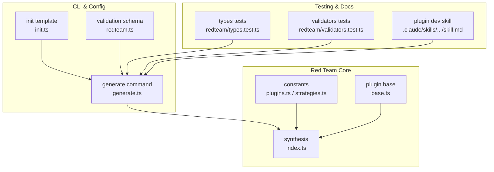
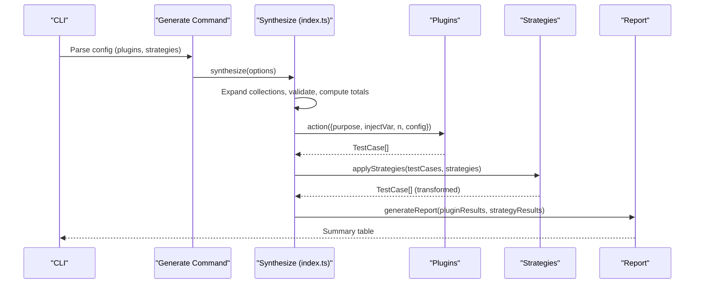
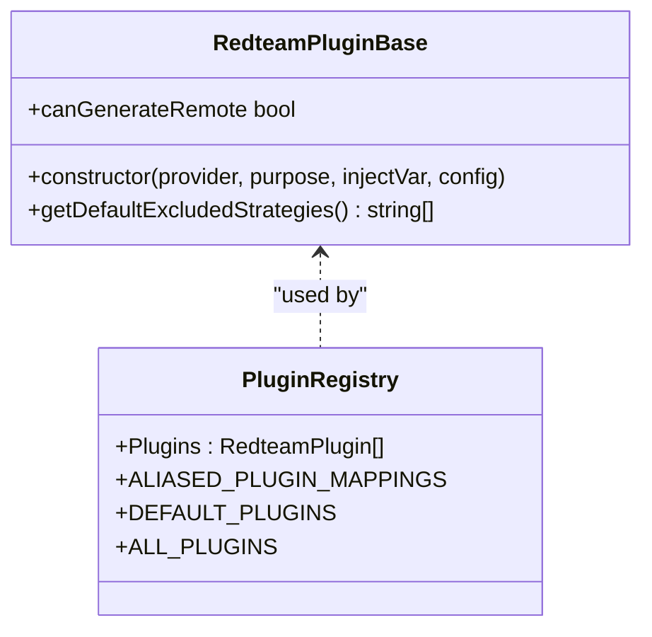
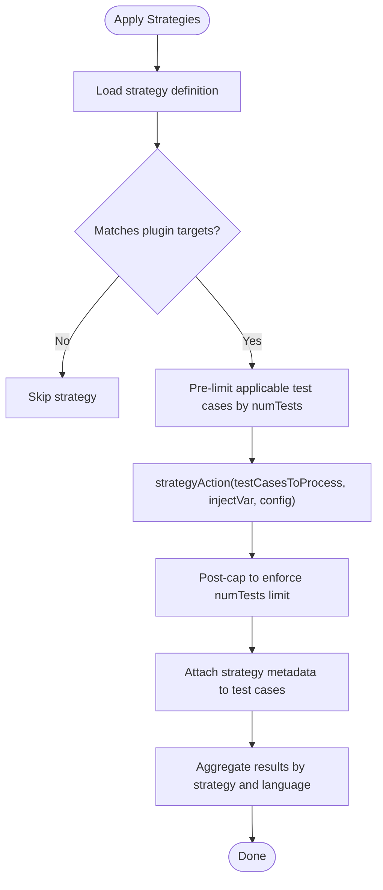
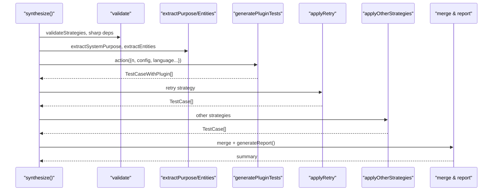
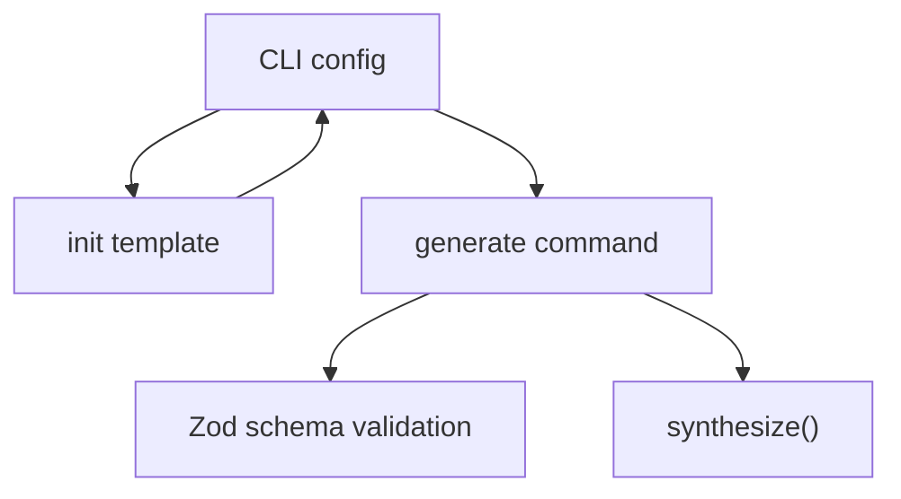
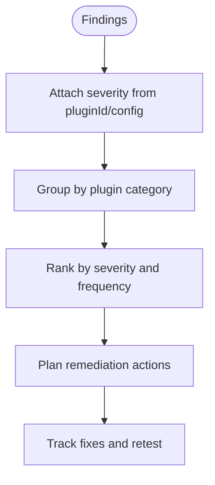
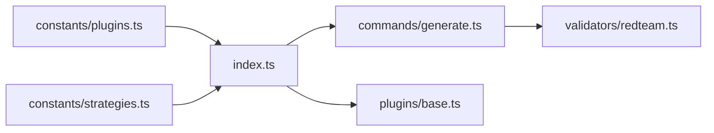

# Red Team Testing

<cite>
**Referenced Files in This Document**
- [AGENTS.md](file://src/redteam/AGENTS.md)
- [index.ts](file://src/redteam/index.ts)
- [constants.ts](file://src/redteam/constants.ts)
- [plugins.ts](file://src/redteam/constants/plugins.ts)
- [strategies.ts](file://src/redteam/constants/strategies.ts)
- [base.ts](file://src/redteam/plugins/base.ts)
- [redteam.ts](file://src/validators/redteam.ts)
- [generate.ts](file://src/redteam/commands/generate.ts)
- [init.ts](file://src/redteam/commands/init.ts)
- [redteam-plugin-development\skill.md](file://.claude/skills/redteam-plugin-development/skill.md)
- [redteam\types.test.ts](file://test/redteam/types.test.ts)
- [redteam\validators.test.ts](file://test/redteam/validators.test.ts)
</cite>

## Table of Contents
1. [Introduction](#introduction)
2. [Project Structure](#project-structure)
3. [Core Components](#core-components)
4. [Architecture Overview](#architecture-overview)
5. [Detailed Component Analysis](#detailed-component-analysis)
6. [Dependency Analysis](#dependency-analysis)
7. [Performance Considerations](#performance-considerations)
8. [Troubleshooting Guide](#troubleshooting-guide)
9. [Conclusion](#conclusion)
10. [Appendices](#appendices)

## Introduction
This document explains how to perform adversarial red team testing for Large Language Model (LLM) applications using PromptFoo’s red team framework. It covers methodology, plugin-driven vulnerability assessment, strategy configuration, risk scoring, prioritization, remediation recommendations, CI/CD integration, and ethical practices. The framework supports 70+ built-in plugins spanning security, bias, and compliance domains, and enables custom plugin development.

## Project Structure
PromptFoo’s red team capability centers around:
- A plugin system that generates adversarial test cases for specific vulnerability families
- A strategy engine that transforms inputs to increase attack efficacy
- A synthesis pipeline that orchestrates generation, metadata enrichment, and reporting
- Validation and CLI scaffolding for configuration and automation

**Diagram sources**
- [index.ts:1-1359](file://src/redteam/index.ts#L1-L1359)
- [plugins.ts:1-556](file://src/redteam/constants/plugins.ts#L1-L556)
- [strategies.ts:1-218](file://src/redteam/constants/strategies.ts#L1-L218)
- [base.ts:42-75](file://src/redteam/plugins/base.ts#L42-L75)
- [generate.ts:416-452](file://src/redteam/commands/generate.ts#L416-L452)
- [init.ts:71-115](file://src/redteam/commands/init.ts#L71-L115)
- [redteam.ts:82-121](file://src/validators/redteam.ts#L82-L121)
- [redteam-plugin-development\skill.md:158-187](file://.claude/skills/redteam-plugin-development/skill.md#L158-L187)
- [redteam\types.test.ts:46-94](file://test/redteam/types.test.ts#L46-L94)
- [redteam\validators.test.ts:136-257](file://test/redteam/validators.test.ts#L136-L257)

**Section sources**
- [AGENTS.md:1-55](file://src/redteam/AGENTS.md#L1-L55)
- [index.ts:1-1359](file://src/redteam/index.ts#L1-L1359)
- [plugins.ts:1-556](file://src/redteam/constants/plugins.ts#L1-L556)
- [strategies.ts:1-218](file://src/redteam/constants/strategies.ts#L1-L218)
- [base.ts:42-75](file://src/redteam/plugins/base.ts#L42-L75)
- [generate.ts:416-452](file://src/redteam/commands/generate.ts#L416-L452)
- [init.ts:71-115](file://src/redteam/commands/init.ts#L71-L115)
- [redteam.ts:82-121](file://src/validators/redteam.ts#L82-L121)
- [redteam-plugin-development\skill.md:158-187](file://.claude/skills/redteam-plugin-development/skill.md#L158-L187)
- [redteam\types.test.ts:46-94](file://test/redteam/types.test.ts#L46-L94)
- [redteam\validators.test.ts:136-257](file://test/redteam/validators.test.ts#L136-L257)

## Core Components
- Plugins: Generate test cases for specific vulnerability families (e.g., harmful content, PII leakage, bias). They can be built-in or custom (file://) and optionally include severity and modifiers.
- Strategies: Transform inputs to increase adversarial effectiveness (e.g., jailbreak variants, encodings, multimodal forms).
- Synthesis pipeline: Orchestrates plugin generation, metadata enrichment, strategy application, and reporting.
- Validation: Zod schemas enforce correct configuration for plugins, strategies, and CLI options.
- CLI scaffolding: Generates starter configurations and integrates with CI/CD.

Key capabilities:
- Multi-language support and per-plugin language overrides
- Fan-out strategies (e.g., best-of-n) and layered strategies
- Retry strategy for retesting flagged cases
- Remote generation support for certain plugins and strategies
- Risk scoring and severity mapping

**Section sources**
- [AGENTS.md:22-55](file://src/redteam/AGENTS.md#L22-L55)
- [plugins.ts:38-83](file://src/redteam/constants/plugins.ts#L38-L83)
- [strategies.ts:15-17](file://src/redteam/constants/strategies.ts#L15-L17)
- [index.ts:800-1359](file://src/redteam/index.ts#L800-L1359)
- [redteam.ts:82-121](file://src/validators/redteam.ts#L82-L121)

## Architecture Overview
High-level flow:
1. CLI parses configuration and expands collections/aliases
2. Plugins generate test cases (optionally per language)
3. Strategies transform inputs (with optional caps and fan-out)
4. Results are enriched with metadata (severity, plugin info, strategy info)
5. Final test sets are produced and summarized

**Diagram sources**
- [generate.ts:416-452](file://src/redteam/commands/generate.ts#L416-L452)
- [index.ts:700-1359](file://src/redteam/index.ts#L700-L1359)
- [plugins.ts:38-83](file://src/redteam/constants/plugins.ts#L38-L83)
- [strategies.ts:75-108](file://src/redteam/constants/strategies.ts#L75-L108)

**Section sources**
- [index.ts:700-1359](file://src/redteam/index.ts#L700-L1359)
- [generate.ts:416-452](file://src/redteam/commands/generate.ts#L416-L452)

## Detailed Component Analysis

### Plugin System
- Built-in plugins cover categories: foundation, harmful, bias, PII, medical, finance, pharmacy, insurance, telecom, real estate, and more.
- Plugins can be specified as simple names or objects with numTests and config.
- Severity can be inferred from plugin short ID or overridden; metadata includes pluginId, pluginConfig, and severity.
- Multi-language support: plugins can specify language arrays; results are tracked per language.

**Diagram sources**
- [base.ts:42-75](file://src/redteam/plugins/base.ts#L42-L75)
- [plugins.ts:38-83](file://src/redteam/constants/plugins.ts#L38-L83)
- [plugins.ts:488-495](file://src/redteam/constants/plugins.ts#L488-L495)

**Section sources**
- [plugins.ts:38-83](file://src/redteam/constants/plugins.ts#L38-L83)
- [plugins.ts:488-495](file://src/redteam/constants/plugins.ts#L488-L495)
- [base.ts:42-75](file://src/redteam/plugins/base.ts#L42-L75)

### Strategy Engine
- Strategies include jailbreak variants, encodings, best-of-n, retry, layer, and multi-turn (e.g., crescendo, goat).
- Strategies can be configured with numTests caps and fan-out multipliers.
- Some strategies require remote generation and are gated when remote generation is disabled.
- Strategies can target specific plugins via config.plugins and are deduplicated by id or layered step identity.

**Diagram sources**
- [index.ts:350-567](file://src/redteam/index.ts#L350-L567)
- [strategies.ts:75-108](file://src/redteam/constants/strategies.ts#L75-L108)
- [strategies.ts:200-217](file://src/redteam/constants/strategies.ts#L200-L217)

**Section sources**
- [index.ts:350-567](file://src/redteam/index.ts#L350-L567)
- [strategies.ts:75-108](file://src/redteam/constants/strategies.ts#L75-L108)
- [strategies.ts:200-217](file://src/redteam/constants/strategies.ts#L200-L217)

### Synthesis Pipeline
- Validates strategies and sharp dependencies, resolves provider, computes expected totals, and logs summaries.
- Handles multi-input mode (with reserved variable to avoid collisions) and excludes incompatible plugins.
- Extracts system purpose and entities, then generates plugin tests per language in parallel.
- Applies retry strategy first, then other strategies, combining results according to basic strategy settings.
- Produces a tabular report of plugin and strategy generation status.

**Diagram sources**
- [index.ts:700-1359](file://src/redteam/index.ts#L700-L1359)

**Section sources**
- [index.ts:700-1359](file://src/redteam/index.ts#L700-L1359)

### Configuration and CLI
- CLI supports specifying plugins, strategies, numTests, and purpose. Templates can be generated for quick start.
- Validation enforces correct plugin names, positive numTests, and proper structure.
- Policies can be resolved and injected into plugin configs, with severity propagation.

**Diagram sources**
- [init.ts:71-115](file://src/redteam/commands/init.ts#L71-L115)
- [generate.ts:416-452](file://src/redteam/commands/generate.ts#L416-L452)
- [redteam.ts:82-121](file://src/validators/redteam.ts#L82-L121)

**Section sources**
- [init.ts:71-115](file://src/redteam/commands/init.ts#L71-L115)
- [generate.ts:416-452](file://src/redteam/commands/generate.ts#L416-L452)
- [redteam.ts:82-121](file://src/validators/redteam.ts#L82-L121)

### Risk Scoring, Prioritization, and Remediation
- Severity mapping: Plugins derive severity from short IDs or explicit config; severity is attached to test case metadata.
- Reporting: The pipeline produces a summary table of requested vs generated counts per plugin and strategy, aiding prioritization.
- Remediation recommendations: Use plugin categories and severity to triage findings; focus on high-severity plugins (e.g., harmful, PII, bias) and strategies that increase attack surface.

**Diagram sources**
- [index.ts:85-94](file://src/redteam/index.ts#L85-L94)
- [index.ts:173-213](file://src/redteam/index.ts#L173-L213)

**Section sources**
- [index.ts:85-94](file://src/redteam/index.ts#L85-L94)
- [index.ts:173-213](file://src/redteam/index.ts#L173-L213)

### CI/CD Integration
- Use the CLI to generate test suites and integrate with CI jobs.
- Validate configurations with Zod schemas prior to generation.
- Store sensitive prompts securely; leverage logging controls for safety.

[No sources needed since this section provides general guidance]

### Ethical Considerations and Responsible Disclosure
- Treat sensitive test content with care; follow logging and data handling guidelines.
- Limit scope to authorized environments; obtain approvals before running adversarial tests.
- Report findings responsibly, including severity, reproduction steps, and remediation status.

[No sources needed since this section provides general guidance]

## Dependency Analysis
- Plugin registry and strategy registry define available capabilities and constraints.
- Synthesis depends on provider availability, remote generation health, and concurrency limits.
- Validation ensures configuration correctness and prevents misuse.

**Diagram sources**
- [plugins.ts:1-556](file://src/redteam/constants/plugins.ts#L1-L556)
- [strategies.ts:1-218](file://src/redteam/constants/strategies.ts#L1-L218)
- [index.ts:1-1359](file://src/redteam/index.ts#L1-L1359)
- [generate.ts:416-452](file://src/redteam/commands/generate.ts#L416-L452)
- [redteam.ts:82-121](file://src/validators/redteam.ts#L82-L121)
- [base.ts:42-75](file://src/redteam/plugins/base.ts#L42-L75)

**Section sources**
- [plugins.ts:1-556](file://src/redteam/constants/plugins.ts#L1-L556)
- [strategies.ts:1-218](file://src/redteam/constants/strategies.ts#L1-L218)
- [index.ts:1-1359](file://src/redteam/index.ts#L1-L1359)
- [generate.ts:416-452](file://src/redteam/commands/generate.ts#L416-L452)
- [redteam.ts:82-121](file://src/validators/redteam.ts#L82-L121)
- [base.ts:42-75](file://src/redteam/plugins/base.ts#L42-L75)

## Performance Considerations
- Concurrency: The pipeline caps max concurrency and disables concurrent requests when delay is enabled.
- Pre/post limiting: Strategies can be pre-limited and post-capped to manage resource usage.
- Fan-out strategies: Use numTests caps to bound combinatorial explosion.
- Multi-language: Per-language generation is parallelized; consider language counts when estimating workload.

[No sources needed since this section provides general guidance]

## Troubleshooting Guide
- Validation failures: Ensure plugin names are valid and numTests is positive; review error messages for guidance.
- Remote generation: Some strategies require remote generation; confirm health checks pass and environment variables are configured.
- Multi-input mode: Certain plugins are excluded in multi-input mode; adjust plugin lists accordingly.
- Progress and logs: Use debug logs and progress bars to diagnose bottlenecks.

**Section sources**
- [redteam.ts:82-121](file://src/validators/redteam.ts#L82-L121)
- [redteam\validators.test.ts:136-257](file://test/redteam/validators.test.ts#L136-L257)
- [index.ts:737-745](file://src/redteam/index.ts#L737-L745)
- [index.ts:909-918](file://src/redteam/index.ts#L909-L918)

## Conclusion
PromptFoo’s red team framework provides a robust, extensible approach to adversarial testing for LLM applications. By combining a rich set of plugins, transformation strategies, and strong validation, teams can systematically uncover vulnerabilities, prioritize risks, and remediate issues—while integrating seamlessly into CI/CD and adhering to ethical safeguards.

## Appendices

### Plugin Development Workflow
- Create plugin file and export from index
- Register in plugin constants and metadata
- Add grader and documentation
- Update shared plugin data for UI

**Section sources**
- [redteam-plugin-development\skill.md:158-187](file://.claude/skills/redteam-plugin-development/skill.md#L158-L187)

### Example Attack Vectors and Mitigations
- Prompt injection and jailbreaking: Use jailbreak strategies and guardrails evaluation plugins; harden system prompts and boundaries.
- Harmful content: Apply harmful content plugins and moderation strategies; configure content filters and policy enforcement.
- PII leakage: Use PII plugins and privacy-focused strategies; implement data minimization and access controls.
- Bias detection: Leverage bias plugins and fairness-aware strategies; audit datasets and scoring functions.
- Compliance: Use domain-specific plugins (finance, healthcare, telecom) aligned with regulatory frameworks.

[No sources needed since this section provides general guidance]