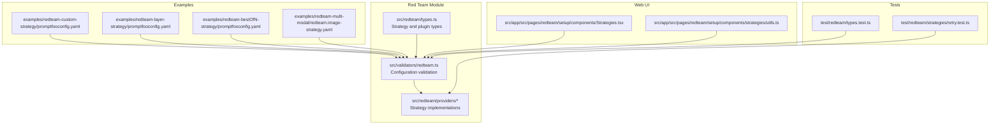
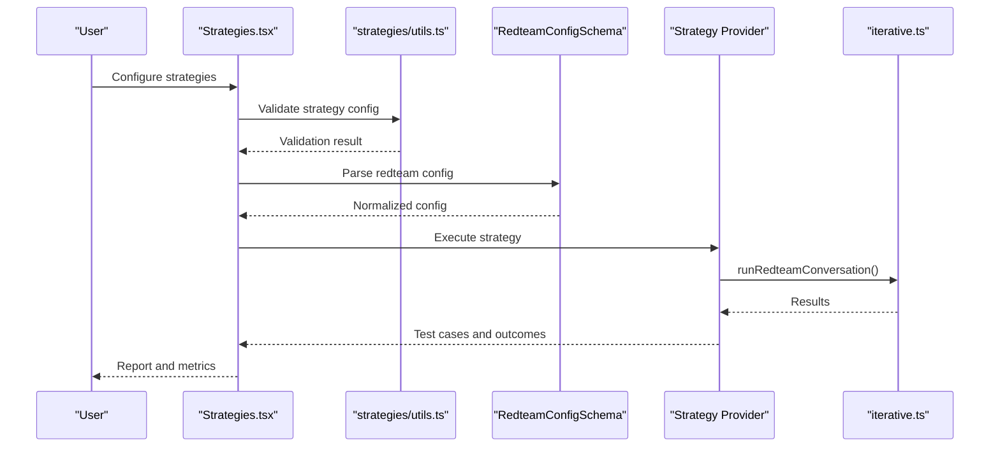
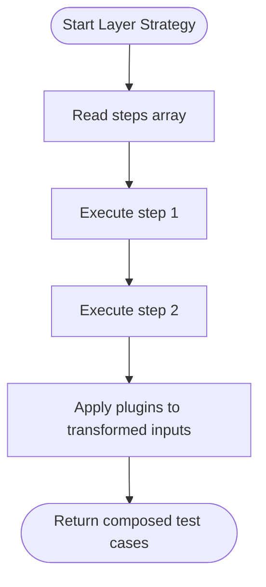
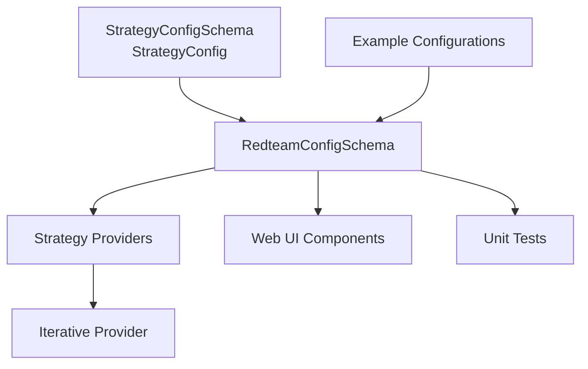

# Strategy Configuration

<cite>
**Referenced Files in This Document**
- [src/redteam/types.ts](file://src/redteam/types.ts)
- [src/validators/redteam.ts](file://src/validators/redteam.ts)
- [examples/redteam-custom-strategy/promptfooconfig.yaml](file://examples/redteam-custom-strategy/promptfooconfig.yaml)
- [examples/redteam-layer-strategy/promptfooconfig.yaml](file://examples/redteam-layer-strategy/promptfooconfig.yaml)
- [examples/redteam-bestOfN-strategy/promptfooconfig.yaml](file://examples/redteam-bestOfN-strategy/promptfooconfig.yaml)
- [examples/redteam-multi-modal/redteam.image-strategy.yaml](file://examples/redteam-multi-modal/redteam.image-strategy.yaml)
- [src/app/src/pages/redteam/setup/components/Strategies.tsx](file://src/app/src/pages/redteam/setup/components/Strategies.tsx)
- [src/app/src/pages/redteam/setup/components/strategies/utils.ts](file://src/app/src/pages/redteam/setup/components/strategies/utils.ts)
- [test/redteam/types.test.ts](file://test/redteam/types.test.ts)
- [test/redteam/strategies/retry.test.ts](file://test/redteam/strategies/retry.test.ts)
- [src/redteam/providers/iterative.ts](file://src/redteam/providers/iterative.ts)
- [CHANGELOG.md](file://CHANGELOG.md)
</cite>

## Table of Contents
1. [Introduction](#introduction)
2. [Project Structure](#project-structure)
3. [Core Components](#core-components)
4. [Architecture Overview](#architecture-overview)
5. [Detailed Component Analysis](#detailed-component-analysis)
6. [Dependency Analysis](#dependency-analysis)
7. [Performance Considerations](#performance-considerations)
8. [Troubleshooting Guide](#troubleshooting-guide)
9. [Conclusion](#conclusion)

## Introduction
This document provides comprehensive guidance for configuring red team testing strategies in PromptFoo. It explains strategy parameter configuration, including attack strength levels, iteration counts, and timeout settings; strategy chaining and sequential execution patterns; strategy-specific configuration options such as prompt templates, attack vectors, and validation criteria; selection criteria based on testing goals, model capabilities, and risk tolerance; configuration examples for vulnerability discovery, safety assessment, and capability testing; parameter tuning for optimal results and performance optimization; and validation, testing procedures, and quality assurance processes.

## Project Structure
PromptFoo organizes red team configuration under a dedicated red team module with strong typing and validation. Key areas include:
- Strategy and plugin configuration types and schemas
- Validation logic for configuration correctness
- Example configurations demonstrating practical usage
- Web UI components for strategy selection and configuration
- Provider implementations for strategy execution

**Diagram sources**
- [src/redteam/types.ts:107-118](file://src/redteam/types.ts#L107-L118)
- [src/validators/redteam.ts:250-328](file://src/validators/redteam.ts#L250-L328)
- [examples/redteam-custom-strategy/promptfooconfig.yaml:1-22](file://examples/redteam-custom-strategy/promptfooconfig.yaml#L1-L22)
- [examples/redteam-layer-strategy/promptfooconfig.yaml:1-38](file://examples/redteam-layer-strategy/promptfooconfig.yaml#L1-L38)
- [examples/redteam-bestOfN-strategy/promptfooconfig.yaml:1-30](file://examples/redteam-bestOfN-strategy/promptfooconfig.yaml#L1-L30)
- [examples/redteam-multi-modal/redteam.image-strategy.yaml:1-140](file://examples/redteam-multi-modal/redteam.image-strategy.yaml#L1-L140)
- [src/app/src/pages/redteam/setup/components/Strategies.tsx:64-103](file://src/app/src/pages/redteam/setup/components/Strategies.tsx#L64-L103)
- [src/app/src/pages/redteam/setup/components/strategies/utils.ts:1-35](file://src/app/src/pages/redteam/setup/components/strategies/utils.ts#L1-L35)
- [test/redteam/types.test.ts:275-354](file://test/redteam/types.test.ts#L275-L354)
- [test/redteam/strategies/retry.test.ts:518-547](file://test/redteam/strategies/retry.test.ts#L518-L547)

**Section sources**
- [src/redteam/types.ts:107-118](file://src/redteam/types.ts#L107-L118)
- [src/validators/redteam.ts:250-328](file://src/validators/redteam.ts#L250-L328)

## Core Components
This section outlines the foundational types and schemas that define strategy configuration in PromptFoo.

- StrategyConfigSchema: Defines the shape for strategy-level configuration, including optional enablement flags, plugin lists, and numeric test counts. It accepts arbitrary additional fields via catch-all to support strategy-specific parameters.
- RedteamConfigSchema: Validates the top-level red team configuration, including strategies, plugins, provider settings, concurrency, delays, and tracing options. It also handles migration logic for deprecated strategies and normalization of language settings.
- StrategyConfig: The inferred TypeScript type for strategy configuration, enabling strongly typed access to configuration values.

Key characteristics:
- numTests: Integer, non-negative, finite; supports zero to disable generation for that strategy.
- enabled: Boolean flag to enable/disable a strategy.
- plugins: Optional array of plugin identifiers to restrict strategy scope.
- Arbitrary fields: Additional strategy-specific configuration is permitted.

Validation behavior:
- Positive integer validation for numTests.
- Rejection of invalid types (strings, decimals, Infinity, NaN).
- Acceptance of missing numTests (undefined).

**Section sources**
- [src/redteam/types.ts:107-118](file://src/redteam/types.ts#L107-L118)
- [src/validators/redteam.ts:250-328](file://src/validators/redteam.ts#L250-L328)
- [test/redteam/types.test.ts:275-354](file://test/redteam/types.test.ts#L275-L354)

## Architecture Overview
The strategy configuration architecture integrates configuration validation, strategy execution, and UI-driven setup.

**Diagram sources**
- [src/app/src/pages/redteam/setup/components/Strategies.tsx:64-103](file://src/app/src/pages/redteam/setup/components/Strategies.tsx#L64-L103)
- [src/app/src/pages/redteam/setup/components/strategies/utils.ts:1-35](file://src/app/src/pages/redteam/setup/components/strategies/utils.ts#L1-L35)
- [src/validators/redteam.ts:250-328](file://src/validators/redteam.ts#L250-L328)
- [src/redteam/providers/iterative.ts:208-861](file://src/redteam/providers/iterative.ts#L208-L861)

## Detailed Component Analysis

### Strategy Parameter Configuration
Strategy parameters are defined by StrategyConfigSchema and validated by RedteamConfigSchema. The following parameters are supported:

- enabled: Boolean to enable or disable a strategy globally.
- plugins: Restrict strategy execution to specific plugins.
- numTests: Controls the number of test cases generated per strategy; supports zero to disable generation.
- Arbitrary fields: Strategy-specific configuration (e.g., numIterations for iterative strategy).

Validation rules:
- numTests must be a finite integer ≥ 0.
- Strings, decimals, Infinity, and NaN are rejected.
- Missing numTests is allowed and treated as undefined.

Practical examples:
- Custom strategy configuration via file path.
- Layer strategy with chained steps.
- Best-of-N strategy for adversarial input generation.
- Image strategy for multimodal safety assessment.

**Section sources**
- [src/redteam/types.ts:107-118](file://src/redteam/types.ts#L107-L118)
- [src/validators/redteam.ts:250-328](file://src/validators/redteam.ts#L250-L328)
- [examples/redteam-custom-strategy/promptfooconfig.yaml:1-22](file://examples/redteam-custom-strategy/promptfooconfig.yaml#L1-L22)
- [examples/redteam-layer-strategy/promptfooconfig.yaml:1-38](file://examples/redteam-layer-strategy/promptfooconfig.yaml#L1-L38)
- [examples/redteam-bestOfN-strategy/promptfooconfig.yaml:1-30](file://examples/redteam-bestOfN-strategy/promptfooconfig.yaml#L1-L30)
- [examples/redteam-multi-modal/redteam.image-strategy.yaml:1-140](file://examples/redteam-multi-modal/redteam.image-strategy.yaml#L1-L140)
- [test/redteam/types.test.ts:275-354](file://test/redteam/types.test.ts#L275-L354)

### Strategy Chaining and Sequential Execution
Strategy chaining enables layered transformations and sequential execution patterns. The layer strategy composes multiple steps, allowing progressive obfuscation or translation before applying plugins.

Implementation highlights:
- Steps array defines the order of transformations.
- Each step can include nested strategies or plugin-specific configurations.
- Unique keys are computed for layer strategies to differentiate multiple instances.

**Diagram sources**
- [src/validators/redteam.ts:498-540](file://src/validators/redteam.ts#L498-L540)
- [examples/redteam-layer-strategy/promptfooconfig.yaml:13-38](file://examples/redteam-layer-strategy/promptfooconfig.yaml#L13-L38)

**Section sources**
- [src/validators/redteam.ts:498-540](file://src/validators/redteam.ts#L498-L540)
- [examples/redteam-layer-strategy/promptfooconfig.yaml:1-38](file://examples/redteam-layer-strategy/promptfooconfig.yaml#L1-L38)

### Strategy-Specific Configuration Options
Different strategies expose specific configuration options:

- Iterative strategy: numIterations controls the number of iterations for conversation refinement.
- Layer strategy: steps define transformation sequences; supports nested strategies and plugin scoping.
- Best-of-N strategy: generates multiple variants and selects the most effective adversarial inputs.
- Image strategy: applies multimodal safety checks to image-encoded prompts.

Configuration examples:
- Iterative strategy with numIterations parameter.
- Layer strategy with multilingual and encoding steps.
- Best-of-N strategy with numTests controlling variant generation.
- Image strategy with image and text inputs plus targeted assertions.

**Section sources**
- [examples/redteam-custom-strategy/promptfooconfig.yaml:1-22](file://examples/redteam-custom-strategy/promptfooconfig.yaml#L1-L22)
- [examples/redteam-layer-strategy/promptfooconfig.yaml:1-38](file://examples/redteam-layer-strategy/promptfooconfig.yaml#L1-L38)
- [examples/redteam-bestOfN-strategy/promptfooconfig.yaml:1-30](file://examples/redteam-bestOfN-strategy/promptfooconfig.yaml#L1-L30)
- [examples/redteam-multi-modal/redteam.image-strategy.yaml:1-140](file://examples/redteam-multi-modal/redteam.image-strategy.yaml#L1-L140)
- [CHANGELOG.md](file://CHANGELOG.md#L5700)

### Strategy Selection Criteria
Selecting appropriate strategies depends on testing goals, model capabilities, and risk tolerance:

- Vulnerability discovery: Use layer strategies with progressive obfuscation and best-of-N to generate diverse adversarial inputs.
- Safety assessment: Employ image strategy for multimodal content and plugin-specific safety checks.
- Capability testing: Combine plugin collections with targeted strategies to probe robustness and alignment.

Guidelines:
- Align strategy complexity with model capabilities; simpler strategies for baseline testing, layered approaches for advanced red teaming.
- Adjust risk tolerance by scaling numTests and iteration counts; higher values increase coverage but cost time and resources.
- Scope strategies to relevant plugins to focus testing on specific domains (e.g., harmful content, PII).

**Section sources**
- [src/validators/redteam.ts:285-328](file://src/validators/redteam.ts#L285-L328)
- [examples/redteam-layer-strategy/promptfooconfig.yaml:1-38](file://examples/redteam-layer-strategy/promptfooconfig.yaml#L1-L38)
- [examples/redteam-multi-modal/redteam.image-strategy.yaml:1-140](file://examples/redteam-multi-modal/redteam.image-strategy.yaml#L1-L140)

### Configuration Examples
Below are scenario-based configuration examples derived from repository examples:

- Vulnerability discovery with Best-of-N:
  - Controls the number of adversarial inputs per plugin.
  - Demonstrates plugin scoping and test count configuration.

- Safety assessment with Image strategy:
  - Uses image and text inputs for multimodal safety checks.
  - Includes targeted assertions for specific harm categories.

- Custom strategy with file-based implementation:
  - Loads a custom strategy via file path.
  - Integrates with plugin ecosystems for tailored attack vectors.

- Layer strategy chaining:
  - Composes multilingual and encoding transformations.
  - Applies plugins selectively to reduce noise and focus on specific risks.

**Section sources**
- [examples/redteam-bestOfN-strategy/promptfooconfig.yaml:1-30](file://examples/redteam-bestOfN-strategy/promptfooconfig.yaml#L1-L30)
- [examples/redteam-multi-modal/redteam.image-strategy.yaml:1-140](file://examples/redteam-multi-modal/redteam.image-strategy.yaml#L1-L140)
- [examples/redteam-custom-strategy/promptfooconfig.yaml:1-22](file://examples/redteam-custom-strategy/promptfooconfig.yaml#L1-L22)
- [examples/redteam-layer-strategy/promptfooconfig.yaml:1-38](file://examples/redteam-layer-strategy/promptfooconfig.yaml#L1-L38)

### Strategy Parameter Tuning and Performance Optimization
Optimization tips grounded in repository behavior and changelog notes:

- numTests tuning:
  - Increase for broader coverage; decrease to reduce runtime.
  - Zero disables generation for that strategy.

- Concurrency and delays:
  - maxConcurrency controls parallel API calls.
  - delay introduces throttling between plugin API calls to manage rate limits and stability.

- Iterative strategy:
  - numIterations governs refinement cycles; higher values improve targeting but increase latency.

- Timeout handling:
  - Provider-level timeouts and retry mechanisms mitigate transient errors and health check delays.

- Quality assurance:
  - Metadata includes strategyId for traceability and debugging.
  - Validation ensures configuration correctness and rejects invalid types.

**Section sources**
- [src/validators/redteam.ts:250-328](file://src/validators/redteam.ts#L250-L328)
- [src/redteam/providers/iterative.ts:208-861](file://src/redteam/providers/iterative.ts#L208-L861)
- [CHANGELOG.md](file://CHANGELOG.md#L330)
- [CHANGELOG.md](file://CHANGELOG.md#L568)
- [CHANGELOG.md](file://CHANGELOG.md#L1206)
- [CHANGELOG.md](file://CHANGELOG.md#L5700)
- [test/redteam/strategies/retry.test.ts:518-547](file://test/redteam/strategies/retry.test.ts#L518-L547)

## Dependency Analysis
The strategy configuration system exhibits clear separation of concerns:

**Diagram sources**
- [src/redteam/types.ts:107-118](file://src/redteam/types.ts#L107-L118)
- [src/validators/redteam.ts:250-328](file://src/validators/redteam.ts#L250-L328)
- [src/app/src/pages/redteam/setup/components/Strategies.tsx:64-103](file://src/app/src/pages/redteam/setup/components/Strategies.tsx#L64-L103)
- [src/redteam/providers/iterative.ts:208-861](file://src/redteam/providers/iterative.ts#L208-L861)
- [examples/redteam-custom-strategy/promptfooconfig.yaml:1-22](file://examples/redteam-custom-strategy/promptfooconfig.yaml#L1-L22)

**Section sources**
- [src/redteam/types.ts:107-118](file://src/redteam/types.ts#L107-L118)
- [src/validators/redteam.ts:250-328](file://src/validators/redteam.ts#L250-L328)

## Performance Considerations
- Control resource usage with maxConcurrency and delay to balance throughput and stability.
- Use numTests judiciously; larger values increase coverage but also compute and API costs.
- Prefer selective plugin application in strategies to minimize redundant test cases.
- Monitor provider timeouts and retry behavior to avoid bottlenecks during generation.

[No sources needed since this section provides general guidance]

## Troubleshooting Guide
Common issues and resolutions:

- Invalid numTests values:
  - Rejects strings, decimals, Infinity, NaN; use integers ≥ 0.
  - Zero disables generation for that strategy.

- Strategy configuration validation failures:
  - Ensure strategy IDs are valid or custom file paths end with .js/.ts.
  - Verify plugin collections and aliases conform to supported sets.

- StrategyId metadata:
  - Tests confirm strategyId is included in metadata for traceability.

- Provider timeouts and retries:
  - Adjust provider timeouts and leverage retry logic to handle transient errors.

**Section sources**
- [test/redteam/types.test.ts:275-354](file://test/redteam/types.test.ts#L275-L354)
- [test/redteam/strategies/retry.test.ts:518-547](file://test/redteam/strategies/retry.test.ts#L518-L547)
- [CHANGELOG.md](file://CHANGELOG.md#L330)
- [CHANGELOG.md](file://CHANGELOG.md#L568)

## Conclusion
PromptFoo’s red team strategy configuration offers flexible, strongly typed, and validated control over attack generation. By leveraging strategy parameters (enabled, plugins, numTests), chaining strategies for layered transformations, and aligning selections with testing goals and model capabilities, teams can optimize both coverage and performance. Robust validation, metadata tracking, and provider timeout handling ensure reliable and observable red team operations.