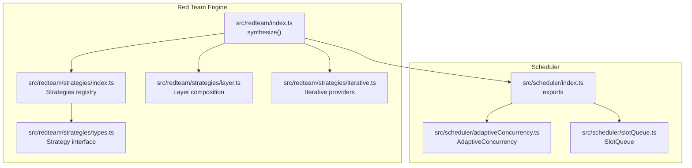
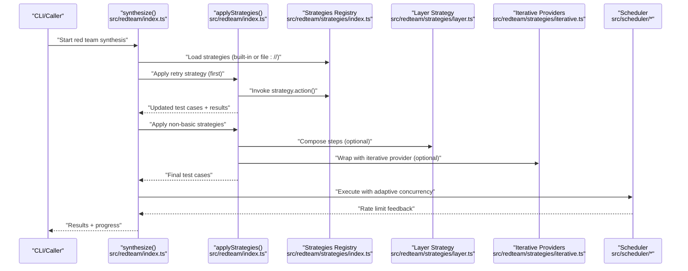
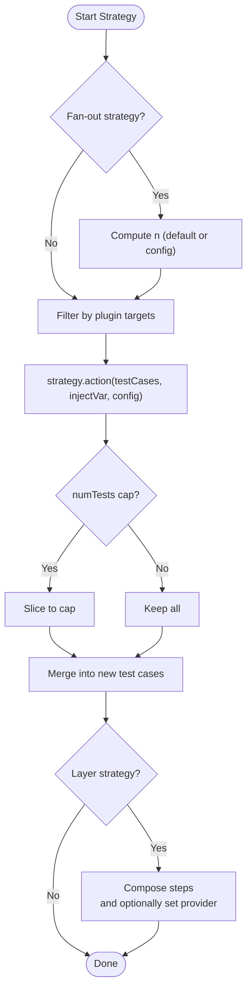
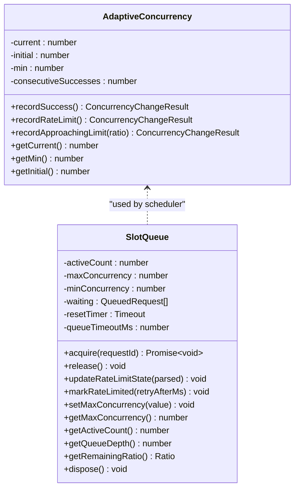
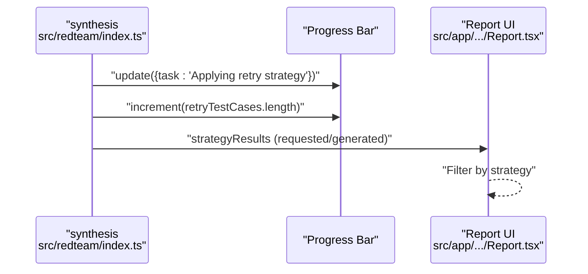
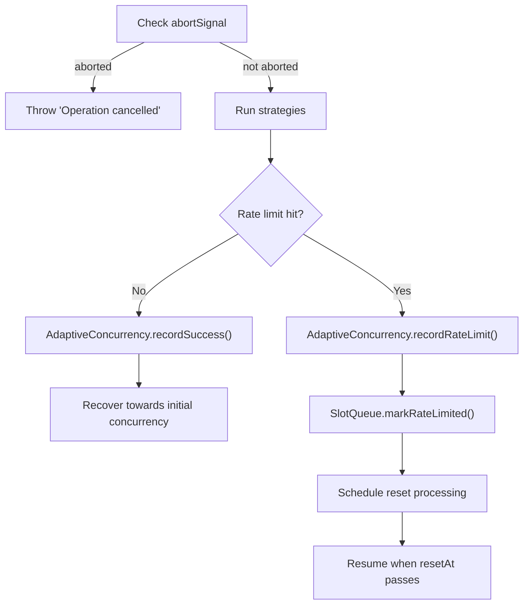
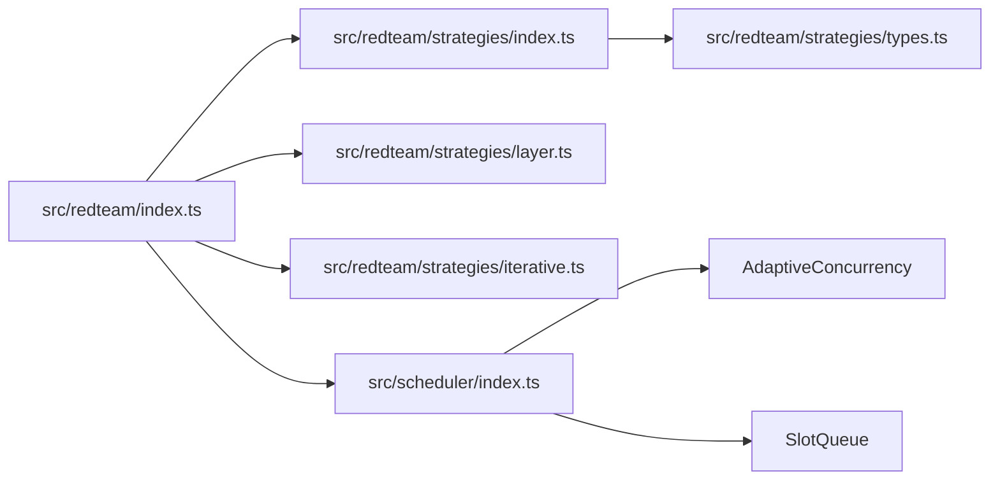

# Strategy Execution

<cite>
**Referenced Files in This Document**
- [index.ts](file://src/redteam/index.ts)
- [index.ts](file://src/redteam/strategies/index.ts)
- [types.ts](file://src/redteam/strategies/types.ts)
- [layer.ts](file://src/redteam/strategies/layer.ts)
- [iterative.ts](file://src/redteam/strategies/iterative.ts)
- [index.ts](file://src/scheduler/index.ts)
- [adaptiveConcurrency.ts](file://src/scheduler/adaptiveConcurrency.ts)
- [slotQueue.ts](file://src/scheduler/slotQueue.ts)
- [index.ts](file://src/app/src/pages/redteam/report/components/Report.tsx)
- [custom-strategy.md](file://site/docs/red-team/strategies/custom-strategy.md)
- [index.md](file://site/docs/red-team/strategies/index.md)
- [tree.md](file://site/docs/red-team/strategies/tree.md)
- [scheduler-architecture.md](file://docs/scheduler-architecture.md)
- [index.test.ts](file://test/redteam/index.test.ts)
- [adaptiveConcurrency.test.ts](file://test/scheduler/adaptiveConcurrency.test.ts)
- [slotQueue.test.ts](file://test/scheduler/slotQueue.test.ts)
- [types.test.ts](file://test/redteam/types.test.ts)
</cite>

## Table of Contents
1. [Introduction](#introduction)
2. [Project Structure](#project-structure)
3. [Core Components](#core-components)
4. [Architecture Overview](#architecture-overview)
5. [Detailed Component Analysis](#detailed-component-analysis)
6. [Dependency Analysis](#dependency-analysis)
7. [Performance Considerations](#performance-considerations)
8. [Troubleshooting Guide](#troubleshooting-guide)
9. [Conclusion](#conclusion)
10. [Appendices](#appendices)

## Introduction
This document explains how PromptFoo executes red team testing strategies, focusing on execution patterns (parallel, sequential chaining, conditional branching), scheduling, concurrency management, monitoring, interruption/resumption/recovery, and optimization. It synthesizes the strategy pipeline from plugin-generated test cases through strategy application, layered composition, and iterative providers, and maps it to the adaptive scheduling infrastructure that manages concurrency and rate limits.

## Project Structure
PromptFoo’s red team execution is orchestrated by a central synthesis function that:
- Loads and validates strategies
- Expands strategy collections
- Applies strategies in a controlled order
- Tracks results and progress
- Integrates with the scheduler for concurrency and rate-limit adaptation

**Diagram sources**
- [index.ts:700-1326](file://src/redteam/index.ts#L700-L1326)
- [index.ts:40-370](file://src/redteam/strategies/index.ts#L40-L370)
- [types.ts:3-13](file://src/redteam/strategies/types.ts#L3-L13)
- [layer.ts:39-167](file://src/redteam/strategies/layer.ts#L39-L167)
- [iterative.ts:3-59](file://src/redteam/strategies/iterative.ts#L3-L59)
- [index.ts:1-61](file://src/scheduler/index.ts#L1-L61)
- [adaptiveConcurrency.ts:29-143](file://src/scheduler/adaptiveConcurrency.ts#L29-L143)
- [slotQueue.ts:28-305](file://src/scheduler/slotQueue.ts#L28-L305)

**Section sources**
- [index.ts:700-1326](file://src/redteam/index.ts#L700-L1326)
- [index.ts:40-370](file://src/redteam/strategies/index.ts#L40-L370)
- [index.ts:1-61](file://src/scheduler/index.ts#L1-L61)

## Core Components
- Strategy registry and execution: Strategies are registered with an id and action. The synthesis pipeline loads built-in strategies or custom strategy modules and invokes their action with test cases, inject var, and config.
- Strategy application: The applyStrategies function filters test cases by plugin targeting rules, respects numTests caps, and merges strategy metadata into test cases.
- Layered composition: The layer strategy composes multiple strategies sequentially and can convert a test case into an attack provider with per-turn transforms.
- Iterative providers: Strategies like jailbreak:meta, jailbreak:tree, and jailbreak:composite delegate to iterative providers that orchestrate multi-turn or multi-attempt evaluations.
- Scheduling and concurrency: The scheduler exposes AdaptiveConcurrency and SlotQueue to manage provider throughput, rate limits, and queue depth.

**Section sources**
- [index.ts:40-370](file://src/redteam/strategies/index.ts#L40-L370)
- [types.ts:3-13](file://src/redteam/strategies/types.ts#L3-L13)
- [index.ts:350-567](file://src/redteam/index.ts#L350-L567)
- [layer.ts:39-167](file://src/redteam/strategies/layer.ts#L39-L167)
- [iterative.ts:3-59](file://src/redteam/strategies/iterative.ts#L3-L59)
- [index.ts:1-61](file://src/scheduler/index.ts#L1-L61)

## Architecture Overview
The strategy execution pipeline integrates plugin generation, strategy application, and provider orchestration with adaptive scheduling.

**Diagram sources**
- [index.ts:1293-1326](file://src/redteam/index.ts#L1293-L1326)
- [index.ts:350-567](file://src/redteam/index.ts#L350-L567)
- [index.ts:40-370](file://src/redteam/strategies/index.ts#L40-L370)
- [layer.ts:39-167](file://src/redteam/strategies/layer.ts#L39-L167)
- [iterative.ts:3-59](file://src/redteam/strategies/iterative.ts#L3-L59)
- [index.ts:1-61](file://src/scheduler/index.ts#L1-L61)

## Detailed Component Analysis

### Strategy Execution Patterns
- Parallel execution: Strategies can fan out test cases (e.g., best-of-n, jailbreak:composite). The synthesis pipeline computes requested vs. generated counts and caps outputs via numTests.
- Sequential chaining: The layer strategy composes steps in order. If an attack provider is encountered, remaining steps become per-turn transforms.
- Conditional branching: Built-in strategies embed branching logic (e.g., jailbreak variants). Custom strategies can encode conditional instructions (see documentation).

**Diagram sources**
- [index.ts:350-567](file://src/redteam/index.ts#L350-L567)
- [layer.ts:39-167](file://src/redteam/strategies/layer.ts#L39-L167)

**Section sources**
- [index.ts:576-613](file://src/redteam/index.ts#L576-L613)
- [index.ts:350-567](file://src/redteam/index.ts#L350-L567)
- [layer.ts:39-167](file://src/redteam/strategies/layer.ts#L39-L167)
- [custom-strategy.md:245-298](file://site/docs/red-team/strategies/custom-strategy.md#L245-L298)

### Strategy Scheduling and Concurrency Management
- Adaptive concurrency: The AdaptiveConcurrency class increases concurrency after sustained successes and decreases it upon rate limits, with thresholds and factors controlling recovery and backoff.
- Slot queue: The SlotQueue enforces max/min concurrency, maintains a FIFO queue, tracks rate limit state, and schedules reset processing when quotas are exhausted.
- Scheduler integration: The scheduler exports types and utilities for wrapping providers and managing rate limits.

**Diagram sources**
- [adaptiveConcurrency.ts:29-143](file://src/scheduler/adaptiveConcurrency.ts#L29-L143)
- [slotQueue.ts:28-305](file://src/scheduler/slotQueue.ts#L28-L305)

**Section sources**
- [adaptiveConcurrency.ts:29-143](file://src/scheduler/adaptiveConcurrency.ts#L29-L143)
- [slotQueue.ts:28-305](file://src/scheduler/slotQueue.ts#L28-L305)
- [index.ts:1-61](file://src/scheduler/index.ts#L1-L61)
- [scheduler-architecture.md:16-41](file://docs/scheduler-architecture.md#L16-L41)

### Strategy Monitoring, Progress Tracking, and Real-time Status
- Progress tracking: The synthesis function updates a progress bar and increments counters for retry and other strategies.
- Reporting: The UI supports filtering by strategy and displaying strategy-specific metrics.
- Strategy results: The synthesis pipeline aggregates requested vs. generated counts per strategy for reporting.

**Diagram sources**
- [index.ts:1293-1315](file://src/redteam/index.ts#L1293-L1315)
- [index.ts:1290-1292](file://src/redteam/index.ts#L1290-L1292)
- [index.ts:862-896](file://src/app/src/pages/redteam/report/components/Report.tsx#L862-L896)

**Section sources**
- [index.ts:1290-1315](file://src/redteam/index.ts#L1290-L1315)
- [index.ts:862-896](file://src/app/src/pages/redteam/report/components/Report.tsx#L862-L896)

### Strategy Interruption, Resumption, and Recovery
- Interruption: Abort signals are checked at key points in synthesis; cancellation throws an error.
- Resumption: The retry strategy adds historical failures back into the test suite, enabling incremental resumption of failed paths.
- Recovery: AdaptiveConcurrency recovers toward initial concurrency after sustained successes; SlotQueue proactively reduces concurrency near rate limit warnings and schedules reset processing.

**Diagram sources**
- [index.ts:724-732](file://src/redteam/index.ts#L724-L732)
- [adaptiveConcurrency.ts:75-87](file://src/scheduler/adaptiveConcurrency.ts#L75-L87)
- [slotQueue.ts:145-164](file://src/scheduler/slotQueue.ts#L145-L164)
- [slotQueue.ts:230-244](file://src/scheduler/slotQueue.ts#L230-L244)

**Section sources**
- [index.ts:724-732](file://src/redteam/index.ts#L724-L732)
- [adaptiveConcurrency.test.ts:36-115](file://test/scheduler/adaptiveConcurrency.test.ts#L36-L115)
- [slotQueue.test.ts:238-280](file://test/scheduler/slotQueue.test.ts#L238-L280)

### Execution Examples

#### Single Strategy Testing
- Use a single strategy (e.g., base64) to transform plugin-generated inputs.
- Configure numTests to cap output if needed.

**Section sources**
- [index.ts:57-81](file://src/redteam/strategies/index.ts#L57-L81)
- [index.test.ts:2679-2720](file://test/redteam/index.test.ts#L2679-L2720)

#### Multi-Strategy Campaigns
- Chain strategies with the layer strategy to compose sequential transformations.
- Optionally include an attack provider (e.g., hydra) where remaining steps become per-turn transforms.

**Section sources**
- [layer.ts:39-167](file://src/redteam/strategies/layer.ts#L39-L167)
- [iterative.ts:3-59](file://src/redteam/strategies/iterative.ts#L3-L59)

#### Continuous Testing
- Use the retry strategy to continuously incorporate previously failed tests.
- Combine with adaptive concurrency to learn provider rate limits and adjust throughput.

**Section sources**
- [index.ts:310-317](file://src/redteam/strategies/index.ts#L310-L317)
- [adaptiveConcurrency.ts:29-143](file://src/scheduler/adaptiveConcurrency.ts#L29-L143)

### Strategy Logging, Debugging, and Troubleshooting
- Strategy logs: Each strategy action logs debug messages for added test cases and warnings for skipped steps.
- Custom strategies: Follow best practices (clear instructions, conditional logic, named variants) and iterate with small maxTurns.
- Validation: The strategy loader validates custom strategy modules and built-in strategy IDs.

**Section sources**
- [index.ts:410-436](file://src/redteam/strategies/index.ts#L410-L436)
- [custom-strategy.md:265-298](file://site/docs/red-team/strategies/custom-strategy.md#L265-L298)
- [types.test.ts:277-316](file://test/redteam/types.test.ts#L277-L316)

## Dependency Analysis
The synthesis pipeline depends on:
- Strategy registry for actions and validation
- Layer and iterative strategies for provider orchestration
- Scheduler for concurrency and rate-limit adaptation

**Diagram sources**
- [index.ts:700-1326](file://src/redteam/index.ts#L700-L1326)
- [index.ts:40-370](file://src/redteam/strategies/index.ts#L40-L370)
- [types.ts:3-13](file://src/redteam/strategies/types.ts#L3-L13)
- [layer.ts:39-167](file://src/redteam/strategies/layer.ts#L39-L167)
- [iterative.ts:3-59](file://src/redteam/strategies/iterative.ts#L3-L59)
- [index.ts:1-61](file://src/scheduler/index.ts#L1-L61)

**Section sources**
- [index.ts:700-1326](file://src/redteam/index.ts#L700-L1326)
- [index.ts:40-370](file://src/redteam/strategies/index.ts#L40-L370)
- [index.ts:1-61](file://src/scheduler/index.ts#L1-L61)

## Performance Considerations
- Concurrency caps: The synthesis pipeline caps max concurrency and disables parallelism when delay is enabled.
- Fan-out control: Strategies with n > 1 multiply test counts; use numTests to cap growth.
- Adaptive tuning: Use adaptive concurrency and slot queues to avoid rate limits and reduce retries.

**Section sources**
- [index.ts:737-745](file://src/redteam/index.ts#L737-L745)
- [index.ts:576-613](file://src/redteam/index.ts#L576-L613)
- [adaptiveConcurrency.ts:29-143](file://src/scheduler/adaptiveConcurrency.ts#L29-L143)
- [slotQueue.ts:28-305](file://src/scheduler/slotQueue.ts#L28-L305)

## Troubleshooting Guide
- Operation cancelled: Ensure abort signals are not triggered prematurely.
- Strategy not found: Verify strategy IDs and custom strategy module exports.
- Rate limit spikes: Reduce concurrency or enable proactive throttling; confirm reset timers are scheduled.
- Unexpected zero tests: Check numTests=0 configurations and pre/post caps.

**Section sources**
- [index.ts:724-732](file://src/redteam/index.ts#L724-L732)
- [index.ts:410-436](file://src/redteam/strategies/index.ts#L410-L436)
- [slotQueue.ts:145-164](file://src/scheduler/slotQueue.ts#L145-L164)
- [index.test.ts:2679-2720](file://test/redteam/index.test.ts#L2679-L2720)

## Conclusion
PromptFoo’s red team execution combines a flexible strategy registry, layered composition, and iterative providers with an adaptive scheduler to manage concurrency and rate limits. By leveraging parallel fan-out, sequential chaining, and conditional branching, teams can design robust testing campaigns. Monitoring, interruption, resumption, and recovery mechanisms ensure reliable and observable execution across diverse environments.

## Appendices

### Strategy Categories Overview
- Static strategies: Deterministic transformations (e.g., base64, hex).
- Dynamic strategies: Multi-attempt or multi-turn iterative approaches (e.g., jailbreak variants).
- Multi-turn strategies: Conversationally guided coercion (e.g., hydra, crescendo).

**Section sources**
- [index.md:44-63](file://site/docs/red-team/strategies/index.md#L44-L63)
- [tree.md:1-45](file://site/docs/red-team/strategies/tree.md#L1-L45)