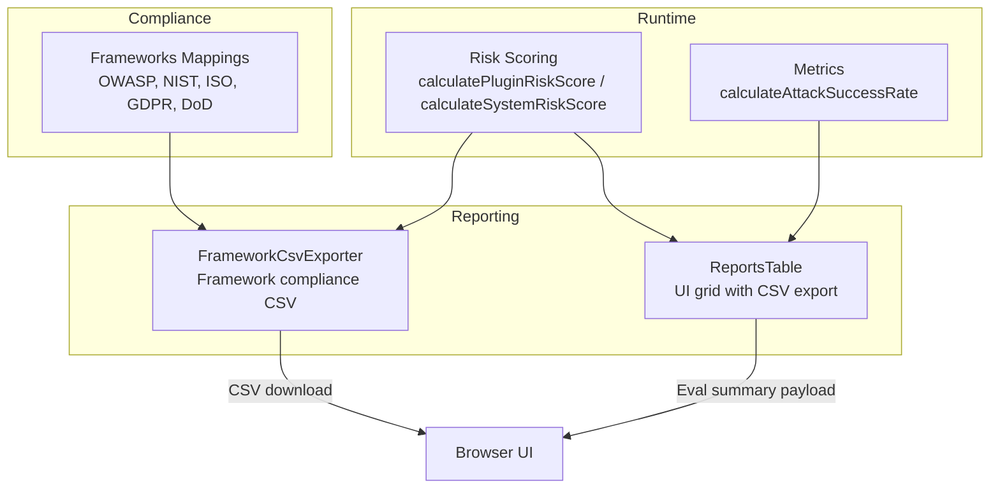
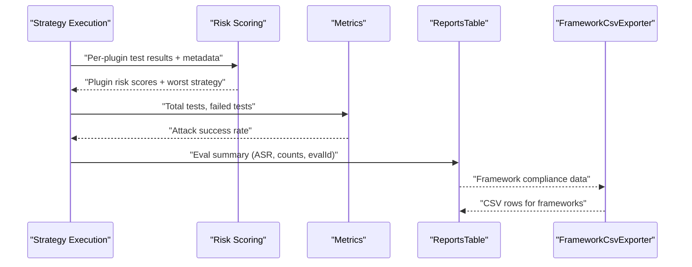
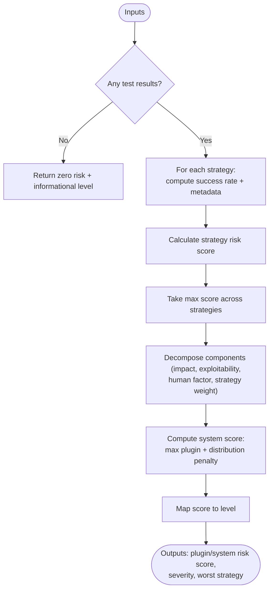
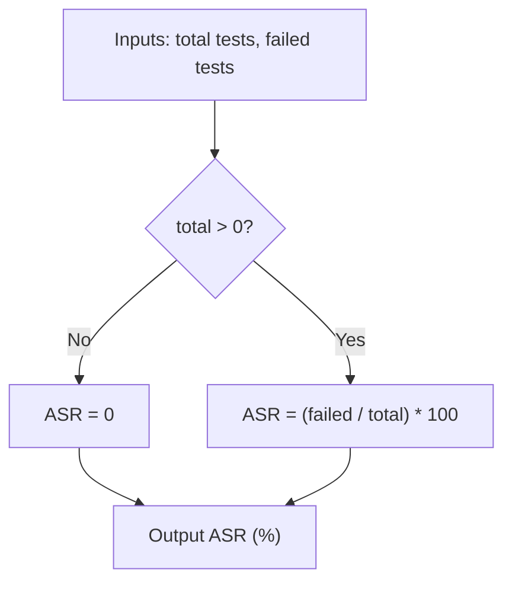
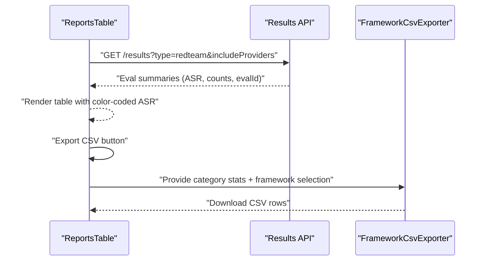
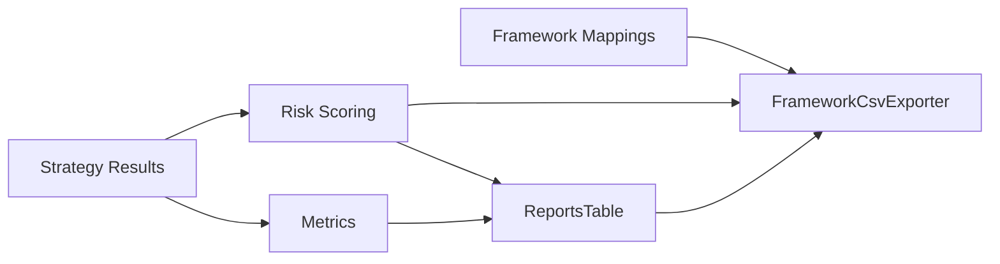

# Strategy Reporting

<cite>
**Referenced Files in This Document**
- [riskScoring.ts](file://src/redteam/riskScoring.ts)
- [metrics.ts](file://src/redteam/metrics.ts)
- [frameworks.ts](file://src/redteam/constants/frameworks.ts)
- [ReportsTable.tsx](file://src/app/src/pages/redteam/report/components/ReportsTable.tsx)
- [FrameworkCsvExporter.tsx](file://src/app/src/pages/redteam/report/components/FrameworkCsvExporter.tsx)
- [risk-scoring.md](file://site/docs/red-team/risk-scoring.md)
</cite>

## Table of Contents
1. [Introduction](#introduction)
2. [Project Structure](#project-structure)
3. [Core Components](#core-components)
4. [Architecture Overview](#architecture-overview)
5. [Detailed Component Analysis](#detailed-component-analysis)
6. [Dependency Analysis](#dependency-analysis)
7. [Performance Considerations](#performance-considerations)
8. [Troubleshooting Guide](#troubleshooting-guide)
9. [Conclusion](#conclusion)
10. [Appendices](#appendices)

## Introduction
This document explains how PromptFoo collects, aggregates, and analyzes red team strategy results into actionable reports. It covers strategy result collection, risk scoring methodologies, vulnerability categorization, severity assessment, performance metrics (including attack success rate), reporting formats (CSV exports, HTML reports, JSON summaries), interpretation and trend analysis, strategy comparison and benchmarking, and remediation guidance derived from results.

## Project Structure
PromptFoo’s red team reporting spans runtime risk scoring, metric computation, compliance framework mappings, and UI-driven reporting. The relevant modules include:
- Risk scoring and severity assessment
- Attack success rate computation
- Compliance framework mappings for categorization
- Frontend reporting table and CSV exporter
- Documentation for risk scoring methodology

**Diagram sources**
- [riskScoring.ts:207-383](file://src/redteam/riskScoring.ts#L207-L383)
- [metrics.ts:8-10](file://src/redteam/metrics.ts#L8-L10)
- [frameworks.ts:6-800](file://src/redteam/constants/frameworks.ts#L6-L800)
- [ReportsTable.tsx:38-209](file://src/app/src/pages/redteam/report/components/ReportsTable.tsx#L38-L209)
- [FrameworkCsvExporter.tsx:28-50](file://src/app/src/pages/redteam/report/components/FrameworkCsvExporter.tsx#L28-L50)

**Section sources**
- [riskScoring.ts:1-489](file://src/redteam/riskScoring.ts#L1-L489)
- [metrics.ts:1-11](file://src/redteam/metrics.ts#L1-L11)
- [frameworks.ts:1-904](file://src/redteam/constants/frameworks.ts#L1-L904)
- [ReportsTable.tsx:1-209](file://src/app/src/pages/redteam/report/components/ReportsTable.tsx#L1-L209)
- [FrameworkCsvExporter.tsx:1-50](file://src/app/src/pages/redteam/report/components/FrameworkCsvExporter.tsx#L1-L50)

## Core Components
- Risk scoring engine: Computes per-plugin and system-level risk scores from strategy test results and metadata, including severity and exploitability.
- Metrics engine: Computes attack success rate (ASR) from counts of total and failed tests.
- Compliance framework mappings: Provides plugin and strategy coverage aligned to standards such as OWASP LLM/API Top 10, ISO/IEC 42001, GDPR, DoD AI Ethics Principles, and MITRE ATLAS.
- Reporting UI: Presents evaluation summaries, ASR, test counts, and provides CSV export for strategy results.
- Framework CSV exporter: Generates compliance-focused CSVs for selected frameworks and categories.

**Section sources**
- [riskScoring.ts:207-383](file://src/redteam/riskScoring.ts#L207-L383)
- [metrics.ts:8-10](file://src/redteam/metrics.ts#L8-L10)
- [frameworks.ts:6-800](file://src/redteam/constants/frameworks.ts#L6-L800)
- [ReportsTable.tsx:38-209](file://src/app/src/pages/redteam/report/components/ReportsTable.tsx#L38-L209)
- [FrameworkCsvExporter.tsx:28-50](file://src/app/src/pages/redteam/report/components/FrameworkCsvExporter.tsx#L28-L50)

## Architecture Overview
The reporting pipeline integrates strategy execution results with risk scoring and compliance mapping, exposing summarized results through the UI and CSV export.

**Diagram sources**
- [riskScoring.ts:207-383](file://src/redteam/riskScoring.ts#L207-L383)
- [metrics.ts:8-10](file://src/redteam/metrics.ts#L8-L10)
- [ReportsTable.tsx:38-209](file://src/app/src/pages/redteam/report/components/ReportsTable.tsx#L38-L209)
- [FrameworkCsvExporter.tsx:28-50](file://src/app/src/pages/redteam/report/components/FrameworkCsvExporter.tsx#L28-L50)

## Detailed Component Analysis

### Risk Scoring Engine
The risk scoring engine computes:
- Per-plugin risk score from strategy success/failure results and strategy metadata (human exploitable, complexity).
- Worst-case scenario across strategies to represent the most severe outcome.
- System-level risk combining the maximum plugin score with a distribution penalty for multiple critical/high risks.
- Severity mapping from plugin IDs to standardized levels.

**Diagram sources**
- [riskScoring.ts:207-383](file://src/redteam/riskScoring.ts#L207-L383)

**Section sources**
- [riskScoring.ts:3-94](file://src/redteam/riskScoring.ts#L3-L94)
- [riskScoring.ts:130-185](file://src/redteam/riskScoring.ts#L130-L185)
- [riskScoring.ts:207-318](file://src/redteam/riskScoring.ts#L207-L318)
- [riskScoring.ts:320-383](file://src/redteam/riskScoring.ts#L320-L383)
- [riskScoring.ts:388-469](file://src/redteam/riskScoring.ts#L388-L469)
- [risk-scoring.md:120-132](file://site/docs/red-team/risk-scoring.md#L120-L132)

### Attack Success Rate (ASR) Metric
ASR is computed as the percentage of failed tests over total tests. It is surfaced in the UI and used for color-coded risk interpretation.

**Diagram sources**
- [metrics.ts:8-10](file://src/redteam/metrics.ts#L8-L10)

**Section sources**
- [metrics.ts:1-11](file://src/redteam/metrics.ts#L1-L11)

### Compliance Framework Mappings
Framework mappings define plugin and strategy coverage for standards such as:
- OWASP LLM Top 10, API Top 10, and Agentic Top 10
- NIST AI RMF
- ISO/IEC 42001
- GDPR
- DoD AI Ethics Principles
- MITRE ATLAS

These mappings enable categorization and compliance reporting.

**Section sources**
- [frameworks.ts:6-800](file://src/redteam/constants/frameworks.ts#L6-L800)

### Reporting UI and CSV Export
The reporting UI displays:
- Evaluation summaries including name, target, scanned date, attack success rate, number of tests, and evaluation ID.
- Color-coded ASR for quick risk interpretation.
- CSV export capability for strategy results.

The framework CSV exporter builds compliance-focused CSVs from category statistics and framework selections.

**Diagram sources**
- [ReportsTable.tsx:38-209](file://src/app/src/pages/redteam/report/components/ReportsTable.tsx#L38-L209)
- [FrameworkCsvExporter.tsx:28-50](file://src/app/src/pages/redteam/report/components/FrameworkCsvExporter.tsx#L28-L50)

**Section sources**
- [ReportsTable.tsx:1-209](file://src/app/src/pages/redteam/report/components/ReportsTable.tsx#L1-L209)
- [FrameworkCsvExporter.tsx:1-50](file://src/app/src/pages/redteam/report/components/FrameworkCsvExporter.tsx#L1-L50)

## Dependency Analysis
- Risk scoring depends on strategy metadata and test results to compute per-plugin and system risk.
- Metrics depend on counts of total and failed tests to compute ASR.
- Reporting UI consumes evaluation summaries and exposes CSV export.
- Framework mappings underpin categorization and compliance reporting.

**Diagram sources**
- [riskScoring.ts:207-383](file://src/redteam/riskScoring.ts#L207-L383)
- [metrics.ts:8-10](file://src/redteam/metrics.ts#L8-L10)
- [frameworks.ts:6-800](file://src/redteam/constants/frameworks.ts#L6-L800)
- [ReportsTable.tsx:38-209](file://src/app/src/pages/redteam/report/components/ReportsTable.tsx#L38-L209)
- [FrameworkCsvExporter.tsx:28-50](file://src/app/src/pages/redteam/report/components/FrameworkCsvExporter.tsx#L28-L50)

**Section sources**
- [riskScoring.ts:1-489](file://src/redteam/riskScoring.ts#L1-L489)
- [metrics.ts:1-11](file://src/redteam/metrics.ts#L1-L11)
- [frameworks.ts:1-904](file://src/redteam/constants/frameworks.ts#L1-L904)
- [ReportsTable.tsx:1-209](file://src/app/src/pages/redteam/report/components/ReportsTable.tsx#L1-L209)
- [FrameworkCsvExporter.tsx:1-50](file://src/app/src/pages/redteam/report/components/FrameworkCsvExporter.tsx#L1-L50)

## Performance Considerations
- Risk scoring aggregates across strategies per plugin; ensure strategy result grouping is efficient to avoid redundant computations.
- CSV export should batch rows and stream downloads for large datasets.
- UI pagination and sorting reduce rendering overhead for large result sets.

## Troubleshooting Guide
Common issues and resolutions:
- No test results: Risk scoring returns zero risk and informational level when no tests are available.
- Missing strategy metadata: Defaults are applied for unknown strategies.
- Empty category stats: CSV exporter gracefully handles missing data by returning no rows for that category.
- API errors: UI surfaces error messages and disables loading state until resolved.

**Section sources**
- [riskScoring.ts:212-229](file://src/redteam/riskScoring.ts#L212-L229)
- [riskScoring.ts:394-469](file://src/redteam/riskScoring.ts#L394-L469)
- [ReportsTable.tsx:43-65](file://src/app/src/pages/redteam/report/components/ReportsTable.tsx#L43-L65)

## Conclusion
PromptFoo’s red team reporting integrates strategy execution results with robust risk scoring and compliance framework mappings. The UI presents actionable insights via attack success rate and CSV exports, enabling strategy comparison, benchmarking, and remediation prioritization grounded in severity and worst-case strategy outcomes.

## Appendices

### Strategy Result Collection and Aggregation Procedures
- Strategy execution produces per-plugin test results grouped by strategy.
- Risk scoring aggregates by computing strategy risk scores and selecting the worst-case scenario per plugin.
- System risk combines the maximum plugin score with a distribution penalty for multiple critical/high risks.

**Section sources**
- [riskScoring.ts:207-383](file://src/redteam/riskScoring.ts#L207-L383)

### Risk Scoring Methodologies
- Impact base score mapped to severity.
- Exploitation modifier scales with success rate.
- Human factor modifier reflects human exploitability and complexity.
- Complexity penalty adds risk for low-complexity successful exploits.
- System-level risk includes distribution penalties for multiple critical/high risks.

**Section sources**
- [riskScoring.ts:130-185](file://src/redteam/riskScoring.ts#L130-L185)
- [risk-scoring.md:120-132](file://site/docs/red-team/risk-scoring.md#L120-L132)

### Vulnerability Categorization and Severity Assessment
- Severity levels are mapped from plugin IDs; defaults to low severity when unspecified.
- Compliance frameworks define categories and plugin/strategy coverage for standards alignment.

**Section sources**
- [riskScoring.ts:85-94](file://src/redteam/riskScoring.ts#L85-L94)
- [frameworks.ts:6-800](file://src/redteam/constants/frameworks.ts#L6-L800)

### Strategy Performance Metrics
- Attack success rate (ASR) computed from total and failed tests.
- UI displays ASR with color-coded risk interpretation.
- CSV export includes framework, category, plugin, severity, tests run, attacks successful, ASR, and status.

**Section sources**
- [metrics.ts:8-10](file://src/redteam/metrics.ts#L8-L10)
- [ReportsTable.tsx:22-36](file://src/app/src/pages/redteam/report/components/ReportsTable.tsx#L22-L36)
- [FrameworkCsvExporter.tsx:34-48](file://src/app/src/pages/redteam/report/components/FrameworkCsvExporter.tsx#L34-L48)

### Strategy Reporting Formats
- CSV exports: Strategy-level and framework compliance CSVs for downstream analysis.
- HTML reports: Interactive UI grid with sorting, toggling, and export capabilities.
- JSON summaries: Evaluation summaries consumed by the UI and exported via CSV.

**Section sources**
- [ReportsTable.tsx:75-101](file://src/app/src/pages/redteam/report/components/ReportsTable.tsx#L75-L101)
- [FrameworkCsvExporter.tsx:34-48](file://src/app/src/pages/redteam/report/components/FrameworkCsvExporter.tsx#L34-L48)

### Examples of Strategy Result Interpretation and Trend Analysis
- Use ASR to compare strategy effectiveness across plugins and categories.
- Track worst strategies per plugin to identify high-impact attack vectors.
- Monitor system risk trends over time to assess remediation impact.

**Section sources**
- [riskScoring.ts:247-250](file://src/redteam/riskScoring.ts#L247-L250)
- [risk-scoring.md:120-132](file://site/docs/red-team/risk-scoring.md#L120-L132)

### Strategy Comparison, Benchmarking, and Regression Tracking
- Compare ASR across strategies and plugins to benchmark performance.
- Track changes in system risk and worst strategies over time to identify regressions.

**Section sources**
- [metrics.ts:8-10](file://src/redteam/metrics.ts#L8-L10)
- [riskScoring.ts:320-383](file://src/redteam/riskScoring.ts#L320-L383)

### Strategy Recommendation Generation and Remediation Guidance
- Prioritize remediation by severity and worst strategy.
- Align remediation efforts with compliance framework mappings to address specific risks (e.g., OWASP LLM Top 10 categories).
- Use CSV exports to communicate findings to stakeholders and track remediation progress.

**Section sources**
- [frameworks.ts:6-800](file://src/redteam/constants/frameworks.ts#L6-L800)
- [riskScoring.ts:300-317](file://src/redteam/riskScoring.ts#L300-L317)