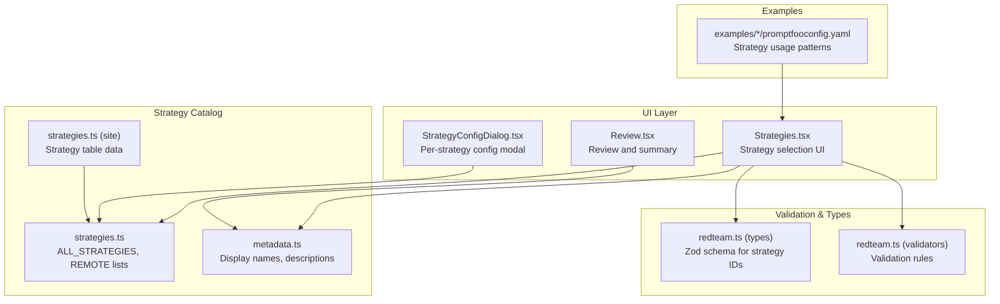
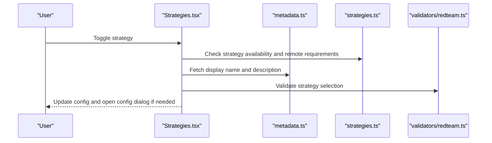
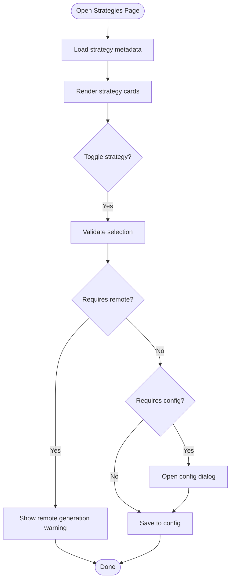
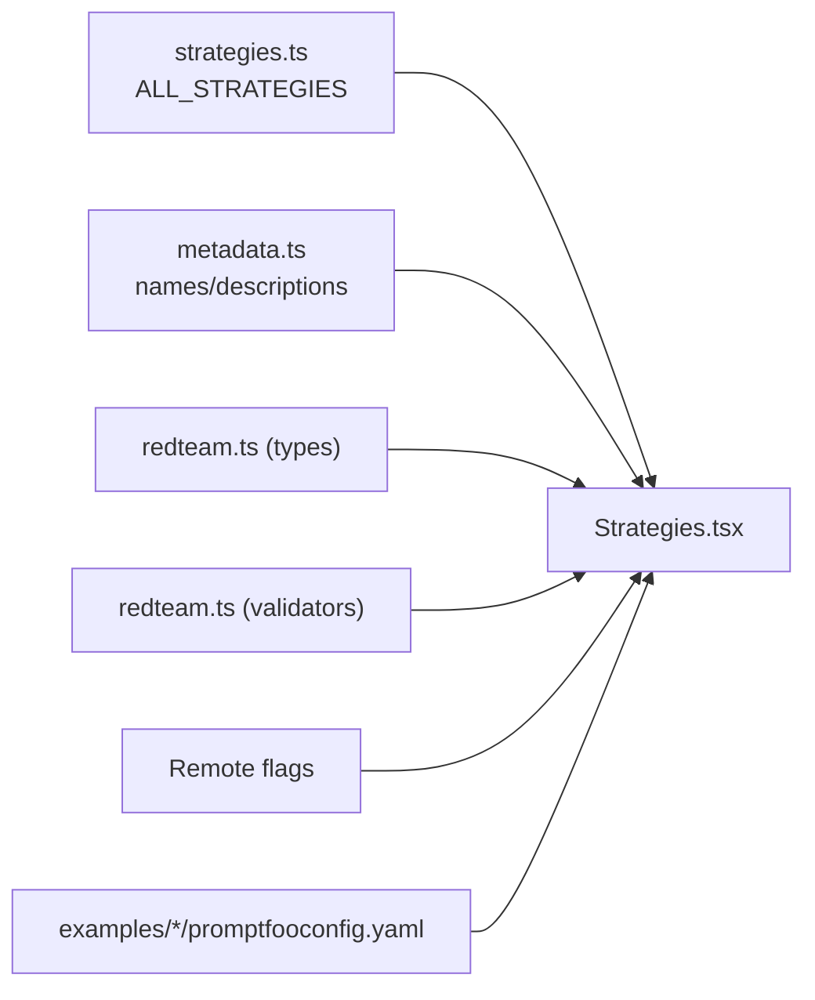

# Strategy Types

<cite>
**Referenced Files in This Document**
- [Strategies.tsx](file://src/app/src/pages/redteam/setup/components/Strategies.tsx)
- [strategies.ts](file://src/redteam/constants/strategies.ts)
- [metadata.ts](file://src/redteam/constants/metadata.ts)
- [redteam.ts](file://src/types/api/redteam.ts)
- [redteam.ts](file://src/validators/redteam.ts)
- [index.md](file://site/docs/red-team/strategies/index.md)
- [strategies.ts](file://site/docs/_shared/data/strategies.ts)
- [StrategyTable.tsx](file://site/docs/_shared/StrategyTable.tsx)
- [StrategyConfigDialog.tsx](file://src/app/src/pages/redteam/setup/components/StrategyConfigDialog.tsx)
- [Review.tsx](file://src/app/src/pages/redteam/setup/components/Review.tsx)
- [promptfooconfig.yaml](file://examples/redteam-beavertails/promptfooconfig.yaml)
- [promptfooconfig.yaml](file://examples/redteam-bestOfN-strategy/promptfooconfig.yaml)
- [promptfooconfig.yaml](file://examples/redteam-custom-strategy/promptfooconfig.yaml)
- [promptfooconfig.yaml](file://examples/redteam-guardrails/promptfooconfig.yaml)
- [promptfooconfig.yaml](file://examples/redteam-indirect-web-pwn/promptfooconfig.yaml)
- [promptfooconfig.yaml](file://examples/redteam-api-top-10/promptfooconfig.yaml)
- [promptfooconfig.yaml](file://examples/redteam-auth/promptfooconfig.api_key.yaml)
- [promptfooconfig.yaml](file://examples/redteam-azure-assistant/promptfooconfig.yaml)
- [promptfooconfig.yaml](file://examples/redteam-chatbot/promptfooconfig.yaml)
- [promptfooconfig.yaml](file://examples/redteam-dalle/promptfooconfig.yaml)
- [promptfooconfig.yaml](file://examples/redteam-deepseek/promptfooconfig.yaml)
- [promptfooconfig.yaml](file://examples/redteam-deepseek-foundation/promptfooconfig.yaml)
- [promptfooconfig.yaml](file://examples/redteam-foundation-model/promptfooconfig.yaml)
- [promptfooconfig.yaml](file://examples/redteam-medical-agent/promptfooconfig.yaml)
- [promptfooconfig.yaml](file://examples/redteam-travel-agent/promptfooconfig.yaml)
- [promptfooconfig.yaml](file://examples/redteam-layer-strategy/promptfooconfig.yaml)
- [promptfooconfig.yaml](file://examples/redteam-mcp/promptfooconfig.yaml)
- [promptfooconfig.yaml](file://examples/redteam-mcp-auth/promptfooconfig.yaml)
- [promptfooconfig.yaml](file://examples/redteam-mcp-agent/promptfooconfig.yaml)
- [promptfooconfig.yaml](file://examples/redteam-rag/promptfooconfig.yaml)
- [promptfooconfig.yaml](file://examples/redteam-starter/promptfooconfig.yaml)
- [promptfooconfig.yaml](file://examples/redteam-tracing-example/promptfooconfig.yaml)
- [promptfooconfig.yaml](file://examples/redteam-multi-modal/promptfooconfig.yaml)
- [promptfooconfig.yaml](file://examples/redteam-ollama/promptfooconfig.yaml)
- [promptfooconfig.yaml](file://examples/redteam-provider-override/promptfooconfig.yaml)
- [promptfooconfig.yaml](file://examples/redteam-deepseek/redteamconfig.yaml)
- [promptfooconfig.yaml](file://examples/redteam-chatbot/redteam.yaml)
- [promptfooconfig.yaml](file://examples/redteam-deepseek/redteam.yaml)
- [promptfooconfig.yaml](file://examples/redteam-foundation-model/redteam.yaml)
</cite>

## Table of Contents
1. [Introduction](#introduction)
2. [Project Structure](#project-structure)
3. [Core Components](#core-components)
4. [Architecture Overview](#architecture-overview)
5. [Detailed Component Analysis](#detailed-component-analysis)
6. [Dependency Analysis](#dependency-analysis)
7. [Performance Considerations](#performance-considerations)
8. [Troubleshooting Guide](#troubleshooting-guide)
9. [Conclusion](#conclusion)
10. [Appendices](#appendices)

## Introduction
This document catalogs PromptFoo red team strategy types and explains how to select, configure, and evaluate them. It covers strategy categories (content safety, capability testing, security vulnerabilities), attack vectors, configuration parameters, execution parameters, result interpretation, and practical sequencing patterns. It also provides guidance on strategy selection criteria based on testing objectives and risk assessment, along with performance characteristics and execution time estimates.

## Project Structure
PromptFoo’s red team strategy ecosystem spans UI configuration, strategy metadata, validation, and example configurations. The UI presents strategy cards, handles toggling and configuration, and integrates with validators and types to ensure correctness.

**Diagram sources**
- [Strategies.tsx:13-22](file://src/app/src/pages/redteam/setup/components/Strategies.tsx#L13-L22)
- [strategies.ts:117-125](file://src/redteam/constants/strategies.ts#L117-L125)
- [metadata.ts:1165-1214](file://src/redteam/constants/metadata.ts#L1165-L1214)
- [redteam.ts:1-21](file://src/types/api/redteam.ts#L1-L21)
- [redteam.ts:143-172](file://src/validators/redteam.ts#L143-L172)
- [StrategyConfigDialog.tsx:39-39](file://src/app/src/pages/redteam/setup/components/StrategyConfigDialog.tsx#L39-L39)
- [Review.tsx:345-345](file://src/app/src/pages/redteam/setup/components/Review.tsx#L345-L345)

**Section sources**
- [Strategies.tsx:63-69](file://src/app/src/pages/redteam/setup/components/Strategies.tsx#L63-L69)
- [strategies.ts:117-125](file://src/redteam/constants/strategies.ts#L117-L125)
- [metadata.ts:1165-1214](file://src/redteam/constants/metadata.ts#L1165-L1214)
- [redteam.ts:1-21](file://src/types/api/redteam.ts#L1-L21)
- [redteam.ts:143-172](file://src/validators/redteam.ts#L143-L172)
- [index.md:1-42](file://site/docs/red-team/strategies/index.md#L1-L42)
- [strategies.ts:1-43](file://site/docs/_shared/data/strategies.ts#L1-L43)
- [StrategyTable.tsx:83-114](file://site/docs/_shared/StrategyTable.tsx#L83-L114)

## Core Components
- Strategy catalog and metadata: Defines strategy IDs, display names, descriptions, and sets for categorization and validation.
- UI strategy selection: Renders strategy cards, handles enabling/disabling, multi-turn state, and configuration dialogs.
- Validation and types: Enforces strategy IDs and custom strategy paths.
- Example configurations: Demonstrates real-world strategy combinations and sequencing.

Key responsibilities:
- Strategy enumeration and availability
- Remote requirement gating
- Multi-turn state propagation
- Per-strategy configuration persistence
- Validation of selections

**Section sources**
- [strategies.ts:117-125](file://src/redteam/constants/strategies.ts#L117-L125)
- [metadata.ts:1165-1214](file://src/redteam/constants/metadata.ts#L1165-L1214)
- [Strategies.tsx:92-97](file://src/app/src/pages/redteam/setup/components/Strategies.tsx#L92-L97)
- [redteam.ts:1-21](file://src/types/api/redteam.ts#L1-L21)
- [redteam.ts:143-172](file://src/validators/redteam.ts#L143-L172)

## Architecture Overview
The strategy selection flow integrates UI, metadata, and validation:

**Diagram sources**
- [Strategies.tsx:92-97](file://src/app/src/pages/redteam/setup/components/Strategies.tsx#L92-L97)
- [metadata.ts:1165-1214](file://src/redteam/constants/metadata.ts#L1165-L1214)
- [strategies.ts:201-215](file://src/redteam/constants/strategies.ts#L201-L215)
- [redteam.ts:143-172](file://src/validators/redteam.ts#L143-L172)

## Detailed Component Analysis

### Strategy Catalog and Categories
PromptFoo defines a canonical list of strategies and categorizes them for UI grouping and UX. The catalog includes:
- Single-turn strategies
- Multi-turn strategies
- Agentic strategies
- Multi-modal strategies
- Custom strategies

Remote requirement:
- Some strategies require remote generation and are gated by environment flags.

Validation:
- Strategy IDs are validated against the canonical list, including custom strategy paths.

**Section sources**
- [strategies.ts:117-125](file://src/redteam/constants/strategies.ts#L117-L125)
- [strategies.ts:201-215](file://src/redteam/constants/strategies.ts#L201-L215)
- [redteam.ts:143-172](file://src/validators/redteam.ts#L143-L172)

### Strategy Selection UI
The UI renders strategy cards, supports:
- Enabling/disabling strategies
- Multi-turn state configuration
- Opening per-strategy configuration dialogs
- Remote generation warnings
- Performance warnings when too many strategies are selected

**Diagram sources**
- [Strategies.tsx:92-97](file://src/app/src/pages/redteam/setup/components/Strategies.tsx#L92-L97)
- [Strategies.tsx:146-242](file://src/app/src/pages/redteam/setup/components/Strategies.tsx#L146-L242)

**Section sources**
- [Strategies.tsx:63-69](file://src/app/src/pages/redteam/setup/components/Strategies.tsx#L63-L69)
- [Strategies.tsx:92-97](file://src/app/src/pages/redteam/setup/components/Strategies.tsx#L92-L97)
- [Strategies.tsx:146-242](file://src/app/src/pages/redteam/setup/components/Strategies.tsx#L146-L242)

### Strategy Configuration Dialog
Certain strategies require configuration before use. The dialog persists per-strategy config and updates the runtime configuration.

**Section sources**
- [StrategyConfigDialog.tsx:39-39](file://src/app/src/pages/redteam/setup/components/StrategyConfigDialog.tsx#L39-L39)
- [Strategies.tsx:316-330](file://src/app/src/pages/redteam/setup/components/Strategies.tsx#L316-L330)

### Strategy Metadata and Display
Display names and descriptions are centralized for consistent UI rendering and review.

**Section sources**
- [metadata.ts:1165-1214](file://src/redteam/constants/metadata.ts#L1165-L1214)
- [Strategies.tsx:56-61](file://src/app/src/pages/redteam/setup/components/Strategies.tsx#L56-L61)
- [Review.tsx:345-345](file://src/app/src/pages/redteam/setup/components/Review.tsx#L345-L345)

### Strategy Categories and Examples
The documentation site provides a categorized strategy table and overview. Example configurations demonstrate practical usage patterns.

Categories:
- Content safety strategies
- Capability testing strategies
- Security vulnerability strategies

Examples:
- Basic and preset configurations
- Multi-modal strategies
- Agentic strategies (Meta, Hydra)
- Custom strategies

**Section sources**
- [index.md:15-42](file://site/docs/red-team/strategies/index.md#L15-L42)
- [strategies.ts:15-43](file://site/docs/_shared/data/strategies.ts#L15-L43)
- [StrategyTable.tsx:83-114](file://site/docs/_shared/StrategyTable.tsx#L83-L114)

## Dependency Analysis
The strategy system depends on:
- Canonical strategy list and metadata
- Validation schema for strategy IDs
- Environment flags for remote generation
- Example configurations for guidance

**Diagram sources**
- [strategies.ts:117-125](file://src/redteam/constants/strategies.ts#L117-L125)
- [metadata.ts:1165-1214](file://src/redteam/constants/metadata.ts#L1165-L1214)
- [redteam.ts:1-21](file://src/types/api/redteam.ts#L1-L21)
- [redteam.ts:143-172](file://src/validators/redteam.ts#L143-L172)
- [Strategies.tsx:92-97](file://src/app/src/pages/redteam/setup/components/Strategies.tsx#L92-L97)

**Section sources**
- [strategies.ts:117-125](file://src/redteam/constants/strategies.ts#L117-L125)
- [metadata.ts:1165-1214](file://src/redteam/constants/metadata.ts#L1165-L1214)
- [redteam.ts:1-21](file://src/types/api/redteam.ts#L1-L21)
- [redteam.ts:143-172](file://src/validators/redteam.ts#L143-L172)
- [Strategies.tsx:92-97](file://src/app/src/pages/redteam/setup/components/Strategies.tsx#L92-L97)

## Performance Considerations
- Strategy count and concurrency: Selecting many strategies increases evaluation time and cost. The UI warns when most strategies are selected.
- Remote generation: Some strategies require remote generation and are disabled when remote generation is turned off.
- Multi-turn strategies: Multi-turn strategies can increase session overhead; stateful behavior can be toggled per strategy.

Practical guidance:
- Prefer preset configurations for broad coverage.
- Limit concurrent strategies to reduce cost and time.
- Disable remote-dependent strategies when remote generation is unavailable.

**Section sources**
- [Strategies.tsx:440-452](file://src/app/src/pages/redteam/setup/components/Strategies.tsx#L440-L452)
- [Strategies.tsx:424-437](file://src/app/src/pages/redteam/setup/components/Strategies.tsx#L424-L437)
- [Strategies.tsx:279-307](file://src/app/src/pages/redteam/setup/components/Strategies.tsx#L279-L307)

## Troubleshooting Guide
Common issues and resolutions:
- Invalid strategy ID: Ensure the strategy ID is part of the canonical list or a valid custom strategy path.
- Missing configuration: Some strategies require configuration; open the strategy config dialog to provide required parameters.
- Remote generation disabled: Certain strategies require remote generation; unset the relevant environment variables to enable them.
- Multi-turn state mismatch: Verify stateful configuration for multi-turn strategies.

**Section sources**
- [redteam.ts:143-172](file://src/validators/redteam.ts#L143-L172)
- [StrategyConfigDialog.tsx:39-39](file://src/app/src/pages/redteam/setup/components/StrategyConfigDialog.tsx#L39-L39)
- [Strategies.tsx:146-242](file://src/app/src/pages/redteam/setup/components/Strategies.tsx#L146-L242)
- [Strategies.tsx:279-307](file://src/app/src/pages/redteam/setup/components/Strategies.tsx#L279-L307)

## Conclusion
PromptFoo’s red team strategy system provides a structured, validated, and configurable way to probe LLM applications across content safety, capability testing, and security vulnerabilities. Use the UI to select strategies, configure them as needed, and leverage example configurations for guidance. Apply performance-aware selection and remote generation policies to balance coverage and cost.

## Appendices

### Strategy Catalog and Categories
- Single-turn strategies
- Multi-turn strategies
- Agentic strategies
- Multi-modal strategies
- Custom strategies

**Section sources**
- [strategies.ts:117-125](file://src/redteam/constants/strategies.ts#L117-L125)
- [index.md:15-42](file://site/docs/red-team/strategies/index.md#L15-L42)

### Strategy-Specific Configuration Parameters
- Custom strategies: Accept a path to a JS/TS module or a local file path.
- Multi-turn strategies: Support a stateful toggle to maintain conversational context.
- Layer strategy: Requires a steps configuration array.

**Section sources**
- [redteam.ts:164-172](file://src/validators/redteam.ts#L164-L172)
- [Strategies.tsx:217-219](file://src/app/src/pages/redteam/setup/components/Strategies.tsx#L217-L219)
- [strategies\utils.ts:19-28](file://src/app/src/pages/redteam/setup/components/strategies/utils.ts#L19-L28)

### Execution Parameters and Result Interpretation
- Execution parameters: Strategy selection, concurrency limits, and optional instructions for test generation.
- Result interpretation: Review strategy-specific outcomes and adjust strategy mix accordingly.

**Section sources**
- [sharedFrontend.test.ts:197-219](file://test/redteam/sharedFrontend.test.ts#L197-L219)

### Examples of Strategy Combinations and Sequencing Patterns
- Preset combinations: Meta (single-turn) and Hydra (multi-turn) for broad coverage.
- Multi-modal strategies: Image, audio, and video testing.
- Agentic strategies: Meta and Hydra for adaptive attacks.
- Custom strategies: Programmatic transformations via custom strategy modules.

**Section sources**
- [index.md:27-36](file://site/docs/red-team/strategies/index.md#L27-L36)
- [promptfooconfig.yaml:1-200](file://examples/redteam-beavertails/promptfooconfig.yaml#L1-L200)
- [promptfooconfig.yaml:1-200](file://examples/redteam-bestOfN-strategy/promptfooconfig.yaml#L1-L200)
- [promptfooconfig.yaml:1-200](file://examples/redteam-custom-strategy/promptfooconfig.yaml#L1-L200)
- [promptfooconfig.yaml:1-200](file://examples/redteam-guardrails/promptfooconfig.yaml#L1-L200)
- [promptfooconfig.yaml:1-200](file://examples/redteam-indirect-web-pwn/promptfooconfig.yaml#L1-L200)
- [promptfooconfig.yaml:1-200](file://examples/redteam-api-top-10/promptfooconfig.yaml#L1-L200)
- [promptfooconfig.yaml:1-200](file://examples/redteam-auth/promptfooconfig.api_key.yaml#L1-L200)
- [promptfooconfig.yaml:1-200](file://examples/redteam-azure-assistant/promptfooconfig.yaml#L1-L200)
- [promptfooconfig.yaml:1-200](file://examples/redteam-chatbot/promptfooconfig.yaml#L1-L200)
- [promptfooconfig.yaml:1-200](file://examples/redteam-dalle/promptfooconfig.yaml#L1-L200)
- [promptfooconfig.yaml:1-200](file://examples/redteam-deepseek/promptfooconfig.yaml#L1-L200)
- [promptfooconfig.yaml:1-200](file://examples/redteam-deepseek-foundation/promptfooconfig.yaml#L1-L200)
- [promptfooconfig.yaml:1-200](file://examples/redteam-foundation-model/promptfooconfig.yaml#L1-L200)
- [promptfooconfig.yaml:1-200](file://examples/redteam-medical-agent/promptfooconfig.yaml#L1-L200)
- [promptfooconfig.yaml:1-200](file://examples/redteam-travel-agent/promptfooconfig.yaml#L1-L200)
- [promptfooconfig.yaml:1-200](file://examples/redteam-layer-strategy/promptfooconfig.yaml#L1-L200)
- [promptfooconfig.yaml:1-200](file://examples/redteam-mcp/promptfooconfig.yaml#L1-L200)
- [promptfooconfig.yaml:1-200](file://examples/redteam-mcp-auth/promptfooconfig.yaml#L1-L200)
- [promptfooconfig.yaml:1-200](file://examples/redteam-mcp-agent/promptfooconfig.yaml#L1-L200)
- [promptfooconfig.yaml:1-200](file://examples/redteam-rag/promptfooconfig.yaml#L1-L200)
- [promptfooconfig.yaml:1-200](file://examples/redteam-starter/promptfooconfig.yaml#L1-L200)
- [promptfooconfig.yaml:1-200](file://examples/redteam-tracing-example/promptfooconfig.yaml#L1-L200)
- [promptfooconfig.yaml:1-200](file://examples/redteam-multi-modal/promptfooconfig.yaml#L1-L200)
- [promptfooconfig.yaml:1-200](file://examples/redteam-ollama/promptfooconfig.yaml#L1-L200)
- [promptfooconfig.yaml:1-200](file://examples/redteam-provider-override/promptfooconfig.yaml#L1-L200)
- [promptfooconfig.yaml:1-200](file://examples/redteam-deepseek/redteamconfig.yaml#L1-L200)
- [promptfooconfig.yaml:1-200](file://examples/redteam-chatbot/redteam.yaml#L1-L200)
- [promptfooconfig.yaml:1-200](file://examples/redteam-deepseek/redteam.yaml#L1-L200)
- [promptfooconfig.yaml:1-200](file://examples/redteam-foundation-model/redteam.yaml#L1-L200)

### Strategy Selection Criteria Based on Testing Objectives and Risk Assessment
- Content safety: Choose strategies targeting policy violations, harmful content, and bias.
- Capability testing: Use strategies that probe reasoning, code generation, and tool use.
- Security vulnerabilities: Apply strategies that exploit prompt injection, jailbreaking, and multi-modal attack surfaces.

Guidance:
- Align strategy selection with application domain and threat model.
- Start with recommended presets and expand gradually.
- Monitor performance and cost; reduce strategy count if needed.

**Section sources**
- [index.md:15-42](file://site/docs/red-team/strategies/index.md#L15-L42)
- [Strategies.tsx:440-452](file://src/app/src/pages/redteam/setup/components/Strategies.tsx#L440-L452)

### Strategy Performance Characteristics, Resource Requirements, and Execution Time Estimates
- Strategy count: Larger selections increase evaluation time and cost.
- Remote generation: Disabling remote generation reduces strategy availability and may improve local performance.
- Multi-turn strategies: Stateful sessions increase overhead; tune stateful behavior per strategy.

Recommendations:
- Use presets for balanced coverage.
- Limit concurrency and avoid excessive strategy combinations.
- Enable remote generation only when necessary.

**Section sources**
- [Strategies.tsx:440-452](file://src/app/src/pages/redteam/setup/components/Strategies.tsx#L440-L452)
- [Strategies.tsx:424-437](file://src/app/src/pages/redteam/setup/components/Strategies.tsx#L424-L437)
- [Strategies.tsx:279-307](file://src/app/src/pages/redteam/setup/components/Strategies.tsx#L279-L307)