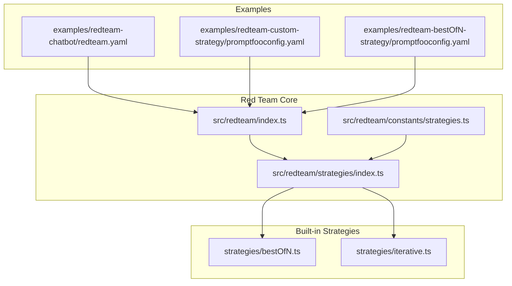
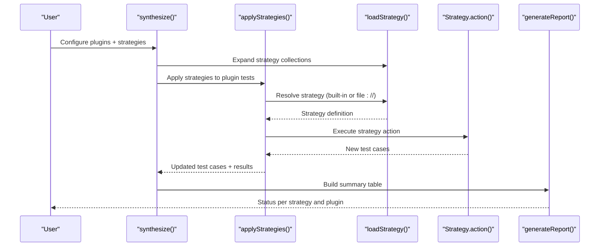
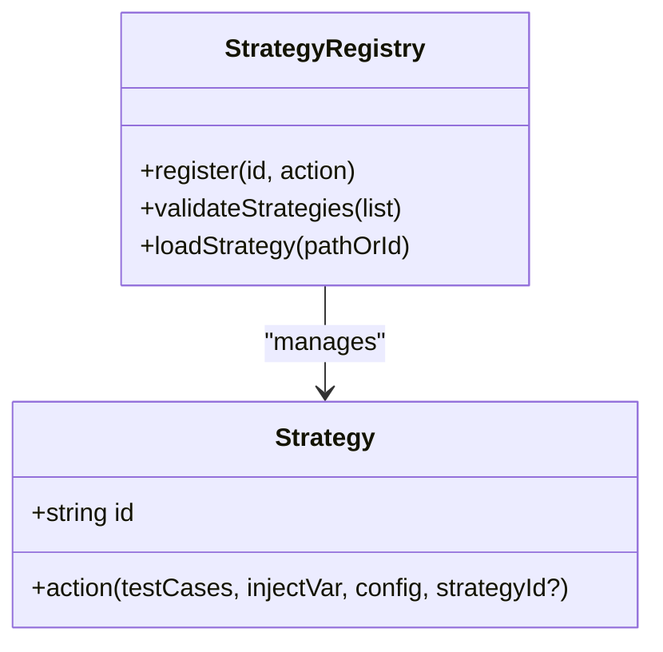
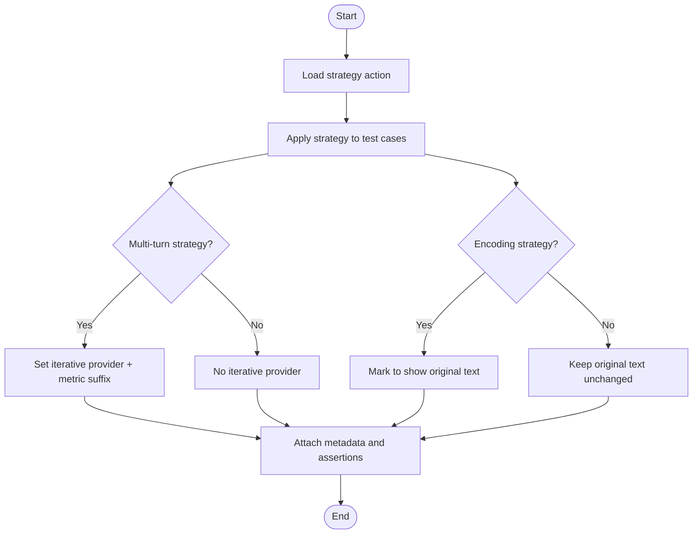
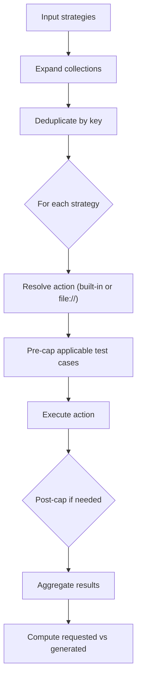
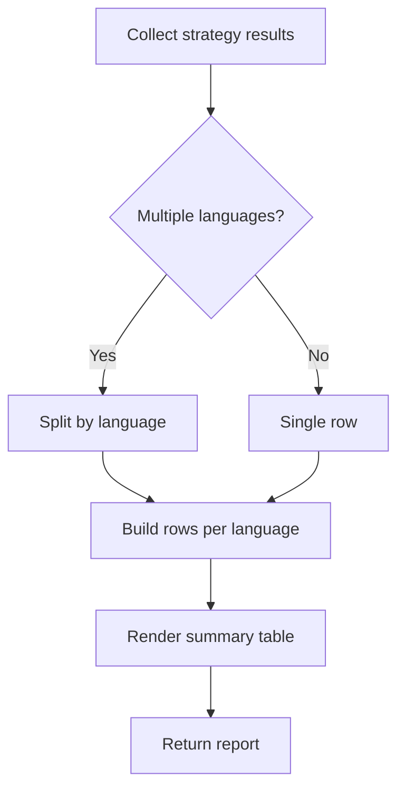
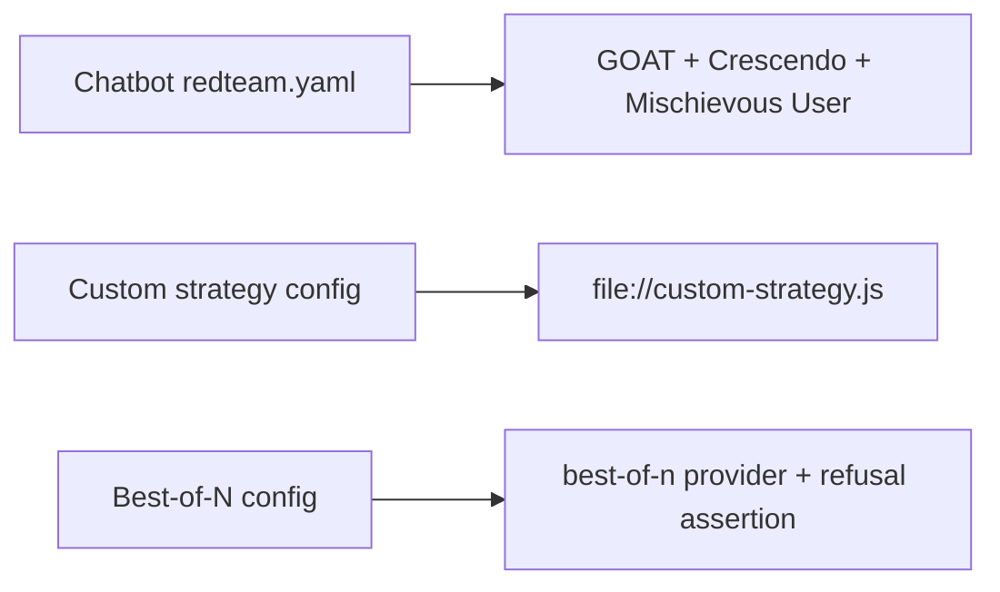
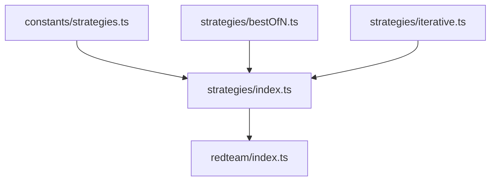

# Testing Strategies

<cite>
**Referenced Files in This Document**
- [index.ts](file://src/redteam/index.ts)
- [strategies/index.ts](file://src/redteam/strategies/index.ts)
- [constants/strategies.ts](file://src/redteam/constants/strategies.ts)
- [strategies/bestOfN.ts](file://src/redteam/strategies/bestOfN.ts)
- [strategies/iterative.ts](file://src/redteam/strategies/iterative.ts)
- [redteam-chatbot/redteam.yaml](file://examples/redteam-chatbot/redteam.yaml)
- [redteam-custom-strategy/promptfooconfig.yaml](file://examples/redteam-custom-strategy/promptfooconfig.yaml)
- [redteam-bestOfN-strategy/promptfooconfig.yaml](file://examples/redteam-bestOfN-strategy/promptfooconfig.yaml)
</cite>

## Table of Contents
1. [Introduction](#introduction)
2. [Project Structure](#project-structure)
3. [Core Components](#core-components)
4. [Architecture Overview](#architecture-overview)
5. [Detailed Component Analysis](#detailed-component-analysis)
6. [Dependency Analysis](#dependency-analysis)
7. [Performance Considerations](#performance-considerations)
8. [Troubleshooting Guide](#troubleshooting-guide)
9. [Conclusion](#conclusion)
10. [Appendices](#appendices)

## Introduction
This document describes comprehensive testing strategies for PromptFoo red team testing. It explains layered testing, progressive escalation, and scenario-based testing, and shows how to configure strategies for vulnerability discovery, impact assessment, and regression testing. It covers strategy types such as adversarial prompting, prompt injection testing, jailbreaking attempts, and bias amplification. It also documents execution patterns, timing controls, resource management, strategy combinations, customization, parameter tuning, performance optimization, reporting, result aggregation, trend analysis, and CI/CD integration.

## Project Structure
PromptFoo’s red team capabilities are implemented in a modular way:
- Strategy registry and loader define built-in strategies and allow custom strategies.
- Strategy actions transform test cases by injecting variations or orchestrating multi-step attacks.
- The synthesis pipeline applies plugins to generate baseline test cases, then applies strategies to expand coverage.
- Example configurations demonstrate practical usage across domains (chatbot, custom provider, best-of-N).

**Diagram sources**
- [index.ts:700-800](file://src/redteam/index.ts#L700-L800)
- [strategies/index.ts:40-370](file://src/redteam/strategies/index.ts#L40-L370)
- [constants/strategies.ts:118-218](file://src/redteam/constants/strategies.ts#L118-L218)
- [strategies/bestOfN.ts:5-44](file://src/redteam/strategies/bestOfN.ts#L5-L44)
- [strategies/iterative.ts:3-59](file://src/redteam/strategies/iterative.ts#L3-L59)
- [redteam-chatbot/redteam.yaml:28-84](file://examples/redteam-chatbot/redteam.yaml#L28-L84)
- [redteam-custom-strategy/promptfooconfig.yaml:12-22](file://examples/redteam-custom-strategy/promptfooconfig.yaml#L12-L22)
- [redteam-bestOfN-strategy/promptfooconfig.yaml:14-30](file://examples/redteam-bestOfN-strategy/promptfooconfig.yaml#L14-L30)

**Section sources**
- [index.ts:700-800](file://src/redteam/index.ts#L700-L800)
- [strategies/index.ts:40-370](file://src/redteam/strategies/index.ts#L40-L370)
- [constants/strategies.ts:118-218](file://src/redteam/constants/strategies.ts#L118-L218)

## Core Components
- Strategy registry and loader: Defines all built-in strategies and supports loading custom strategies from files. Validates strategy IDs and ensures required properties are present.
- Strategy actions: Transform test cases by adding encodings, multi-turn jailbreaks, best-of-N sampling, retry logic, and more.
- Synthesis pipeline: Orchestrates plugin-generated test cases, applies strategies, computes totals, and aggregates results with reporting.

Key responsibilities:
- Strategy selection and expansion (including collections).
- Pre/post caps for fan-out strategies.
- Multilingual handling and language-aware reporting.
- Abort signal handling and concurrency limits.
- Metadata enrichment for severity, strategy IDs, and original text.

**Section sources**
- [strategies/index.ts:40-370](file://src/redteam/strategies/index.ts#L40-L370)
- [strategies/index.ts:372-437](file://src/redteam/strategies/index.ts#L372-L437)
- [index.ts:350-567](file://src/redteam/index.ts#L350-L567)
- [index.ts:621-686](file://src/redteam/index.ts#L621-L686)

## Architecture Overview
The red team synthesis pipeline follows a layered approach:
- Plugins generate baseline test cases.
- Strategies transform or expand those cases.
- Results are aggregated and reported with status indicators.

**Diagram sources**
- [index.ts:700-800](file://src/redteam/index.ts#L700-L800)
- [index.ts:350-567](file://src/redteam/index.ts#L350-L567)
- [strategies/index.ts:410-437](file://src/redteam/strategies/index.ts#L410-L437)

## Detailed Component Analysis

### Strategy Registry and Validation
- Built-in strategies are registered with IDs and action functions.
- Collections (e.g., other encodings) expand into multiple strategies.
- Validation ensures custom strategies include required fields and built-in strategies are recognized.

**Diagram sources**
- [strategies/index.ts:40-370](file://src/redteam/strategies/index.ts#L40-L370)
- [strategies/index.ts:372-437](file://src/redteam/strategies/index.ts#L372-L437)

**Section sources**
- [strategies/index.ts:40-370](file://src/redteam/strategies/index.ts#L40-L370)
- [strategies/index.ts:372-437](file://src/redteam/strategies/index.ts#L372-L437)
- [constants/strategies.ts:111-126](file://src/redteam/constants/strategies.ts#L111-L126)

### Strategy Execution Patterns
- Iterative jailbreaks: Wrap test cases with iterative providers and suffix metrics by strategy type.
- Best-of-N: Duplicate test cases with a provider that returns multiple candidates; optionally switch to a refusal assertion for cost reduction.

**Diagram sources**
- [strategies/iterative.ts:3-59](file://src/redteam/strategies/iterative.ts#L3-L59)
- [strategies/bestOfN.ts:5-44](file://src/redteam/strategies/bestOfN.ts#L5-L44)
- [constants/strategies.ts:147-174](file://src/redteam/constants/strategies.ts#L147-L174)

**Section sources**
- [strategies/iterative.ts:3-59](file://src/redteam/strategies/iterative.ts#L3-L59)
- [strategies/bestOfN.ts:5-44](file://src/redteam/strategies/bestOfN.ts#L5-L44)
- [constants/strategies.ts:147-174](file://src/redteam/constants/strategies.ts#L147-L174)

### Strategy Application and Expansion
- Strategy collections expand into multiple strategies.
- Duplicate detection prevents redundant applications.
- Pre-cap and post-cap logic manage fan-out growth.

**Diagram sources**
- [index.ts:747-794](file://src/redteam/index.ts#L747-L794)
- [index.ts:404-450](file://src/redteam/index.ts#L404-L450)
- [index.ts:507-563](file://src/redteam/index.ts#L507-L563)

**Section sources**
- [index.ts:747-794](file://src/redteam/index.ts#L747-L794)
- [index.ts:404-450](file://src/redteam/index.ts#L404-L450)
- [index.ts:507-563](file://src/redteam/index.ts#L507-L563)

### Reporting and Result Aggregation
- Reports summarize per-plugin and per-strategy requested vs generated counts with status indicators.
- Multilingual strategies produce separate rows per language.

**Diagram sources**
- [index.ts:173-213](file://src/redteam/index.ts#L173-L213)
- [index.ts:516-543](file://src/redteam/index.ts#L516-L543)

**Section sources**
- [index.ts:173-213](file://src/redteam/index.ts#L173-L213)
- [index.ts:516-543](file://src/redteam/index.ts#L516-L543)

### Example Configurations and Campaigns
- Chatbot red team: Demonstrates combining GOAT, Crescendo, and Mischievous User strategies against a custom HTTP target.
- Custom strategy: Loads a strategy from a local JavaScript file.
- Best-of-N: Uses a provider that samples multiple outputs and adjusts assertions accordingly.

**Diagram sources**
- [redteam-chatbot/redteam.yaml:74-83](file://examples/redteam-chatbot/redteam.yaml#L74-L83)
- [redteam-custom-strategy/promptfooconfig.yaml:20-22](file://examples/redteam-custom-strategy/promptfooconfig.yaml#L20-L22)
- [redteam-bestOfN-strategy/promptfooconfig.yaml:28-30](file://examples/redteam-bestOfN-strategy/promptfooconfig.yaml#L28-L30)

**Section sources**
- [redteam-chatbot/redteam.yaml:28-84](file://examples/redteam-chatbot/redteam.yaml#L28-L84)
- [redteam-custom-strategy/promptfooconfig.yaml:12-22](file://examples/redteam-custom-strategy/promptfooconfig.yaml#L12-L22)
- [redteam-bestOfN-strategy/promptfooconfig.yaml:14-30](file://examples/redteam-bestOfN-strategy/promptfooconfig.yaml#L14-L30)

## Dependency Analysis
- Strategy registry depends on constants for strategy sets and collections.
- Synthesis pipeline depends on strategy registry and loader.
- Strategy actions depend on types and provider IDs.

**Diagram sources**
- [constants/strategies.ts:118-218](file://src/redteam/constants/strategies.ts#L118-L218)
- [strategies/index.ts:40-370](file://src/redteam/strategies/index.ts#L40-L370)
- [index.ts:700-800](file://src/redteam/index.ts#L700-L800)

**Section sources**
- [constants/strategies.ts:118-218](file://src/redteam/constants/strategies.ts#L118-L218)
- [strategies/index.ts:40-370](file://src/redteam/strategies/index.ts#L40-L370)
- [index.ts:700-800](file://src/redteam/index.ts#L700-L800)

## Performance Considerations
- Concurrency caps: Enforced at runtime to prevent overload.
- Delay and concurrency: When delay is enabled, concurrency is forced to 1.
- Fan-out strategies: Pre-cap and post-cap protect against exponential growth.
- Best-of-N: Can switch to refusal assertions to reduce LLM grading costs.

Recommendations:
- Use numTests caps per strategy to bound resource usage.
- Prefer encoding strategies for low-cost transformations.
- Limit max concurrency for providers with rate limits.
- Use retry strategy judiciously to avoid unbounded growth.

**Section sources**
- [index.ts:737-745](file://src/redteam/index.ts#L737-L745)
- [index.ts:404-450](file://src/redteam/index.ts#L404-L450)
- [strategies/bestOfN.ts:28-41](file://src/redteam/strategies/bestOfN.ts#L28-L41)

## Troubleshooting Guide
Common issues and resolutions:
- Invalid strategy ID: Validation throws an error listing valid strategies.
- Custom strategy missing required fields: Ensure exported object includes id and action.
- Strategy collection mapping missing: Expansion logs a warning and skips.
- No tests generated: Check strategy caps and plugin counts; review status in report.

Operational tips:
- Monitor abort signals and handle cancellation gracefully.
- Inspect strategy-specific logs around action execution.
- Verify language configuration for multilingual runs.

**Section sources**
- [strategies/index.ts:372-408](file://src/redteam/strategies/index.ts#L372-L408)
- [strategies/index.ts:410-437](file://src/redteam/strategies/index.ts#L410-L437)
- [index.ts:724-732](file://src/redteam/index.ts#L724-L732)
- [index.ts:154-165](file://src/redteam/index.ts#L154-L165)

## Conclusion
PromptFoo’s red team testing framework provides a flexible, extensible pipeline for adversarial testing. By combining plugins, strategies, and collections, teams can systematically discover vulnerabilities, assess impact, and maintain regression coverage. The built-in strategies cover encoding, jailbreaking, multi-turn orchestration, and best-of-N sampling, while the synthesis engine manages execution, timing, and reporting. Integrating with CI/CD enables automated, repeatable red team campaigns.

## Appendices

### Strategy Types and Use Cases
- Adversarial prompting: Use encoding strategies (base64, hex, homoglyph, leetspeak) and jailbreak families (meta, tree, composite, hydra).
- Prompt injection testing: Use jailbreak templates and authoritative markup injection.
- Jailbreaking attempts: Meta-agent iterative, composite, and multi-turn variants.
- Bias amplification: Combine with harm and bias plugins and multi-turn strategies.

**Section sources**
- [constants/strategies.ts:21-59](file://src/redteam/constants/strategies.ts#L21-L59)
- [strategies/index.ts:196-242](file://src/redteam/strategies/index.ts#L196-L242)

### Strategy Configuration Examples
- Chatbot red team: Configure plugins and strategies in a YAML file and target a custom HTTP endpoint.
- Custom strategy: Point to a local JS file for dynamic strategy logic.
- Best-of-N: Enable sampling and optional refusal assertion to reduce cost.

**Section sources**
- [redteam-chatbot/redteam.yaml:28-84](file://examples/redteam-chatbot/redteam.yaml#L28-L84)
- [redteam-custom-strategy/promptfooconfig.yaml:12-22](file://examples/redteam-custom-strategy/promptfooconfig.yaml#L12-L22)
- [redteam-bestOfN-strategy/promptfooconfig.yaml:14-30](file://examples/redteam-bestOfN-strategy/promptfooconfig.yaml#L14-L30)

### Execution Patterns and Timing Controls
- Pre-cap and post-cap: Bound fan-out growth for strategies that multiply test cases.
- Concurrency: Cap enforced; delay forces single-threaded execution.
- Abort signals: Checked at key points to cancel long-running operations.

**Section sources**
- [index.ts:404-450](file://src/redteam/index.ts#L404-L450)
- [index.ts:737-745](file://src/redteam/index.ts#L737-L745)
- [index.ts:724-732](file://src/redteam/index.ts#L724-L732)

### Resource Management and Cost Optimization
- Use encoding strategies for cheap transformations.
- Prefer refusal assertions for best-of-N to avoid expensive judge calls.
- Tune numTests per strategy and globally to balance coverage and cost.

**Section sources**
- [strategies/bestOfN.ts:28-41](file://src/redteam/strategies/bestOfN.ts#L28-L41)
- [index.ts:606-613](file://src/redteam/index.ts#L606-L613)

### Strategy Reporting and Trend Analysis
- Per-plugin and per-strategy requested vs generated counts with status.
- Multilingual breakdown for strategies applied across languages.
- Use strategyConfig and metadata to track parameters and original text.

**Section sources**
- [index.ts:173-213](file://src/redteam/index.ts#L173-L213)
- [index.ts:516-543](file://src/redteam/index.ts#L516-L543)
- [strategies/iterative.ts:47-56](file://src/redteam/strategies/iterative.ts#L47-L56)

### CI/CD Integration
- Run red team campaigns via CLI with configured plugins and strategies.
- Use environment variables and provider overrides to adapt to CI contexts.
- Aggregate results and publish reports as artifacts.

[No sources needed since this section provides general guidance]