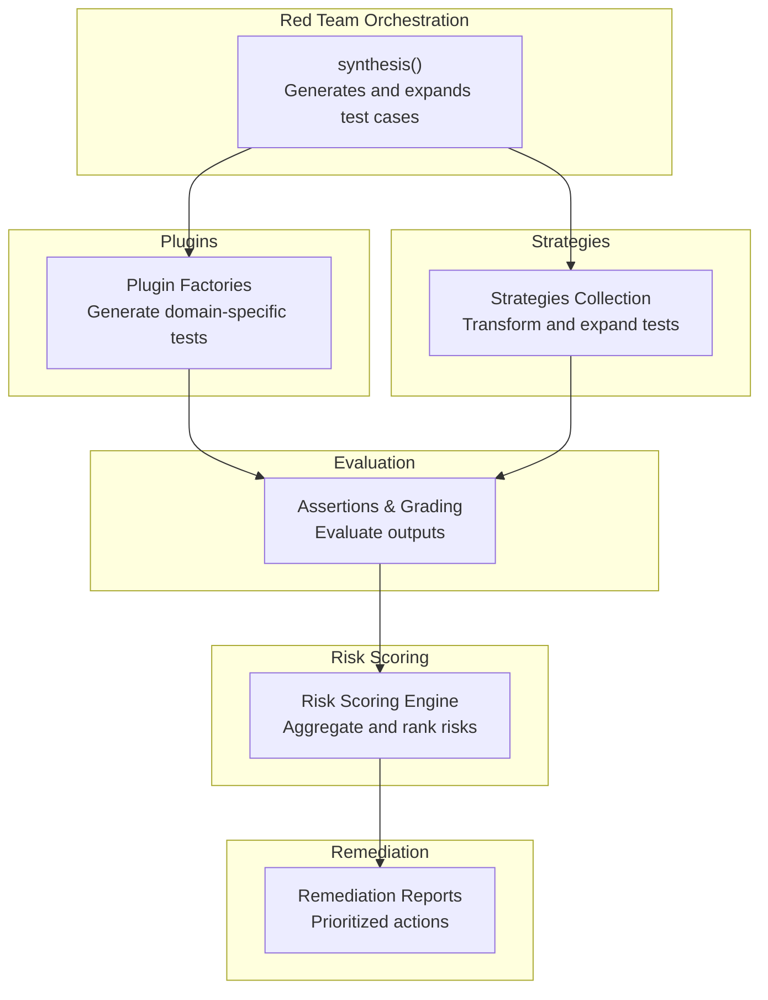
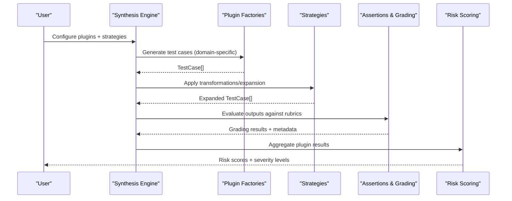
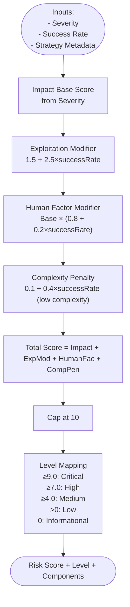
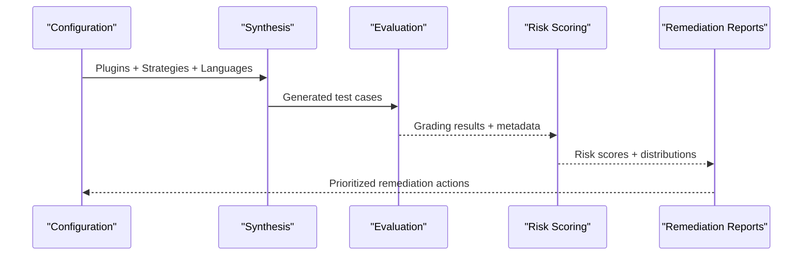
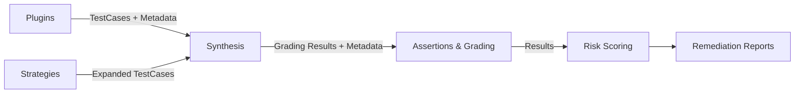

# Vulnerability Assessment

<cite>
**Referenced Files in This Document**
- [riskScoring.ts](file://src/redteam/riskScoring.ts)
- [index.ts](file://src/redteam/index.ts)
- [redteam.ts](file://src/assertions/redteam.ts)
- [index.ts](file://src/redteam/strategies/index.ts)
- [index.ts](file://src/redteam/plugins/index.ts)
- [redteamRun.ts](file://src/commands/mcp/tools/redteamRun.ts)
- [risk-scoring.md](file://site/docs/red-team/risk-scoring.md)
- [red-team-gpt.md](file://site/blog/red-team-gpt.md)
- [model-drift.md](file://site/docs/red-team/model-drift.md)
- [remediation-reports.md](file://site/docs/enterprise/remediation-reports.md)
- [red-teaming.tsx](file://site/src/pages/red-teaming.tsx)
</cite>

## Table of Contents
1. [Introduction](#introduction)
2. [Project Structure](#project-structure)
3. [Core Components](#core-components)
4. [Architecture Overview](#architecture-overview)
5. [Detailed Component Analysis](#detailed-component-analysis)
6. [Dependency Analysis](#dependency-analysis)
7. [Performance Considerations](#performance-considerations)
8. [Troubleshooting Guide](#troubleshooting-guide)
9. [Conclusion](#conclusion)
10. [Appendices](#appendices)

## Introduction
This document describes the vulnerability assessment capabilities of PromptFoo’s red team testing framework. It explains how the system detects potential security weaknesses in LLM applications, classifies and prioritizes them using a risk scoring model, and supports remediation workflows. It also covers assessment workflows from detection through risk evaluation to remediation prioritization, metrics collection, statistical analysis, trend reporting, and integration with external databases and compliance frameworks.

## Project Structure
PromptFoo organizes red team functionality under a cohesive set of modules:
- Red team orchestration and synthesis: orchestrates plugin generation and strategy application
- Plugins: generate test cases across domains (harmful content, bias, PII, SQL injection, etc.)
- Strategies: transform and expand test cases to probe robustness
- Assertions and grading: evaluate model outputs against domain-specific rubrics
- Risk scoring: converts assessment outcomes into risk scores and severity levels
- Remediation reports: guide prioritized remediation actions

**Diagram sources**
- [index.ts:700-800](file://src/redteam/index.ts#L700-L800)
- [index.ts:199-420](file://src/redteam/plugins/index.ts#L199-L420)
- [index.ts:40-370](file://src/redteam/strategies/index.ts#L40-L370)
- [redteam.ts:35-173](file://src/assertions/redteam.ts#L35-L173)
- [riskScoring.ts:207-383](file://src/redteam/riskScoring.ts#L207-L383)
- [remediation-reports.md:46-203](file://site/docs/enterprise/remediation-reports.md#L46-L203)

**Section sources**
- [index.ts:700-800](file://src/redteam/index.ts#L700-L800)
- [index.ts:199-420](file://src/redteam/plugins/index.ts#L199-L420)
- [index.ts:40-370](file://src/redteam/strategies/index.ts#L40-L370)
- [redteam.ts:35-173](file://src/assertions/redteam.ts#L35-L173)
- [riskScoring.ts:207-383](file://src/redteam/riskScoring.ts#L207-L383)
- [remediation-reports.md:46-203](file://site/docs/enterprise/remediation-reports.md#L46-L203)

## Core Components
- Plugin factories generate domain-specific test cases (e.g., harmful content, bias, PII leakage, SQL injection, shell injection, excessive agency, hallucination, toxic chat, unsafe benchmarks, cross-session leaks, debug access, prompt extraction, RBAC, tool discovery, and more).
- Strategies transform and expand test cases (e.g., jailbreak variants, encoding-based obfuscation, best-of-N sampling, layering, iterative techniques, indirect web pwn, audio/image/video encodings, and others).
- Assertions and grading evaluate model outputs using domain-specific rubrics and propagate metadata for risk scoring.
- Risk scoring aggregates plugin-level results into per-plugin and system-level risk scores, with severity mapping and level assignment.
- Remediation reports translate risk scores into prioritized remediation actions.

Key implementation references:
- Plugin factories and remote/local generation: [index.ts:199-420](file://src/redteam/plugins/index.ts#L199-L420)
- Strategy registry and transformations: [index.ts:40-370](file://src/redteam/strategies/index.ts#L40-L370)
- Assertion handling and grader integration: [redteam.ts:35-173](file://src/assertions/redteam.ts#L35-L173)
- Risk scoring engine: [riskScoring.ts:207-383](file://src/redteam/riskScoring.ts#L207-L383)

**Section sources**
- [index.ts:199-420](file://src/redteam/plugins/index.ts#L199-L420)
- [index.ts:40-370](file://src/redteam/strategies/index.ts#L40-L370)
- [redteam.ts:35-173](file://src/assertions/redteam.ts#L35-L173)
- [riskScoring.ts:207-383](file://src/redteam/riskScoring.ts#L207-L383)

## Architecture Overview
The red team assessment pipeline integrates plugin-driven test generation, strategy expansion, evaluation, and risk scoring.

**Diagram sources**
- [index.ts:700-800](file://src/redteam/index.ts#L700-L800)
- [index.ts:199-420](file://src/redteam/plugins/index.ts#L199-L420)
- [index.ts:40-370](file://src/redteam/strategies/index.ts#L40-L370)
- [redteam.ts:35-173](file://src/assertions/redteam.ts#L35-L173)
- [riskScoring.ts:207-383](file://src/redteam/riskScoring.ts#L207-L383)

## Detailed Component Analysis

### Risk Scoring Engine
The risk scoring engine computes per-plugin and system-level risk scores from plugin test results. It considers:
- Severity base (Critical, High, Medium, Low, Informational)
- Exploitability modifier (linear mapping from success rate)
- Human factor modifier (based on human exploitability and complexity)
- Complexity penalty (for low-complexity, human-exploitable attacks)

**Diagram sources**
- [riskScoring.ts:130-185](file://src/redteam/riskScoring.ts#L130-L185)
- [riskScoring.ts:187-205](file://src/redteam/riskScoring.ts#L187-L205)

**Section sources**
- [riskScoring.ts:207-383](file://src/redteam/riskScoring.ts#L207-L383)
- [risk-scoring.md:40-118](file://site/docs/red-team/risk-scoring.md#L40-L118)

### Vulnerability Classification Taxonomy
- Severity levels: Critical, High, Medium, Low, Informational
- Exploitability: Human vs. tool-only; complexity levels (low, medium, high)
- Strategy metadata: Maps strategy IDs to human exploitability and complexity
- Success rate: Derived from plugin test results (failed = successful attack; passed = blocked)

References:
- Strategy metadata mapping: [riskScoring.ts:58-90](file://src/redteam/riskScoring.ts#L58-L90)
- Severity mapping: [riskScoring.ts:141-147](file://src/redteam/riskScoring.ts#L141-L147)

**Section sources**
- [riskScoring.ts:58-90](file://src/redteam/riskScoring.ts#L58-L90)
- [riskScoring.ts:141-147](file://src/redteam/riskScoring.ts#L141-L147)

### Assessment Workflows
End-to-end workflow from detection to remediation prioritization:
1. Configuration: Select plugins and strategies; define languages and optional test generation instructions.
2. Test generation: Plugins produce domain-specific test cases; strategies expand them.
3. Evaluation: Assertions grade outputs; rubrics encode domain-specific requirements.
4. Risk aggregation: Plugin-level risk scores computed; system-level score derived.
5. Reporting: Risk scores, severity levels, and strategy breakdowns presented.
6. Remediation: Remediation reports map vulnerabilities to actionable items; track progress across scans.

**Diagram sources**
- [index.ts:700-800](file://src/redteam/index.ts#L700-L800)
- [redteam.ts:35-173](file://src/assertions/redteam.ts#L35-L173)
- [riskScoring.ts:320-383](file://src/redteam/riskScoring.ts#L320-L383)
- [remediation-reports.md:46-203](file://site/docs/enterprise/remediation-reports.md#L46-L203)

**Section sources**
- [index.ts:700-800](file://src/redteam/index.ts#L700-L800)
- [redteam.ts:35-173](file://src/assertions/redteam.ts#L35-L173)
- [riskScoring.ts:320-383](file://src/redteam/riskScoring.ts#L320-L383)
- [remediation-reports.md:46-203](file://site/docs/enterprise/remediation-reports.md#L46-L203)

### Metrics Collection, Statistical Analysis, and Trend Reporting
- Metrics: Per-plugin totals, passed/failure counts, success rates, and strategy breakdowns
- Statistical analysis: Aggregation across strategies; distribution of risk levels; system-level penalties for multiple high-risk issues
- Trend reporting: Baseline establishment and drift detection over time; continuous monitoring in CI/CD pipelines

References:
- Distribution and system-level scoring: [riskScoring.ts:320-383](file://src/redteam/riskScoring.ts#L320-L383)
- Drift best practices: [model-drift.md:368-389](file://site/docs/red-team/model-drift.md#L368-L389)

**Section sources**
- [riskScoring.ts:320-383](file://src/redteam/riskScoring.ts#L320-L383)
- [model-drift.md:368-389](file://site/docs/red-team/model-drift.md#L368-L389)

### Examples of Vulnerability Categorization, Scoring, and Remediation
- Scenario examples and scoring walkthroughs are documented in the risk scoring guide, including Critical/High/Medium scenarios with explicit calculations.
- Remediation reports provide prioritized action items with impact/effort estimates and implementation guidance.

References:
- Scenario examples: [risk-scoring.md:75-118](file://site/docs/red-team/risk-scoring.md#L75-L118)
- Remediation report structure and workflow: [remediation-reports.md:46-203](file://site/docs/enterprise/remediation-reports.md#L46-L203)

**Section sources**
- [risk-scoring.md:75-118](file://site/docs/red-team/risk-scoring.md#L75-L118)
- [remediation-reports.md:46-203](file://site/docs/enterprise/remediation-reports.md#L46-L203)

### False Positive Reduction, Confidence Scoring, and Validation Processes
- Stored grader results: If a provider response includes stored grader results, they are used directly to reduce variability and false positives.
- Iterative strategy handling: Graceful handling of partial grader errors in iterative strategies; marks grading as incomplete rather than failing the entire evaluation.
- Validation: Strategy validation ensures custom strategies and configurations are well-formed; plugin factories validate inputs and modifiers.

References:
- Stored grader result propagation: [redteam.ts:46-72](file://src/assertions/redteam.ts#L46-L72)
- Partial grader error handling: [redteam.ts:140-171](file://src/assertions/redteam.ts#L140-L171)
- Strategy validation: [index.ts:372-408](file://src/redteam/strategies/index.ts#L372-L408)
- Plugin factory validation: [index.ts:234-244](file://src/redteam/plugins/index.ts#L234-L244)

**Section sources**
- [redteam.ts:46-72](file://src/assertions/redteam.ts#L46-L72)
- [redteam.ts:140-171](file://src/assertions/redteam.ts#L140-L171)
- [index.ts:372-408](file://src/redteam/strategies/index.ts#L372-L408)
- [index.ts:234-244](file://src/redteam/plugins/index.ts#L234-L244)

### Integration with External Vulnerability Databases and Compliance Frameworks
- Framework compliance testing: Plugins and configurations can target specific frameworks (e.g., OWASP LLM Top 10, NIST AI risk management).
- Continuous monitoring and CI/CD integration: Automated scanning integrated into pipelines; drift detection and baselining.

References:
- Compliance testing examples: [red-team-gpt.md:226-237](file://site/blog/red-team-gpt.md#L226-L237)
- CI/CD integration and drift: [model-drift.md:368-389](file://site/docs/red-team/model-drift.md#L368-L389)
- Feature overview: [red-teaming.tsx:231-271](file://site/src/pages/red-teaming.tsx#L231-L271)

**Section sources**
- [red-team-gpt.md:226-237](file://site/blog/red-team-gpt.md#L226-L237)
- [model-drift.md:368-389](file://site/docs/red-team/model-drift.md#L368-L389)
- [red-teaming.tsx:231-271](file://site/src/pages/red-teaming.tsx#L231-L271)

### Automated Assessment Workflows and Manual Review Processes
- Automated workflows: CLI tooling and MCP tooling orchestrate red team runs with timeouts, caching, and progress reporting.
- Manual review: Remediation reports provide prioritized action items; users can review findings, mark as fixed, and re-scan to validate remediation.

References:
- Red team run orchestration and timeouts: [redteamRun.ts:120-163](file://src/commands/mcp/tools/redteamRun.ts#L120-L163)
- Remediation workflow: [remediation-reports.md:159-196](file://site/docs/enterprise/remediation-reports.md#L159-L196)

**Section sources**
- [redteamRun.ts:120-163](file://src/commands/mcp/tools/redteamRun.ts#L120-L163)
- [remediation-reports.md:159-196](file://site/docs/enterprise/remediation-reports.md#L159-L196)

## Dependency Analysis
The red team subsystem exhibits clear separation of concerns:
- Plugins depend on provider interfaces and configuration; they emit test cases with metadata.
- Strategies depend on plugin outputs and transform them using encoding, jailbreaking, and iterative techniques.
- Assertions depend on grader implementations and provider responses; they return pass/fail with rubrics.
- Risk scoring depends on plugin-level results and strategy metadata; it produces system-level risk.

**Diagram sources**
- [index.ts:199-420](file://src/redteam/plugins/index.ts#L199-L420)
- [index.ts:40-370](file://src/redteam/strategies/index.ts#L40-L370)
- [redteam.ts:35-173](file://src/assertions/redteam.ts#L35-L173)
- [riskScoring.ts:207-383](file://src/redteam/riskScoring.ts#L207-L383)

**Section sources**
- [index.ts:199-420](file://src/redteam/plugins/index.ts#L199-L420)
- [index.ts:40-370](file://src/redteam/strategies/index.ts#L40-L370)
- [redteam.ts:35-173](file://src/assertions/redteam.ts#L35-L173)
- [riskScoring.ts:207-383](file://src/redteam/riskScoring.ts#L207-L383)

## Performance Considerations
- Concurrency limits: Max concurrency capped to protect resource usage during test generation.
- Pre/post caps: Strategies limit output fan-out; early and late caps prevent excessive computation.
- Remote generation: Offloads heavy generation to remote servers when enabled, reducing local overhead.
- Timeout protection: Red team runs enforce timeouts to avoid hanging operations.

References:
- Concurrency and caps: [index.ts:742-745](file://src/redteam/index.ts#L742-L745), [index.ts:406-450](file://src/redteam/index.ts#L406-L450)
- Remote generation: [index.ts:169-173](file://src/redteam/plugins/index.ts#L169-L173)
- Tool timeout: [redteamRun.ts:142-146](file://src/commands/mcp/tools/redteamRun.ts#L142-L146)

**Section sources**
- [index.ts:742-745](file://src/redteam/index.ts#L742-L745)
- [index.ts:406-450](file://src/redteam/index.ts#L406-L450)
- [index.ts:169-173](file://src/redteam/plugins/index.ts#L169-L173)
- [redteamRun.ts:142-146](file://src/commands/mcp/tools/redteamRun.ts#L142-L146)

## Troubleshooting Guide
Common issues and mitigations:
- No results generated: Indicates no test cases created or no vulnerabilities found; verify plugin configuration and strategies.
- Provider connectivity or credentials: Timeouts may indicate upstream issues; confirm credentials and network access.
- Partial or skipped generations: Check requested vs. generated counts; investigate plugin or strategy failures.
- Grader errors: Stored grader results can be used; partial failures in iterative strategies are handled gracefully.

References:
- Timeout and no-results messaging: [redteamRun.ts:142-156](file://src/commands/mcp/tools/redteamRun.ts#L142-L156)
- Stored grader result handling: [redteam.ts:46-72](file://src/assertions/redteam.ts#L46-L72)
- Partial failure handling: [redteam.ts:140-171](file://src/assertions/redteam.ts#L140-L171)

**Section sources**
- [redteamRun.ts:142-156](file://src/commands/mcp/tools/redteamRun.ts#L142-L156)
- [redteam.ts:46-72](file://src/assertions/redteam.ts#L46-L72)
- [redteam.ts:140-171](file://src/assertions/redteam.ts#L140-L171)

## Conclusion
PromptFoo’s red team framework provides a comprehensive, automated approach to vulnerability assessment for LLM applications. By combining domain-specific plugins, diverse attack strategies, robust evaluation with stored grader results, and a principled risk scoring model, it enables teams to detect, classify, prioritize, and remediate security weaknesses effectively. Integration with CI/CD pipelines and compliance frameworks further strengthens operational security and continuous monitoring.

## Appendices
- Adaptive scans and continuous monitoring features: [red-teaming.tsx:11-35](file://site/src/pages/red-teaming.tsx#L11-L35)
- Example compliance plugin usage: [red-team-gpt.md:226-237](file://site/blog/red-team-gpt.md#L226-L237)