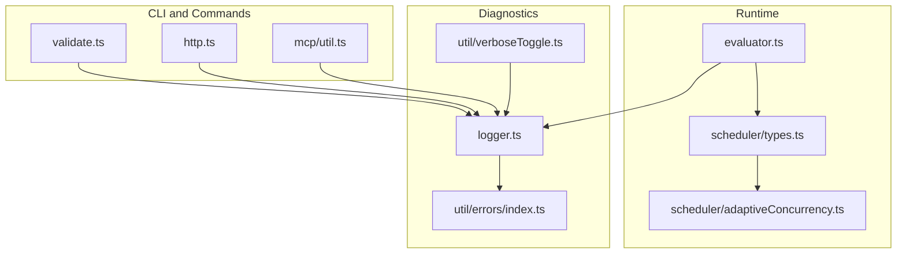
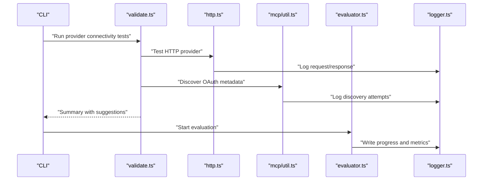
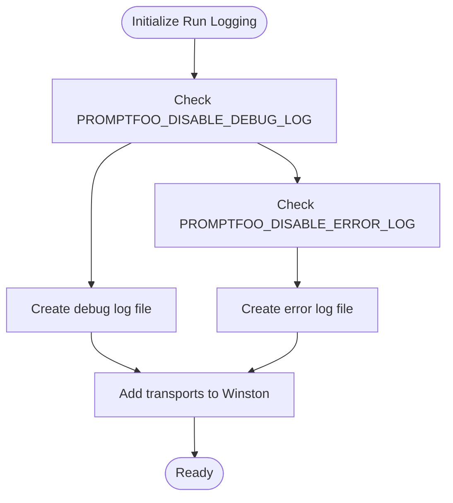
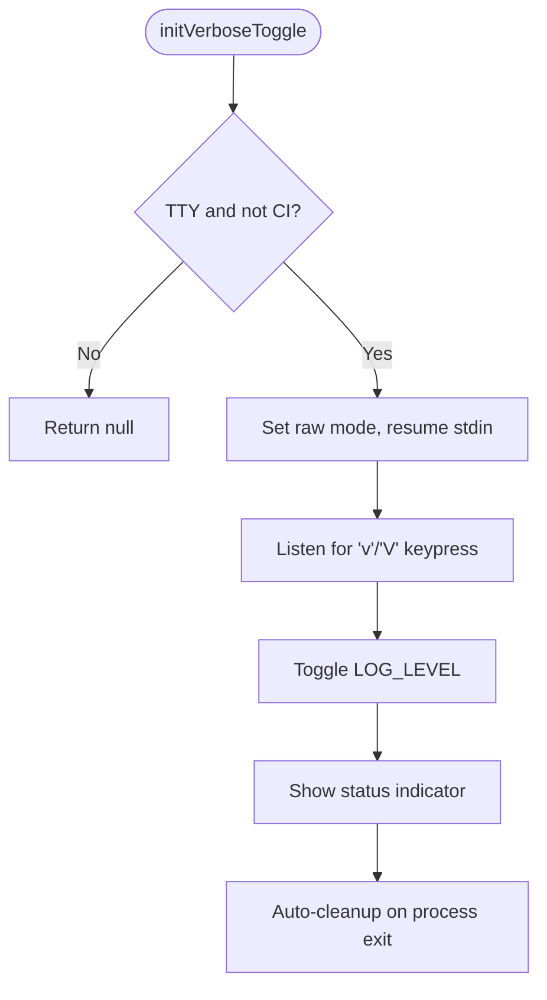
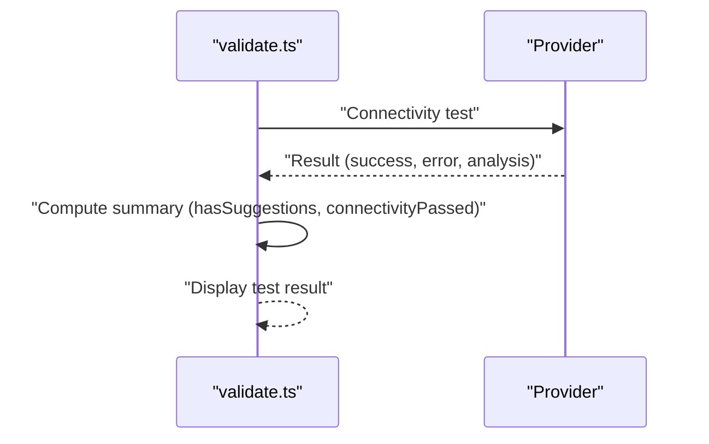
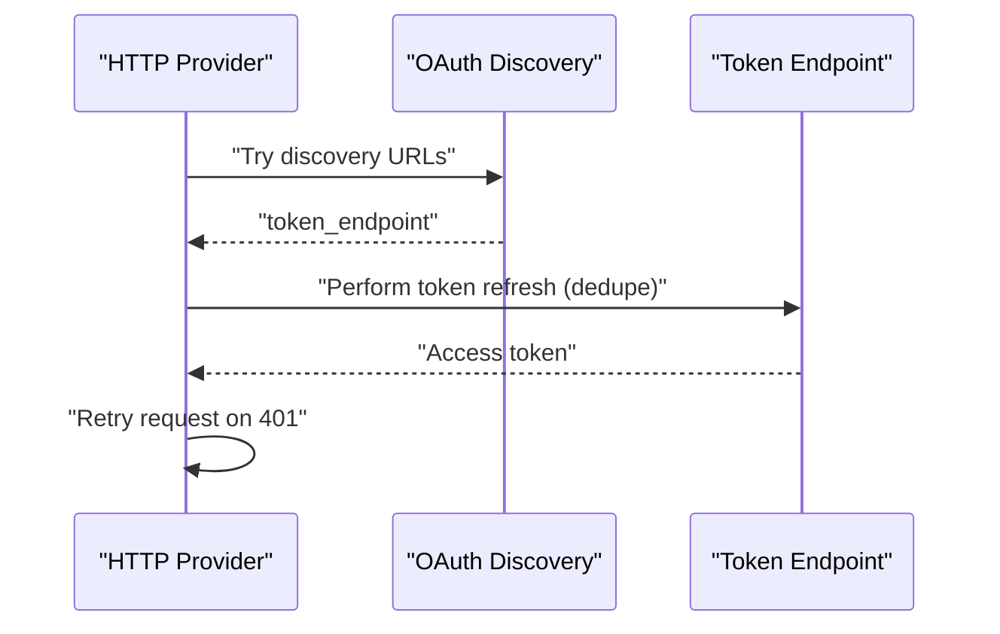
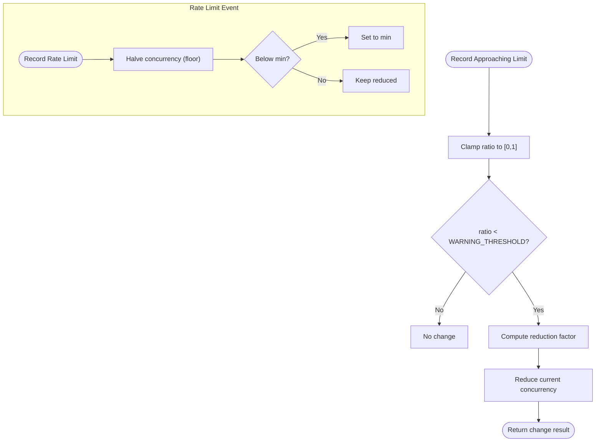
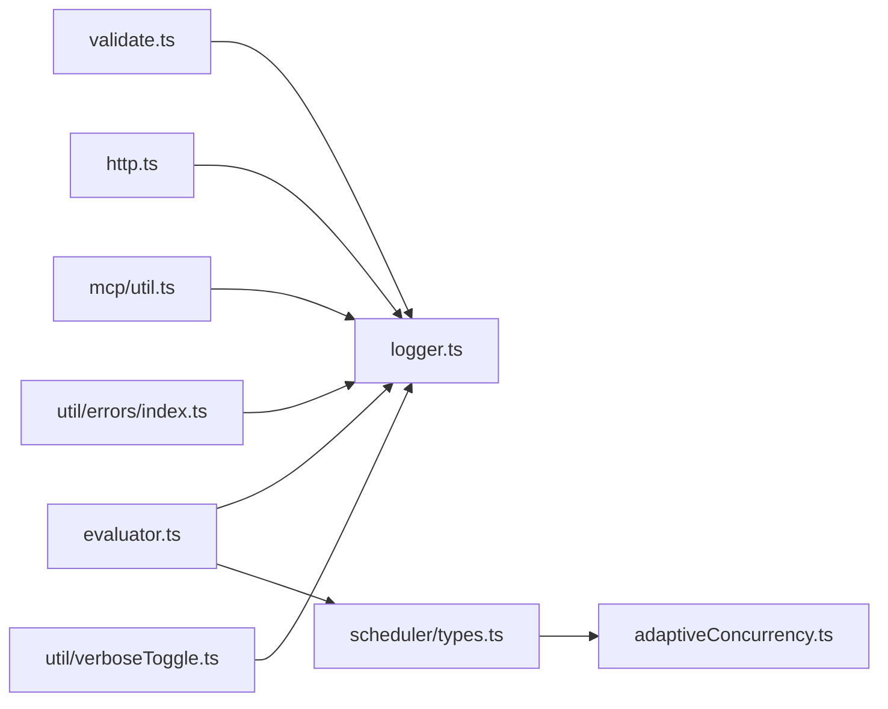

# Troubleshooting & FAQ

<cite>
**Referenced Files in This Document**
- [logger.ts](file://src/logger.ts)
- [errors/index.ts](file://src/util/errors/index.ts)
- [verboseToggle.ts](file://src/util/verboseToggle.ts)
- [evaluator.ts](file://src/evaluator.ts)
- [validate.ts](file://src/commands/validate.ts)
- [http.ts](file://src/providers/http.ts)
- [mcp/util.ts](file://src/providers/mcp/util.ts)
- [adaptiveConcurrency.ts](file://src/scheduler/adaptiveConcurrency.ts)
- [types.ts](file://src/scheduler/types.ts)
- [SECURITY.md](file://SECURITY.md)
- [CODE_OF_CONDUCT.md](file://CODE_OF_CONDUCT.md)
- [conductor-setup.sh](file://conductor-setup.sh)
- [promptfooCommand.ts](file://src/util/promptfooCommand.ts)
- [0011_moaning_millenium_guard.sql](file://drizzle/0011_moaning_millenium_guard.sql)
- [README.md](file://README.md)
</cite>

## Table of Contents
1. [Introduction](#introduction)
2. [Project Structure](#project-structure)
3. [Core Components](#core-components)
4. [Architecture Overview](#architecture-overview)
5. [Detailed Component Analysis](#detailed-component-analysis)
6. [Dependency Analysis](#dependency-analysis)
7. [Performance Considerations](#performance-considerations)
8. [Troubleshooting Guide](#troubleshooting-guide)
9. [Conclusion](#conclusion)
10. [Appendices](#appendices)

## Introduction
This document provides comprehensive troubleshooting and FAQ guidance for PromptFoo. It covers installation issues, configuration errors, evaluation failures, debugging techniques, performance optimization, provider-specific authentication and connectivity problems, result interpretation, assertion failure analysis, and evaluation workflow debugging. It also includes frequently asked questions, error message meanings, community resources, and security considerations with safe troubleshooting practices.

## Project Structure
PromptFoo’s troubleshooting-relevant subsystems include:
- Logging and diagnostics: centralized logger, error file detection, and verbose toggle
- Evaluation engine: progress tracking, concurrency, and result aggregation
- Provider connectivity validation and OAuth/MCP token refresh
- Scheduler and adaptive concurrency for rate-limiting and throughput
- Security policy and community conduct/reporting

**Diagram sources**
- [validate.ts:145-184](file://src/commands/validate.ts#L145-L184)
- [http.ts:1621-1661](file://src/providers/http.ts#L1621-L1661)
- [mcp/util.ts:76-107](file://src/providers/mcp/util.ts#L76-L107)
- [evaluator.ts:1-200](file://src/evaluator.ts#L1-L200)
- [types.ts:37-53](file://src/scheduler/types.ts#L37-L53)
- [adaptiveConcurrency.ts:84-124](file://src/scheduler/adaptiveConcurrency.ts#L84-L124)
- [logger.ts:251-276](file://src/logger.ts#L251-L276)
- [errors/index.ts:22-34](file://src/util/errors/index.ts#L22-L34)
- [verboseToggle.ts:30-99](file://src/util/verboseToggle.ts#L30-L99)

**Section sources**
- [logger.ts:251-276](file://src/logger.ts#L251-L276)
- [validate.ts:145-184](file://src/commands/validate.ts#L145-L184)
- [http.ts:1621-1661](file://src/providers/http.ts#L1621-L1661)
- [mcp/util.ts:76-107](file://src/providers/mcp/util.ts#L76-L107)
- [evaluator.ts:1-200](file://src/evaluator.ts#L1-L200)
- [types.ts:37-53](file://src/scheduler/types.ts#L37-L53)
- [adaptiveConcurrency.ts:84-124](file://src/scheduler/adaptiveConcurrency.ts#L84-L124)
- [errors/index.ts:22-34](file://src/util/errors/index.ts#L22-L34)
- [verboseToggle.ts:30-99](file://src/util/verboseToggle.ts#L30-L99)

## Core Components
- Logging and diagnostics: structured logging, file transports, caller location, and shutdown handling
- Verbose toggle: interactive debug verbosity control in TTY environments
- Provider connectivity validation: HTTP provider tests, suggestion analysis, and session handling
- OAuth/MCP token refresh: proactive refresh, deduplicated refresh promises, and error handling
- Scheduler and adaptive concurrency: rate-limiting, approaching-limit adjustments, and recovery
- Error file detection: prints actionable log locations after runs

**Section sources**
- [logger.ts:251-276](file://src/logger.ts#L251-L276)
- [logger.ts:476-529](file://src/logger.ts#L476-L529)
- [verboseToggle.ts:30-99](file://src/util/verboseToggle.ts#L30-L99)
- [validate.ts:145-184](file://src/commands/validate.ts#L145-L184)
- [http.ts:1621-1661](file://src/providers/http.ts#L1621-L1661)
- [mcp/util.ts:76-107](file://src/providers/mcp/util.ts#L76-L107)
- [adaptiveConcurrency.ts:84-124](file://src/scheduler/adaptiveConcurrency.ts#L84-L124)
- [errors/index.ts:22-34](file://src/util/errors/index.ts#L22-L34)

## Architecture Overview
The evaluation workflow integrates CLI commands, provider connectivity checks, HTTP/MCP authentication, scheduler concurrency, and logging. Results are aggregated and surfaced with progress and metrics.

**Diagram sources**
- [validate.ts:145-184](file://src/commands/validate.ts#L145-L184)
- [http.ts:1621-1661](file://src/providers/http.ts#L1621-L1661)
- [mcp/util.ts:76-107](file://src/providers/mcp/util.ts#L76-L107)
- [evaluator.ts:1-200](file://src/evaluator.ts#L1-L200)
- [logger.ts:429-468](file://src/logger.ts#L429-L468)

## Detailed Component Analysis

### Logging and Diagnostics
- Per-run logging creates debug and error log files with timestamps and cleans up old logs.
- Structured logging supports cloud integrations; console mode formats context as JSON.
- Caller location is captured for debug logs; source map support initializes on demand.
- Graceful shutdown closes file transports safely and suppresses “write after end” errors.

**Diagram sources**
- [logger.ts:251-276](file://src/logger.ts#L251-L276)

**Section sources**
- [logger.ts:251-276](file://src/logger.ts#L251-L276)
- [logger.ts:429-468](file://src/logger.ts#L429-L468)
- [logger.ts:476-529](file://src/logger.ts#L476-L529)

### Verbose Toggle
- Enables live toggling of debug/info verbosity in interactive TTY sessions.
- Safe initialization and cleanup; exits gracefully on Ctrl+C.

**Diagram sources**
- [verboseToggle.ts:30-99](file://src/util/verboseToggle.ts#L30-L99)

**Section sources**
- [verboseToggle.ts:30-99](file://src/util/verboseToggle.ts#L30-L99)

### Provider Connectivity Validation
- Tests connectivity and optionally session handling, aggregates suggestions, and reports pass/fail.
- Handles scenarios where suggestions exist without actual errors.

**Diagram sources**
- [validate.ts:145-184](file://src/commands/validate.ts#L145-L184)

**Section sources**
- [validate.ts:145-184](file://src/commands/validate.ts#L145-L184)

### OAuth/MCP Token Refresh
- Proactively refreshes tokens before expiry, deduplicates concurrent refreshes, and retries on 401.
- Discovers OAuth token endpoint via RFC 8414 discovery URLs with fallbacks.

**Diagram sources**
- [http.ts:1621-1661](file://src/providers/http.ts#L1621-L1661)
- [mcp/util.ts:76-107](file://src/providers/mcp/util.ts#L76-L107)

**Section sources**
- [http.ts:1621-1661](file://src/providers/http.ts#L1621-L1661)
- [mcp/util.ts:76-107](file://src/providers/mcp/util.ts#L76-L107)

### Scheduler and Adaptive Concurrency
- Adjusts concurrency based on rate-limit warnings and actual rate-limit events.
- Linear reduction near thresholds; exponential decay when rate-limited; recovers toward initial concurrency.

**Diagram sources**
- [adaptiveConcurrency.ts:84-124](file://src/scheduler/adaptiveConcurrency.ts#L84-L124)

**Section sources**
- [adaptiveConcurrency.ts:84-124](file://src/scheduler/adaptiveConcurrency.ts#L84-L124)
- [types.ts:37-53](file://src/scheduler/types.ts#L37-L53)

### Error File Detection
- After a run, if error logs exist, prints actionable guidance with file paths.

**Section sources**
- [errors/index.ts:22-34](file://src/util/errors/index.ts#L22-L34)

## Dependency Analysis
- CLI commands depend on logging for diagnostics and on provider modules for connectivity and auth.
- Evaluation depends on scheduler types and adaptive concurrency for throughput control.
- Security and community policies govern reporting and safe usage.

**Diagram sources**
- [validate.ts:145-184](file://src/commands/validate.ts#L145-L184)
- [http.ts:1621-1661](file://src/providers/http.ts#L1621-L1661)
- [mcp/util.ts:76-107](file://src/providers/mcp/util.ts#L76-L107)
- [evaluator.ts:1-200](file://src/evaluator.ts#L1-L200)
- [types.ts:37-53](file://src/scheduler/types.ts#L37-L53)
- [adaptiveConcurrency.ts:84-124](file://src/scheduler/adaptiveConcurrency.ts#L84-L124)
- [logger.ts:251-276](file://src/logger.ts#L251-L276)
- [errors/index.ts:22-34](file://src/util/errors/index.ts#L22-L34)
- [verboseToggle.ts:30-99](file://src/util/verboseToggle.ts#L30-L99)

**Section sources**
- [validate.ts:145-184](file://src/commands/validate.ts#L145-L184)
- [http.ts:1621-1661](file://src/providers/http.ts#L1621-L1661)
- [mcp/util.ts:76-107](file://src/providers/mcp/util.ts#L76-L107)
- [evaluator.ts:1-200](file://src/evaluator.ts#L1-L200)
- [types.ts:37-53](file://src/scheduler/types.ts#L37-L53)
- [adaptiveConcurrency.ts:84-124](file://src/scheduler/adaptiveConcurrency.ts#L84-L124)
- [logger.ts:251-276](file://src/logger.ts#L251-L276)
- [errors/index.ts:22-34](file://src/util/errors/index.ts#L22-L34)
- [verboseToggle.ts:30-99](file://src/util/verboseToggle.ts#L30-L99)

## Performance Considerations
- Rate limiting and concurrency tuning:
  - Use adaptive concurrency to reduce or recover concurrency based on rate-limit signals.
  - Monitor “approaching limit” ratios and adjust initial concurrency accordingly.
- Throughput and stability:
  - Scheduler types extract headers and detect transient connection errors to improve resilience.
- Memory management:
  - Prefer streaming or chunked responses when supported by providers to reduce memory pressure.
  - Avoid loading excessively large fixtures into memory; use file-backed inputs where possible.
- Logging overhead:
  - Disable debug logs in production runs via environment variables to reduce I/O overhead.

[No sources needed since this section provides general guidance]

## Troubleshooting Guide

### Installation Problems
- Node.js version mismatch:
  - Ensure the required Node.js version is installed and active; use nvm if necessary.
- Missing package manager:
  - Confirm npm is installed and available in PATH.
- Installation method detection:
  - PromptFoo detects how it was invoked (npx, brew, npm-global) to tailor guidance.

**Section sources**
- [conductor-setup.sh:12-40](file://conductor-setup.sh#L12-L40)
- [promptfooCommand.ts:17-39](file://src/util/promptfooCommand.ts#L17-L39)

### Configuration Errors
- YAML/JSON schema validation failures:
  - Review configuration files for typos, incorrect indentation, or unsupported keys.
- Environment variables:
  - Verify required environment variables are set and not accidentally masked by defaults.
- Provider configuration:
  - Use connectivity validation to test provider endpoints and receive suggestions for fixes.

**Section sources**
- [validate.ts:145-184](file://src/commands/validate.ts#L145-L184)

### Evaluation Failures
- Assertion failures vs. runtime errors:
  - Assertion failures mark test cases as failed; runtime errors indicate provider or environment issues.
  - Investigate failure reasons recorded in evaluation results.
- Progress and metrics:
  - Use the progress bar indicators and metrics to isolate failing providers or prompts.

**Section sources**
- [evaluator.ts:1-200](file://src/evaluator.ts#L1-L200)
- [0011_moaning_millenium_guard.sql:1-1](file://drizzle/0011_moaning_millenium_guard.sql#L1-L1)

### Debugging Techniques
- Enable verbose logging:
  - Toggle debug verbosity interactively in TTY sessions or set log level via environment variables.
- Inspect logs:
  - After a run, if errors occurred, the system prints the locations of error and debug logs.
- Structured logging:
  - Enable structured logging for cloud integrations; otherwise, context is formatted as JSON appended to messages.

**Section sources**
- [verboseToggle.ts:30-99](file://src/util/verboseToggle.ts#L30-L99)
- [errors/index.ts:22-34](file://src/util/errors/index.ts#L22-L34)
- [logger.ts:251-276](file://src/logger.ts#L251-L276)
- [logger.ts:360-396](file://src/logger.ts#L360-L396)

### Provider-Specific Issues
- HTTP provider authentication:
  - Proactive OAuth token refresh and deduplicated refresh promises prevent redundant requests.
- MCP authentication:
  - OAuth discovery follows RFC 8414; supports bearer, basic, and API key auth types with automatic token reuse and refresh.

**Section sources**
- [http.ts:1621-1661](file://src/providers/http.ts#L1621-L1661)
- [mcp/util.ts:76-107](file://src/providers/mcp/util.ts#L76-L107)

### Network Connectivity Troubleshooting
- Transient connection errors:
  - Certain connection errors are treated as transient; the scheduler can retry or adjust concurrency.
- Rate-limit handling:
  - Approaching-limit ratios trigger proactive concurrency reductions; explicit rate-limit events halve concurrency.

**Section sources**
- [types.ts:37-53](file://src/scheduler/types.ts#L37-L53)
- [adaptiveConcurrency.ts:84-124](file://src/scheduler/adaptiveConcurrency.ts#L84-L124)

### Result Interpretation and Assertion Failure Analysis
- Aggregate scores and thresholds:
  - Final pass/fail considers assertion weights and thresholds; review assertion results for reasons.
- Comparison and selection:
  - Use selection strategies (e.g., max score) to determine winners among multiple outputs.

**Section sources**
- [evaluator.ts:1-200](file://src/evaluator.ts#L1-L200)

### Evaluation Workflow Debugging
- Step-by-step checks:
  - Validate provider connectivity first, then run evaluation with verbose logging.
- Session handling:
  - Some providers require session parsing; ensure session variables are handled appropriately.

**Section sources**
- [validate.ts:145-184](file://src/commands/validate.ts#L145-L184)

### Frequently Asked Questions
- How do I increase verbosity during a run?
  - Press v in an interactive terminal to toggle debug output; or set the log level via environment variables.
- Where are logs stored?
  - Per-run logs are created under a logs directory within the configuration directory; locations are printed after runs.
- How do I fix OAuth authentication failures?
  - Ensure correct client credentials and scopes; the provider proactively refreshes tokens and retries on 401.
- How do I interpret assertion failures?
  - Review assertion reasons and scores; consider thresholds and weights when aggregating results.
- How do I report bugs or security issues?
  - Use the community channels and reporting procedures outlined in the community guidelines and security policy.

**Section sources**
- [verboseToggle.ts:30-99](file://src/util/verboseToggle.ts#L30-L99)
- [logger.ts:251-276](file://src/logger.ts#L251-L276)
- [http.ts:1621-1661](file://src/providers/http.ts#L1621-L1661)
- [SECURITY.md:56-67](file://SECURITY.md#L56-L67)
- [CODE_OF_CONDUCT.md:42-52](file://CODE_OF_CONDUCT.md#L42-L52)

### Error Message Meanings and Resolution Steps
- “There were some errors during the operation”:
  - Indicates presence of error logs; check the printed error log path for details.
- “Invalid token” or 401 responses:
  - Re-authenticate; ensure tokens are refreshed and applied to requests.
- “Too many requests”:
  - Reduce concurrency or wait for quota to reset; the scheduler adapts automatically.

**Section sources**
- [errors/index.ts:22-34](file://src/util/errors/index.ts#L22-L34)
- [http.ts:1621-1661](file://src/providers/http.ts#L1621-L1661)
- [types.ts:37-53](file://src/scheduler/types.ts#L37-L53)

### Community Resources, Support Channels, and Issue Reporting
- Reporting a vulnerability:
  - Use GitHub Security Advisories or email channels; do not open public issues for security reports.
- General issues and discussions:
  - Use community channels for support and collaboration.

**Section sources**
- [SECURITY.md:56-67](file://SECURITY.md#L56-L67)
- [CODE_OF_CONDUCT.md:42-52](file://CODE_OF_CONDUCT.md#L42-L52)

### Security Considerations and Safe Troubleshooting Practices
- Trust boundaries:
  - Treat configuration files and referenced scripts as trusted code; avoid running against untrusted configs.
- Local web server:
  - Intended for local use; apply CSRF protections and restrict exposure.
- Hardening recommendations:
  - Run in containers/VMs, use least-privileged keys, avoid secrets in configs, restrict network egress, and do not expose the UI publicly.

**Section sources**
- [SECURITY.md:1-100](file://SECURITY.md#L1-L100)

## Conclusion
PromptFoo provides robust logging, interactive verbosity controls, provider connectivity validation, proactive authentication, and adaptive concurrency to help you troubleshoot effectively. Use the guidance here to diagnose installation issues, resolve configuration errors, interpret evaluation results, and optimize performance while following secure practices.

## Appendices

### Quick Reference: Environment Variables and Flags
- LOG_LEVEL: Controls console verbosity (e.g., info, debug).
- PROMPTFOO_DISABLE_DEBUG_LOG / PROMPTFOO_DISABLE_ERROR_LOG: Disable specific log transports.
- PROMPTFOO_LOG_DIR: Override log directory location.
- PROMPTFOO_CSRF_ALLOWED_ORIGINS: Configure allowed origins for the local web server.

**Section sources**
- [logger.ts:170-194](file://src/logger.ts#L170-L194)
- [logger.ts:204-233](file://src/logger.ts#L204-L233)
- [SECURITY.md:42-46](file://SECURITY.md#L42-L46)