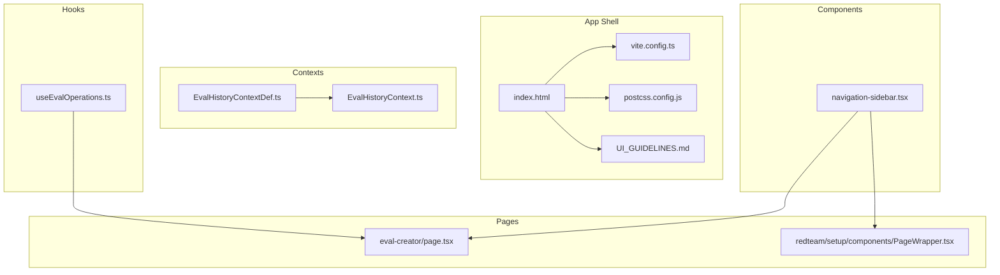
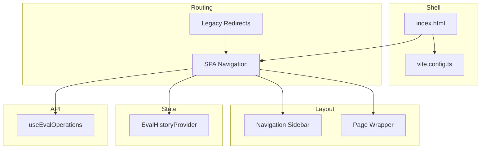
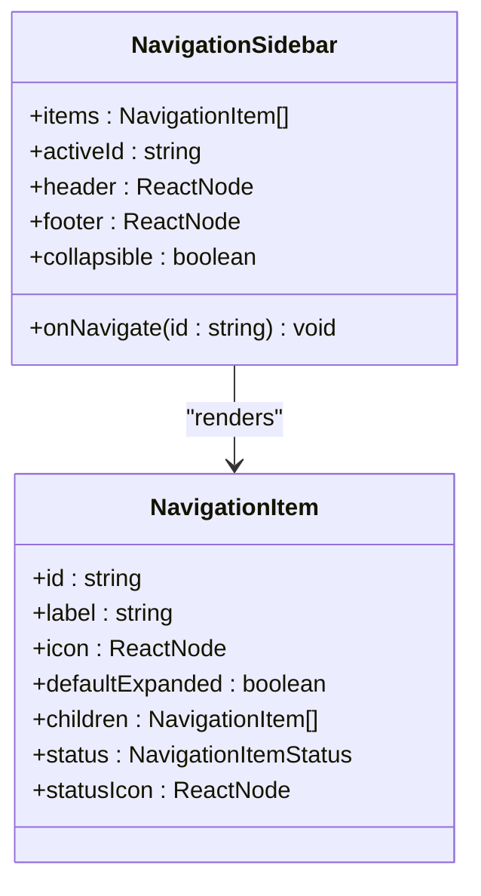
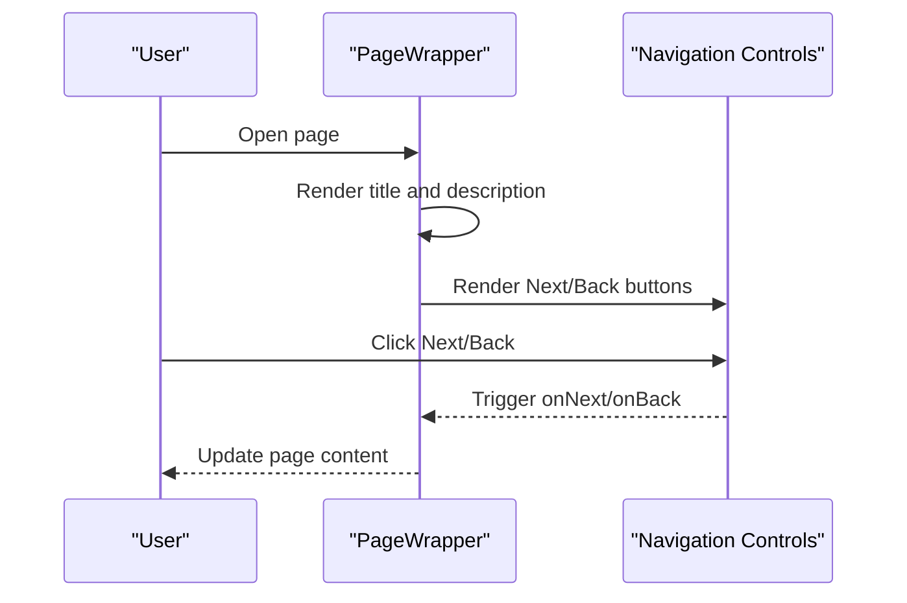
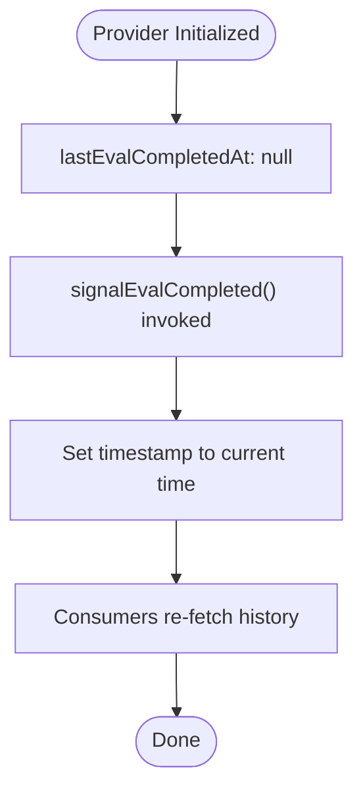
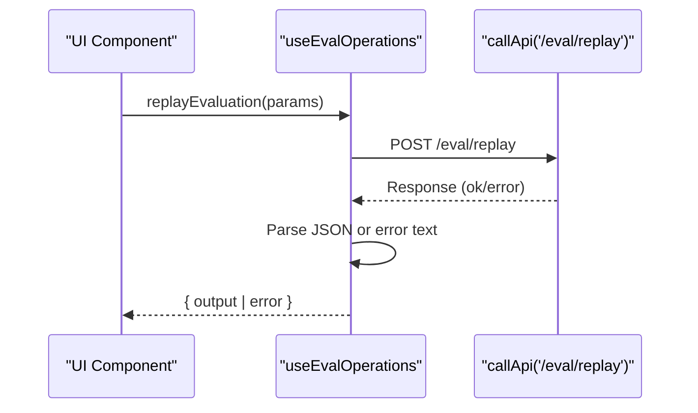
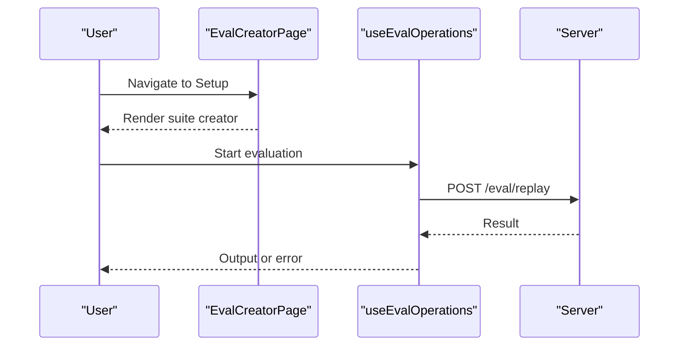
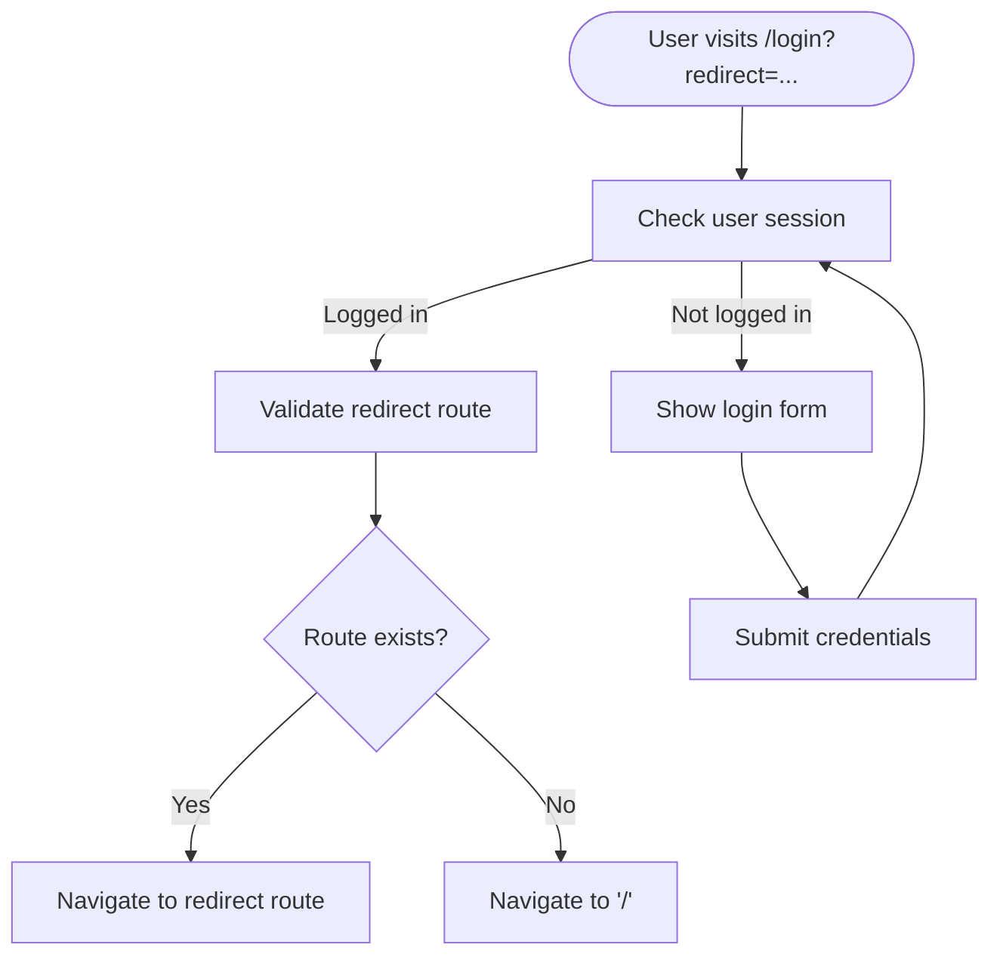
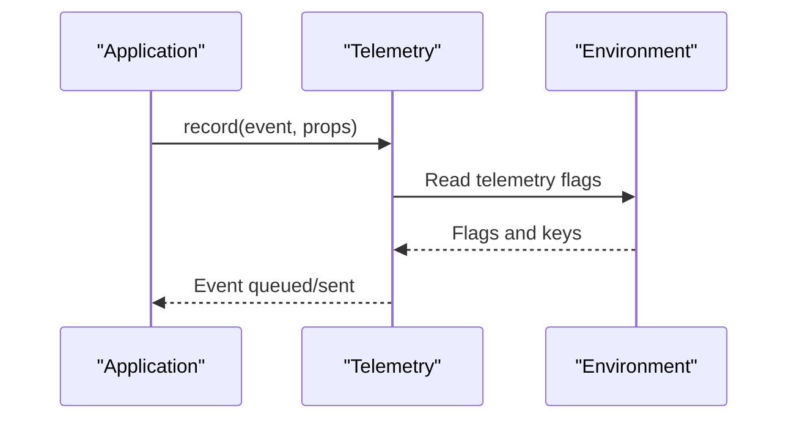
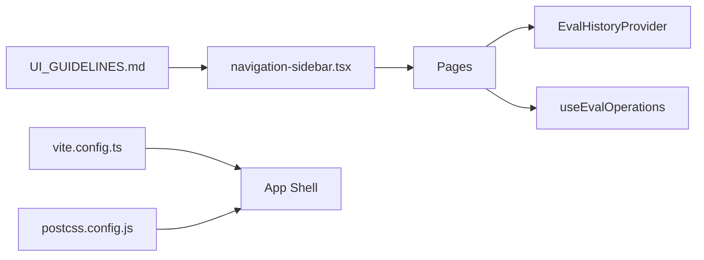

# Dashboard Overview

<cite>
**Referenced Files in This Document**
- [navigation-sidebar.tsx](file://src/app/src/components/ui/navigation-sidebar.tsx)
- [navigation-sidebar.stories.tsx](file://src/app/src/components/ui/navigation-sidebar.stories.tsx)
- [PageWrapper.tsx](file://src/app/src/pages/redteam/setup/components/PageWrapper.tsx)
- [EvalHistoryContext.tsx](file://src/app/src/contexts/EvalHistoryContext.tsx)
- [EvalHistoryContextDef.ts](file://src/app/src/contexts/EvalHistoryContextDef.ts)
- [useEvalOperations.ts](file://src/app/src/hooks/useEvalOperations.ts)
- [login.test.tsx](file://src/app/src/pages/login.test.tsx)
- [index.html](file://src/app/index.html)
- [vite.config.ts](file://src/app/vite.config.ts)
- [postcss.config.js](file://src/app/postcss.config.js)
- [UI_GUIDELINES.md](file://src/app/UI_GUIDELINES.md)
- [telemetry.test.ts](file://test/telemetry.test.ts)
</cite>

## Table of Contents
1. [Introduction](#introduction)
2. [Project Structure](#project-structure)
3. [Core Components](#core-components)
4. [Architecture Overview](#architecture-overview)
5. [Detailed Component Analysis](#detailed-component-analysis)
6. [Dependency Analysis](#dependency-analysis)
7. [Performance Considerations](#performance-considerations)
8. [Troubleshooting Guide](#troubleshooting-guide)
9. [Conclusion](#conclusion)

## Introduction
This document provides a comprehensive dashboard overview for PromptFoo's web interface. It explains the main navigation structure, page routing system, and overall layout architecture. It also covers the launcher page functionality, evaluation workflow initiation, the PageShell component that ensures consistent styling and layout, the routing system including legacy route redirects and modern SPA navigation, context providers such as EvalHistoryProvider and ToastProvider, telemetry tracking, responsive design considerations, and accessibility features. The goal is to help both developers and product users understand how the dashboard works end-to-end.

## Project Structure
PromptFoo's web interface is organized under the src/app directory and uses Vite for bundling and development. The UI follows a component-driven architecture with reusable building blocks, context providers for state sharing, and page-level components that assemble features. Key areas include:
- Components: Reusable UI elements such as the navigation sidebar
- Pages: Routeable screens like the evaluation creator and redteam setup
- Contexts: Providers for evaluation history and other shared state
- Hooks: Custom hooks encapsulating API operations
- Routing: SPA navigation with legacy redirect support
- Layout: Consistent shell and page wrappers for unified UX

**Diagram sources**
- [index.html](file://src/app/index.html)
- [vite.config.ts](file://src/app/vite.config.ts)
- [postcss.config.js](file://src/app/postcss.config.js)
- [UI_GUIDELINES.md](file://src/app/UI_GUIDELINES.md)
- [navigation-sidebar.tsx](file://src/app/src/components/ui/navigation-sidebar.tsx)
- [EvalHistoryContext.tsx](file://src/app/src/contexts/EvalHistoryContext.tsx)
- [EvalHistoryContextDef.ts](file://src/app/src/contexts/EvalHistoryContextDef.ts)
- [useEvalOperations.ts](file://src/app/src/hooks/useEvalOperations.ts)
- [PageWrapper.tsx](file://src/app/src/pages/redteam/setup/components/PageWrapper.tsx)

**Section sources**
- [index.html](file://src/app/index.html)
- [vite.config.ts](file://src/app/vite.config.ts)
- [postcss.config.js](file://src/app/postcss.config.js)
- [UI_GUIDELINES.md](file://src/app/UI_GUIDELINES.md)

## Core Components
- Navigation Sidebar: Provides hierarchical navigation with collapsible behavior, icons, and status indicators. Supports nested items and active state management.
- Page Wrapper: Encapsulates page layouts with title, description, navigation controls, and scroll-aware minimize behavior.
- Evaluation History Provider: Manages evaluation lifecycle signals and timestamps to coordinate history refresh across the app.
- Evaluation Operations Hook: Encapsulates replay evaluation API calls and error handling.
- Login Redirect Logic: Handles legacy redirects and SPA routing via query parameters.

**Section sources**
- [navigation-sidebar.tsx](file://src/app/src/components/ui/navigation-sidebar.tsx)
- [navigation-sidebar.stories.tsx](file://src/app/src/components/ui/navigation-sidebar.stories.tsx)
- [PageWrapper.tsx](file://src/app/src/pages/redteam/setup/components/PageWrapper.tsx)
- [EvalHistoryContext.tsx](file://src/app/src/contexts/EvalHistoryContext.tsx)
- [EvalHistoryContextDef.ts](file://src/app/src/contexts/EvalHistoryContextDef.ts)
- [useEvalOperations.ts](file://src/app/src/hooks/useEvalOperations.ts)
- [login.test.tsx](file://src/app/src/pages/login.test.tsx)

## Architecture Overview
The dashboard architecture centers around a shell that loads the application bundle, a navigation sidebar for primary navigation, page-specific wrappers for content layout, and context providers for shared state. Routing is handled client-side with SPA semantics and legacy redirect support.

**Diagram sources**
- [index.html](file://src/app/index.html)
- [vite.config.ts](file://src/app/vite.config.ts)
- [navigation-sidebar.tsx](file://src/app/src/components/ui/navigation-sidebar.tsx)
- [PageWrapper.tsx](file://src/app/src/pages/redteam/setup/components/PageWrapper.tsx)
- [EvalHistoryContext.tsx](file://src/app/src/contexts/EvalHistoryContext.tsx)
- [useEvalOperations.ts](file://src/app/src/hooks/useEvalOperations.ts)

## Detailed Component Analysis

### Navigation Sidebar
The navigation sidebar provides a structured, hierarchical menu with support for nested items, icons, and status indicators. It offers a collapsible mode for compact layouts and integrates with active state callbacks to drive navigation.

**Diagram sources**
- [navigation-sidebar.tsx](file://src/app/src/components/ui/navigation-sidebar.tsx)

**Section sources**
- [navigation-sidebar.tsx](file://src/app/src/components/ui/navigation-sidebar.tsx)
- [navigation-sidebar.stories.tsx](file://src/app/src/components/ui/navigation-sidebar.stories.tsx)

### Page Wrapper
The Page Wrapper component standardizes page layouts with title, description, navigation controls, and scroll-aware minimize behavior. It supports optional warning messages and customizable button labels.

**Diagram sources**
- [PageWrapper.tsx](file://src/app/src/pages/redteam/setup/components/PageWrapper.tsx)

**Section sources**
- [PageWrapper.tsx](file://src/app/src/pages/redteam/setup/components/PageWrapper.tsx)

### Evaluation History Provider
The EvalHistoryProvider exposes a context value containing the last evaluation completion timestamp and a signal function to notify downstream components. This enables coordinated history refresh after evaluations complete.

**Diagram sources**
- [EvalHistoryContext.tsx](file://src/app/src/contexts/EvalHistoryContext.tsx)
- [EvalHistoryContextDef.ts](file://src/app/src/contexts/EvalHistoryContextDef.ts)

**Section sources**
- [EvalHistoryContext.tsx](file://src/app/src/contexts/EvalHistoryContext.tsx)
- [EvalHistoryContextDef.ts](file://src/app/src/contexts/EvalHistoryContextDef.ts)

### Evaluation Operations Hook
The useEvalOperations hook centralizes replay evaluation API calls, handling request construction, response parsing, and error propagation. It separates concerns between presentation and API logic.

**Diagram sources**
- [useEvalOperations.ts](file://src/app/src/hooks/useEvalOperations.ts)

**Section sources**
- [useEvalOperations.ts](file://src/app/src/hooks/useEvalOperations.ts)

### Launcher Page and Evaluation Workflow Initiation
The launcher page (evaluation creator) sets page metadata and renders the suite creation component. The evaluation workflow can be initiated from this page and leverages the evaluation operations hook for replay actions.

**Diagram sources**
- [eval-creator/page.tsx](file://src/app/src/pages/eval-creator/page.tsx)
- [useEvalOperations.ts](file://src/app/src/hooks/useEvalOperations.ts)

**Section sources**
- [eval-creator/page.tsx](file://src/app/src/pages/eval-creator/page.tsx)
- [useEvalOperations.ts](file://src/app/src/hooks/useEvalOperations.ts)

### Routing System and Legacy Redirects
The routing system uses SPA semantics with client-side navigation. Legacy redirects are supported via query parameters, ensuring backward compatibility with older URLs.

**Diagram sources**
- [login.test.tsx](file://src/app/src/pages/login.test.tsx)

**Section sources**
- [login.test.tsx](file://src/app/src/pages/login.test.tsx)

### Telemetry Tracking
Telemetry records events with environment awareness and respects opt-out settings. Tests demonstrate event recording and version inclusion behavior.

**Diagram sources**
- [telemetry.test.ts](file://test/telemetry.test.ts)

**Section sources**
- [telemetry.test.ts](file://test/telemetry.test.ts)

## Dependency Analysis
The dashboard components depend on shared UI guidelines, build configuration, and context providers. The navigation sidebar depends on component utilities and styling, while page wrappers rely on navigation controls and layout primitives. Context providers offer centralized state for evaluation history, and hooks encapsulate API interactions.

**Diagram sources**
- [UI_GUIDELINES.md](file://src/app/UI_GUIDELINES.md)
- [vite.config.ts](file://src/app/vite.config.ts)
- [postcss.config.js](file://src/app/postcss.config.js)
- [navigation-sidebar.tsx](file://src/app/src/components/ui/navigation-sidebar.tsx)
- [EvalHistoryContext.tsx](file://src/app/src/contexts/EvalHistoryContext.tsx)
- [useEvalOperations.ts](file://src/app/src/hooks/useEvalOperations.ts)

**Section sources**
- [UI_GUIDELINES.md](file://src/app/UI_GUIDELINES.md)
- [vite.config.ts](file://src/app/vite.config.ts)
- [postcss.config.js](file://src/app/postcss.config.js)

## Performance Considerations
- Lazy loading: Consider lazy-loading heavy page components to reduce initial bundle size.
- Virtualization: For long lists in navigation or history, implement virtualized lists to improve rendering performance.
- Debounced updates: Throttle frequent UI updates (e.g., scroll handlers) to avoid excessive re-renders.
- Caching: Cache evaluation results and metadata to minimize repeated network requests.
- Bundle splitting: Split vendor and application bundles to enable better caching and faster incremental updates.

## Troubleshooting Guide
- Navigation not updating: Verify activeId prop and onNavigate callback are correctly wired in the navigation sidebar.
- Page wrapper controls not responding: Confirm onNext/onBack handlers are passed and not disabled.
- Evaluation replay failing: Inspect useEvalOperations error handling and ensure server endpoints are reachable.
- Legacy redirect issues: Validate redirect query parameter and route existence checks in login flow.
- Telemetry not recording: Check environment flags and keys; ensure telemetry is enabled and not disabled by configuration.

**Section sources**
- [navigation-sidebar.tsx](file://src/app/src/components/ui/navigation-sidebar.tsx)
- [PageWrapper.tsx](file://src/app/src/pages/redteam/setup/components/PageWrapper.tsx)
- [useEvalOperations.ts](file://src/app/src/hooks/useEvalOperations.ts)
- [login.test.tsx](file://src/app/src/pages/login.test.tsx)
- [telemetry.test.ts](file://test/telemetry.test.ts)

## Conclusion
PromptFoo's dashboard combines a robust navigation sidebar, standardized page wrappers, and context-driven state management to deliver a cohesive user experience. The SPA routing system supports modern navigation while preserving legacy redirect behavior. With clear separation of concerns via hooks and providers, the architecture scales for future enhancements such as toast notifications, expanded telemetry, and improved accessibility and responsiveness.