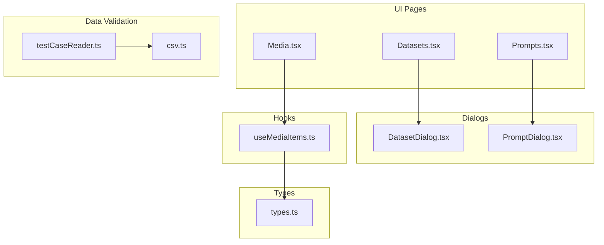
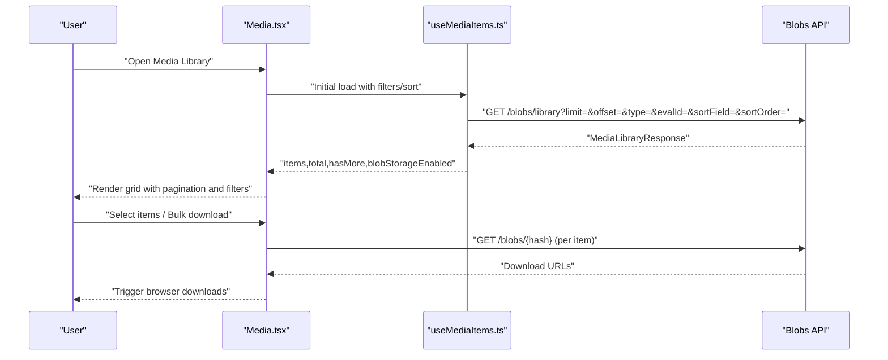
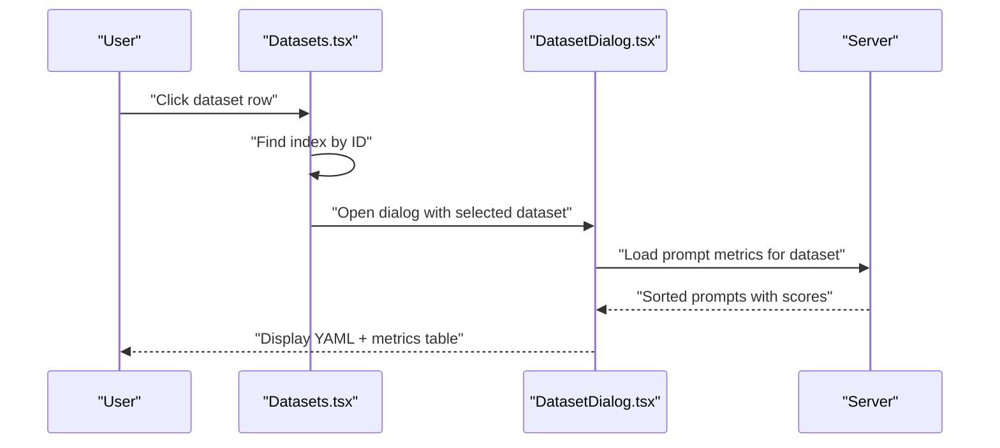
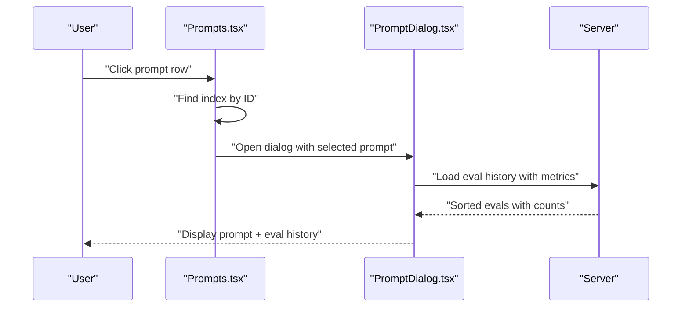
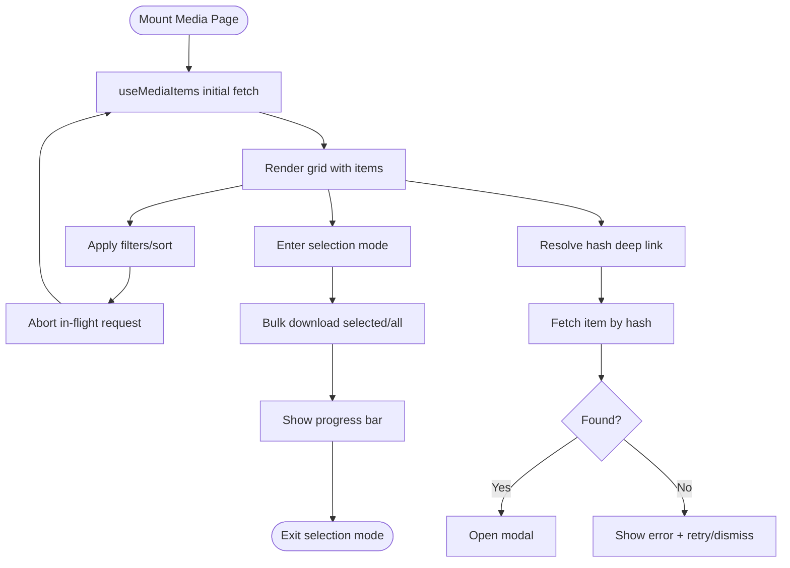
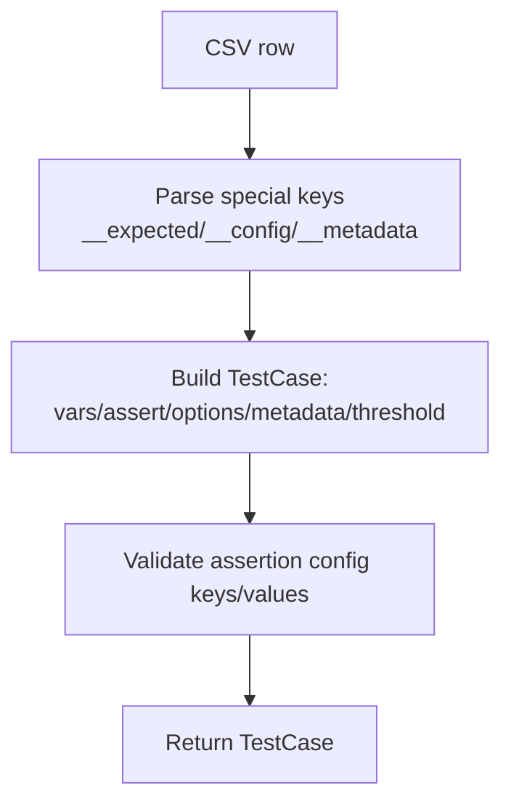
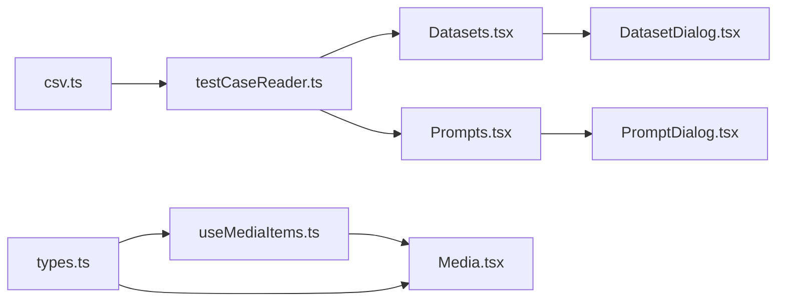

# Data Management

<cite>
**Referenced Files in This Document**
- [Datasets.tsx](file://src/app/src/pages/datasets/Datasets.tsx)
- [DatasetDialog.tsx](file://src/app/src/pages/datasets/DatasetDialog.tsx)
- [Prompts.tsx](file://src/app/src/pages/prompts/Prompts.tsx)
- [PromptDialog.tsx](file://src/app/src/pages/prompts/PromptDialog.tsx)
- [Media.tsx](file://src/app/src/pages/media/Media.tsx)
- [useMediaItems.ts](file://src/app/src/pages/media/hooks/useMediaItems.ts)
- [types.ts](file://src/app/src/pages/media/types.ts)
- [csv.ts](file://src/csv.ts)
- [testCaseReader.ts](file://src/util/testCaseReader.ts)
- [prompts.md](file://site/docs/configuration/prompts.md)
</cite>

## Table of Contents
1. [Introduction](#introduction)
2. [Project Structure](#project-structure)
3. [Core Components](#core-components)
4. [Architecture Overview](#architecture-overview)
5. [Detailed Component Analysis](#detailed-component-analysis)
6. [Dependency Analysis](#dependency-analysis)
7. [Performance Considerations](#performance-considerations)
8. [Troubleshooting Guide](#troubleshooting-guide)
9. [Conclusion](#conclusion)
10. [Appendices](#appendices)

## Introduction
This document explains how PromptFoo’s web interface manages data across three primary areas:
- Datasets: test case collections, CSV uploads, and dataset versioning signals
- Prompts: organizing and editing prompt templates with variables and formatting options
- Media: uploaded files, images, and multimedia content used in evaluations

It covers workflows for dataset creation, bulk operations, and data validation; prompt template editing with variable substitution; and media upload/download capabilities with storage management. Practical examples and best practices are included for dataset organization and prompt management.

## Project Structure
The data management UI is organized around three pages:
- Datasets page: lists datasets, shows counts and latest evaluation, and opens a dialog with prompt and test case details
- Prompts page: lists prompts, shows evaluation history, and opens a dialog with evaluation metrics
- Media page: lists generated media items, supports filtering, sorting, selection, and bulk downloads

**Diagram sources**
- [Datasets.tsx:154-191](file://src/app/src/pages/datasets/Datasets.tsx#L154-L191)
- [Prompts.tsx:124-162](file://src/app/src/pages/prompts/Prompts.tsx#L124-L162)
- [Media.tsx:456-748](file://src/app/src/pages/media/Media.tsx#L456-L748)
- [DatasetDialog.tsx:58-193](file://src/app/src/pages/datasets/DatasetDialog.tsx#L58-L193)
- [PromptDialog.tsx:54-174](file://src/app/src/pages/prompts/PromptDialog.tsx#L54-L174)
- [useMediaItems.ts:33-166](file://src/app/src/pages/media/hooks/useMediaItems.ts#L33-L166)
- [types.ts:33-66](file://src/app/src/pages/media/types.ts#L33-L66)
- [csv.ts:134-303](file://src/csv.ts#L134-L303)
- [testCaseReader.ts:135-206](file://src/util/testCaseReader.ts#L135-L206)

**Section sources**
- [Datasets.tsx:1-191](file://src/app/src/pages/datasets/Datasets.tsx#L1-L191)
- [Prompts.tsx:1-162](file://src/app/src/pages/prompts/Prompts.tsx#L1-L162)
- [Media.tsx:1-748](file://src/app/src/pages/media/Media.tsx#L1-L748)
- [useMediaItems.ts:1-269](file://src/app/src/pages/media/hooks/useMediaItems.ts#L1-L269)
- [types.ts:1-66](file://src/app/src/pages/media/types.ts#L1-L66)
- [csv.ts:1-323](file://src/csv.ts#L1-L323)
- [testCaseReader.ts:128-206](file://src/util/testCaseReader.ts#L128-L206)

## Core Components
- Datasets page
  - Displays dataset metadata: ID, test case count, variables, total evaluations, prompt count, latest evaluation date and ID
  - Clicking a row opens a dialog with test cases YAML and a paginated table of associated prompts and evaluation metrics
- Prompts page
  - Displays prompt metadata: ID, label, prompt preview, most recent evaluation date and ID, and evaluation count
  - Clicking a row opens a dialog with prompt content and evaluation history
- Media page
  - Lists media items with type, size, creation date, and context
  - Supports filtering by type, evaluation, and sorting by creation date or size
  - Provides selection mode for bulk downloads and deep linking via URL hash

**Section sources**
- [Datasets.tsx:65-145](file://src/app/src/pages/datasets/Datasets.tsx#L65-L145)
- [DatasetDialog.tsx:26-56](file://src/app/src/pages/datasets/DatasetDialog.tsx#L26-L56)
- [Prompts.tsx:59-115](file://src/app/src/pages/prompts/Prompts.tsx#L59-L115)
- [PromptDialog.tsx:30-52](file://src/app/src/pages/prompts/PromptDialog.tsx#L30-L52)
- [Media.tsx:41-115](file://src/app/src/pages/media/Media.tsx#L41-L115)

## Architecture Overview
The data management architecture centers on React components, custom hooks, and typed data models. The Media page demonstrates robust client-side state synchronization with URL parameters, pagination guards, and error boundaries. The Datasets and Prompts pages rely on dialogs to present detailed views without full-page navigation.

**Diagram sources**
- [Media.tsx:98-108](file://src/app/src/pages/media/Media.tsx#L98-L108)
- [useMediaItems.ts:53-123](file://src/app/src/pages/media/hooks/useMediaItems.ts#L53-L123)
- [types.ts:43-49](file://src/app/src/pages/media/types.ts#L43-L49)

**Section sources**
- [Media.tsx:98-108](file://src/app/src/pages/media/Media.tsx#L98-L108)
- [useMediaItems.ts:53-123](file://src/app/src/pages/media/hooks/useMediaItems.ts#L53-L123)
- [types.ts:43-49](file://src/app/src/pages/media/types.ts#L43-L49)

## Detailed Component Analysis

### Datasets Page
- Columns and behavior
  - ID: short monospace identifier
  - Test Cases: count of test cases
  - Variables: unique variable keys extracted from test cases
  - Total Evals: total evaluation runs
  - Total Prompts: number of prompts associated with the dataset
  - Latest Eval Date: formatted date or “Unknown”
  - Latest Eval ID: link to evaluation detail route
- Row interaction
  - Clicking a row opens a dialog with:
    - Full YAML of test cases
    - Paginated table of prompts with metrics (raw score, pass rate, pass/fail/error counts) and links to evaluation details

**Diagram sources**
- [Datasets.tsx:147-152](file://src/app/src/pages/datasets/Datasets.tsx#L147-L152)
- [DatasetDialog.tsx:29-49](file://src/app/src/pages/datasets/DatasetDialog.tsx#L29-L49)

**Section sources**
- [Datasets.tsx:65-145](file://src/app/src/pages/datasets/Datasets.tsx#L65-L145)
- [DatasetDialog.tsx:26-56](file://src/app/src/pages/datasets/DatasetDialog.tsx#L26-L56)

### Prompts Page
- Columns and behavior
  - ID: short monospace identifier
  - Label: derived from prompt label/display/raw
  - Prompt: truncated preview
  - Most recent eval: formatted date and link to evaluation detail
  - # Evals: total evaluation count
- Row interaction
  - Clicking a row opens a dialog with:
    - Prompt content (copyable)
    - Evaluation history with metrics (raw score, pass rate, pass/fail/error counts) and dataset links

**Diagram sources**
- [Prompts.tsx:117-122](file://src/app/src/pages/prompts/Prompts.tsx#L117-L122)
- [PromptDialog.tsx:30-52](file://src/app/src/pages/prompts/PromptDialog.tsx#L30-L52)

**Section sources**
- [Prompts.tsx:59-115](file://src/app/src/pages/prompts/Prompts.tsx#L59-L115)
- [PromptDialog.tsx:54-174](file://src/app/src/pages/prompts/PromptDialog.tsx#L54-L174)

### Media Page
- URL-driven state
  - Filters: type (all/image/video/audio/other), evaluation ID
  - Sort: field (createdAt/sizeBytes), order (asc/desc)
  - Selection: hash-based deep linking with modal navigation
- Data fetching
  - Infinite scroll with page size and offset
  - Abort controller to cancel in-flight requests on filter changes
  - Separate hook to fetch evaluation options for filtering
- Bulk operations
  - Selection mode toggles selection across items
  - Bulk download triggers browser downloads one by one with progress tracking
- Error handling
  - Error boundary for media grid
  - Deep-link loading and error states with retry and dismiss actions

**Diagram sources**
- [Media.tsx:143-301](file://src/app/src/pages/media/Media.tsx#L143-L301)
- [useMediaItems.ts:125-140](file://src/app/src/pages/media/hooks/useMediaItems.ts#L125-L140)

**Section sources**
- [Media.tsx:41-115](file://src/app/src/pages/media/Media.tsx#L41-L115)
- [Media.tsx:143-301](file://src/app/src/pages/media/Media.tsx#L143-L301)
- [useMediaItems.ts:33-166](file://src/app/src/pages/media/hooks/useMediaItems.ts#L33-L166)

### Data Validation and CSV Uploads
- CSV parsing and test case conversion
  - Converts CSV rows into test cases with variables, assertions, options, metadata, and thresholds
  - Handles special prefixes (__expected, __prefix, __suffix, __description, __providerOutput, __metric, __threshold, __metadata, __config)
  - Applies assertion configurations per index and merges into metadata
- Test case reader
  - Supports CSV, XLSX/XLS, JSON, and Google Sheets/SharePoint URLs
  - Enforces strict CSV parsing with fallback to relaxed mode
  - Adds telemetry for external sources

**Diagram sources**
- [csv.ts:134-303](file://src/csv.ts#L134-L303)
- [testCaseReader.ts:135-206](file://src/util/testCaseReader.ts#L135-L206)

**Section sources**
- [csv.ts:134-303](file://src/csv.ts#L134-L303)
- [testCaseReader.ts:135-206](file://src/util/testCaseReader.ts#L135-L206)

### Prompt Template Editing and Variable Substitution
- Prompt templates are rendered with variable substitution and optional Nunjucks logic
- External prompt sources (e.g., Helicone, Langfuse) are supported and integrate seamlessly with test case variables
- Best practices include organizing prompts in files, using labels and IDs, leveraging templates with variables, and testing variations

**Section sources**
- [prompts.md:395-472](file://site/docs/configuration/prompts.md#L395-L472)

## Dependency Analysis
- Datasets and Prompts depend on dialogs for detailed views, which compute derived metrics and present evaluation histories
- Media relies on a dedicated hook for pagination, filtering, and error handling, returning typed data models
- Data validation is centralized in CSV parsing and test case reader utilities, feeding into evaluation workflows

**Diagram sources**
- [csv.ts:134-303](file://src/csv.ts#L134-L303)
- [testCaseReader.ts:135-206](file://src/util/testCaseReader.ts#L135-L206)
- [Datasets.tsx:1-191](file://src/app/src/pages/datasets/Datasets.tsx#L1-L191)
- [Prompts.tsx:1-162](file://src/app/src/pages/prompts/Prompts.tsx#L1-L162)
- [DatasetDialog.tsx:1-193](file://src/app/src/pages/datasets/DatasetDialog.tsx#L1-L193)
- [PromptDialog.tsx:1-174](file://src/app/src/pages/prompts/PromptDialog.tsx#L1-L174)
- [useMediaItems.ts:1-269](file://src/app/src/pages/media/hooks/useMediaItems.ts#L1-L269)
- [types.ts:1-66](file://src/app/src/pages/media/types.ts#L1-L66)

**Section sources**
- [csv.ts:134-303](file://src/csv.ts#L134-L303)
- [testCaseReader.ts:135-206](file://src/util/testCaseReader.ts#L135-L206)
- [Datasets.tsx:1-191](file://src/app/src/pages/datasets/Datasets.tsx#L1-L191)
- [Prompts.tsx:1-162](file://src/app/src/pages/prompts/Prompts.tsx#L1-L162)
- [DatasetDialog.tsx:1-193](file://src/app/src/pages/datasets/DatasetDialog.tsx#L1-L193)
- [PromptDialog.tsx:1-174](file://src/app/src/pages/prompts/PromptDialog.tsx#L1-L174)
- [useMediaItems.ts:1-269](file://src/app/src/pages/media/hooks/useMediaItems.ts#L1-L269)
- [types.ts:1-66](file://src/app/src/pages/media/types.ts#L1-L66)

## Performance Considerations
- Media pagination
  - Uses an offset-based approach with a page size constant; guard flags prevent concurrent load-more calls
  - Abort controllers cancel in-flight requests when filters change to avoid wasted work
- Rendering
  - Deferred values and memoized computations reduce re-renders for large grids
  - Dialogs lazy-load detailed content to keep main lists responsive
- Downloads
  - Browser-initiated downloads avoid large memory footprints; progress indicates current file and totals

[No sources needed since this section provides general guidance]

## Troubleshooting Guide
- Media deep-link failures
  - Not found: indicates item deletion or invalid link; user can retry or dismiss
  - Network/server errors: transient; retry is supported
- CSV upload issues
  - Strict vs relaxed parsing: strict mode enforces quote rules; if it fails, the system falls back to relaxed parsing
  - Misformatted columns: warnings and errors guide correction of __config and __metadata usage
- Media library errors
  - Error boundary surfaces actionable messages with retry and refresh actions

**Section sources**
- [Media.tsx:606-675](file://src/app/src/pages/media/Media.tsx#L606-L675)
- [useMediaItems.ts:180-202](file://src/app/src/pages/media/hooks/useMediaItems.ts#L180-L202)
- [csv.ts:208-276](file://src/csv.ts#L208-L276)
- [testCaseReader.ts:155-190](file://src/util/testCaseReader.ts#L155-L190)

## Conclusion
PromptFoo’s data management UI provides robust tools for organizing datasets, editing prompts, and managing media. The Datasets and Prompts pages offer contextual insights through dialogs, while the Media page delivers efficient browsing, filtering, and bulk operations. Centralized validation ensures reliable ingestion of test cases from various sources, and typed models improve reliability across components.

[No sources needed since this section summarizes without analyzing specific files]

## Appendices

### Dataset Creation Workflows and Strategies
- Strategy: organize datasets by domain or scenario (e.g., customer support, technical queries)
- Strategy: version datasets by appending a version suffix to the dataset ID and maintaining a changelog
- Strategy: group related prompts under a single dataset to simplify evaluation comparisons

[No sources needed since this section provides general guidance]

### Prompt Management Best Practices
- Keep prompts modular and versioned; use labels and IDs for traceability
- Use variables consistently across datasets and prompts
- Prefer external prompt stores (e.g., Helicone, Langfuse) for collaborative management and A/B testing

**Section sources**
- [prompts.md:443-451](file://site/docs/configuration/prompts.md#L443-L451)