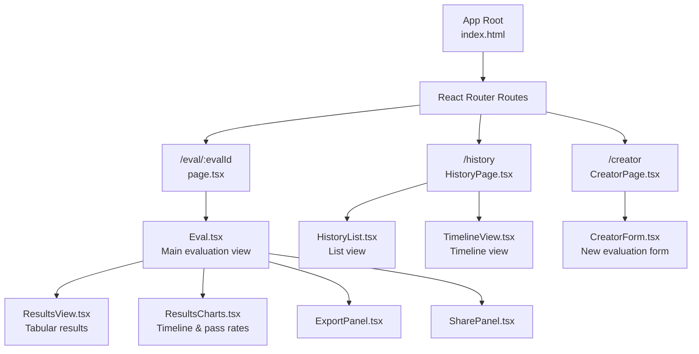
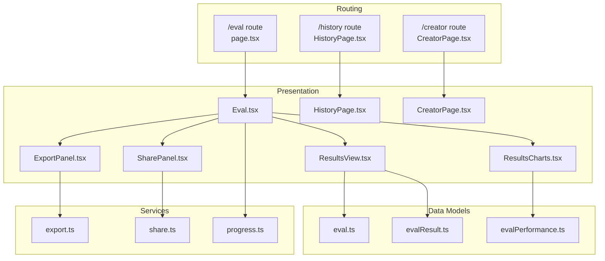
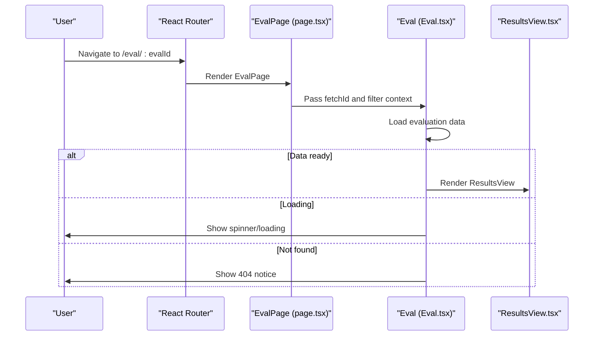
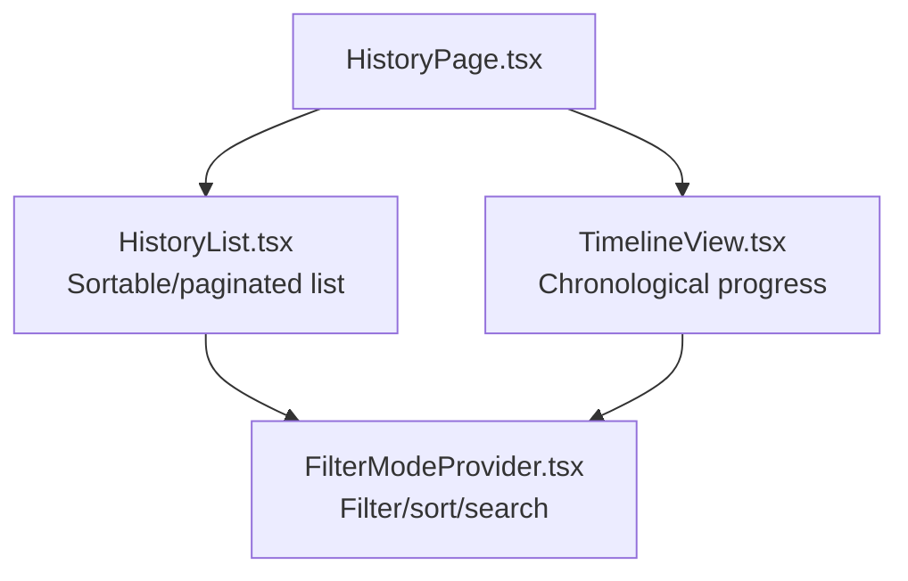
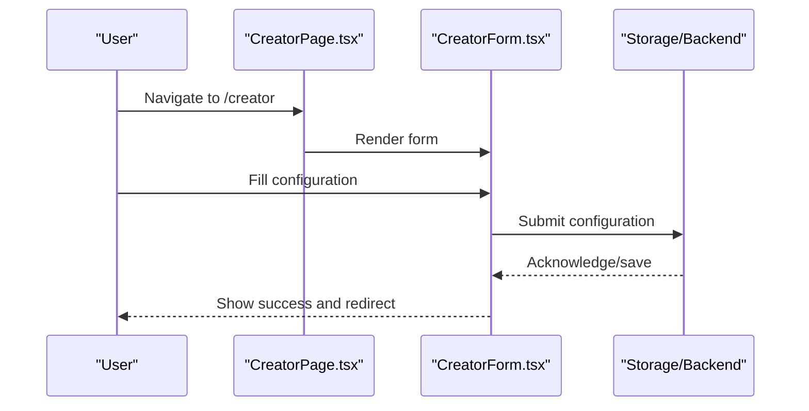
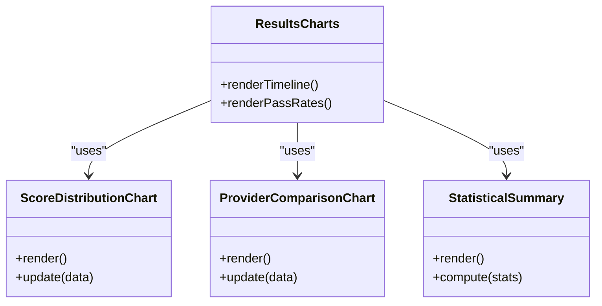
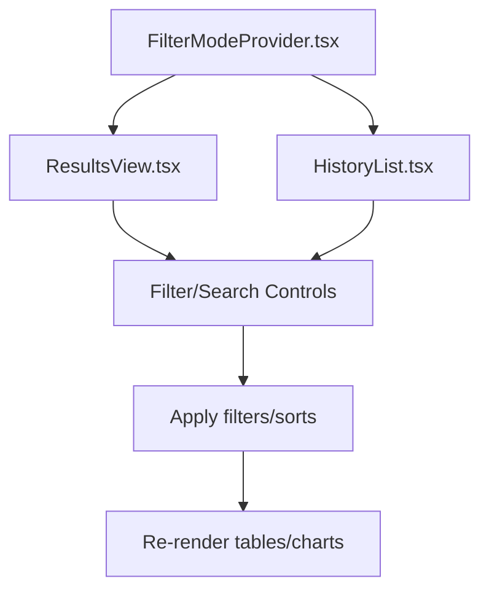
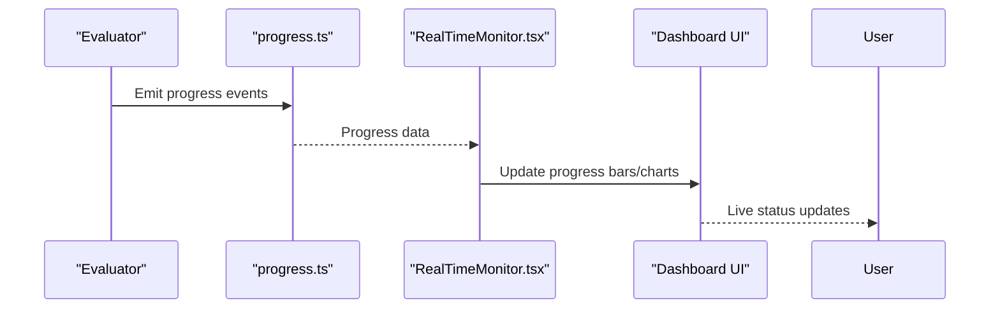
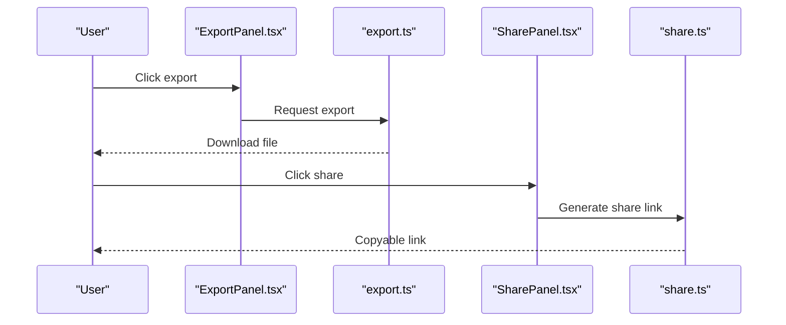
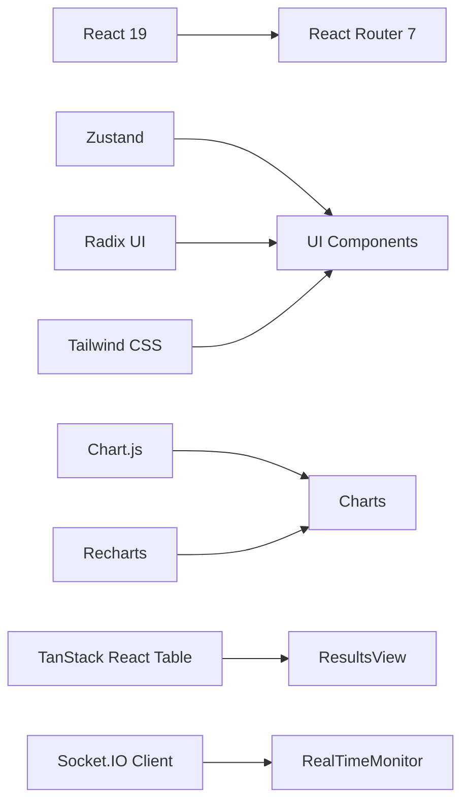

# Evaluation Dashboard

<cite>
**Referenced Files in This Document**
- [index.html](file://src/app/index.html)
- [package.json](file://src/app/package.json)
- [page.tsx](file://src/app/src/pages/eval/page.tsx)
- [Eval.tsx](file://src/app/src/pages/eval/components/Eval.tsx)
- [ResultsCharts.tsx](file://src/app/src/pages/eval/components/ResultsCharts.tsx)
- [ResultsView.tsx](file://src/app/src/pages/eval/components/ResultsView.tsx)
- [FilterModeProvider.tsx](file://src/app/src/pages/eval/components/FilterModeProvider.tsx)
- [HistoryPage.tsx](file://src/app/src/pages/history/HistoryPage.tsx)
- [HistoryList.tsx](file://src/app/src/pages/history/components/HistoryList.tsx)
- [TimelineView.tsx](file://src/app/src/pages/history/components/TimelineView.tsx)
- [CreatorPage.tsx](file://src/app/src/pages/creator/CreatorPage.tsx)
- [CreatorForm.tsx](file://src/app/src/pages/creator/components/CreatorForm.tsx)
- [ExportPanel.tsx](file://src/app/src/pages/eval/components/ExportPanel.tsx)
- [SharePanel.tsx](file://src/app/src/pages/eval/components/SharePanel.tsx)
- [ScoreDistributionChart.tsx](file://src/app/src/pages/eval/components/ScoreDistributionChart.tsx)
- [ProviderComparisonChart.tsx](file://src/app/src/pages/eval/components/ProviderComparisonChart.tsx)
- [StatisticalSummary.tsx](file://src/app/src/pages/eval/components/StatisticalSummary.tsx)
- [RealTimeMonitor.tsx](file://src/app/src/pages/eval/components/RealTimeMonitor.tsx)
- [eval.ts](file://src/models/eval.ts)
- [evalResult.ts](file://src/models/evalResult.ts)
- [evalPerformance.ts](file://src/models/evalPerformance.ts)
- [progress.ts](file://src/progress/ciProgressReporter.ts)
- [share.ts](file://src/share.ts)
- [export.ts](file://src/commands/export.ts)
</cite>

## Table of Contents
1. [Introduction](#introduction)
2. [Project Structure](#project-structure)
3. [Core Components](#core-components)
4. [Architecture Overview](#architecture-overview)
5. [Detailed Component Analysis](#detailed-component-analysis)
6. [Dependency Analysis](#dependency-analysis)
7. [Performance Considerations](#performance-considerations)
8. [Troubleshooting Guide](#troubleshooting-guide)
9. [Conclusion](#conclusion)

## Introduction
This document describes the evaluation dashboard for PromptFoo's web interface. It covers the main evaluation page for viewing individual test results, provider comparisons, and performance metrics; the evaluation list and history pages for historical runs and batch evaluations; the evaluation creator page for configuring new evaluations; result visualization components; filtering, sorting, and search capabilities; real-time monitoring features; and export and sharing functionality.

## Project Structure
The evaluation dashboard is built as a React application within the `src/app` directory. Key routes include:
- `/eval/:evalId` for viewing a specific evaluation run
- `/history` for browsing historical runs and timelines
- `/creator` for creating new evaluation configurations

**Diagram sources**
- [index.html:1-16](file://src/app/index.html#L1-L16)
- [page.tsx:1-15](file://src/app/src/pages/eval/page.tsx#L1-L15)
- [HistoryPage.tsx](file://src/app/src/pages/history/HistoryPage.tsx)
- [CreatorPage.tsx](file://src/app/src/pages/creator/CreatorPage.tsx)

**Section sources**
- [index.html:1-16](file://src/app/index.html#L1-L16)
- [package.json:1-103](file://src/app/package.json#L1-L103)

## Core Components
- Evaluation View (`Eval.tsx`): Orchestrates loading, rendering, and state for a single evaluation run. Handles red team evaluation banners and delegates to `ResultsView.tsx`.
- Results View (`ResultsView.tsx`): Renders tabular results and supports filtering/sorting/searching.
- Results Charts (`ResultsCharts.tsx`): Provides timeline visualizations and pass-rate progression.
- History Page (`HistoryPage.tsx`): Lists historical runs and supports timeline visualization.
- Creator Page (`CreatorPage.tsx`): Provides forms and controls to define new evaluation configurations.
- Export Panel (`ExportPanel.tsx`) and Share Panel (`SharePanel.tsx`): Offer export and sharing options.
- Visualization Components: Score distribution chart, provider comparison chart, and statistical summary.
- Real-Time Monitor (`RealTimeMonitor.tsx`): Displays live progress and status updates.

**Section sources**
- [Eval.tsx:331-383](file://src/app/src/pages/eval/components/Eval.tsx#L331-L383)
- [ResultsView.tsx](file://src/app/src/pages/eval/components/ResultsView.tsx)
- [ResultsCharts.tsx:518-565](file://src/app/src/pages/eval/components/ResultsCharts.tsx#L518-L565)
- [HistoryPage.tsx](file://src/app/src/pages/history/HistoryPage.tsx)
- [CreatorPage.tsx](file://src/app/src/pages/creator/CreatorPage.tsx)
- [ExportPanel.tsx](file://src/app/src/pages/eval/components/ExportPanel.tsx)
- [SharePanel.tsx](file://src/app/src/pages/eval/components/SharePanel.tsx)
- [ScoreDistributionChart.tsx](file://src/app/src/pages/eval/components/ScoreDistributionChart.tsx)
- [ProviderComparisonChart.tsx](file://src/app/src/pages/eval/components/ProviderComparisonChart.tsx)
- [StatisticalSummary.tsx](file://src/app/src/pages/eval/components/StatisticalSummary.tsx)
- [RealTimeMonitor.tsx](file://src/app/src/pages/eval/components/RealTimeMonitor.tsx)

## Architecture Overview
The dashboard follows a layered architecture:
- Routing layer: React Router manages navigation between evaluation, history, and creator pages.
- Presentation layer: Page components render UI and delegate to reusable components.
- Data layer: Models (`eval.ts`, `evalResult.ts`, `evalPerformance.ts`) define evaluation data structures.
- Services: Export and share utilities provide result export and sharing capabilities.
- Visualization layer: Chart.js and Recharts components render charts and graphs.

**Diagram sources**
- [page.tsx:1-15](file://src/app/src/pages/eval/page.tsx#L1-L15)
- [HistoryPage.tsx](file://src/app/src/pages/history/HistoryPage.tsx)
- [CreatorPage.tsx](file://src/app/src/pages/creator/CreatorPage.tsx)
- [Eval.tsx:331-383](file://src/app/src/pages/eval/components/Eval.tsx#L331-L383)
- [ResultsView.tsx](file://src/app/src/pages/eval/components/ResultsView.tsx)
- [ResultsCharts.tsx:518-565](file://src/app/src/pages/eval/components/ResultsCharts.tsx#L518-L565)
- [eval.ts](file://src/models/eval.ts)
- [evalResult.ts](file://src/models/evalResult.ts)
- [evalPerformance.ts](file://src/models/evalPerformance.ts)
- [export.ts](file://src/commands/export.ts)
- [share.ts](file://src/share.ts)
- [progress.ts](file://src/progress/ciProgressReporter.ts)

## Detailed Component Analysis

### Main Evaluation Page
The main evaluation page renders a specific evaluation run identified by `evalId`. It handles loading states, empty states, and red team evaluation banners, then delegates to the results view.

**Diagram sources**
- [page.tsx:1-15](file://src/app/src/pages/eval/page.tsx#L1-L15)
- [Eval.tsx:331-383](file://src/app/src/pages/eval/components/Eval.tsx#L331-L383)
- [ResultsView.tsx](file://src/app/src/pages/eval/components/ResultsView.tsx)

**Section sources**
- [page.tsx:1-15](file://src/app/src/pages/eval/page.tsx#L1-L15)
- [Eval.tsx:331-383](file://src/app/src/pages/eval/components/Eval.tsx#L331-L383)

### Evaluation List and History Pages
The history page lists previous evaluation runs and supports timeline visualization. It includes:
- History list component for paginated and sortable listings
- Timeline view for chronological progress tracking

**Diagram sources**
- [HistoryPage.tsx](file://src/app/src/pages/history/HistoryPage.tsx)
- [HistoryList.tsx](file://src/app/src/pages/history/components/HistoryList.tsx)
- [TimelineView.tsx](file://src/app/src/pages/history/components/TimelineView.tsx)
- [FilterModeProvider.tsx](file://src/app/src/pages/eval/components/FilterModeProvider.tsx)

**Section sources**
- [HistoryPage.tsx](file://src/app/src/pages/history/HistoryPage.tsx)
- [HistoryList.tsx](file://src/app/src/pages/history/components/HistoryList.tsx)
- [TimelineView.tsx](file://src/app/src/pages/history/components/TimelineView.tsx)
- [FilterModeProvider.tsx](file://src/app/src/pages/eval/components/FilterModeProvider.tsx)

### Evaluation Creator Page
The creator page allows users to define new evaluation configurations. It includes:
- A form component for capturing evaluation parameters
- Validation and submission flows

**Diagram sources**
- [CreatorPage.tsx](file://src/app/src/pages/creator/CreatorPage.tsx)
- [CreatorForm.tsx](file://src/app/src/pages/creator/components/CreatorForm.tsx)

**Section sources**
- [CreatorPage.tsx](file://src/app/src/pages/creator/CreatorPage.tsx)
- [CreatorForm.tsx](file://src/app/src/pages/creator/components/CreatorForm.tsx)

### Result Visualization Components
Visualization components provide insights into evaluation outcomes:
- Score distribution chart: Distribution of scores across test cases
- Provider comparison chart: Comparative performance across providers
- Statistical summary: Aggregated metrics and summaries
- Results charts: Timeline and pass-rate progression

**Diagram sources**
- [ScoreDistributionChart.tsx](file://src/app/src/pages/eval/components/ScoreDistributionChart.tsx)
- [ProviderComparisonChart.tsx](file://src/app/src/pages/eval/components/ProviderComparisonChart.tsx)
- [StatisticalSummary.tsx](file://src/app/src/pages/eval/components/StatisticalSummary.tsx)
- [ResultsCharts.tsx:518-565](file://src/app/src/pages/eval/components/ResultsCharts.tsx#L518-L565)

**Section sources**
- [ResultsCharts.tsx:518-565](file://src/app/src/pages/eval/components/ResultsCharts.tsx#L518-L565)
- [ScoreDistributionChart.tsx](file://src/app/src/pages/eval/components/ScoreDistributionChart.tsx)
- [ProviderComparisonChart.tsx](file://src/app/src/pages/eval/components/ProviderComparisonChart.tsx)
- [StatisticalSummary.tsx](file://src/app/src/pages/eval/components/StatisticalSummary.tsx)

### Filtering, Sorting, and Search
Filtering and sorting are provided via a shared provider that exposes filter modes and state to result views and history lists. Users can:
- Filter by provider, test case, or assertion status
- Sort by various metrics (scores, latency, pass/fail counts)
- Search within test case content and metadata

**Diagram sources**
- [FilterModeProvider.tsx](file://src/app/src/pages/eval/components/FilterModeProvider.tsx)
- [ResultsView.tsx](file://src/app/src/pages/eval/components/ResultsView.tsx)
- [HistoryList.tsx](file://src/app/src/pages/history/components/HistoryList.tsx)

**Section sources**
- [FilterModeProvider.tsx](file://src/app/src/pages/eval/components/FilterModeProvider.tsx)
- [ResultsView.tsx](file://src/app/src/pages/eval/components/ResultsView.tsx)
- [HistoryList.tsx](file://src/app/src/pages/history/components/HistoryList.tsx)

### Real-Time Monitoring and Progress Indicators
Real-time monitoring displays ongoing evaluation progress and status updates. It integrates with progress reporters to:
- Track evaluation completion percentage
- Show current test case being processed
- Display pass/fail counts and latency metrics

**Diagram sources**
- [progress.ts](file://src/progress/ciProgressReporter.ts)
- [RealTimeMonitor.tsx](file://src/app/src/pages/eval/components/RealTimeMonitor.tsx)

**Section sources**
- [progress.ts](file://src/progress/ciProgressReporter.ts)
- [RealTimeMonitor.tsx](file://src/app/src/pages/eval/components/RealTimeMonitor.tsx)

### Export and Sharing
Export and sharing enable users to:
- Export evaluation results to CSV/JSON
- Generate shareable links for specific evaluation runs

**Diagram sources**
- [ExportPanel.tsx](file://src/app/src/pages/eval/components/ExportPanel.tsx)
- [SharePanel.tsx](file://src/app/src/pages/eval/components/SharePanel.tsx)
- [export.ts](file://src/commands/export.ts)
- [share.ts](file://src/share.ts)

**Section sources**
- [ExportPanel.tsx](file://src/app/src/pages/eval/components/ExportPanel.tsx)
- [SharePanel.tsx](file://src/app/src/pages/eval/components/SharePanel.tsx)
- [export.ts](file://src/commands/export.ts)
- [share.ts](file://src/share.ts)

## Dependency Analysis
The evaluation dashboard relies on several libraries and internal modules:
- UI framework: React 19 with React Router 7
- State management: Zustand for lightweight state
- Data visualization: Chart.js and Recharts
- Table rendering: TanStack React Table
- Real-time communication: Socket.IO client
- Styling: Tailwind CSS and Radix UI primitives

**Diagram sources**
- [package.json:55-101](file://src/app/package.json#L55-L101)

**Section sources**
- [package.json:55-101](file://src/app/package.json#L55-L101)

## Performance Considerations
- Lazy initialization: The evaluation view defers heavy table construction until data is ready to avoid race conditions and improve perceived performance.
- Virtualized tables: For large datasets, consider virtualization to reduce DOM overhead.
- Debounced search/filter: Apply debouncing to search inputs to minimize re-renders during typing.
- Efficient chart updates: Batch chart updates and avoid unnecessary redraws when data changes incrementally.
- Progressive loading: Show skeleton loaders while fetching evaluation data to maintain responsiveness.

## Troubleshooting Guide
Common issues and resolutions:
- Evaluation not found: The evaluation view displays a 404 notice when the requested evaluation ID does not exist. Verify the ID and permissions.
- Empty results: If no table is available, the view shows an empty state. Confirm that the evaluation produced results and refresh the page.
- Loading delays: Large evaluations may take time to render. Wait for the loader to complete; if stuck, reload the page or check network connectivity.
- Real-time updates not appearing: Ensure WebSocket connections are established and not blocked by firewalls or browser extensions.
- Export failures: Validate export permissions and available disk space. Retry exporting with smaller datasets if memory issues occur.

**Section sources**
- [Eval.tsx:351-368](file://src/app/src/pages/eval/components/Eval.tsx#L351-L368)

## Conclusion
The PromptFoo evaluation dashboard provides a comprehensive, real-time interface for managing and analyzing LLM evaluations. It combines robust visualization, flexible filtering, and practical export/sharing capabilities to support iterative evaluation workflows. The modular architecture ensures maintainability and extensibility for future enhancements.