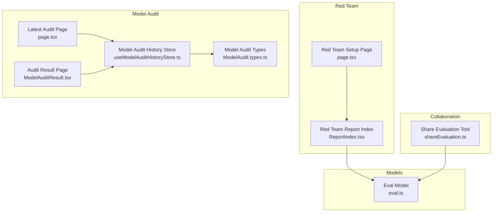
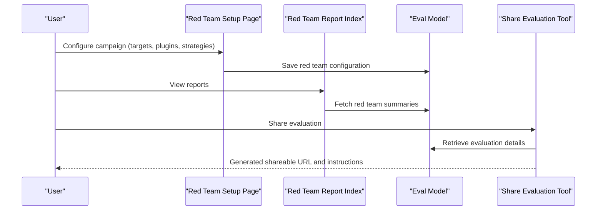
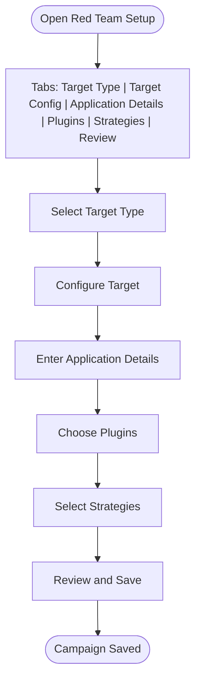
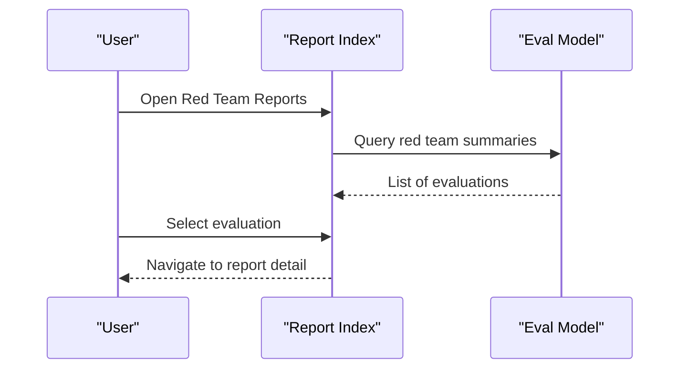
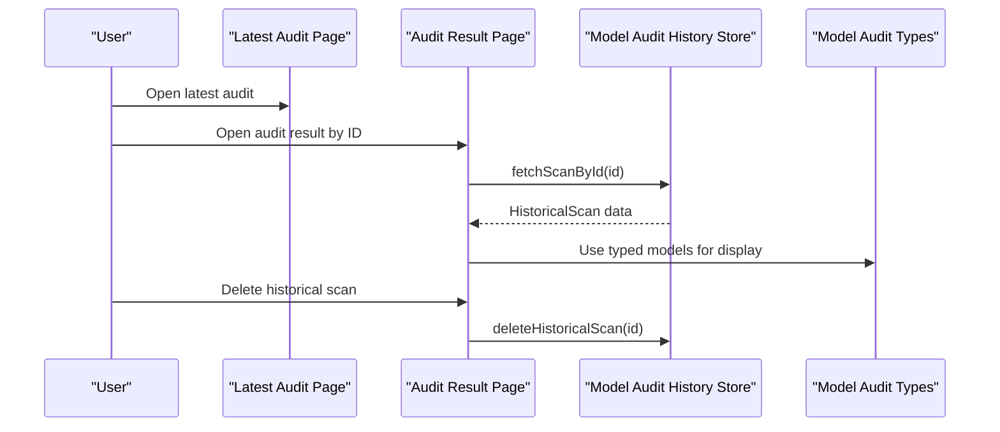
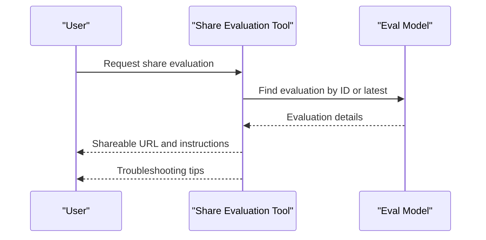
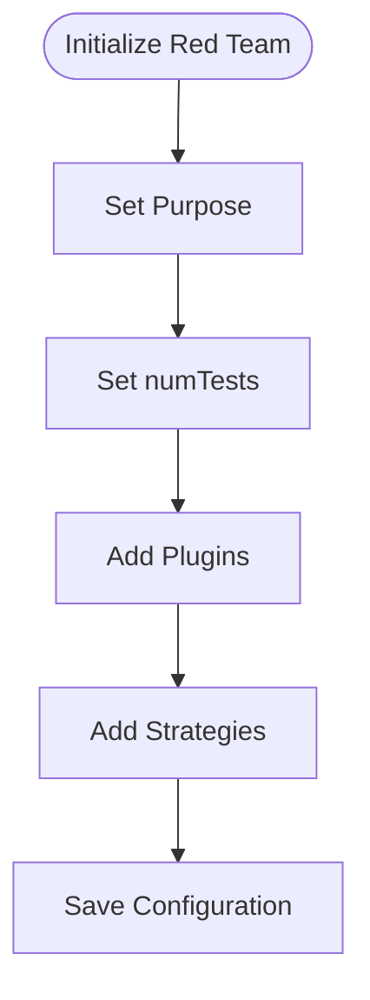
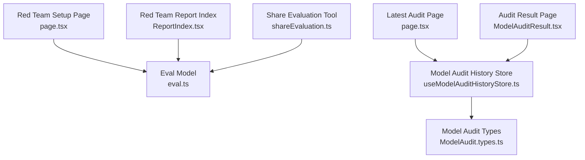

# Red Team & Collaboration

<cite>
**Referenced Files in This Document**
- [page.tsx](file://src/app/src/pages/redteam/setup/page.tsx)
- [ReportIndex.tsx](file://src/app/src/pages/redteam/report/components/ReportIndex.tsx)
- [ModelAudit.types.ts](file://src/app/src/pages/model-audit/ModelAudit.types.ts)
- [useModelAuditHistoryStore.ts](file://src/app/src/pages/model-audit/stores/useModelAuditHistoryStore.ts)
- [ModelAuditResult.tsx](file://src/app/src/pages/model-audit-result/ModelAuditResult.tsx)
- [page.tsx](file://src/app/src/pages/model-audit-latest/page.tsx)
- [page.tsx](file://src/app/src/pages/model-audit-result/page.tsx)
- [eval.ts](file://src/models/eval.ts)
- [shareEvaluation.ts](file://src/commands/mcp/tools/shareEvaluation.ts)
- [init.ts](file://src/redteam/commands/init.ts)
</cite>

## Table of Contents
1. [Introduction](#introduction)
2. [Project Structure](#project-structure)
3. [Core Components](#core-components)
4. [Architecture Overview](#architecture-overview)
5. [Detailed Component Analysis](#detailed-component-analysis)
6. [Dependency Analysis](#dependency-analysis)
7. [Performance Considerations](#performance-considerations)
8. [Troubleshooting Guide](#troubleshooting-guide)
9. [Conclusion](#conclusion)
10. [Appendices](#appendices)

## Introduction
This document provides red team and collaboration documentation for PromptFoo’s web interface. It covers:
- Red team setup: configuring adversarial testing campaigns, selecting plugins, and setting strategies.
- Red team reports: vulnerability assessments, attack vectors, and security recommendations.
- Model audit: latest audit results and historical tracking.
- Collaboration: shared datasets, evaluation sharing, and coordinated testing workflows.
- Access controls and permissions for team-based evaluation.

## Project Structure
PromptFoo’s web interface organizes red team and collaboration features under dedicated pages and stores:
- Red team setup page for campaign configuration.
- Red team report index for scanning and reviewing results.
- Model audit pages for latest and historical audit results.
- Stores and utilities for managing audit data and sharing evaluations.

**Diagram sources**
- [page.tsx:90-106](file://src/app/src/pages/redteam/setup/page.tsx#L90-L106)
- [ReportIndex.tsx:1-30](file://src/app/src/pages/redteam/report/components/ReportIndex.tsx#L1-L30)
- [ModelAudit.types.ts:1-200](file://src/app/src/pages/model-audit/ModelAudit.types.ts#L1-L200)
- [useModelAuditHistoryStore.ts:1-48](file://src/app/src/pages/model-audit/stores/useModelAuditHistoryStore.ts#L1-L48)
- [page.tsx:1-3](file://src/app/src/pages/model-audit-latest/page.tsx#L1-L3)
- [ModelAuditResult.tsx:31-73](file://src/app/src/pages/model-audit-result/ModelAuditResult.tsx#L31-L73)
- [eval.ts:1589-1605](file://src/models/eval.ts#L1589-L1605)
- [shareEvaluation.ts:79-245](file://src/commands/mcp/tools/shareEvaluation.ts#L79-L245)

**Section sources**
- [page.tsx:90-106](file://src/app/src/pages/redteam/setup/page.tsx#L90-L106)
- [ReportIndex.tsx:1-30](file://src/app/src/pages/redteam/report/components/ReportIndex.tsx#L1-L30)
- [ModelAudit.types.ts:1-200](file://src/app/src/pages/model-audit/ModelAudit.types.ts#L1-L200)
- [useModelAuditHistoryStore.ts:1-48](file://src/app/src/pages/model-audit/stores/useModelAuditHistoryStore.ts#L1-L48)
- [page.tsx:1-3](file://src/app/src/pages/model-audit-latest/page.tsx#L1-L3)
- [ModelAuditResult.tsx:31-73](file://src/app/src/pages/model-audit-result/ModelAuditResult.tsx#L31-L73)
- [eval.ts:1589-1605](file://src/models/eval.ts#L1589-L1605)
- [shareEvaluation.ts:79-245](file://src/commands/mcp/tools/shareEvaluation.ts#L79-L245)

## Core Components
- Red team setup page: Guides users through target selection, configuration, application details, plugin selection, strategy selection, and review/save steps.
- Red team report index: Lists past red team evaluations and navigates to detailed reports.
- Model audit pages: Latest audit view and historical audit result view with filtering, sorting, and deletion capabilities.
- Stores and utilities: Manage audit history, pagination, sorting, and search; provide typed access to audit data.
- Collaboration utilities: Share evaluation results via URLs and instructions for team collaboration.

**Section sources**
- [page.tsx:75-88](file://src/app/src/pages/redteam/setup/page.tsx#L75-L88)
- [ReportIndex.tsx:8-29](file://src/app/src/pages/redteam/report/components/ReportIndex.tsx#L8-L29)
- [useModelAuditHistoryStore.ts:14-36](file://src/app/src/pages/model-audit/stores/useModelAuditHistoryStore.ts#L14-L36)
- [ModelAudit.types.ts:1-200](file://src/app/src/pages/model-audit/ModelAudit.types.ts#L1-L200)
- [shareEvaluation.ts:79-245](file://src/commands/mcp/tools/shareEvaluation.ts#L79-L245)

## Architecture Overview
The red team and collaboration features integrate with the evaluation model and audit stores to support:
- Campaign creation and configuration.
- Vulnerability scanning and reporting.
- Latest and historical audit views.
- Sharing and collaboration workflows.

**Diagram sources**
- [page.tsx:90-106](file://src/app/src/pages/redteam/setup/page.tsx#L90-L106)
- [ReportIndex.tsx:8-29](file://src/app/src/pages/redteam/report/components/ReportIndex.tsx#L8-L29)
- [eval.ts:1589-1605](file://src/models/eval.ts#L1589-L1605)
- [shareEvaluation.ts:79-245](file://src/commands/mcp/tools/shareEvaluation.ts#L79-L245)

## Detailed Component Analysis

### Red Team Setup Page
The setup page orchestrates campaign configuration across multiple tabs:
- Target Type and Target Config: Define the testing scope and endpoint details.
- Application Details: Capture metadata for the application under test.
- Plugins: Select adversarial plugins and configure per-plugin parameters.
- Strategies: Choose attack strategies to apply adversarial inputs.
- Review: Validate and save the configuration.

**Diagram sources**
- [page.tsx:75-88](file://src/app/src/pages/redteam/setup/page.tsx#L75-L88)
- [page.tsx:90-106](file://src/app/src/pages/redteam/setup/page.tsx#L90-L106)

**Section sources**
- [page.tsx:75-88](file://src/app/src/pages/redteam/setup/page.tsx#L75-L88)
- [page.tsx:90-106](file://src/app/src/pages/redteam/setup/page.tsx#L90-L106)

### Red Team Report Page
The report index lists red team evaluations and allows navigation to detailed reports:
- Displays a table of evaluations with links to detailed views.
- Supports navigation to individual report pages for vulnerability assessments and attack vectors.

**Diagram sources**
- [ReportIndex.tsx:8-29](file://src/app/src/pages/redteam/report/components/ReportIndex.tsx#L8-L29)
- [eval.ts:1589-1605](file://src/models/eval.ts#L1589-L1605)

**Section sources**
- [ReportIndex.tsx:8-29](file://src/app/src/pages/redteam/report/components/ReportIndex.tsx#L8-L29)
- [eval.ts:1589-1605](file://src/models/eval.ts#L1589-L1605)

### Model Audit Functionality
Model audit includes latest and historical views:
- Latest audit page: Shows the most recent scan results.
- Historical audit result page: Loads a specific scan by ID, supports deletion, and displays severity counts and file listings.

**Diagram sources**
- [page.tsx:1-3](file://src/app/src/pages/model-audit-latest/page.tsx#L1-L3)
- [ModelAuditResult.tsx:31-73](file://src/app/src/pages/model-audit-result/ModelAuditResult.tsx#L31-L73)
- [useModelAuditHistoryStore.ts:14-36](file://src/app/src/pages/model-audit/stores/useModelAuditHistoryStore.ts#L14-L36)
- [ModelAudit.types.ts:1-200](file://src/app/src/pages/model-audit/ModelAudit.types.ts#L1-L200)

**Section sources**
- [page.tsx:1-3](file://src/app/src/pages/model-audit-latest/page.tsx#L1-L3)
- [ModelAuditResult.tsx:31-73](file://src/app/src/pages/model-audit-result/ModelAuditResult.tsx#L31-L73)
- [useModelAuditHistoryStore.ts:14-36](file://src/app/src/pages/model-audit/stores/useModelAuditHistoryStore.ts#L14-L36)
- [ModelAudit.types.ts:1-200](file://src/app/src/pages/model-audit/ModelAudit.types.ts#L1-L200)

### Collaboration Features
Collaboration is supported through evaluation sharing:
- Share evaluation tool retrieves evaluation details, applies sharing configuration, validates eligibility, and returns a shareable URL with instructions.
- Provides troubleshooting guidance for common issues.

**Diagram sources**
- [shareEvaluation.ts:79-245](file://src/commands/mcp/tools/shareEvaluation.ts#L79-L245)
- [eval.ts:1589-1605](file://src/models/eval.ts#L1589-L1605)

**Section sources**
- [shareEvaluation.ts:79-245](file://src/commands/mcp/tools/shareEvaluation.ts#L79-L245)
- [eval.ts:1589-1605](file://src/models/eval.ts#L1589-L1605)

### Plugin Selection and Strategy Configuration
Plugin and strategy configuration is scaffolded during red team initialization:
- Generates a base configuration with placeholders for purpose, number of tests, plugins, and strategies.
- Allows per-plugin customization including test counts and plugin-specific configuration.

**Diagram sources**
- [init.ts:71-115](file://src/redteam/commands/init.ts#L71-L115)

**Section sources**
- [init.ts:71-115](file://src/redteam/commands/init.ts#L71-L115)

## Dependency Analysis
The following diagram shows key dependencies among red team and audit components:

**Diagram sources**
- [page.tsx:90-106](file://src/app/src/pages/redteam/setup/page.tsx#L90-L106)
- [ReportIndex.tsx:8-29](file://src/app/src/pages/redteam/report/components/ReportIndex.tsx#L8-L29)
- [eval.ts:1589-1605](file://src/models/eval.ts#L1589-L1605)
- [page.tsx:1-3](file://src/app/src/pages/model-audit-latest/page.tsx#L1-L3)
- [ModelAuditResult.tsx:31-73](file://src/app/src/pages/model-audit-result/ModelAuditResult.tsx#L31-L73)
- [useModelAuditHistoryStore.ts:14-36](file://src/app/src/pages/model-audit/stores/useModelAuditHistoryStore.ts#L14-L36)
- [ModelAudit.types.ts:1-200](file://src/app/src/pages/model-audit/ModelAudit.types.ts#L1-L200)
- [shareEvaluation.ts:79-245](file://src/commands/mcp/tools/shareEvaluation.ts#L79-L245)

**Section sources**
- [page.tsx:90-106](file://src/app/src/pages/redteam/setup/page.tsx#L90-L106)
- [ReportIndex.tsx:8-29](file://src/app/src/pages/redteam/report/components/ReportIndex.tsx#L8-L29)
- [eval.ts:1589-1605](file://src/models/eval.ts#L1589-L1605)
- [page.tsx:1-3](file://src/app/src/pages/model-audit-latest/page.tsx#L1-L3)
- [ModelAuditResult.tsx:31-73](file://src/app/src/pages/model-audit-result/ModelAuditResult.tsx#L31-L73)
- [useModelAuditHistoryStore.ts:14-36](file://src/app/src/pages/model-audit/stores/useModelAuditHistoryStore.ts#L14-L36)
- [ModelAudit.types.ts:1-200](file://src/app/src/pages/model-audit/ModelAudit.types.ts#L1-L200)
- [shareEvaluation.ts:79-245](file://src/commands/mcp/tools/shareEvaluation.ts#L79-L245)

## Performance Considerations
- Pagination and sorting: The audit history store manages pagination and sorting to efficiently render large datasets.
- Search and filters: Filtering by search query reduces rendering overhead for long histories.
- Lazy loading: Audit result pages load data on demand and support abort signals to cancel requests when unmounting.

[No sources needed since this section provides general guidance]

## Troubleshooting Guide
Common issues and resolutions:
- No evaluations found: Ensure an evaluation exists or specify a valid evaluation ID when sharing.
- Network connectivity problems: Verify network access and retry the operation.
- Authentication/authorization issues: Confirm credentials and permissions for accessing shared evaluations.
- Invalid evaluation ID: Use the list of evaluations to select a valid ID.

**Section sources**
- [shareEvaluation.ts:79-245](file://src/commands/mcp/tools/shareEvaluation.ts#L79-L245)

## Conclusion
PromptFoo’s web interface provides a comprehensive framework for red team campaigns, vulnerability reporting, model audits, and collaboration. The setup page enables flexible configuration of plugins and strategies, while the report index and audit pages deliver actionable insights. Collaboration features streamline sharing and team coordination through secure URLs and clear instructions.

[No sources needed since this section summarizes without analyzing specific files]

## Appendices

### Red Team Campaign Management Examples
- Campaign creation: Use the setup page to define targets, plugins, and strategies; save the configuration for later execution.
- Reporting: Navigate to the report index to review past campaigns and drill into detailed findings.
- Sharing: Use the share evaluation tool to generate a URL for collaborators and stakeholders.

**Section sources**
- [page.tsx:75-88](file://src/app/src/pages/redteam/setup/page.tsx#L75-L88)
- [ReportIndex.tsx:8-29](file://src/app/src/pages/redteam/report/components/ReportIndex.tsx#L8-L29)
- [shareEvaluation.ts:79-245](file://src/commands/mcp/tools/shareEvaluation.ts#L79-L245)

### Security Assessment Reporting
- Vulnerability assessments: Red team reports present findings categorized by attack vectors and severity.
- Recommendations: Use the detailed report view to derive actionable security recommendations aligned with identified risks.

**Section sources**
- [ReportIndex.tsx:8-29](file://src/app/src/pages/redteam/report/components/ReportIndex.tsx#L8-L29)

### Access Controls and Permissions
- Sharing configuration: The share evaluation tool applies default sharing settings and validates eligibility before generating shareable URLs.
- Cloud-enabled environments: Adjust sharing behavior depending on cloud configuration availability.

**Section sources**
- [shareEvaluation.ts:79-245](file://src/commands/mcp/tools/shareEvaluation.ts#L79-L245)