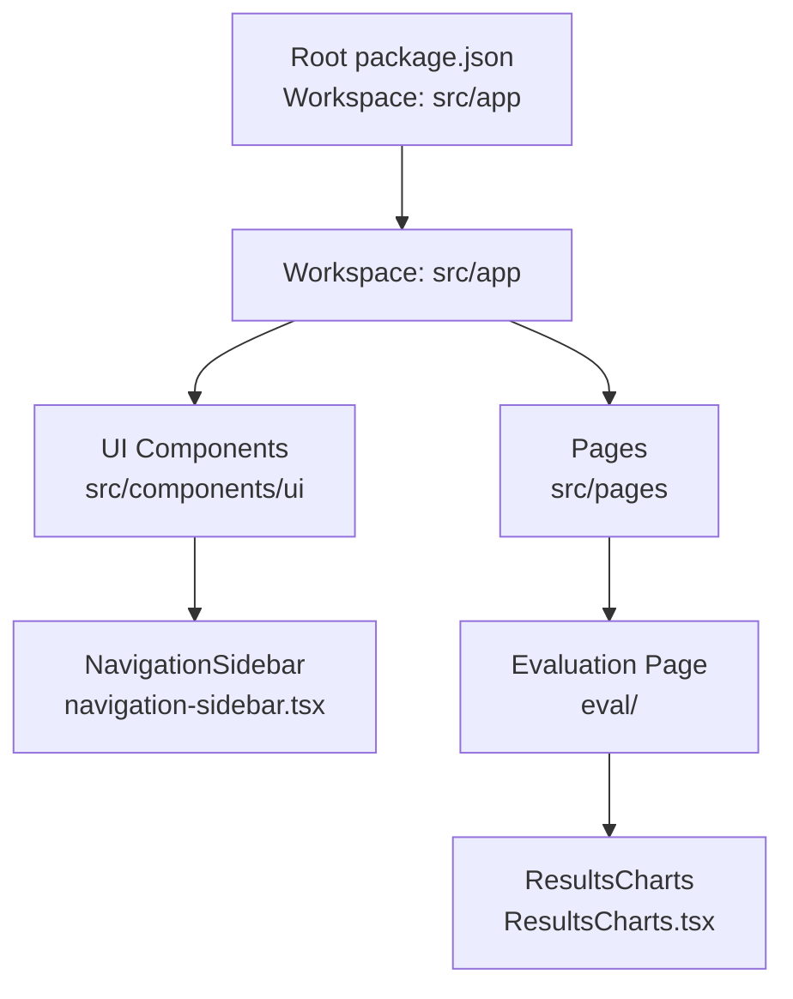
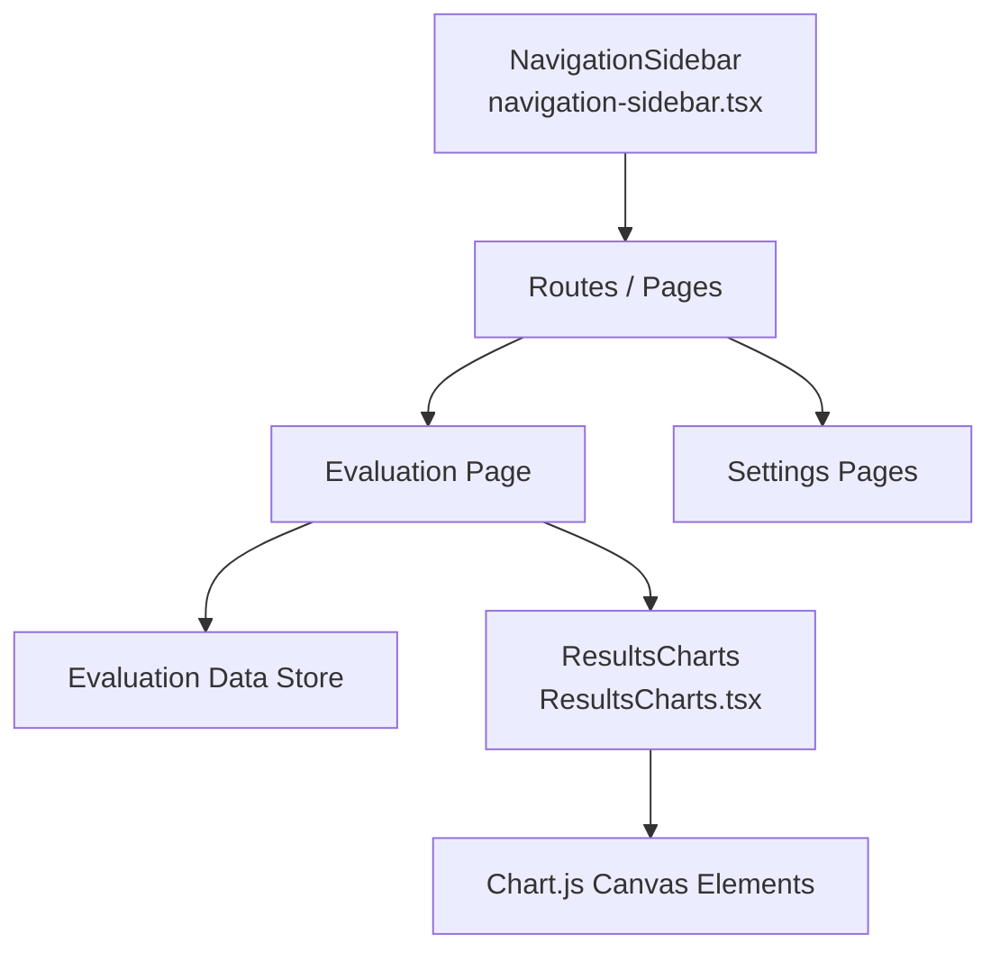
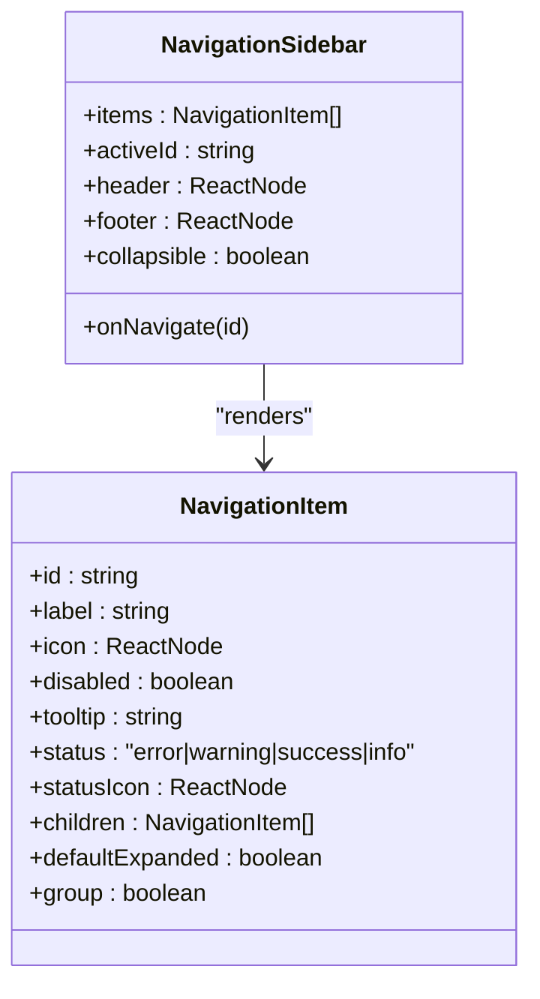
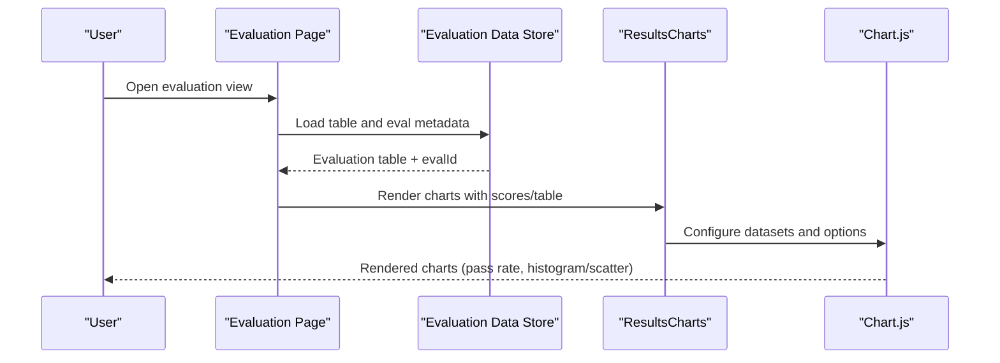
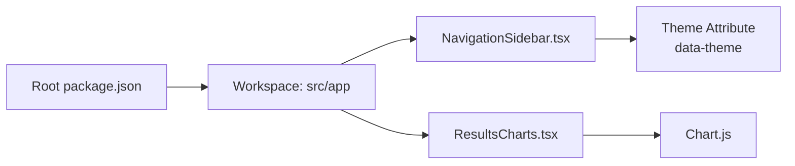

# Web Interface

<cite>
**Referenced Files in This Document**
- [package.json](file://package.json)
- [navigation-sidebar.tsx](file://src/app/src/components/ui/navigation-sidebar.tsx)
- [navigation-sidebar.stories.tsx](file://src/app/src/components/ui/navigation-sidebar.stories.tsx)
- [ResultsCharts.tsx](file://src/app/src/pages/eval/components/ResultsCharts.tsx)
- [ResultsCharts.test.tsx](file://src/app/src/pages/eval/components/ResultsCharts.test.tsx)
</cite>

## Table of Contents
1. [Introduction](#introduction)
2. [Project Structure](#project-structure)
3. [Core Components](#core-components)
4. [Architecture Overview](#architecture-overview)
5. [Detailed Component Analysis](#detailed-component-analysis)
6. [Dependency Analysis](#dependency-analysis)
7. [Performance Considerations](#performance-considerations)
8. [Troubleshooting Guide](#troubleshooting-guide)
9. [Conclusion](#conclusion)
10. [Appendices](#appendices)

## Introduction
This document describes the web interface for PromptFoo’s React-based dashboard. It covers navigation, result visualization, dataset and test-case management, filtering, sharing, collaboration, real-time monitoring, customization, mobile responsiveness, accessibility, and deployment considerations. The goal is to help product managers, engineers, and operators understand how to use and extend the dashboard effectively.

## Project Structure
PromptFoo’s web application is organized as a React workspace under the monorepo. The primary React app workspace is declared in the root package.json, and the dashboard UI is implemented with reusable components and pages. The navigation sidebar component is a key UI primitive used across the app.

**Diagram sources**
- [package.json:19-22](file://package.json#L19-L22)
- [navigation-sidebar.tsx:1-265](file://src/app/src/components/ui/navigation-sidebar.tsx#L1-L265)
- [ResultsCharts.tsx:661-752](file://src/app/src/pages/eval/components/ResultsCharts.tsx#L661-L752)

**Section sources**
- [package.json:19-22](file://package.json#L19-L22)

## Core Components
- NavigationSidebar: A flexible, hierarchical navigation component supporting nested items, collapsible mode, tooltips, status indicators, and group headers. It drives page-level navigation and settings organization.
- ResultsCharts: A visualization suite for evaluation results, including pass rate, histogram, scatter plots, and a performance-over-time chart (conditionally rendered). It integrates with the evaluation table and supports dark/light themes.

Key capabilities:
- Hierarchical navigation with expand/collapse and active selection
- Collapsible sidebar for compact layouts
- Status indicators for items and nested groups
- Responsive charts with tooltips and interactive points
- Conditional rendering based on data richness (e.g., named metrics vs. numeric scores)

**Section sources**
- [navigation-sidebar.tsx:15-79](file://src/app/src/components/ui/navigation-sidebar.tsx#L15-L79)
- [navigation-sidebar.tsx:232-261](file://src/app/src/components/ui/navigation-sidebar.tsx#L232-L261)
- [ResultsCharts.tsx:661-752](file://src/app/src/pages/eval/components/ResultsCharts.tsx#L661-L752)

## Architecture Overview
The dashboard is a client-side React application built with a component-driven architecture. NavigationSidebar organizes the main routes and settings, while evaluation pages consume tabular evaluation data and render visualizations via ResultsCharts.

**Diagram sources**
- [navigation-sidebar.tsx:232-261](file://src/app/src/components/ui/navigation-sidebar.tsx#L232-L261)
- [ResultsCharts.tsx:661-752](file://src/app/src/pages/eval/components/ResultsCharts.tsx#L661-L752)

## Detailed Component Analysis

### NavigationSidebar
NavigationSidebar supports:
- Multi-level nesting up to three levels
- Collapsible mode for icon-only layout with hover expansion
- Active item highlighting and ancestor auto-expand
- Disabled items, tooltips, and status indicators
- Group headers that cannot be navigated but can be expanded

**Diagram sources**
- [navigation-sidebar.tsx:15-79](file://src/app/src/components/ui/navigation-sidebar.tsx#L15-L79)
- [navigation-sidebar.tsx:232-261](file://src/app/src/components/ui/navigation-sidebar.tsx#L232-L261)

Usage patterns:
- Dashboard and settings are top-level items
- Data management and history are grouped under dedicated sections
- Collapsible mode improves screen real estate on smaller displays

**Section sources**
- [navigation-sidebar.tsx:232-261](file://src/app/src/components/ui/navigation-sidebar.tsx#L232-L261)
- [navigation-sidebar.stories.tsx:218-413](file://src/app/src/components/ui/navigation-sidebar.stories.tsx#L218-L413)

### ResultsCharts
ResultsCharts renders multiple chart types based on evaluation data:
- Pass rate visualization
- Histogram or metric-specific charts depending on data richness
- Scatter plot for pairwise provider comparisons
- Performance-over-time chart (conditionally enabled)

**Diagram sources**
- [ResultsCharts.tsx:661-752](file://src/app/src/pages/eval/components/ResultsCharts.tsx#L661-L752)

Algorithm highlights:
- Conditional rendering switches between histogram and metric charts based on named scores
- Scatter plot encodes evaluation number and pass rate; optional line connects highest pass rates
- Theme-aware color defaults for light/dark modes

**Section sources**
- [ResultsCharts.tsx:560-752](file://src/app/src/pages/eval/components/ResultsCharts.tsx#L560-L752)
- [ResultsCharts.test.tsx:134-622](file://src/app/src/pages/eval/components/ResultsCharts.test.tsx#L134-L622)

## Dependency Analysis
The React workspace is configured in the root package.json. The navigation and evaluation components depend on:
- React and UI libraries for rendering and interactivity
- Chart.js for visualization
- Theming attributes for dark/light mode support

**Diagram sources**
- [package.json:19-22](file://package.json#L19-L22)
- [ResultsCharts.tsx:669-672](file://src/app/src/pages/eval/components/ResultsCharts.tsx#L669-L672)

**Section sources**
- [package.json:19-22](file://package.json#L19-L22)

## Performance Considerations
- Chart rendering: Use memoization and conditional rendering to avoid unnecessary re-renders. The component is exported as a memoized React component to minimize updates when props are unchanged.
- Data size: Large evaluation tables can increase memory usage. Prefer filtering and pagination at the data source level when integrating with backend APIs.
- Theme switching: Apply theme via a single attribute to avoid cascading style recalculations.
- Canvas elements: Limit the number of simultaneous canvases and ensure cleanup when leaving the evaluation view.

[No sources needed since this section provides general guidance]

## Troubleshooting Guide
Common issues and resolutions:
- Charts not visible: Verify that evaluation data is loaded and non-empty. The component conditionally renders based on presence of table data.
- Missing tooltips or hover interactions: Confirm that Chart.js options include tooltip callbacks and that the canvas element is mounted.
- Dark/light mode mismatch: Ensure the theme attribute is applied to the document root so Chart.js defaults pick up the correct text color.
- Navigation not expanding: Check that nested items have defaultExpanded set appropriately and that the activeId triggers ancestor expansion.

**Section sources**
- [ResultsCharts.tsx:669-672](file://src/app/src/pages/eval/components/ResultsCharts.tsx#L669-L672)
- [ResultsCharts.test.tsx:134-622](file://src/app/src/pages/eval/components/ResultsCharts.test.tsx#L134-L622)

## Conclusion
PromptFoo’s React dashboard centers on a robust NavigationSidebar and a flexible ResultsCharts visualization suite. Together, they enable efficient navigation, deep evaluation insights, and customizable presentation. By leveraging collapsible navigation, conditional chart rendering, and theme-aware visuals, teams can monitor evaluations, compare providers, and collaborate effectively.

[No sources needed since this section summarizes without analyzing specific files]

## Appendices

### Dashboard Usage Examples by Role
- Product Manager
  - Navigate to “Dashboard” and “History”
  - Filter evaluations by date range and provider
  - Review pass rate and histogram to identify regressions
- Data Engineer
  - Import datasets via “Data > Imports”
  - Edit test cases and variables in “Data > Exports”
  - Share evaluation links for peer review
- DevOps/SRE
  - Monitor real-time evaluation progress using the performance-over-time chart
  - Adjust provider configurations in “Settings > General”
  - Enable dark mode for low-light environments

[No sources needed since this section provides general guidance]

### Deployment and Integration Notes
- Workspace build: The root package.json defines a build command that orchestrates TypeScript compilation, bundling, and app builds. Use this to produce production-ready assets for the React workspace.
- Local development: The scripts include a combined dev server for backend and frontend, enabling rapid iteration on the dashboard.
- Theming and branding: Apply a theme attribute at the document root to align visual components with brand guidelines. Ensure fonts and colors are consistent across pages.

**Section sources**
- [package.json:44-53](file://package.json#L44-L53)